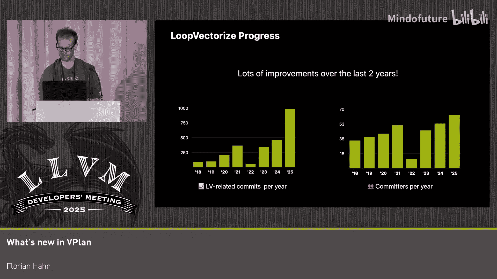

# 025：VPlan的新特性

在本节课中，我们将学习过去两年里VPlan基础设施的主要改进，以及这些改进所启用的新优化。VPlan是升级和扩展循环向量化基础设施的一项持续工作。我们将回顾这些逐步引入代码库并默认启用的改进。

## 概述

VPlan是一个用于描述向量化候选方案的显式模型。在向量化管道的开始，我们从一个标量循环（以LLVM IR形式输入）出发，逐步构建一个初始VPlan。这个初始VPlan作为后续优化的起点。在创建初始计划的过程中，我们将抽象层次从输入的LLVM IR提升。然后，我们创建多个反映不同向量化策略的VPlan。例如，为不同的向量化因子创建不同的VPlan。一旦我们从候选集中选出最佳的VPlan，我们便逐步将其降级为向量化的LLVM IR。

## 回顾路线图

上一节我们介绍了VPlan的基本概念，本节中我们来看看其发展路线图。在2024年的演讲中，我们提出了五个不同的基础设施演进方向：

1.  重构初始VPlan创建过程：将流程从“LLVM IR -> VPlan”转变为一组模块化转换。
2.  简化VPlan执行：即从VPlan回到LLVM IR的过程。
3.  教会VPlan计算成本，并使用这些成本直接在VPlan上做出基于成本的决策，而不再依赖传统的成本模型。
4.  融合内联和外联向量化管道。
5.  将执行尾部循环向量化的方式也完全转换为基于VPlan。

## 初始VPlan创建的改进

现在，让我们首先关注初始VPlan创建过程的改进，即如何将LLVM IR中的初始输入循环转换为初始VPlan，作为向量化和进一步优化的起点。我们将这个初始VPlan称为VPlan Zero。

以下是创建VPlan Zero的步骤：

1.  **创建初始骨架**：首先创建一个不包含任何配方的平面VPlan，它只是包装了输入。循环的入口和出口块被包装在我们引入的新类型块——`VPBasicBlock`中。循环内的块和指令则被包装在`VPBasicBlock`和标量`VPInstruction`中。
2.  **显式建模生命周期值**：离开循环的值（称为生命周期值）通过将出口块中的循环闭合SSA phi节点包装在`VPRedphiRecipe`中来显式建模，这些配方将离开循环的VPlan值作为显式操作数。
3.  **规范化循环**：添加一个经济归纳变量配方，该变量从0步进到向量化行程计数。同时更新控制循环的退出条件，使其现在由经济归纳变量控制，确保我们要优化的循环始终是可计数的形式。
4.  **完成初始骨架**：添加一些额外的块，用于在优化过程中放置各种代码。例如，引入一个新的向量化前导块来具体化向量循环中需要的一些值；添加一个中间块来调度决定在执行向量循环后是恢复执行标量循环还是跳转到原始出口块。
5.  **转换为区域块**：将计划中的循环转换为专用的`VPRegionBlock`，其中包含我们要向量化的循环的所有块。这提升了我们工作的抽象层次，简化了后续必须处理的CFG转换，并允许我们的转换轻松识别要优化的循环。

这些是构建初始VPlan方式的一些较大变化。这让你对我们在该领域的总体思路和构建整个管道的方向有了很好的了解。还有一些标量转换我们今天没有时间详细讨论，例如线性化控制流和执行谓词化。

## VPlan范围的扩展

接下来，我们看看VPlan模型范围的演变。在幻灯片上，你可以看到大约两年前VPlan的范围：它包含了入口块的部分（主要用于首次头扩展）、向量化前导块和中间块的部分，当然还有循环区域。当时，生命周期值仍然是单独建模的，这基本上限制了它只能处理具有单个出口块的循环。

如果我们看看过去两年的变化，可以看到VPlan的范围已经扩展到覆盖整个向量化骨架。我们还没有向量化尾部循环，所以处理尾部循环向量化时，这仍然是单独处理的。幻灯片上绿色高亮的部分是自2023年以来新增的。

现在，所有入口和出口块都被包装在之前提到的`VPRBasicBlock`中。标量循环体和标量前导块也以类似的方式建模。这允许我们对入口/出口块之间的完整控制流以及相应的运行时检查进行建模。标量前导块中的恢复值现在也使用`VPRedphiRecipe`显式建模，出口值则通过包装出口块的`VPRBasicBlock`中的`VPRedphiRecipe`类似地建模。这允许在VPlan执行和VPlan转换期间正确更新这些最终节点的传入值。

这种方法的一个主要好处是，它允许移除和简化各种传统代码路径中的代码。例如，这允许从向量化器类中移除处理前导对象和相应块的遗留代码，从而简化了实现。它还允许将剩余的尾部循环特定代码移动到尾部循环特定类中，使代码更清晰。

现在整个骨架都在VPlan中建模，我们可以免费获得诸如平凡运行时检查、分支和块移除等简化操作，只需在完整计划上运行现有的VPlan转换，而不仅仅是循环区域。例如，如果入口块中的最小迭代检查已知总是执行向量循环，我们可以简单地移除指向标量前导块的分支。同样，如果我们简化了中间块的条件，我们也可以移除这个平凡分支。最后，在简化之后，如果我们知道标量循环永远不会执行，我们可以通过移除包装它的`VPRBasicBlock`来完全移除它。

这产生了更简单、更易于审查的IR。我认为当补丁被合并时，它从各种测试中移除了大约10,000行检查行，使它们更易于审查，并且为下游传递或后续向量化留下了更少的代码来处理。

将范围扩展到包括出口块，并将构建过程分解为这组转换，也使得以一种与框架良好契合的方式支持具有提前退出的循环成为可能。只需引入另一个执行具有多个出口的循环规范化的标量转换，我们将它们再次转换为一种形式，其中向量循环由单个退出条件控制，并带有一些额外的块，以便在离开向量循环后调度到正确的出口块。出口值的显式建模意味着它们可以根据转换的需要直接调整，确保在通过提前退出离开循环时计算正确的值。

## VPlan执行的简化

上一节我们介绍了VPlan范围的扩展，本节中我们来看看VPlan执行的简化，即将其降级回LLVM IR的过程。

与VPlan构建类似，这种降级可以通过将其分解为单独的转换来简化，这些转换逐步降低抽象层次。在选择最佳VPlan后，我们逐步将我们做出的隐式决策显式化，并最终转换回一个平面CFG VPlan，它更直接地映射到最终的LLVM IR。

以下是两个转换示例：

1.  **执行显式交错**：除了向量化循环外，在优化过程中交错多个向量迭代通常是有利的。VPlan对一系列向量化因子和任何可能的交错因子都有效。在选择最具效益的交错计数后，降级过程中的第一步就是将交错计数应用到VPlan。对于大多数配方，这仅仅意味着将配方克隆交错计数次，并将操作数重新映射到对应交错部分的值。需要注意的一点是，这种交错保留了原始向量循环中依赖关系的顺序。类似地，我们发现后续的配方，如向量指针配方，在交错时需要一些特殊处理，最显著的是那些具有跨迭代依赖关系的配方，如归纳变量和归约。这些也由转换处理。将其作为转换执行有多个好处：一方面，它简化了所有配方的代码生成实现，这些实现以前必须负责为所有交错部分生成值；另一方面，它简化了在VPlan转换状态期间从VPlan值到相应生成的LLVM IR值的映射，变为简单的一对一映射，而不是必须处理一对多映射。更显式的实现还支持仅在应用此交错后才可能进行的额外简化。例如，在应用显式交错后，计算第一部分的向量指针变得冗余。
2.  **替换区域表示**：第二个转换是将我们从具有显式区域表示的形式，转换回显式控制流。这降低了抽象层次，并将计划带回一种直接映射到LLVM IR控制流的形式，并消除了在代码生成期间处理循环区域的需要。它还支持在层次表示中进行一些额外的简化。这些循环区域要求始终提供一个经济归纳变量，并且要求是可计数的，这限制了我们在该阶段可以执行的一些转换。替换这样的区域允许我们移除不再需要的经济归纳变量，并调整循环的控制方式。例如，在RISC-V上，控制循环的条件可以替换为基于显式向量长度的条件。

## 向基于VPlan的成本模型过渡

另一个重大变化是向基于VPlan的成本模型过渡，即直接在VPlan上计算配方和块的成本，并使用这个基于VPlan的成本模型来做出基于成本的决策，例如选择最具效益的计划。

在接口方面，配方和块都已扩展为直接计算成本。一些配方尚未完全使用这个基于VPlan的成本模型计算成本，而是必须回退到传统成本模型。但这个过渡应该很快就会完成。

基于VPlan的成本模型可以更准确地计算成本，特别是在存在基于VPlan的转换时，以及对于一些复杂或更复杂的配方。过去几年添加了许多新配方，例如用于建模直方图归约模式的`VPHistogramRecipe`，这些配方仅在基于VPlan的成本模型中受支持，因为在那里支持它们非常容易，而将它们添加到传统成本模型中将非常具有挑战性。

现在，让我们也看一个转换方面的例子，这只是计划中的一个简单简化。在幻灯片上，我们有一个冗余的乘法，它将在VPlan优化期间被移除。基于VPlan的成本模型会自动处理像这样的简化，因为一旦你移除了冗余配方，在成本计算中就无需处理它们，它们已经被移除了。另一方面，要在传统成本模型中支持像这样的简化，需要大量的特殊情况处理，因为所有可能的转换或简化都需要在我们可以执行它们之前的某个时间点被预见到。在幻灯片上，你可以看到在传统成本模型中支持这种乘以1的情况所需的逻辑。这是不可扩展的，只有少数一些以前被认为重要的情况在传统成本模型中得到了处理。但正如我所说，使用基于VPlan的成本模型，我们基本上可以免费获得对任何转换的支持。

## 循环向量化优化管道的演变

现在，让我们通过回顾过去两年循环向量化优化管道的演变，将所有变化整合起来。

在幻灯片上，我们可以看到2023年的管道。当时的主要阶段是合法化、通用优化和特定优化。那时，所有基于成本的决策仍然由传统模型驱动。

现在我们引入了这个新的标量转换阶段，它执行我们在演讲中已经提到的初始VPlan创建。合法化和通用优化阶段也有一些新增内容，主要是为了启用新的优化，例如支持缩小交错组和在没有快速数学标志的情况下向量化浮点最小/最大归约。最后一个阶段已经泛化，以执行我们讨论过的渐进式降级，并执行向量化因子和展开因子特定的优化。

## 总结与进展

本节课中，我们一起学习了VPlan基础设施在过去几年的主要改进。正如我提到的，过去几年有大量的改进，这得益于贡献者数量的增长。在幻灯片上，我们可以看到过去几年每年的提交数量和独立贡献者数量。我们可以看到，无论是提交数量还是贡献者数量，都呈现出健康的增长。我认为这与VPlan基础设施的成熟相吻合，并且有效地促进了在向量化器不同部分工作的人员之间更有效的协作。

此外，过去三年中，我们能够向量化的新型循环也取得了一些进展：

*   我们现在可以在没有快速数学的情况下向量化浮点最小/最大归约。
*   我们初步支持向量化具有提前退出的循环。
*   我们支持向量化针对给定谓词查找最后一个或第一个归纳变量的循环。
*   我们现在支持所谓的部分归约，主要用于利用特定硬件指令，如AArch64上的点积指令。
*   尾部折叠已在RISC-V上默认启用。
*   还有许多更小的优化已经落地。

所有这些都归功于许多在向量化器上工作的贡献者，感谢所有的贡献，并希望明年能有更多进展。

---

本节课到此结束。谢谢。