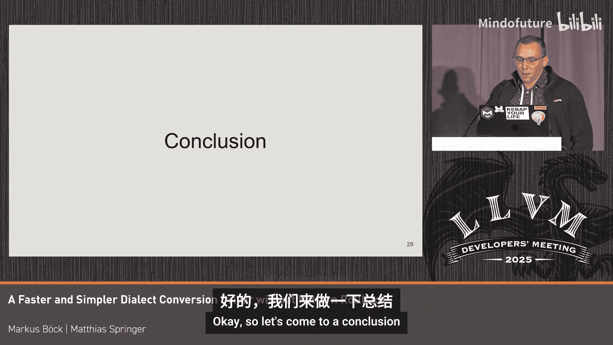

# 026：更快速、更简便的方言转换驱动器


## 概述 📋

在本教程中，我们将介绍MLIR方言转换驱动器的重大更新：**无模式回滚**的“一次性”方言转换驱动器。这个新驱动器已经合并到MLIR上游代码库中。我们将探讨其核心概念、优势、API变化、性能提升以及迁移指南，旨在帮助初学者理解并开始使用这一新功能。

## 无回滚转换：核心概念与动机 🎯

上一节我们概述了本次更新的内容，本节中我们来深入理解其核心概念。

传统的方言转换驱动器支持“模式回滚”。这意味着，当一个模式尝试进行IR（中间表示）转换但最终失败时，驱动器可以撤销该模式所做的所有更改。然而，这种机制带来了显著的复杂性和性能开销。

新的“一次性”方言转换驱动器**不允许模式回滚**。所有IR更改都会**立即生效**。这一改变虽然对API产生了一些影响，但带来了多方面的优势：

*   **性能大幅提升**：由于移除了大量用于跟踪回滚状态的数据结构，编译时间显著缩短，内存使用量大幅降低。
*   **调试更简便**：每次模式应用后，IR都处于有效状态，可以轻松地通过调试或日志输出进行查看，无需处理隐藏在C++内部的状态。
*   **支持新特性**：作为副作用，它更好地支持了监听器（listeners）等特性，并且使得实现“上下文感知类型转换器”等新功能成为可能，这在有回滚机制时非常困难。

**动机公式**可以概括为：`新驱动器 = 传统驱动器 - 回滚状态管理 + 即时变更`。

## 时间线与项目状态 📅

这个项目是一个长期工程，包含了许多前置的清理工作。目前，**一次性方言转换**功能已经合并。在此之前，诸如“1对N”模式支持等功能也已合并。团队还在努力使“内存到LLVM”的转换也能在此新驱动器上工作。

## API差异与用户指南 📖

上一节我们了解了新驱动器的优势，本节中我们来看看用户在使用时需要注意的主要API变化。

首先，理解“有回滚”和“无回滚”的区别至关重要。

### 模式应用逻辑的改变

在旧驱动器中，一个模式可以：
1.  匹配IR。
2.  进行一些修改。
3.  如果发现修改不适用于当前IR，则从`matchAndRewrite`函数返回`failure()`。
4.  驱动器会**完全撤销**该模式所做的所有更改。

这种机制允许驱动器依次尝试多个模式。例如，驱动器可能先尝试将操作A转换为非法操作B的模式，失败回滚后，再尝试将其转换为非法操作C的模式。

**在新的无回滚驱动器中，上述机制不再有效**。它要求模式必须具有清晰、干净的匹配和重写阶段。如果模式匹配失败（返回`failure`），则**绝对不能对IR进行任何修改**。否则，转换可能会失败，因为后续模式无法在已被部分修改的IR上应用。

### IR修改的即时性

最大的变化之一是IR修改操作现在是**即时**的，而非延迟的。

在旧的回滚驱动器中，诸如`eraseOp`（擦除操作）或`replaceOp`（替换操作）等方法并不会立即反映在IR中，而是将更改记录在转换驱动器内部的隐藏状态中。这样做是为了避免昂贵的IR克隆操作。

在新的无回滚驱动器中，其行为更符合用户从规范化（canonicalization）中熟悉的`PatternRewriter`的预期：**所有更改都会立即生效**。这为调试带来了巨大便利。

以下是API行为对比的摘要：

| 操作 | 回滚驱动器（旧） | 无回滚驱动器（新） |
| :--- | :--- | :--- |
| `replaceOp` / `eraseOp` | 延迟生效 | **立即生效** |
| `replaceAllUsesWith` | 延迟生效，有特殊语义 | **立即生效**，语义更直观 |
| 遍历IR | 可能不安全（存在未链接的临时结构） | **安全**（IR始终一致） |

### 具体迁移示例与注意事项

由于修改是立即的，一些在旧驱动器中可行的代码模式在新驱动器中会导致错误。

**问题1：操作使用后释放**
```cpp
// 旧驱动器（可行）
rewriter.replaceOp(op, newValue); // 延迟擦除
auto attr = op->getAttr("foo");   // 仍可访问‘op’
// 新驱动器（错误：use-after-free）
rewriter.replaceOp(op, newValue); // 立即擦除
auto attr = op->getAttr("foo");   // 错误！‘op’已被删除
```
**修复方法**：在修改前保存所需信息，或调整执行顺序。
```cpp
// 修复：先获取属性，再替换操作
auto attr = op->getAttr("foo");
rewriter.replaceOp(op, newValue);
```

**问题2：`replaceAllUsesWith`的语义**
在旧驱动器中，`replaceAllUsesWith`是延迟执行的，并且有一个特殊行为：如果在调用它之后又创建了新的使用（use），这些新使用在最终替换时也会被更新。这容易令人困惑。

在新驱动器中，`replaceAllUsesWith`**立即生效**，行为更直观。目前，新驱动器仅支持替换**所有**使用场景，尚不支持`replaceAllUsesExcept`或`replaceUsesWithIf`等选择性替换的变体，但计划在未来添加。

### 调试与检查

为了帮助迁移，MLIR提供了一个CMake选项：`-DMLIR_ENABLE_EXPENSIVE_PATTERN_API_CHECKS=ON`。启用后，它会在运行时执行更严格的检查，确保模式遵守“失败时不修改IR”等关键约定，能有效捕获不兼容的代码模式。

## 性能对比分析 ⚡

我们介绍了API的变化，现在让我们看看这些变化带来的实际性能提升，这是引入新驱动器的首要原因。

以下基准测试来自MLIR稀疏编译器测试套件中的一个大型集成测试。该测试进行大量的稀疏张量转换和打印操作。

**编译时间对比**：
*   随着问题规模（例如打印操作数量）增大，新旧驱动器的编译时间都会增加。
*   **无回滚的新驱动器始终更快**。例如，当问题规模扩大80倍时，新驱动器的速度比旧驱动器快约50%。
*   性能提升主要源于消除了大量IR重写对象的分配和维护开销。

**内存使用对比**：
*   在旧驱动器中，由于IR修改被延迟且相关内存直到最后才释放，该测试峰值内存使用高达**20 GB**。
*   在新驱动器中，内存被**立即释放**，峰值内存使用降至**100 MB**左右。
*   内存使用量的巨大差异是因为新驱动器不需要维护那些用于回滚的IR重写对象栈。

**性能剖析（Flame Graph）**：
在旧驱动器的剖析图中，可以看到大量时间花费在分配`IRRewrite`对象上（例如在`scf`到控制流转换中分裂块时）。而在新驱动器的剖析图中，这部分开销基本消失，更多时间花在符号表查找等与回滚无关的操作上。

## 迁移指南与调试技巧 🛠️

了解了性能优势后，本节我们探讨如何将现有代码迁移到新驱动器，并利用其改进的调试功能。

### 不兼容的用例

大多数模式可以平滑迁移，但存在一些不兼容的用例。主要问题源于**新驱动器只能看到最新的IR状态**，而旧驱动器可以同时看到旧IR和新IR的“并排”视图。



**示例：需要查看历史IR信息的模式**
有一个测试用例，其模式需要根据**转换前**的内存操作（memref）的维度信息来计算新的索引。在旧驱动器中，即使插入了一个中间转换层（如`unrealized_conversion_cast`），模式仍能回溯到原始的内存操作来获取元数据。

在新驱动器中，模式只能看到最新的IR，即一个以`unrealized_conversion_cast`为操作数的`memref.extract_strided_metadata`操作，无法进一步获取原始维度信息，导致转换无法完成。

**错误信息**：
启用新驱动器后，如果遇到此类不兼容模式，你会看到类似错误：
```
convert.vector_load produced IR that cannot be legalized
...
- `memref.extract_strided_metadata` : illegal op
```
这清晰地指出了无法合法化的操作。

**解决方案**：这类情况通常需要**重写整个转换流程**，而不是简单的适配。有时，这类转换可能更适合使用贪婪重写驱动器（Greedy Pattern Rewrite Driver）而非方言转换驱动器。

### 改进的调试体验

新驱动器在调试方面有显著优势。

**旧驱动器调试输出**：
在转换后打印IR，你可能会看到：
*   **新旧操作并存**：因为旧操作只是被标记为删除，并未立即擦除。
*   **未知的SSA值**：由于块签名转换等操作是部分延迟的，打印时可能引用已分离（detached）的旧值，导致显示为`<?>`。

**新驱动器调试输出**：
在转换后打印IR，你看到的是：
*   **完全物化后的最新IR**：所有操作都已就位，状态一致。
*   **清晰的转换痕迹**：例如，可以清楚地看到指针如何通过`unrealized_conversion_cast`转换回memref类型，并与内存操作连接。

这使得通过`-debug`选项逐步跟踪转换过程变得非常直观和可靠。

## 项目经验与未来工作 🚀

本节我们总结一下这个大型重构项目的经验教训，并展望未来的发展方向。

### 经验教训

这个历时一年半的大型重构项目带来了一些宝贵的经验：
1.  **发送小而精的合并请求（MR）**：小的MR更容易被评审和合并。
2.  **多发送无功能更改（NFC）的清理**：NFC更改评审阻力小，能为后续实质性更改铺平道路。
3.  **给评审和下游项目留出时间**：在发送大型MR之间留出间隔，避免评审者负担过重，并留出时间让下游项目（如Google、AMD等拥有大型代码库的团队）进行测试和反馈，这能有效发现测试用例覆盖不到的问题。
4.  **积极寻找内部用户**：联系那些在内部使用相关组件的团队，让他们提前试用你的代码，可以获得宝贵的验证。

### 现状与呼吁

目前，方言转换驱动器可以运行在两种模式下：**回滚模式**和**无回滚模式**。
我们强烈建议大家尝试并尽可能使用**无回滚模式**，因为它：
*   更快、更易用、内存占用更低。
*   提供更好的调试信息。
*   更好地支持上下文感知类型转换器（减少了未知SSA值的问题）。
*   提供更准确的监听器通知（例如，操作插入通知与模式开始/结束通知正确交错）。

最终目标是**弃用并移除旧的回滚驱动器**。使用的人越少，这一目标就能越早实现，预计可以**减少驱动器中多达50%的代码量**。

### 未来工作

未来可能的工作方向包括：
*   **池化`unrealized_conversion_cast`操作**：以进一步提升性能（效果待评估）。
*   **进一步收紧API**：使其更贴近`PatternRewriter`的API。例如，当前即使一个操作仍有使用（uses），也可以擦除它，然后由驱动器插入源材料化（source materialization）。未来可能禁止此类行为，使API更严格、更安全。
*   **探索迭代顺序控制**：允许用户控制区域内操作的应用顺序（例如，自底向上或先进入区域）。

## 总结 📝

本节课中我们一起学习了MLIR中全新的“一次性”方言转换驱动器。

我们从其**核心概念**——禁止模式回滚、即时变更IR——出发，理解了其带来的**性能提升**（更快的编译速度、更低的内存占用）和**开发体验改善**（更简便的调试）。我们详细分析了新旧驱动器之间的**API差异**，特别是IR修改的即时性带来的代码适配要求。通过**迁移指南**和**调试对比**，我们掌握了如何识别不兼容的用例并利用新工具。最后，我们分享了项目重构的**经验**，并展望了**未来**的优化方向。

现在，你可以通过在上游转换配置中设置`allowPatternRollback = false`来尝试这一新功能。希望本教程能帮助你顺利过渡，并享受新驱动器带来的诸多好处。