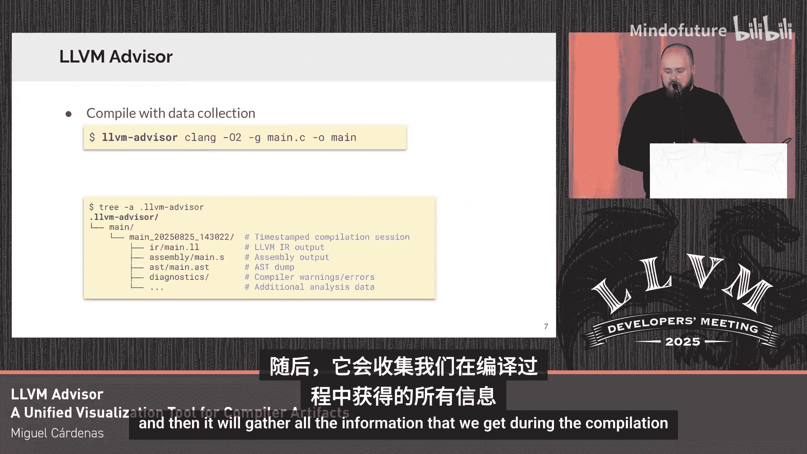

# 027：LLVM顾问工具介绍

在本节课中，我们将要学习一个名为**LLVM顾问**的统一可视化工具，它用于处理编译器生成的各类数据。我们将了解它如何简化编译数据的收集、分析和可视化过程。

## 概述

大家好，我是来自劳伦斯利弗莫尔国家实验室的Kevin Sala。我将介绍**LLVM顾问**，这是一个用于编译器产物的统一可视化工具。该项目实际上是由Miguel Carins主导的GO语言项目，我是其导师之一。

## 问题背景

LLVM编译器能够报告大量可用的编译数据，例如优化备注、性能剖析信息、时间统计以及诊断信息。然而，问题在于我们需要使用多个不同的编译标志来启用这些数据的报告功能。这导致输出文件格式各异，使得查找特定代码区域（例如，当我们尝试优化某些特定区域的性能时）的相关信息变得相当困难。

## 解决方案：LLVM顾问

为了解决上述问题，我们引入了**LLVM顾问**。它本质上是一个统一的基础设施工具。该工具首先通过一个名为`llvm-advisor`的编译器包装器，收集关于您应用程序编译过程的信息。接着，它会组织这些编译数据，将它们存储在一个文件夹中，然后进行分析和关联。最终，您可以通过一个现代化的Web界面来可视化所有这些数据。

## 工作原理

以下是其基本工作流程：

1.  您拥有一个使用`clang`的编译或链接命令。
2.  您只需将`llvm-advisor`命令放在您的编译命令之前。
3.  该工具将收集常规编译过程中获得的所有信息。
4.  它会在内部创建一个文件夹，存放所有信息，例如每个翻译单元的LLVM IR、汇编代码、AST和诊断信息。

## 可视化界面功能

最后，您可以在一个同样名为LLVM顾问的Web界面中，以统一的方式查看所有组织好的数据。

### 主面板（仪表盘）

界面的一侧是主面板，即仪表盘。它展示了您应用程序编译过程的一些总体信息。

以下是仪表盘显示的关键信息：
*   您拥有的文件总数。
*   优化备注的分布情况。
*   诊断信息的数量及每种类型的数量。
*   编译所花费的时间。
*   二进制文件大小的细分。
*   已报告的优化过程和优化备注的摘要。

### 性能面板

上一节我们介绍了仪表盘，本节中我们来看看性能面板。目前，该面板展示两种不同的追踪信息。

以下是性能面板包含的追踪类型：
*   **编译时间追踪**：显示每个编译过程所花费的时间。
*   **运行时追踪**：针对上传到GPU的应用程序，显示上传部分的运行时追踪，并展示GPU上每个操作所花费的时间。

### 探索面板

接下来是第三个面板，我们称之为探索面板。在这个面板中，您可以显示您应用程序的源代码（支持C++、Fortran等）。您可以在那些小标签页中启用诊断信息或优化备注的显示。它们会直接显示在报告它们的代码行上方，方便您查看。

在界面的另一侧，您可以显示针对该源文件生成的不同输出。

以下是可显示的生成输出类型：
*   **LLVM IR**：可以显示LLVM中间表示。
*   **汇编代码**：可以显示生成的汇编代码。

## 适用人群

那么，谁能从LLVM顾问中受益呢？

我们认为以下人群可以从中获益：
*   **LLVM高级开发者**：可以利用它减少翻阅优化备注文件、寻找感兴趣特定部分所花费的时间。
*   **LLVM新手**：可以更容易地了解LLVM基础设施和编译过程。
*   **教育工作者和大学教授**：可以将其用于教学，帮助学生理解编译过程。

## 总结与资源

本节课中，我们一起学习了LLVM顾问工具，它如何通过统一的Web界面来收集、组织和可视化复杂的编译数据，从而帮助不同背景的开发者更高效地进行工作。

如果您有任何问题，欢迎在明天的海报展示环节来访，我将在那里进行展示。正如所说，这是由米尼奥大学的Miguel Cardis学生主导的项目，您也可以联系他。最后，我在这里留下了二维码，如果您想尝试LLVM顾问的实时预览，或者查看正在审核中的PR，都可以扫描获取。任何评论或反馈都非常欢迎。非常感谢。