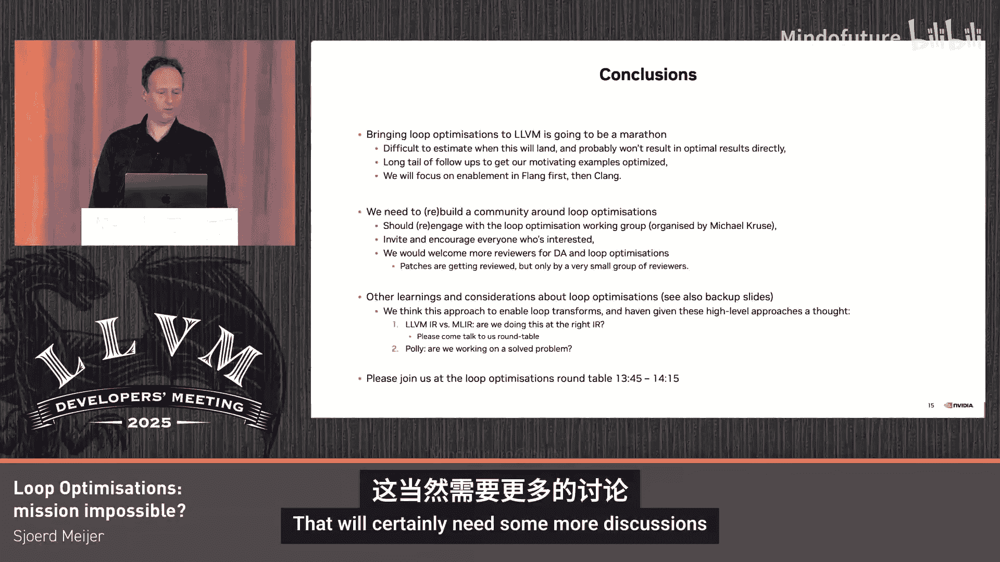

# 028：循环优化与未来展望


## 概述

在本节课中，我们将学习LLVM中循环优化的现状、挑战以及未来的发展方向。我们将探讨如何通过改进依赖分析和类型信息提取来提升循环优化的性能，并了解社区在推动这些优化成为默认设置过程中所面临的挑战。

## 循环优化的背景与重要性

上一节我们介绍了循环优化在提升程序性能中的关键作用。本节中，我们来看看为什么LLVM需要加强这方面的能力。

许多专有编译器已经实现了循环分布、循环交换等优化，这使得LLVM在某些基准测试中表现落后。例如，在TSVC基准测试中，由于缺少循环分布和交换优化，LLVM的性能可能落后专有编译器高达35倍。

TSVC虽然是一个人工合成的基准测试，但其揭示的模式在真实工作负载中同样存在。如果编译器在TSVC中错过了某些优化模式，那么在实际应用中也可能会错过。

## 循环优化的实际影响

以下是我们在真实工作负载中观察到的循环优化带来的性能提升示例：

*   **Spec CPU 2017/2006/2000**：多个基准测试显示性能有显著提升。
*   **Livermore Loops**：经典的科学计算内核，优化效果明显。
*   **Polybench/RAJA/Perf/Geekbench**：涵盖多种计算模式，验证了优化的广泛适用性。

需要说明的是，这些数据基于特定的硬件平台（AX 60），实际效果可能因环境而异。此外，最大的性能提升往往来自于多种变换的组合应用，例如循环分布与循环交换的结合。

## 当前挑战：“不可能的任务”

我们的目标是在去年的LLVM开发者大会后，让循环交换优化在默认优化管道（如-O2及以上）中启用。然而，由于大量的错误修复、技术讨论和固有挑战，我们未能如期实现这个目标。

目前，LLVM中许多经典的循环优化（如循环分布、融合、交换）虽然存在，但默认是关闭的。这造成了巨大的技术债务。我们的策略是首先在Flang（Fortran前端）中启用循环交换，因为科学计算Fortran代码对这些优化非常敏感，能提供良好的测试用例。之后，我们计划在Clang中做同样的事情，并着手研究下一个目标：循环分布优化。

## 技术难点：依赖分析与线性化

循环交换等优化需要确保变换后的程序语义正确，这严重依赖**依赖分析**。依赖分析的核心是判断不同的数组访问（读/写）是否指向相同的内存位置。

为了高效地进行依赖测试，我们需要识别出数组访问的下标。给定扁平的LLVM IR，我们通过**线性化**过程来恢复这些下标信息。例如，对于源代码中的访问 `A[i][j]`，线性化分析需要从一系列 `getelementptr` 指令中解析出下标 `i` 和 `j`。

当前面临的主要问题包括：
1.  **IR简化**：LLVM的IR简化过程可能会移除 `getelementptr` 指令的类型信息，而这正是线性化分析所依赖的。
2.  **类型信息提取**：我们需要从全局变量和动态分配数组中提取维度信息，并将其表达在IR中，以辅助优化器做出更好的决策。

对于静态声明的全局数组，我们可以通过附加元数据来提供维度信息，例如：
```llvm
!0 = !{!"array_info", ptr @A, i64 0, i64 42} ; 表示数组A的索引范围是[0, 42)
```
对于动态数组（包括Fortran的假定形状数组），我们可能需要插入额外的`assume`指令来向优化器传递边界约束，例如“索引 `i` 必须小于42”。

## 社区与开发流程的启示

在推进此项工作的过程中，我们也获得了一些关于LLVM开发流程的启示。

LLVM社区已经变得更加成熟。一项重要的政策变化是：**当添加一个新的编译通道时，目标应是尽快将其纳入默认优化管道，并持续进行增量开发，且该通道不应存在已知的正确性问题**。

然而，历史遗留问题是，许多循环优化通道因未能遵循此流程而默认关闭。这导致我们现在需要花费大量精力去“解耦”这些通道中堆积的功能，修复性能与正确性问题，这并非最高效的方式。

此外，**编译时间**始终是社区关注的焦点。由于这些优化默认关闭，其编译时间开销未被有效监控，导致问题不断累积。我们需要对所有感兴趣的循环优化进行同样的处理：测量、改进编译时间，并修复正确性问题。



## 未来计划与总结

本节课中我们一起学习了LLVM循环优化的现状与核心挑战。我们的未来计划清晰分为几步：

1.  **修复依赖分析**：这是当前启用循环交换的主要障碍。我们需要解决一系列相关问题，特别是处理整数溢出等边界情况。
2.  **启用循环交换**：在依赖分析稳固后，在Flang及随后在Clang中默认启用循环交换优化。
3.  **增强信息表达**：通过从源码提取数组维度信息并编码到IR中，为优化器提供更丰富的上下文，以解锁更大的性能潜力。
4.  **建设社区**：循环优化需要更广泛的社区参与。我们鼓励大家参与每月举行的“循环优化工作组”会议，共同review代码，推动进展。

关于MLIR与LLVM IR的路线，我们认为基于MLIR的循环优化仍然较远，涉及大量基础设施迁移和成本模型重建。因此，在可预见的未来，继续在LLVM IR层面启用和完善这些优化是务实且必要的选择。

**总结**：提升LLVM的循环优化能力是一项持续的任务，需要解决底层的技术难题（如依赖分析），改进开发流程，并依靠社区的力量共同推进。我们相信，通过逐步启用和优化这些变换，LLVM能够在高性能计算领域更具竞争力。