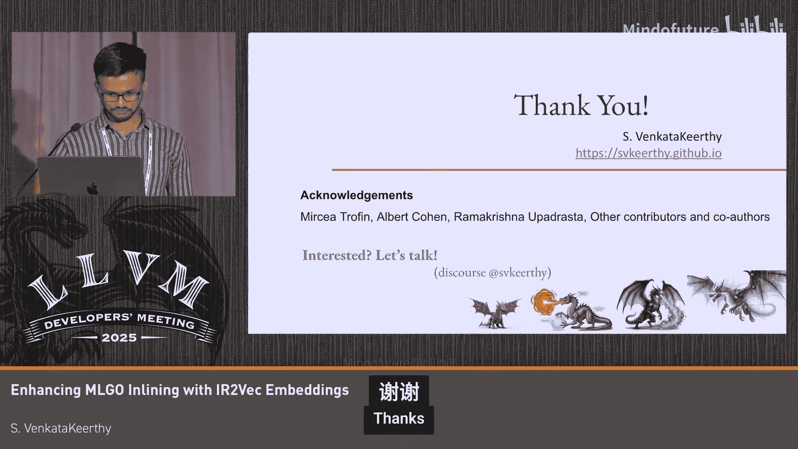

# 029：利用IR2Vec嵌入增强MLGO内联

在本节课中，我们将学习如何利用IR2Vec嵌入技术来增强LLVM中基于机器学习的优化（MLGO），特别是函数内联优化。我们将探讨如何更好地表示程序以供机器学习应用使用，并详细介绍IR2Vec的工作原理及其在LLVM中的集成。

## 概述

我们试图回答的核心问题是：如何为机器学习应用更好地表示程序？为此，我们有两种主要方法：基于特征工程的方法和基于嵌入的方法。特征工程依赖于人类专家确定对特定优化相关的特征，而嵌入则是一种学习到的表示，旨在自动发现重要信息，从而以任务无关的方式驱动优化决策。

## 嵌入技术简介

嵌入是一种学习到的表示。本质上，我们使用一个机器学习模型，将对象作为输入，并将其投影到一个N维空间中的浮点向量，这些向量捕获了有意义的信息。在自然语言处理中，嵌入可以捕获诸如“男人”与“国王”之间的关系类似于“女人”与“王后”之间的关系。我们的目标是：能否为LLVM IR做类似的事情？我们能否完全消除特征工程？

为此，我们提出了一种称为IR2Vec的方法。这是一种基于LLVM IR的方法，我们利用程序分析信息来驱动嵌入的生成。顾名思义，这是一种分布式编码，其中语义含义分布在向量的各个组成部分中，而不是典型的基于特征的表示。该方法采用自底向上的方式：我们从学习实体级别的表示开始，然后聚合它们，最终得到IR不同区域的表示。

## IR2Vec工作原理

让我们简要概述这个过程。考虑一个典型的LLVM IR。

该IR中的每条指令 `I` 被分解为一组三元组。每个三元组的形式为 `(H, R, T)`，其中 `H` 代表头，`T` 代表尾，`R` 代表连接头与尾的关系。

我们主要定义了三种关系：
1.  **类型关系**：将操作码与指令的类型关联起来。
2.  **下一条指令关系**：将当前指令的操作码与下一条指令的操作码关联起来。
3.  **参数关系**：将操作码与指令的参数关联起来。

这个过程在大量的IR语料库中对每条指令进行。我们使用一个简单的神经网络进行训练。

这里我们使用了一个称为TransE的翻译表示学习模型。该模型学习的关系是：头 `H` 加上关系 `R` 应近似等于尾 `T`，即 `H + R ≈ T`。

训练过程结束后，我们为训练期间遇到的所有实体获得了一个表示。所有这些被整合在一起，形成了一个我们称之为**种子嵌入词汇表**的东西。这个词汇表的训练是离线一次性完成的。一旦有了这个词汇表，我们就能够推导出不同级别的IR表示。

你可以将这个词汇表想象成一个简单的JSON文件，包含大约100个实体，其中键是实体的名称，值是该实体的向量表示。

## 生成指令表示

一旦有了词汇表，我们通过查表获取操作码、类型和参数的表示，并将它们组合起来得到一条指令的表示。

这个过程结束后，我们能够为IR中的每条指令生成表示。这种生成表示的方式我们称之为**符号编码**。

但我们并不止步于此，我们还希望编码一些流信息。

正如之前所见，指令中的操作数会获得一个通用的表示（如指针、变量、常量等）。但我们希望将其特化，并在此处编码上下文的概念。我们通过使用流信息来实现这一点。

假设我们像这样推导出指令 `I2` 的表示。对于指令 `I4`，我们考虑所有可能到达该点的定义，并利用这些表示的组合来推导 `I4` 的表示。如图所示，来自 `I2`、`I3` 和 `I9` 的定义都可能到达这里。我们保守地使用所有三个定义来推导 `I4` 的表示。这个过程可以对所有指令重复进行。

我们可以最终编码更多从定义-使用分析中推导出的上下文信息来获得表示。这就是我们所说的**流感知编码**。

由此可见，这种生成表示的方式更简单，同时也更具表现力。例如，你可以考虑编码整个函数的表示，并用该表示来表示调用点，这反过来可以模拟内联的效果。如果你知道某个特定定义到达一个使用点的可能性，你还可以进一步特化，编码这种可能性并相应地加权各个组成部分，这通常可以通过使用性能剖析信息来推导。

## 聚合区域表示

一旦我们有了指令级别的表示，就可以使用不同的聚合器来组合指令的表示，以获得代码中不同区域的表示，例如函数、循环、基本块等。

你可以考虑各种聚合器，比如简单的线性组合、求平均，或者训练模型来学习更好的聚合方式以获得更好的表示。

这本质上就是我们基于LLVM IR推导出的IR2Vec。它也有衍生版本，例如我们为LLVM的机器IR（主要考虑后端应用）推导的表示，称为MIR2Vec。我们还有另一个针对二进制文件的变体。如果你有二进制文件并想在二进制级别进行优化或转换，可以使用从VEX IR（Valgrind的IR）推导出的类似表示。

## LLVM中的IR2Vec

现在，让我们谈谈LLVM中IR2Vec的现状。目前，IR2Vec和MIR2Vec已在LLVM上游代码库中可用。我们发起了一个RFC并进行了讨论，然后开始以一系列增量补丁的形式将其上游化。

IR2Vec位于 `LLVM/lib/Analysis` 目录下，MIR2Vec位于 `LLVM/lib/CodeGen` 目录下。我们还有一个独立的工具叫 `llvm-ir2vec`，位于 `LLVM/tools` 目录下，它可以帮助生成嵌入和进行词汇表训练。这里的想法是，你可以使用这个工具或即将推出的Python库来驱动你的训练、在Python中生成嵌入以进行训练；在推理时，LLVM Pass可以直接从IR分析中消费这些嵌入。原始源代码也是开源的。

IR2Vec包含三个主要组件：
1.  **词汇表分析**：读取包含种子嵌入词汇表的JSON文件，并将此信息提供给嵌入类。
2.  **嵌入类**：包含如何生成表示、如何生成嵌入的核心功能。嵌入类使用词汇表分析提供的结果。
3.  **嵌入本身**：只是对标准向量的包装。可以将其视为N维表示被包装为嵌入。

在LLVM Pass中如何使用：
1.  首先运行词汇表分析Pass，获取词汇表结果。
2.  创建一个嵌入实例。
3.  一旦有了嵌入实例，你就能够查询并生成不同级别的表示。我们目前提供函数、基本块和指令级别的表示作为起点。

使用独立工具，你可以运行 `llvm-ir2vec` 并使用 `embedding` 子命令来生成嵌入，或者使用 `triplet` 子命令来生成用于训练的三元组。你可以查看LLVM工具中提供的脚本，了解如何在大规模语料库上自动生成三元组。

## 应用与成果

截至目前，我们已经使用IR2Vec来驱动不同的、基于机器学习的优化模型，例如循环分布、阶段排序和寄存器分配。这些都是研究项目。在LLVM中，我们有两个基于机器学习的引导优化：函数内联和寄存器驱逐决策（在贪心寄存器分配器中）。接下来我将简要介绍我们如何在函数内联中使用IR2Vec。展望未来，我们计划使用MIR2Vec来驱动贪心寄存器分配器中的驱逐决策。

在使用ML内联顾问的工作中，与使用基于特征的MLGO表示相比，我们在不同工作负载上看到了约2%到5%的性能提升。作为第一步，我们只是将嵌入与特征连接起来并训练了一个模型。该模型在一个包含约50,000个模块的内部数据中心二进制文件上训练了约2000万步，使用了PPO策略。这个训练好的模型被用于评估不同工作负载的性能，并且该模型被训练为优化代码大小。这是我们目前的技术水平。

展望未来，我们的想法是开始移除特征，并尽可能用嵌入替换它们。目前，我们有大约32个不同的特征驱动着机器学习内联决策。考虑到我们使用了嵌入，这些特征中的大多数可能是冗余的，显然可以被移除。

## 挑战与未来方向

接下来谈谈挑战和未来的道路。首先，正如你所想象的，像流感知嵌入这样的东西可能会遇到循环依赖。这在考虑PHI指令时非常典型，其中可能有多个定义以循环方式到达。那么如何解决呢？事实证明，当我们对流感知方程建模时，它表现为一组联立方程。一个非常明显的解决方案是使用某种线性求解器来解决它。如果我们想使用线性求解器，是应该使用像Eigen这样的现有库，还是应该编写一个简单的手写代码并将其放在LLVM工具中？或者我们可以使用精度较低但能编码流感知本质的迭代解决方案。

另一个明显的事情是编码更多信息。例如，我们可以从内存依赖、内存别名分析和内存SSA分析开始。LLVM中的这些分析甚至可以使这些流感知嵌入的构建更加优雅。但本质上，它们是非常保守的，因为它们都是为优化设计的，不能容忍假阴性。然而，嵌入本身可以承受假阴性。因此，如果我们能稍微放宽其保守性，允许一些假阴性，我们就可以编码更好的信息。如果是这样，我们应该为嵌入生成的目的专门定制这些基础设施，还是可以进行某种内存剖析，并据此决定考虑哪些依赖？

当涉及到MIR词汇表时，我们有特定于目标的指令操作码和其他操作数。这里与典型的基于LLVM IR的表示的一个主要区别是词汇表的大小。IR2Vec词汇表总共只有大约100个或更少的实体（包括操作码、类型、操作数等）。相反，在MIR（例如x86_64特定词汇表）的情况下，我们有大约7000个操作码可用。我们尝试通过分组操作码来减小这个大小。例如，你可以将像 `ADD32rr` 这样的操作码规范化成典型的 `ADD`，并最终将这些额外的前缀和后缀分开编码。问题是，x86提供了系统的方法来做到这一点，因为它使用适当的TableGen规则来定义前缀和后缀，我们可以在规范化操作码时利用这些。但这并不是通用的，不能跨不同架构。因此，在这种情况下，我们如何进行分组或规范化是另一个可能需要回答的问题。

最后，我们还计划自动化词汇表的生成。可以想象，词汇表在不断演变，编译器也在不断演变。与相对稳定的LLVM IR相比，我们在MIR中看到越来越多的操作码和操作数变化。在这种情况下，我们可能需要定期训练词汇表并使其可用。一个明显的方法是使用构建机器人。我们可以将这个过程解耦为两个阶段：
1.  **生成三元组**：可以在LLVM代码库上完成。我们可以使用LLVM本身作为生成三元组的数据源。这个过程本身是轻量级的，使用大约64个CPU核心需要大约10分钟。这也可以作为集成测试。
2.  **训练模型获取词汇表**：一旦有了数据，我们就可以训练模型来获得实际的词汇表。我们实际上可以以较低的频率训练模型，并使词汇表可用。

## 总结

本节课我们一起学习了IR2Vec嵌入，这是一种学习到的表示，已被集成到LLVM上游。我们解决了不同的性能相关问题，你可以通过分叉LLVM来使用它。其目标是减少特征工程的工作量，并改进当前的MLGO基础设施。

我们已经看到了它在研究和实际生产环境中的潜力。接下来的步骤是减少当前使用的特征，并开始使用MIR2Vec来驱动贪心寄存器分配器中的驱逐决策，以及自动化词汇表训练流程。

