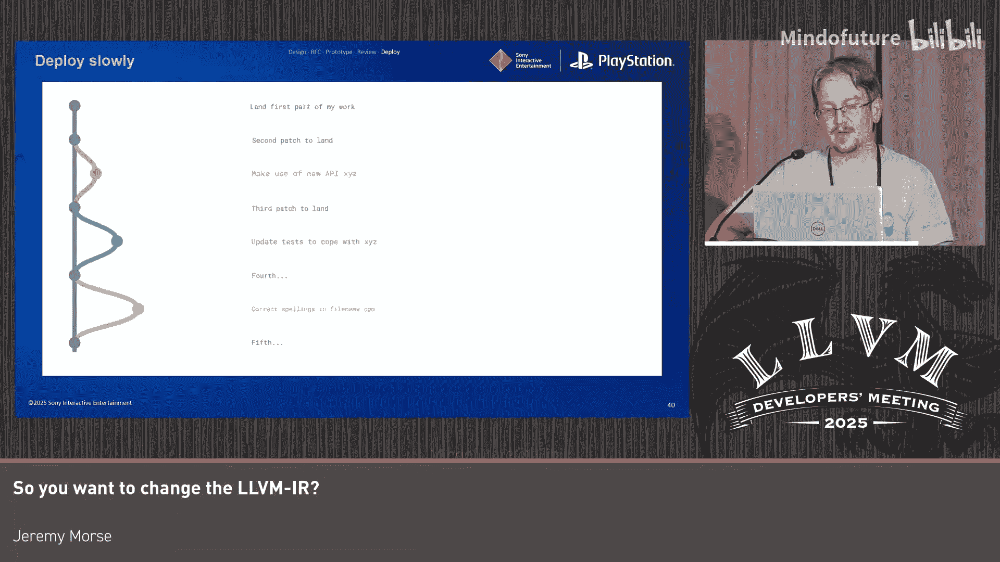

# 030：如何修改LLVM IR

在本节课中，我们将学习如何对LLVM进行比单个补丁更复杂的修改，包括添加、移除或修改某些功能。我们将探讨在此类变更中应遵循的最佳实践和流程。

## 概述

LLVM是一个庞大而复杂的编译器基础设施。当你需要对其进行实质性修改时，遵循一个清晰的流程至关重要。这不仅有助于确保技术方案的正确性，也能提高你的修改被开源社区接受的可能性。本节课将引导你完成从构思到部署的完整过程。

## 设计阶段：构思你的变更

上一节我们介绍了课程目标，本节中我们来看看如何开始设计你的变更。

首先，你不应该一开始就编写大量代码并试图直接实现它。优秀的程序员更关心数据结构及其关系，而非代码本身。

LLVM IR中的意义并非来自单个元素，而是来自它们彼此之间的关系。例如，指令之间存在直接的数据依赖关系，元数据可能编码了指针间的别名信息，调用指令则隐式地定义了其前后代码的关系。

当你向IR中添加新内容时，需要思考它将如何改变这些元素之间的关系。如果你的变更导致许多关系发生潜在变化，那么它就是侵入性的。侵入性的设计会迫使其他开发者考虑你的变更，从而增加复杂性，应尽量避免。

以下是一个侵入性设计的例子：
*   假设你决定为某些函数添加一个名为 `no_overflow_at_all` 的属性，以忽略所有溢出行为。
*   虽然IR层面的改动很小，但所有考虑溢出行为的代码站点都必须处理这个新属性。
*   未来任何编写依赖溢出行为的新代码的开发者，也必须考虑你的属性。
*   即使没有立即给他人带来额外工作，这仍然是一个侵入性设计。

关于数据结构，LLVM主要有两个层次结构：`Value` 层次结构（包含指令、常量等）和 `Metadata` 层次结构（包含调试信息等额外数据）。尽量让你的修改位于这两个层次结构内，这样可以免费获得序列化、哈希等支持。如果必须添加新的数据结构，请考虑计算复杂度、编译时间影响和内存使用，并优先复用LLVM ADT（抽象数据类型）目录中的现有组件。

## 撰写RFC：寻求社区反馈

在理论设计之后，你需要将想法转化为RFC（征求意见稿），并在社区论坛上寻求批准。

即使对于较小的变更，撰写RFC也很有必要。LLVM代码库非常庞大，无人能完全理解其所有细节。将你的提案发布在论坛上，可以让了解编译器不同角落的开发者告诉你潜在的问题，从而节省大量时间。

以下是撰写RFC时的一些要点：
*   提供对技术变更的简洁而详细的解释。
*   阐明变更的动机和目标。
*   明确变更的受益者（目标受众），这有助于证明将其纳入开源编译器的合理性。
*   尝试量化维护成本和潜在问题，以便社区进行成本效益评估。
*   开篇段落至关重要，需要吸引读者的注意力，让他们有兴趣阅读全文。

在收到RFC反馈后，你可能会遇到几种类型：
1.  **技术性反馈**：指出你方案中的细节问题、适用范围或更好的实现方式。
2.  **意愿性反馈**：社区成员表达对你的想法的支持或对方向的担忧。获得支持性反馈非常重要，它表明存在感兴趣的受众。
3.  **沉默**：如果没有收到反馈，这可能意味着受众较小或无人关注，但这不代表你的想法被拒绝。对于侵入性较小的独立变更，你可以继续推进；对于侵入性大的变更，这可能意味着难以证明其合理性。

如果遇到沟通困难，无法在RFC上达成一致，强烈建议参加LLVM开发者大会。面对面的交流更直接、坦诚，有助于理解他人的观点和动机。

## 实现阶段：构建原型与编写代码

假设你的提案已获得某种共识，并且有受众支持，接下来可以开始构建原型。

在原型阶段，目的不是编写高质量代码，而是快速验证想法、连接编译器中被修改的行为与其他部分，并尽早发现可能存在的致命问题。

以下是一些原型开发建议：
*   使用 `llvm-reduce` 工具来生成最小的测试用例，这些用例在未来可作为冒烟测试、回归测试或编写上游测试的基础。
*   在开发过程中，拥有一个独立于LLVM的质量评估目标。例如，如果你修改了底层架构，可以证明生成的二进制文件与之前完全相同，这能提供很大的信心。
*   开启LTO（链接时优化）进行测试，因为它会让编译器的每个部分都相互摩擦，暴露出各种奇怪的行为和问题。
*   如果你修改了文本IR，请考虑其可读性。例如，使调试记录缩进，让眼睛能轻松区分真实指令和元数据。
*   如果更改了文本IR，也必须更改位码（bitcode）。不必害怕修改位码，其防护机制很强，会引导你做出正确的选择，但需注意大小变化和向后兼容性要求。

## 代码审查：准备与提交补丁

当原型完成并经过评估后，你需要准备并提交代码进行审查。

提交补丁的唯一正确方式是**提交小型、增量的补丁**。审查时间与变更规模呈非线性增长。一个触及编译器多个部分的大型补丁会让审阅者需要考虑的细节呈指数级增长，从而难以获得及时审查。

以下是如何拆分补丁的建议：
*   **理想情况**：如果你的项目结构允许，将其拆分为一系列独立的小补丁。例如，先修改基础数据类型，然后是底层架构，接着是各个Pass的插桩，最后是前端（如Clang）的改动。
*   **大型算法**：如果必须添加一个大型独立算法，可以尝试将其拆分为多个小模块，分别添加单元测试，最后再用一个“顶石”补丁将它们组合起来。
*   **多处调用点**：如果你需要修改大量独立的调用点，可以预先通过机械性的补丁将它们“标准化”，这样后续实现核心功能的补丁就只是对大量相似代码做相同修改，便于审阅。
*   **无法拆分**：如果确实无法拆分（例如一个完整的新优化Pass），可以寻求许可，先以禁用状态提交代码，然后逐步启用它，并随着启用范围扩大而添加测试。

请记住，社区中可用的审查时间非常有限。优化你的补丁以方便审阅者高效工作，是提高合并成功率的关键。

## 部署与维护：合并代码与长期责任

最后，假设你的变更已经过审查并获得批准，接下来是部署阶段。

你不应该一次性推送所有补丁。总会有边缘案例和未知问题在最后时刻出现。你需要像提交审查时一样，逐步部署你的补丁。

部署时需考虑两点：
1.  **回退的难易程度**：如果你的补丁触及数百个文件，回退将非常困难。
2.  **影响范围**：你的新代码或Pass是否会突然处理编译器的所有输入？能否更渐进地引入？

缓慢合并补丁（例如20个补丁在20周内合并）是理想情况，这为持续集成（CI）测试和其他开发者适应变更留出了时间。如果必须进行无法渐进部署的“阶跃式”变更（例如移除调试内部函数），请提前公告，提供简单的开关（逃逸舱口），并尽量保持差异（diff）最小化，以便于回退。

变更合并后，维护工作随之而来：
*   为你添加的功能编写文档。
*   如果添加的是通用设施，社区可能会在其基础上进行扩展。
*   如果你添加的是非常特定或小众的功能，社区期望你能持续维护它。如果某项功能不断出现问题却无人维护，社区可能会因其成为维护负担而将其移除。

## 总结

本节课中我们一起学习了修改LLVM IR的完整流程。关键点总结如下：
*   **设计**：使你的变更**非侵入性**、**渐进演化**且**符合人体工学**。
*   **RFC**：尽早寻求反馈，并以真诚的态度回应所有反馈，包括负面意见。
*   **原型**：快速构建原型以发现所有潜在问题。
*   **审查**：为审阅者优化你的补丁，认识到社区审查时间的稀缺性，充分准备并提交增量补丁。
*   **部署**：以渐进方式提交和部署补丁。
*   **维护**：承诺对你引入的变更进行长期维护，以建立信任。

遵循这一流程，可以帮助你更有效、更顺利地将有价值的改进贡献给LLVM社区。