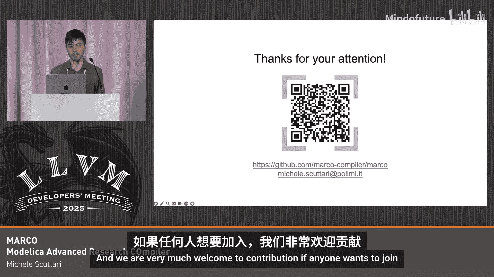

# 031：MARCO - 基于MLIR的Modelica编译器


在本教程中，我们将学习MARCO项目，这是一个基于MLIR的编译器，专门用于处理名为Modelica的领域特定语言。我们将了解其设计动机、核心架构、引入的新方言以及一些关键的优化技术。

## 项目动机与Modelica语言简介

上一节我们概述了MARCO项目。本节中，我们来看看驱动该项目开发的核心动机以及它所针对的Modelica语言。

Modelica是一种**非因果、面向对象和组件的语言**，用于描述微分代数方程系统。例如，描述一个电容器可以通过定义其两个引脚，并使用“连接器”的概念将它们连接起来。随后，可以描述支配该系统的方程，在此例中即电容器的物理定律。当然，还可以向系统中添加其他组件以构建更复杂的场景。

关于Modelica代码，有两点需要注意：
1.  代码中可能包含不常见的运算符，例如**时间导数运算符**。
2.  程序主体由**方程**构成，而非赋值语句。这些方程之间没有强制性的执行顺序，赋值操作也不是显式的。

换句话说，Modelica是一种**声明式语言**，而非编程语言。因此，以下代码在语义上并不代表一个循环，而是**多个方程的同时迭代**（在此例中是100个）。

```modelica
for i in 1:100 loop
  x[i] = y[i] + z[i];
end for;
```

这一特性对编译器工具至关重要。

那么，为什么我们需要构建一个新的编译器呢？事实证明，现有编译器对上述最后一个特性（数组方程和循环）的处理并不理想。它们通常的做法是**展开这些循环**，并将微分代数方程算法应用于展开后的源代码。这会导致其内部表示变得极其庞大。

虽然展开有时可能带来性能优势，但它对**编译性能**的影响是灾难性的，编译时间会迅速变得不可行（例如长达数天）。此外，还会产生**巨大的二进制文件**（例如GB级别）。

因此，MARCO项目的主要动机是超越当前处理代数方程系统的方法，设计能够推理**数组变量和方程循环**（我们简称为数组方程）的新算法。其核心目标是能够模拟通常由这种结构表示的**大规模系统**。

## 为什么选择MLIR？

上一节我们了解了MARCO要解决的问题。本节中，我们来看看为什么选择MLIR作为实现基础。

使用MLIR的优势包括：
*   利用**开源编译器基础设施**。
*   共享跨不同领域的**概念和优化**。
*   与LLVM后端有更紧密的集成。
*   可能更容易为**自定义架构**生成代码。
*   更好的**可调试性**。

## MARCO的架构与编译流程

了解了MLIR的优势后，我们来看看MARCO的整体架构和内部表示是如何构建的。

MARCO的结构对于基于LLVM的编译器来说是典型的。它有一个前端处理Modelica代码，然后进入中间表示，最后链接到构成运行时系统的库。然而，MARCO也与Clang驱动程序集成，目的是接收目标和优化特定信息，并使用Clang前端处理C代码（Modelica规范允许通过外部函数实现某些功能）。

在MARCO前端的编译流水线中，编译过程分为三个主要部分：
1.  **规范化阶段**：处理一些语言特定特性，并为流水线后续部分建立某些假设。
2.  **数学处理阶段**：涵盖微分代数方程处理的数学方面，例如执行**因果化**（许多新算法所在之处），并对系统应用数值积分。
3.  **优化与 lowering 阶段**：更传统的部分，应用一些优化，并将各种方言逐步降低到LLVM IR，然后交给LLVM的中端和后端。

目前，前端总共有85个Pass，但我们不会在此详述所有。

## MARCO引入的新方言

从流水线中可以看到，我们引入了一些新的方言（位于左侧）。现在，我将简要介绍它们，重点说明某些设计决策背后的原因，这些可能对社区有益。

最相关的方言无疑是 **`bmodelica`** 方言。你可能会问为什么是“b”。实际上，目前的MARCO并不直接接受完整的Modelica代码，而是接受其一个子集，称为**Base Modelica**（因此是“b”）。完整的Modelica代码会先由另一个编译器处理以移除面向对象的特性，然后MARCO从Base Modelica开始处理。理论上所有步骤都可以在MARCO内完成，但目前人力有限。

`bmodelica`方言的主要概念是表示**微分代数方程系统**。其核心概念是**模型**，我们通过一个具有名称的单一区域操作来表示。在该区域内，我们描述变量和方程。

以下是关于变量和方程表示的一些关键设计：

**变量表示**：我们有一个明确的设计目标，即**保持与其他Pass的互操作性**。在MLIR生态系统中，某些操作具有“从上方隔离”的特性，这阻止了区域内的操作引用区域外定义的SSA值。为了真正对IR中可能使用的任何其他方言开放，我们必须考虑这一点。解决方案是**对模型变量采用内存语义**，并提供一些操作在需要时在内存语义和SSA语义之间切换。然后，根据在IR中使用的位置，对这些操作（如变量声明和绑定）进行不同的 lowering。例如，在模型内部，你得到全局变量；如果在函数内部声明变量，你可能得到可被优化的分配操作。

**方程表示**：考虑到MARCO的转换过程，方程的表示也并非直截了当。我们的想法是从一开始就避免复杂化，因为某些分析的结果可能依赖于特定方程的索引（记住，方程可能基于多个索引进行迭代）。为了实现这一点，**方程体与实际实例化被分开**。我们称前者为**方程模板**，后者为**方程实例**。方程模板在由实例指定的索引上是参数化的。此外，我们使用内部开发的高效归档实现来支持索引范围的压缩。在这种情况下，我们更倾向于使用SSA语义，因为我们对IR结构有完全的控制权，嵌套问题不再存在。

除了`bmodelica`，我们还有其他几个方言，我将快速介绍：
*   **`eda`、`kinsol` 和 `sundials` 方言**：用于与外部求解器集成（例如SUNDIALS套件中的IDA和KINSOL）。它们在模型求解阶段（编译流水线的中间部分）使用，用于提供隐式积分方法或数值求解系统中仍然存在的循环。
*   **`runtime` 方言**：与MARCO的运行时环境接口。它提供一些示例函数（如正弦、余弦的实现），也用于提供编译模型所期望的运行时环境中的某些核心扩展。

## 优化示例：方程并行化

上一节我们介绍了MARCO的核心方言。本节中，我们通过一个具体的优化示例来展示其应用，你将看到其中两个方言的协作。

这个优化的想法是**并行化独立方程**。想象你有一个依赖关系图，其中方程1只有在方程0计算完成后才能计算。你可以做的是计算方程之间的依赖图，并理解例如组1内的所有方程可以以独立的方式计算。这看起来可能简单且低效，因为只有两个方程用两个线程。但请记住，这两个方程可能是数组方程，并且彼此独立。因此，你可以做的是**分割所有索引范围**，并将所有方程分配给多个核心。这就是主要思想，并不复杂。

从IR的角度来看，考虑一个简单例子，你有一些不透明的块，其中只包含关于依赖关系的知识（哪个方程读取/写入哪个变量，需要哪些其他变量），并且有一个额外的属性说明该块是否可以与其他块并行化。

首先，我们应用依赖图分析并**包装这些组**。`ScheduledBlocks`操作就代表了上一张幻灯片中显示的组。然后，应用一个特定的转换来查看这些块是否可以被并行化。如果可以，它会插入一些由运行时系统管理的运行时调度对象，这些对象将负责**分发方程、分割索引并在多个线程间调度方程**。

## 性能展示

现在，让我们看一个展示项目性能的例子。

考虑一个硅芯片的热模型，这是一个非常简单的模型。你可以用三个维度参数化你的芯片，根据这些参数控制体积单元的数量。底部有一个固定的电源，顶部有一个固定的冷却表面。

我们使用谱方法，测量了MARCO和另一个开源编译器OpenModelica的编译时间和模拟时间。

从结果可以看出：
*   **编译时间**：MARCO在编译时间上表现出色，因为它利用了编译过程中那些**数组感知算法**，基本上实现了**恒定的编译时间**，这与OpenModelica等编译器非常不同。
*   **模拟时间**：MARCO也带来了可观的收益。并且你会注意到，在某个点，运行时系统会自动激活多线程，因为它理解到在系统扩展到一定程度时，激活多核调度会变得有益。

## 当前状态、挑战与总结

本节课中我们一起学习了MARCO编译器的核心内容。最后，我们来总结其现状、遇到的挑战并展望未来。

**当前状态**：MARCO仍然是一个**原型编译器**。虽然已经开发了五年，但仍有工作要做。例如，我们对转向自定义架构非常感兴趣，即使只是使用GPU也将是非常好的事情，特别是对于MARCO的用例。

**对社区的启示与挑战**：在开发过程中遇到了一些困难，可能对社区有借鉴意义：
1.  **与Clang驱动程序的集成**：并不容易，因为它是一个庞大的代码库。虽然未来可能会改善，但目前仍需要一些复制粘贴，并且关于LLVM源码修改仍有一些疑问。
2.  **MLIR操作的特性（Attribute/Property）表**：它们很好，但需要手动更新。流水线中的某些点在规模上曾呈二次增长（这些问题已被修复），但我在想我们是否能做得更好，例如能否通过Trait自动将特性表附加到操作上，并拥有自动更新它们的基础设施？
3.  **基于接口的成本模型**：我们非常有兴趣开发一些基于接口的机制来为操作建立成本模型。因为目前自动分组并行独立方程的机制非常朴素。我们希望考虑每个方程相对于其他方程的计算成本，以便更好地在多个核心间平衡计算。但这带来了许多问题。
4.  **早期访问（Early Access）**：这在开发的最初几天是个更大的问题，我知道相关工作正在进行中，但目前它被弃用了，我们现在没问题。

**总结**：MARCO是一个基于MLIR的、针对Modelica语言的编译器项目，旨在通过创新的数组感知算法高效处理大规模微分代数方程系统。它引入了多个专用方言，并在编译性能和并行计算方面展示了潜力。项目欢迎贡献。



