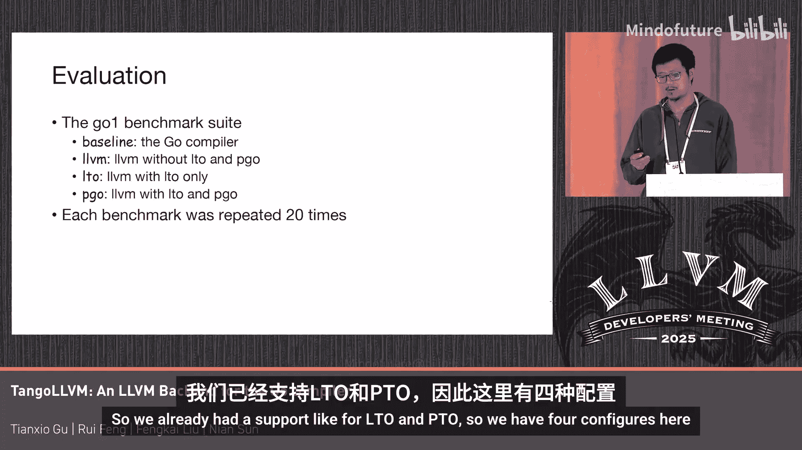

# 032：Go编译器的LLVM后端

## 概述
在本教程中，我们将学习如何为Go语言构建一个基于LLVM的后端编译器。我们将探讨其背后的动机、标准Go编译器的基础知识、实现方法，特别是如何支持Go的垃圾回收机制，并最终评估其性能表现。

## 章节 1： 动机与背景

上一节我们介绍了本教程的主题，本节中我们来看看为什么需要为Go语言优化性能。

Go语言被设计为一种易于学习的编程语言。其编译器编译速度非常快，并能生成较小的二进制文件。然而，性能并非Go社区的首要关注点。

在阿里巴巴，Go是后端服务中使用最广泛的编程语言，每天消耗大量的CPU核心资源。为了降低成本，我们有许多团队从不同方面尝试提升Go的性能。例如，有团队致力于RPC框架，有团队优化Go标准库，还有团队研究运行时内存管理。

作为编译器团队，我们最初尝试为Go编译器添加一些优化。我们曾试图将LLVM中的一些循环优化迁移到Go编译器中，但由于其复杂性，我们放弃了。

随后，我们开始研究基于LLVM的实现方案，尝试用LLVM来编译Go代码。

## 章节 2： 现有方案与挑战

上一节我们介绍了性能优化的需求，本节中我们来审视现有的Go编译器工具链及其挑战。

我们首先考察了TinyGo。TinyGo是为嵌入式环境设计的，并不适用于服务器端应用程序。它拥有独立的运行时和SDK，这意味着绝大多数后端服务无法使用TinyGo构建。

我们也检查了Gollvm项目，但它存在与TinyGo相同的问题。

因此，我们开始尝试自己构建一些东西。

以下是标准Go工具链的构成：
*   一个Go程序不仅包含Go源代码。
*   它还包含一些使用Go特定Plan9语法的汇编代码，这类汇编代码只能由Go汇编器（go asm）处理。
*   C源代码也通过外部函数接口（FFI）在Go程序中被广泛使用。
*   此外，Go程序还需要与Go运行时链接。Go运行时依赖于编译器生成的一些模块数据来支持其操作，这类元数据用于支持栈追踪、垃圾回收和反射API等。

回顾标准工具链，如果你计划用LLVM实现Go编译器，可能需要实现所有相关组件，例如Go ABI、Go特定的对象格式、垃圾回收支持，并且还需要修改链接器以链接模块数据。

作为一个小型团队，我们无法承担如此昂贵的解决方案。因此，我们尝试了不同的方法。

## 章节 3： 核心方法概述

上一节我们分析了直接实现完整后端的挑战，本节中我们来看看TangoLLVM的核心方法。

我们的方法是将LLVM简单地用作一个后端。以下是工作流程概述：

1.  首先，运行Go编译器生成Go对象文件（`.o`文件）。
2.  接着，在通用的SSA（静态单赋值）级别将Go程序翻译成LLVM IR。通过这种方式，我们可以重用Go编译器中的一些优化，例如逃逸分析。
3.  然后，运行LLVM后端来优化函数、生成代码，并以ELF格式接收结果。
4.  我们从ELF文件中提取符号数据，并将其修补回Go对象文件中。

通过这种方式，我们可以避免在LLVM中支持复杂的Go对象文件格式。由于这仍是一个早期项目，我们可能无法使用LLVM成功构建某些函数。在这种情况下，我们可以回退到Go编译器来生成代码。

我们认为，垃圾回收是导致我们无法构建某个函数的主要原因。

## 章节 4： 支持Go垃圾回收

上一节我们介绍了整体流程，本节中我们深入探讨实现中最具挑战性的部分：在LLVM中支持Go垃圾回收。

Go运行时可以在栈和堆上分配对象。这意味着垃圾回收器必须扫描栈和堆来查找存活对象。

Go的垃圾回收机制有些不同。它不移动或复制堆对象，但可以复制栈对象。这意味着我们必须识别栈上的所有指针。

垃圾回收发生在一个称为“状态点”（state point）的地方。状态点可以看作是一条调用指令及其关联的栈映射（stack map）。栈映射描述了栈的布局，它帮助垃圾回收器找到所有指针。

关于Go ABI的一个事实是：在Go ABI中，没有调用者保存的寄存器。这意味着在状态点，所有寄存器中的值都会被溢出到栈上。因此，我们不需要为支持Go垃圾回收而构建寄存器映射。

以下是我们如何在LLVM中实现垃圾回收支持：
我们简单地基于LLVM中现有的`gc.statepoint`指令。基本上，我们在IR级别识别指针，因为我们拥有丰富的类型信息。我们在代码生成过程中保持这些信息，并最终在LLVM IR中发出栈映射。

最具挑战性的部分是，LLVM中许多现有的优化过程并不感知垃圾回收。例如，循环不变代码外提（LICM）可能会将指针移出循环，但在移出的位置，该指针可能尚未准备好被引用，这可能导致垃圾回收器出错。

因此，我们尝试在LLVM IR级别识别所有的GC指针。

## 章节 5： 指针识别与处理

上一节我们提到了识别GC指针的挑战，本节中我们详细看看如何识别和处理不同类型的指针。

我们基本上将所有指针类型的右值视为内部指针（derived pointer）。

*   **内部指针**：被垃圾回收器用来定位包含它的对象，然后扫描该对象中的所有指针。
*   **值指针**：存活对象内部的指针。
*   **无效指针**：对象末尾的指针不是有效指针。例如，如果对象O2的末尾是有效的，它实际上是对象O3的开头，我们应该标记O3而不是O2。

那么，如何识别无效的GC指针呢？我们发现只有内部指针可能需要处理无效指针。一个无效的内部指针可能有一个无效的基指针（例如，空指针），或者其偏移量可能超出对象边界，成为越界指针。

为了识别这些指针，我们使用静态分析。我们首先进行保守的静态分析，尝试识别所有指针。如果任何内部指针可能具有非法的基指针，我们将其标记为指针。我们还尝试传播每个指针所指向值的大小。

静态分析非常保守，可能会报告许多无效的GC指针。但幸运的是，我们发现，如果无效的GC指针没有被记录在栈映射中，它仍然是安全的。因此，如果我们发现一些无效的GC指针，我们可能会将其使用点之前移动。这样，我们可以避免在栈映射中记录这类无效指针。然而，这种方法可能会影响某些优化（如LICM）的效果。

未定义指针是支持LLVM中Go垃圾回收的另一个挑战。Go可以将指针转换为整数，然后再转换回来。我们必须跟踪这些值之间的使用定义链。在这个链中，可能包含一些整数算术运算。某些操作可能不会产生有效的指针，例如，两个指针相加的结果就不是一个有效的指针。

我们将这类值标记为“畸形指针”。一旦我们发现这类畸形指针直接出现在栈映射中，我们最终会放弃编译并回退到Go编译器。因为这种情况在实践中很少见，我们不想为此引入额外的复杂性。

## 章节 6： 性能评估与总结

上一节我们深入探讨了技术细节，本节中我们来看看TangoLLVM的性能评估结果。

我们使用Go1基准测试套件作为评估对象。我们已经支持了LTO（链接时优化）和PGO（配置文件引导优化）。我们这里有四种配置，每种重复运行20次。

最初，结果中的异常数据让我们感到震惊，因为有100%的性能提升。这通常可能是一个错误。但我们仔细检查了编译器的输出，发现LLVM进行了大量的循环优化，例如将普通循环转换为向量化循环并使用向量化指令进行计算。我们认为这个结果是合理的。

在移除异常值后，我们仍然获得了大约28%的性能提升。

一个有趣的发现是，LLVM非常强大，但如果引导不当，它也可能生成效率较低的代码。例如，在`time.format`基准测试中，我们发现LLVM的循环不变代码外提将过多的值移出了循环，但在那个工作负载中，实际上只有少数值被真正使用。这就是为什么我们必须在LLVM方法中引入指针优化。

## 总结
在本节课中，我们一起学习了TangoLLVM项目，这是一个为Go语言构建LLVM后端的尝试。我们探讨了其背后的性能优化动机，分析了标准Go工具链的复杂性，并介绍了一种将LLVM作为“补丁式”后端使用的创新方法。我们深入研究了实现中最关键的部分——在LLVM IR级别支持Go的垃圾回收机制，包括识别和处理内部指针、无效指针以及未定义指针。最后，我们看到了初步的性能评估结果，显示该方法有潜力带来显著的性能提升，同时也指出了需要谨慎引导LLVM优化器的重要性。