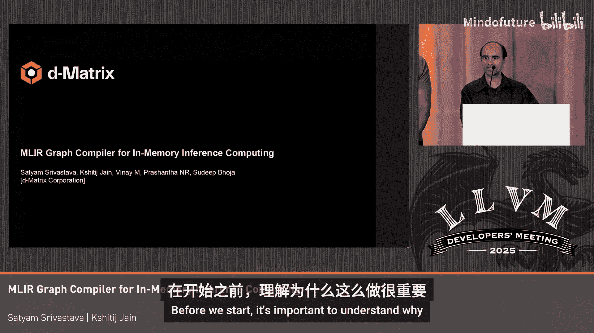
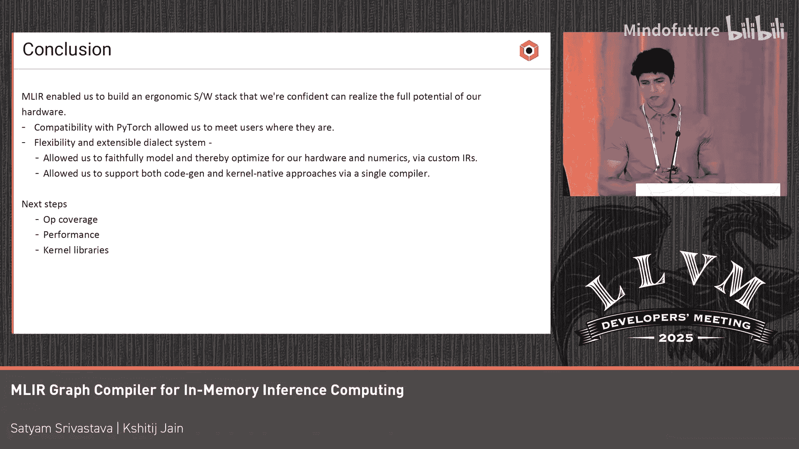

# 034：概述与挑战

在本节课中，我们将学习如何为D矩阵AI加速器构建一个基于MLIR的图编译器。我们将探讨构建此类编译器的动机、所面临的独特挑战，以及我们采用混合编译策略的解决方案。

大家好，我是Sahiium，与我的同事Shaitch一起，我们将分享为D矩阵AI加速器构建图编译器的一些经验。

在开始之前，理解“为什么”至关重要。为什么要做这件事？为什么要构建一个加速器？

有些人可能听说过“内存墙”、“AI壁垒”或“计算饥饿”这些术语。它们本质上是同一回事，意味着传统架构及其最快的HBM内存无法满足现代AI计算的需求。

因此，我们着手构建一种根本不同的东西，它能为我们提供这些计算所需的10倍、20倍更快的内存性能。

这引出了Corst加速器。Corst架构是使用数据流和模块化构建块构建的，这些构建块可以组合成更大的系统。我们使用内存计算技术来实现快速且高能效的矩阵乘法，并通过大量快速、分布式的片上SRAM来增强，这些SRAM用于存储张量参数。

演讲后面需要注意的一点是，每个芯片被分为四个象限，每个象限是一个软件可寻址的、独立的编程单元。

另外需要记住几点。第一，我们拥有相当复杂的内存层次结构，包括多个层级。但它不基于缓存。我们所有的内存对软件都是透明可见的，程序员和编译器的责任是精心编排数据在这些内存上的放置和移动。

第二点，很可能当我们拥有一个容量相当大的模型时，需要将其分布到多个设备上，并采用适当的并行策略来实现。

现在的问题是，我们如何开始为这种具有花哨内存层次结构、奇怪的内存计算架构思考程序表示，同时还要能扩展到多个设备？幸运的是，我们几乎已将所有这些复杂性抽象成一个紧凑的指令集。

Corst ISA包含少量指令，涵盖数据移动、加载存储、向量和矩阵计算、程序控制以及数据重塑。在右侧，您可以看到一个使用这些指令的简单矩阵乘法的示例，我们将在后面讨论。

有了这个背景，当我们开始构建作为更大软件栈一部分的图编译器时，显然会面临一些挑战。对于这个社区来说，构建编译器很困难并非新鲜事。其中一些挑战是我们独有的，一些则普遍适用，总体上它们属于以下三类：

1.  通过编译器捕获各种算法的难易程度。在机器学习中，这转化为可以编译哪些类型的ML架构。
2.  我们为开发者或内核作者提供何种控制和能力，以表达他们的优化提示以及任何程序化构造，并能被下游忠实地表示。
3.  利用所有这些，不仅是编译器技术，还有程序员的意图，我们能在多大程度上利用架构的真正优势并获得其承诺的性能。

我们解决其中一些挑战（以及更多）的方法是采用混合路线。所谓混合，是指我们有一个基于MLIR的编译器栈，并辅以一个包含高性能和用户优化内核的丰富库。

这些内核可以来自像Triton这样的外部方言，我们可以在功能上支持，但Triton的期望与我们的DSL所需的抽象之间存在结构差异，因此我们有其他方法在稍低的抽象级别编写内核。在每种情况下，内核都会被翻译成MLIR的IR或方言，然后输入编译器进行后续处理和优化。

现在，为了深入了解编译器核心部分内部发生了什么，我将交给我的同事。

谢谢Sahiium。我将从我们混合编译管道的概览开始，然后深入探讨前端、中端和后端中一些有趣的组件。

我们从PyTorch模型开始，通过Torch-MLIR将其降低到我们的编译器前端。在前端，我们执行基于SPMD的分区、填充、分块、量化到我们的数值格式以及常量折叠。此阶段的输出是一系列在张量上操作的仿射循环。

然后是中端。在中端，Triton作为一系列仿射循环集成到我们的编译器中。在中端，我们执行生产者-消费者风格的融合、缓冲区化以及向量化，将操作数据块的操作降低为操作64x64虚拟向量寄存器的操作。此阶段的输出是一系列通过DDR内存相互通信的并行循环嵌套。

接着是编译器后端。在这里，我们的自定义DSL降低到DLIR并集成到编译器中。在后端，我们执行SRE和寄存器分配、指令选择、指令调度、内核缝合以及降低到线程模型。此阶段的输出是DMX IO，即我们硬件的汇编代码。

我提到我们做的一个转换是SPMD分区，让我稍微深入探讨一下。我们在StableHLO中执行SPMD分区，从而得到象限级别的对称计算图，之后的编译管道都在这些象限级别的对称计算图上操作。

SPMD分区并非将计算图映射到计算网格的唯一方式，但对我们来说它非常有意义。我们需要支持的最重要模型之一是基于注意力的模型，SPMD分区允许我们自然地将多头注意力模型中不同注意力头之间的独立性和对称性与我们硬件中作为自主执行单元的象限联系起来。

现在让我们通过具体示例来了解一个512x512的矩阵乘法如何通过我们的编译器栈逐步降低。这将有助于说明MLIR提供的丰富抽象如何使我们能够忠实地建模硬件并据此进行优化。

在管道的早期，我们有一个高级的Linalg砖操作，对应单个矩阵乘法操作。这个单一的矩阵乘法操作随后被分解为64个矩阵乘法，每个大小为64x512x64。我们选择按这些维度分块，因为这是我们的矩阵乘法引擎一次能处理的最大矩阵乘法。

这里需要注意的另一件事是，我们也从FP32数值格式降低到了Corst BFP数值格式。

我提到我们的引擎一次可以处理一个64x512x64的矩阵乘法，但在硬件中，这实际上是作为八个不同的64x64矩阵乘法发生的，并且涉及16个不同的向量寄存器，八个用于激活，八个用于权重。在这张幻灯片中，您可以看到我们朝着这种表示形式逐步降低。

我们最终对矩阵乘法操作进行向量化，并使计算中涉及的16个不同向量寄存器在IR中显式化。IR中还显式化了在这八个不同矩阵乘法之间发生的部分乘积归约，这将它们联系在一起，作为单个矩阵乘法的一部分。

最后，我们降低到基于线程的模型，在此过程中，我们将每个仿射并行循环嵌套转换为在一个组内最多八个核心上运行的GPU调用。我们将每个核心建模为线程。这里需要注意的一点是，尽管我们将核心建模为线程，但我们的硬件实际上并不要求我们这样做，我们的核心实际上可以运行不同的工作负载。

在整个降低过程中，我们使用了多种基于方言的优化，这里已经提到。为了节省时间，我将避免详细讨论它们。

无论代码通过我们的编译器走哪条路径，无论是PyTorch、Triton还是自定义DSL，它们最终都会汇聚到DLIR，这是我们自定义的方言，与我们的硬件ISA具有功能对等性。

DLIR模型硬件有序的四元组执行原语。一个DLIR图代表我们硬件上完全调度的工作负载。DLIR是我们退出MLIR的出口，它相当机械地降低到我们的硬件ISA。

总结一下，MLIR使我们能够解决交付ML编译器工具链的一些关键挑战。它让我们能够满足客户当前的需求，其灵活而丰富的方言系统使我们能够忠实地建模硬件并据此进行优化。它还使我们能够构建一个单一的编译器，可以原生支持代码生成和基于内核的方法。

至于我们的下一步，我们将专注于增加操作覆盖范围。

提升性能并构建内核库。就到这里，谢谢大家。祝大家晚上愉快。

本节课中我们一起学习了为D矩阵AI加速器构建基于MLIR的图编译器的动机、核心挑战以及混合编译策略。我们了解了如何利用MLIR的丰富抽象来建模复杂硬件，并通过SPMD分区、渐进式降低等关键技术将高级计算图转化为高效的硬件指令。