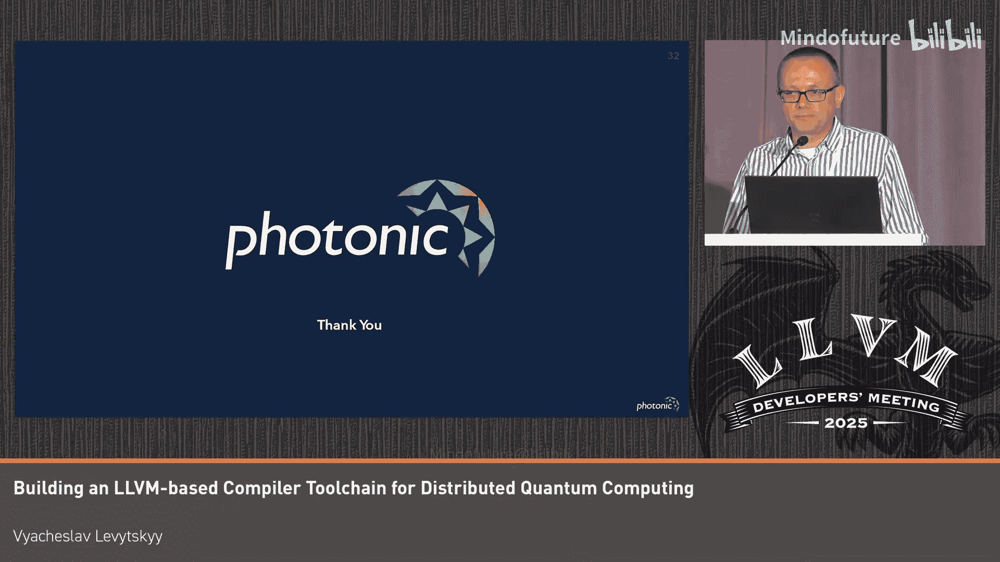

# 035：概述与挑战

在本教程中，我们将学习如何为分布式量子计算构建一个基于LLVM和MLIR的编译器工具链。我们将从量子计算的基本概念和硬件多样性开始，探讨其带来的独特工程挑战，并了解编译器如何作为连接高层编程与底层物理硬件的桥梁。

## 量子计算：承诺与挑战

量子优势尚未实现，但工程挑战已经显现。本教程旨在介绍我们看到的未来，并展示我们如何利用LLVM和MLIR来支持量子软件工程师和科学家。

这是一个广泛的概述，从量子硬件如何决定需求，到光子学编译器栈如何应对技术挑战，包括时序约束、语言和中间表示的支持。

## 量子计算机：异构分布式系统

一个核心的工程观点是：量子计算机是一个带有有线边缘设备的异构分布式系统。它利用**叠加**和**纠缠**，使用量子比特来处理信息。其承诺是，对于某些问题，提供比经典计算机快得多的解决方案。

然而，边缘设备的实现方式差异巨大，架构范围从固定拓扑到高连接性，再到可重构系统。

## 硬件多样性：没有“银弹”

回顾历史，量子技术的发展道路并非直接通向硅基技术，而是在硅基技术主导之前，多种技术竞争并塑造了进步。同样，量子计算的成功不仅依赖于更好的量子比特，还依赖于以架构为中心的方法、网络和分布式设计。

一台实用的量子计算机需要数百万个物理量子比特，因此构建它的方式是横向扩展。编译器需要理解目标硬件。

以下是量子硬件方法多样性的简要概览：
*   **超导量子比特**：广泛可用的技术，门操作时间快，已演示数百个量子比特。
*   **拓扑量子比特**：由微软主导的相关方法，提供更强的抗错能力。
*   **囚禁离子**：提供长相干时间和全连接性，但门速度较慢。
*   **中性原子**：在室温下工作，通过穿梭原子到新配置来支持灵活的连接性。
*   **硅自旋量子比特**：有望实现具有成本效益的制造。
*   **光子量子比特**：利用光的量子特性，提供高连接性和易于扩展性。

由此可见，可用的边缘设备不仅不同，而且差异巨大。控制和测量硬件是特定于模态的，这就在具体技术内部塑造了各自的编译器需求。

## 共同挑战与编译器需求

所有平台的共同点是：精确控制至关重要，底层操作本质上是硬实时的。技术的多样性限制了现有解决方案的复用，我们离量子电路模型越远，满足特定模态要求就越困难。

我们正处于一个量子比特有限、错误率较高的量子时代。虽然量子优势尚未来临，但我们可以预见大规模容错系统将超越经典计算。

但请思考一下数字：商业应用将需要数千个连接的逻辑（即虚拟）量子比特，以及数量级更多的物理量子比特。每种模态都在与自身的扩展和稳定性挑战作斗争，仅仅扩大规模不太可能解决这个问题。这促使我们倾向于分布式模块化设计和横向可扩展系统作为基础要素。

因此，对于我们基于LLVM的编译器来说，这意味着需要专注于分布式计算，并且复用现有解决方案的能力有限。

## 现有开源项目与局限

该领域已有知名的开源项目。一个量子编译器将电路降级为硬件诊断中间表示、脉冲序列领域特定语言，再到供应商特定的指令。无论我们如何努力将语言、中间表示和目标平台耦合在一起，这些抽象都会泄漏，并且很难将量子模态与技术解决方案（包括MLIR方言）分离开来。

量子电路的建模无助于解决超越网络的扩展细节。而像脉冲序列这样的低级操作在不同模态间存在差异，这使得抽象变得复杂。分布式多设备工作流在MLIR中表达时，模态非常具体，并且有非常特定的约束，再次限制了复用。

## 总结

在本节中，我们介绍了量子计算的基本承诺和构建实用量子计算机所面临的巨大工程挑战。我们了解到量子硬件具有惊人的多样性，这直接导致了编译器设计的复杂性。核心挑战在于如何为这种异构、分布式、硬实时的系统构建一个高效、可靠的编译器工具链。在接下来的章节中，我们将深入探讨如何利用LLVM和MLIR来应对这些挑战。

---

# 分布式量子计算编译器工具链：第2章：架构与约束

上一节我们介绍了量子计算的多样性和挑战，本节中我们来看看一种具体的混合架构及其带来的编译约束。

## 自旋-光子混合架构

我们的自旋-光子混合架构通过结合用于存储的硅自旋量子比特和用于高连接性的硅光子，来解决连接性挑战，从而为编译器门实现任意的非本地连接。这是一个多步骤的概率过程，具有网络感知能力且资源密集，需要在低级语言中支持原生控制流。

## 实际约束：模态特定与硬实时

实际约束仍然是模态特定的。操作受相干时间限制，这使得硬实时处理和低延迟至关重要。我们需要闭环控制、嵌入式控制器来满足延迟要求，以及控制器与运行时之间的高效交互，以支持非破坏性的中途测量。

我们模态中实现效率的支柱是可复用模型和高效的软硬件协同设计，以满足纳米级同步控制器的要求。

## 分布式编译：从全局模型到设备二进制码

有意义的量子计算需要将各个模块联网在一起。因此，从技术上讲，编译器是为分布式嵌入式系统服务的。光子控制系统是一个量子比特控制器网络，编译器必须将全局控制模型转换为具有时序和通信保证的配对设备二进制码。

全连接性是该架构的一大优势，同时由于规模和复杂性，它也是一个巨大的技术挑战。

## 编译器支持的复杂编程模型

编译器支持一个用于异构计算的复杂编程模型，具有分布式主机-控制器交互，为运行时提供调度上下文（如物理量子比特本身等共享资源）。这种复杂性对编译器工程师来说是个好消息，因为语言和中间表示在编码、表达和暴露这个编程模型方面扮演着关键角色。

## 总结

在本节中，我们探讨了一种具体的量子硬件架构——自旋-光子混合架构，并分析了它给编译器带来的核心约束：硬实时处理、分布式控制、复杂的资源调度以及网络感知的编程模型。这些约束定义了我们的编译器必须解决的关键问题。接下来，我们将看到LLVM和MLIR如何为构建这样的编译器提供基础。

---

# 分布式量子计算编译器工具链：第3章：LLVM与MLIR的基础与鸿沟

上一节我们了解了量子架构的特定约束，本节中我们来看看经典编译器框架LLVM和MLIR如何作为我们工具链的基础，以及它们与量子需求之间存在的鸿沟。

## LLVM/MLIR：强大的基础

从头开始创建一个可扩展的量子编译器栈本身就足够具有挑战性。因此，利用像LLVM这样的主流经典编译器框架是一个重大优势。其基础设施、优化和功能为构建工具链提供了强大的基础。

然而，我们需要协调经典编译与量子资源，并针对量子特定指标（如电路深度和门数量）进行优化。因此，高层编程与物理硬件控制之间的鸿沟比在经典系统中要大。

## MLIR：支持量子语义与虚拟ISA

在光子学，MLIR支持量子及模态特定的语义，并支持虚拟指令集架构。我们的量子比特控制器使用增加了实时语义的RISC-V。但脉冲级控制对于上游的MLIR方言来说仍然是一个挑战，现有的方言无法捕捉我们的控制参数。

因此，LLVM和MLIR确实提供了许多构建模块，但构建量子软件栈的关键部分在上游是缺失的。

## 构建量子编译器：初始焦点与挑战

从零开始构建量子编译器，我们最初的焦点是低级控制实验、基准测试和校准库。平衡本地执行效率与模块化组件调度、交互控制的大局观，需要在纳秒精度上进行决策。因此，决策需要在编译时做出。但同时，控制流限制了静态调度，使得实时反馈循环成为硬件协同设计的一个关键挑战。

量子编译器不可或缺的环节，如量子比特映射和错误缓解，在LLVM中并非原生支持，必须作为自定义转换来实现。工具链的这一部分是量子编译器，它与经典编译器紧密交互，以满足由量子比特相干时间决定的时序要求。

## 总结

本节我们认识到，LLVM和MLIR为量子编译器开发提供了坚实的工程基础，特别是其模块化、多层中间表示的设计哲学与量子系统的分层特性非常契合。然而，由于量子计算的独特性（如硬实时、概率性操作、特定硬件约束），我们需要在它们之上构建大量自定义的组件和优化。下一节，我们将描绘整个编译器栈的完整层次结构。

---

# 分布式量子计算编译器工具链：第4章：多层编译器栈

上一节我们讨论了基础与鸿沟，本节中我们来看看为分布式量子计算设计的完整的多层编译器栈是如何组织的。

## 量子系统的深层分层

量子系统是深度分层的，从高级语言和中间表示、逻辑门和纠错，到物理量子比特、同步原语和控制电子设备。LLVM为此提供了坚实的基础，而MLIR则提供了一个框架，用于集成量子和经典方言以及纠错和模态特定协议，这与量子计算的多层性质相匹配。这对于底层至关重要，在底层，精确的脉冲和通信调度被转换为控制器级代码，并与运行时环境交互。

## 编译器栈图示

下图展示了一个用于分布式量子计算的多层编译器栈：
*   **前端**：将Q#和其他领域特定语言转换为为自旋-光子架构设计的MLIR方言。
*   **运行时集成**：定义辅助拓扑，支持原生非确定性量子协议。
*   **中端**：适应系统配置和底层物理门定义的变化。
*   **底层**：脉冲语言构成量子电路的构建块，并从高级编译器的视角提供一个虚拟ISA。

在这里，单一的中间表示是低效的。多层栈使用可移植的中间表示在逻辑电路、脉冲控制和分布式硬件之间架起桥梁，并在各层之间进行稳定和抽象。这些层是集成的，但又是不同的，具有不同的范围、目标、用户输入语言和约束。

## 多种用户与统一表示

除了创建量子电路（例如用Q#）的终端用户外，还有两种内部用户：
1.  **量子软件工程师**：创建纠错方案，将逻辑电路转换为具体的容错、可执行调度。
2.  **低级语言用户**：使用低级语言进行表征、基准测试，并最终开发更好的量子硬件。

我们需要一个编程模型的统一表示，作为量子编译和完全硬件降级之间的锚定点。在量子计算中，有趣的是多层编译器栈为多个可移植中间表示提供了多个接入点（在图中用红色箭头标出）。

## 关键中间表示

以下是关键的可移植中间表示：
*   **QIR**：由QIR联盟维护的行业范围成果。
*   **虚拟ISA**：编码量子比特控制器网络的执行模型，在栈的各层内表达同步和通信原语。
    *   **逻辑虚拟ISA**：仍然是抽象的，位于层之间，并非硬性可执行，更像编译器后端的API。
    *   **物理虚拟ISA**：抽象硬件实现细节，实现不同版本量子控制系统之间的可移植性。

这种方法支持前向兼容性、更快的迭代以及跨层的独立创新。

## 总结

本节我们勾勒出了一个为分布式量子计算量身定制的多层编译器栈。它通过引入多个稳定的、可移植的中间表示（如QIR和不同层级的虚拟ISA），来解耦高层算法、硬件控制逻辑和具体的物理实现。这种设计提供了灵活性、可维护性和应对硬件快速迭代的能力。接下来，我们将深入其中一个关键环节：脉冲级语言。

---

# 分布式量子计算编译器工具链：第5章：脉冲级语言与执行模型

上一节我们介绍了多层编译器栈的整体结构，本节中我们聚焦于底层的关键——脉冲级语言及其执行模型。

## 模拟与物理操作

区分模拟量子计算和物理操纵量子比特非常重要。模拟是需要的，但精确的量子比特操作才是最终关键。因此，我们优先考虑脉冲语言和ISA。

## 脉冲级用例与重要性

脉冲级用例包括校准、控制序列设计、保真度基准测试和实验，以推动硬件改进。它类似于逻辑虚拟ISA，是量子电路的构建块。在自旋-光子模态中，脉冲语言内部的原生控制流至关重要，因为其执行模型是概率性的、网络感知的，并且需要控制和测量设备之间的对齐。确保正确的时序、同步和通信对于精确的量子控制至关重要。

## 编译器实现与关键约束

我们的光子学编译器使用MLIR来编码用户级虚拟ISA和控制器操作，从而实现从逻辑电路到硬件的完整量子执行。编程模型确保全局协调的量子比特操纵。

关键约束包括：
*   **精确脉冲时序**：硬件优化和纳秒级时序至关重要。
*   **资源冲突**：需要无冲突的资源分配。
*   **中途反馈延迟**：不一致的分支延迟可能破坏量子比特对齐，因此我们使用静态调度和确定性分支来保持对齐的相干执行。

同步和通信原语使得在分布式环境中能够进行无冲突的资源分配和一致对齐的操作，但延迟和调度挑战比在经典系统中更为严格。

## 编译器实现与Python集成

编译器在底层用C++实现，同时也作为Python包发布。Python绑定暴露了完整的翻译、优化、分析API。与Python的集成支持用户管理实验，Python中的数据集成和系统参数（如设备拓扑、校准参数）直接反馈到编译器中。这允许用户和开发者在适当的抽象级别插入编译器，结合了性能与易用性。

## 总结

本节我们深入探讨了量子编译器栈的基石——脉冲级语言。它直接控制硬件，必须处理硬实时、概率性执行和分布式同步等极端约束。通过静态调度、确定性分支和丰富的同步原语，编译器确保了量子操作的精确性。同时，提供Python接口使得实验和调试对用户更加友好。接下来，我们将讨论如何将高层量子编程语言（如Q#）集成到这个栈中。

---

# 分布式量子计算编译器工具链：第6章：集成QIR与未来方向

上一节我们探讨了底层的脉冲控制，本节中我们来看看如何将高层的量子编程语言（以Q#和QIR为例）集成到我们的MLIR-based工具链中，并探讨未来的标准化方向。

## 集成Q#与QIR的挑战

回到中间表示作为编译器的关键组件，我们支持Q#作为前端之一，使用QIR来表示门、测量、量子比特遥传和结果处理。将QIR与MLIR集成并非易事。MLIR具有结构化控制流和一等公民的语义，而QIR仍然是LLVM IR，需要仔细的映射。微软的软件栈并非基于LLVM，因此集成选项有限：要么将LLVM IR提升到MLIR，要么在降级之前拦截其内部中间表示。依赖未文档化的实现细节具有挑战性。目前，我们将QIR提升到MLIR，编译降级到物理门，再进一步降级到RISC-V以供硬件执行。

## 更优路径：MLIR作为稳定中间层

一个更具吸引力的方法，是使用MLIR作为Q#和QIR之间的稳定中间层，以提供丰富、灵活的语义。Mojo语言展示了将编程语言与MLIR概念对齐如何使开发者和行业受益。Q#可以遵循类似的道路以获得更广泛的采用。

将QIR提升到结构化控制流再融入MLIR管道，并非匹配Q#、QIR与现代基于LLVM的编译链的唯一问题。QIR使用指针类型和内存语义来建模量子实体，而我们缺少与量子计算自然对齐的SSA值语义（确保值被赋值一次并显式转换）。QIR的中立性是有代价的：难以表达模态特定功能，也难以向编译器传递元数据来指导降级。

## 推动QIR发展的MLIR框架

我们并非第一个认为MLIR为QIR发展的下一阶段提供了理想框架的人。MLIR在推动QIR采用方面处于独特地位。在QIR之上标准化架构中立的MLIR方言，可能对整个行业来说都是一个有价值的栈，有助于统一原本碎片化的量子计算生态。

## 平台特定转换与领域特定语言

进入平台特定领域，我们的目标是避免为复杂的条件算法硬编码编译过程。解决方案之一是建立一个用于量子定制化转换和纠错的**标准库**。这使得我们的用户（量子软件工程师和物理学家）能够用高级语言指定降级逻辑，从而将后端特定关注点与应用程序逻辑分离开来。

Python领域特定语言在这里是一个强有力的工具，因为用状态机编写类似的纠错代码很繁琐。用户熟悉Python，而领域特定语言可以强制执行模态特定的约束。当脉冲序列方言在底层表达逻辑时，这个库使用户能够影响降级，例如，通过描述量子纠错中的“重复直到成功”控制流。

## 结合领域特定语言与硬件控制

为了结合领域特定语言、高级语言和低级硬件控制，我们必须考虑编译器工具链在自适应量子电路中的执行模型。经典反馈指导后续操作，这就提出了工具链组件如何交互、哪一层驱动执行逻辑的问题。我们的方法是使用与分布式运行时集成的编译语言来处理这种异构环境。因此，类似于HPC，领域特定语言被降级为多个ISA的二进制码以及元数据，生成主机程序和用于量子比特控制器的设备特定内核。

我们的目标是将后端特定关注点与核心应用逻辑分离，为量子软件工程师和实验物理学家提供工具来探索新颖的转换模式。这些抽象必须被降级到MLIR中。

## Python动态性与MLIR静态性的调和

尽管Python的动态性、反射和控制流与MLIR基于静态SSA的设计相冲突。一个可行的方法是将Python限制为一个可静态分析的子集，在Python AST上操作，并将其翻译成MLIR，同时单独处理外部调用。该领域已有类似的先例，例如用于混合量子经典工作流的Catalyst装饰器，以及像PySelf这样从受限Python生成MLIR的库。这个设计是一个折中路径，强制执行一个受约束的Python子集。

## 灵感来源：Mojo与未来愿景

Mojo作为MLIR的前端，以及对混合经典AI工作流的引人注目看法，对我们来说是非常重要的灵感来源，这在概念上与经典-量子工作流相似。我们设想一个未来，经典AI和量子系统在统一的流程中交互并相互受益。

在那个尚未到来的光明未来之前，我们记得，尽管量子系统有些奇特，但它们仍然属于异构计算这个更广泛的范畴。

## 总结

本节我们讨论了集成高层量子语言（如Q#）的挑战与方案，提出了利用MLIR作为更灵活、更强大的中间层来桥接高层抽象与硬件控制的愿景。同时，我们探讨了使用Python领域特定语言和标准库来赋能用户、实现软硬件协同设计的策略。最后，我们展望了量子与经典计算（包括AI）深度融合的未来。接下来，我们将面对维护这样一个复杂工具链的实际考量。

---

# 分布式量子计算编译器工具链：第7章：维护、版本控制与结语

上一节我们展望了技术集成的未来方向，本节中我们来看看维护基于LLVM的量子编译器工具链所涉及的实际挑战，并以此作为本次教程的总结。

## 维护LLVM基础的成本

最后，LLVM是一个庞大的C++代码库，保持更新需要付出努力，我们需要控制维护负担，但稳定性对我们至关重要。量子硬件实验是科学的前沿，这本身就充满挑战，并且期望软件栈具有稳定性和可预测性。我们降级到RISC-V进行脉冲级控制，这种依赖关系是我们持续考虑的一部分：我们应该自己实现或定制什么，以及我们应该从上游使用什么。如果是使用上游版本，那么版本是什么。

## 所有权与定制化的权衡

拥有降级管道的某些部分会给我们精细的控制权，这对于应对大规模工程挑战至关重要，但权衡的结果是，我们在自己的代码库中采用变通方法和定制，既不拥有也不定制后端和目标。

关于C++和版本，我们不支持多个LLVM版本以避免复杂性。支持QIR也有这样的代价，但我们宁愿采用变通方法也不使用LLVM 14。因此我们的版本是LLVM 21，并且我们尝试与上游变更保持一致以简化维护。

## 更广泛的思考

在这最后一张幻灯片上，我想进行更广泛的反思。在17世纪，人们构思了可以代表世界的通用符号语言。几个世纪以来，这些想法仍然是抽象的，但现在有了大语言模型和生成式AI，我们有了先进的实现。量子计算处于类似的位置：前景巨大，不确定性十足，技术困难重重。

经典芯片中的晶体管本质上是完美的。量子比特的两量子比特门保真度在百分之九十几的范围。这个差距定义了我们面前工程挑战的规模。但是，错过实用规模量子计算到来的风险太高，不容忽视。因此，辩论已经转变。问题不再是“是否”会有量子计算机，而是“何时”以及“如何”。

幸运的是，编译器处于这场变革的核心。

## 总结

在本教程中，我们一起学习了为分布式量子计算构建编译器工具链的完整图景。我们从量子硬件的多样性和独特约束出发，探讨了如何利用LLVM和MLIR的强大基础来构建多层编译器栈。我们深入了解了脉冲级控制、执行模型、高层语言集成（如QIR）以及赋能用户的标准库和领域特定语言。最后，我们也看到了维护这样一个前沿工具链的实际考量。量子计算编译是一个充满挑战但至关重要的领域，它融合了编译器技术、分布式系统、实时编程和量子物理，正等待着编译器工程师们去开拓。