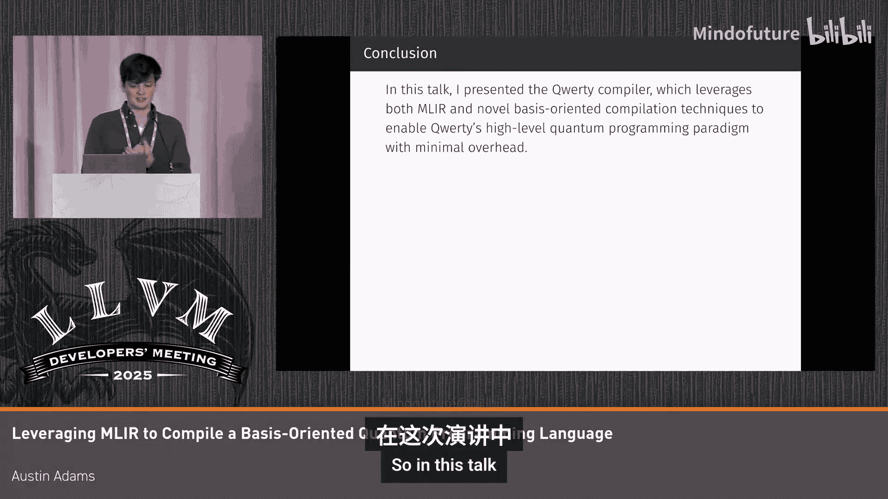

# 036：利用MLIR编译面向基础的量子编程


在本教程中，我们将学习如何利用MLIR编译器框架，为一个名为“Query”的面向基础（basis-oriented）的量子编程语言构建编译器。我们将了解如何将高级量子算法描述转换为底层的量子电路，并探讨其中的关键编译技术。

## 概述

当前主流的量子编程语言（如QCL、Q#）通常要求程序员直接思考和构建量子电路，这属于较低层次的抽象。我们开发的“Query”语言及其编译器旨在提供更高层次的抽象，允许程序员以更直观的方式（例如，通过基础变换和经典代码）描述量子算法，并由编译器自动合成优化的量子电路。

## 语言设计动机 🎯

上一节我们提到了当前量子编程的抽象层次问题，本节中我们来看看一个具体的例子。

在主流量子编程语言中，实现一个特定的基础变换（例如，将四个|+>态替换为带负号的版本）可能需要手动合成复杂的电路。例如，在QCL或现代商业语言中，代码可能如下所示：

```qcl
// 示例：在传统量子语言中手动构建电路
circuit some_gate(qubit q) {
    H(q);
    // ... 更多门操作
}
```

而在我们的Query语言中，同样的功能可以简洁地表达为一个基础翻译操作：

```python
# Query语言中的基础翻译
basis_translation |++> -> -|++>
```

这种表达更接近算法意图，而非硬件细节。编译器负责将此高级描述转换为具体的量子门序列。

## 编译器架构与MLIR方言 🏗️

上一节我们介绍了Query语言的设计理念，本节中我们来看看其编译器的整体架构。

Query编译器的核心工作是将Query代码（最初解析为Python AST）最终转换为可供现有量子电路优化器和后端使用的量子电路。其软件架构流程如下：

以下是编译器处理流程的关键步骤：
1.  **解析与前端处理**：将Query代码（基于Python语法）解析为抽象语法树（AST），然后提取为Query特有的AST（在实现中是一个Rust数据结构）。
2.  **类型检查与宏展开**：对AST进行类型检查、宏展开和类型推断。
3.  ** lowering 到 MLIR 方言**：将处理后的AST lowering 到两个自定义的MLIR方言。

我们将重点关注上述流程中的最后一步，即 lowering 到MLIR方言的过程。首先 lowering 到的是 **QIRDI 方言**。

### QIRDI 方言：高层次的量子语义

QIRDI 方言是直接从AST lowering 而来，它镜像了Query语言的语义，可以说是我们MLIR流程中抽象层次最高的方言。这主要体现在其操作是**基于量子态的基础（basis）**定义的，而非底层的量子门（如NOT、Hadamard门）。

QIRDI方言主要包含两类操作：

以下是QIRDI方言中的两类主要操作：
*   **基础导向的量子操作**：例如 `state_change`（状态改变）、`basis_translation`（基础翻译）、`state_evolution`（状态演化）或在某个基础上进行的 `measurement`（测量）。这些操作都带有指定基础（basis）的属性。
*   **函数式操作**：这类操作看起来有点像MLIR中的 `func` 方言，包含 `constant`（常量）、`call_indirect`（间接调用）等。但这里有一个关键的不同点。

那么，为什么不直接使用MLIR内置的 `func` 方言呢？原因在于Query语言中函数调用的特殊性。

### 处理特殊的函数调用：反转与谓词化 🔄

在Query以及许多其他量子编程语言中，函数可以以多种方式调用：
1.  **正向调用**：正常顺序执行。
2.  **反向调用**：以逆序执行函数。
3.  **谓词化调用**：函数仅在整个状态空间的某个特定子空间上运行。这是对传统量子语言中“受控”操作的泛化。

更复杂的是，这些操作可以组合。例如，可以获取一个函数的谓词化版本，然后取其逆，再调用它。

在编译器中，我们这样处理这些特殊调用：首先，像 `call_rev`（反向调用）这样的操作在QIRDI IR中会生成一个函数值。接着，通过一个“具体化”过程，将其转换为带有 `reversed=true` 属性的直接 `call` 指令。

真正的挑战在于内联（inlining）这些反向或谓词化的调用。

#### 内联反向调用

在QIRDI方言中，我们假设所有可反向调用的函数（目前）只包含一个基本块。因此，内联一个反向调用就简化为**如何反转一个基本块**。

我们通过以下步骤实现：
1.  从基本块的终止符开始，向上遍历操作。
2.  为每个操作生成其逆操作。这里的新颖之处在于，我们没有为特定操作硬编码此过程，而是定义了一个 **`ReversibleOpInterface`**。
3.  每个实现了该接口的操作都知道如何构建自己的逆版本。我们自底向上收集这些逆操作，然后自顶向下重建出反转后的基本块。

#### 内联谓词化调用

谓词化调用的内联思路类似。我们同样从终止符向上遍历基本块，但这次使用 **`PredicableOpInterface`**。对于许多基础导向的操作，谓词化通常意味着修改其基础属性，使其仅在特定的子空间（由谓词指定）上生效。

成功内联后，我们的代码将变成从量子比特分配到测量之间的一条直线型量子操作序列。这对于许多只支持直线型代码的量子硬件来说是理想状态。

## 量子电路合成 ⚡

上一节我们探讨了如何在QIRDI方言中处理高级语义，本节中我们来看看如何将这些高级操作合成为具体的量子电路。

内联之后，代码虽然已是直线型，但其语义仍是量子层面的（basis-oriented）。下一步是通过**方言转换**，将QIRDI方言 lowering 到**量子电路方言**。

我们设计了一个量子电路方言（例如 `QuantumCircuit`）。它的设计借鉴了前人工作，其特点是量子比特像SSA值一样在不同操作间显式地流动，这使得依赖关系清晰，并且可以相对容易地替换为其他量子硬件厂商的方言。

### 基础翻译操作的电路合成

让我们以核心的 `basis_translation`（基础翻译）操作为例，看其合成过程。我们为这类操作合成的电路总体结构包含：一个可逆的经典相位字符串排列核心，外围包裹着处理向量相位（引入或移除负号）的层，以及最外层的标准化/去标准化层（用于移除和重新引入叠加态）。

对于一个具体的两量子比特基础翻译操作，其合成步骤如下：

以下是基础翻译操作的电路合成步骤：
1.  **解包**：将输入的2-qubit寄存器解包为两个1-qubit值。
2.  **去叠加**：将状态从叠加态中取出（去标准化）。
3.  **施加相位**：施加指定的相位（例如π相位，即负号）。
4.  **重新叠加**：将状态重新置回叠加态（标准化）。
5.  **重新打包**：将两个1-qubit值打包回一个2-qubit寄存器。

整个合成过程在MLIR中通过一个方言转换模式实现，无需复杂的分析上下文。

### 经典代码的量子电路合成

Query允许编写经典函数（如Oracle），并由编译器合成量子电路。其流程如下：
1.  经典函数从AST lowering 到一个**经典电路方言**（如 `ClassicalCirc` 方言）。
2.  对该经典电路进行数字逻辑优化。
3.  使用工具（如借鉴 `T` 库的方法）将优化后的经典电路合成为量子电路。

## 性能评估与总结 📊

上一节我们详细介绍了电路合成的过程，本节最后我们来评估一下这种方法的有效性。

我们选取了四个教科书级的量子算法，分别用Query语言和三种常见的面向电路的量子语言实现。针对不同的量子比特数量，我们使用各自的编译器流程生成电路，并送入一个针对未来容错量子计算机设计的资源估算器，来估算其运行时间。

结果显示，对于这些算法，通过Query编译器自动合成的电路，其预估性能与手工编写的电路相比具有竞争力。

**总结**：本节课中我们一起学习了如何利用MLIR为面向基础的量子编程语言Query构建编译器。我们探讨了：
*   Query语言如何通过基础变换等高级抽象简化量子编程。
*   编译器如何通过QIRDI和量子电路等多层MLIR方言进行 lowering 和转换。
*   如何处理反向调用、谓词化调用等高级语言特性。
*   如何将基础翻译和经典函数等高级操作自动合成为优化的量子电路。
*   性能评估表明，该编译器能够使高级抽象在性能上与手工编写电路相竞争。

如果您想了解更多细节，可以参考相关论文和开源代码。




## 问答环节 ❓

**问**：当处理可逆函数时，对于那些本身不可逆的操作，你们如何处理？

**答**：我们在AST层面进行类型检查。Query中有两种函数类型：`reversible`（可逆）和`irreversible`（不可逆）。如果一个函数被声明为`reversible`，那么其函数体内所有的操作和子调用都必须是可逆的。目前，可逆函数中不允许包含经典分支等不可逆操作。未来或许可以借鉴可逆经典编程语言（如Janus）的思想来引入受控的可逆分支。


