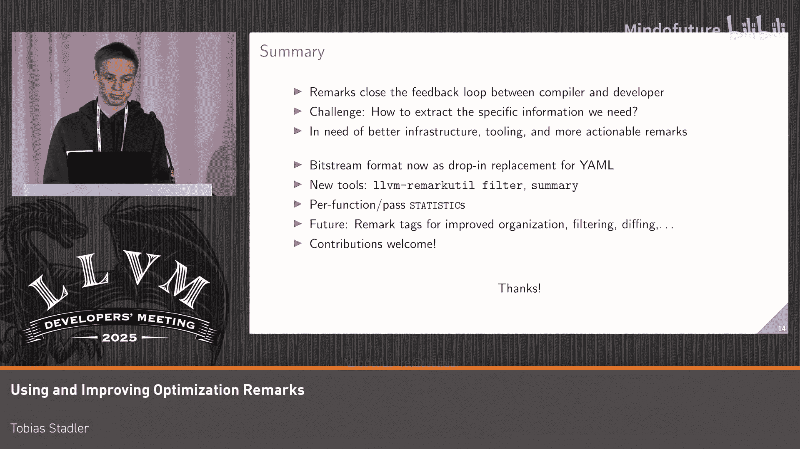

# 037：使用与改进优化备注

在本教程中，我们将学习LLVM优化备注的当前状态、使用方法以及近期的一些改进。优化备注是编译器向开发者反馈优化决策信息的重要工具，例如哪些优化被应用了，哪些被错过了及其原因。掌握它们有助于我们理解代码性能并指导编译器生成更优的代码。

## 优化备注简介与动机

优化，特别是向量化等复杂优化，对程序性能有巨大影响。其效果取决于优化是否成功应用。

例如，你编写了一个简单的循环来计算一系列值的范围，然后对结果进行归约。编译器能否成功向量化这个循环，取决于许多因素。这里的关键问题是：我们如何得知编译器是否成功向量化了循环？如果失败了，原因是什么？

一种方法是直接查看生成的汇编代码，但这可能非常繁琐，对于向量化尤其棘手，因为你可能在循环中看到一些SIMD指令，但这并不意味着循环被完全向量化，可能只是发生了SLP向量化。

因此，我们需要更好的工具来完成这项工作。这就是优化备注的用武之地。使用优化备注，编译器可以直接告诉我们某些优化是否被触发。

例如，如果归约计算的是浮点值的总和，优化备注可以告诉我们，需要允许浮点运算重新排序，循环才能被向量化。

另一个例子是，如果归约函数定义在不同的翻译单元中，这可能阻止其被内联。而编译器无法向量化包含函数调用的指令。在这种情况下，优化备注会告诉我们这一点。

## 优化备注的现状与挑战

优化备注已经存在了一段时间，但由于使用起来仍有些繁琐，我们并未充分利用它们。

首先，大多数优化备注不像我展示的第一个例子那样具有可操作性。其次，你需要知道一些“魔法”标志来传递给编译器，以发现你真正感兴趣的信息。如果你不确定要找什么，就不得不生成所有的优化备注。

这是可以做到的。我们有一个很好的工具叫 `opt-viewer`，它允许你以HTML页面的形式，将优化备注与源代码交错查看。

问题在于，即使是一个简单的函数，我们也会被各种不同的优化备注淹没，其中大部分对我们来说并非立即可用。

因此，不幸的是，除了小段代码片段，目前使用优化备注来收集实际的性能洞察是相当困难的。

## 优化备注的设计与分类

优化备注最初被设计为一种与前端无关的诊断机制，用于从优化器和后端向用户提供反馈。

然而，这些诊断更像是遥测数据，而非真正的诊断。因为与错误或警告不同，如果你在代码中看到一个优化备注，通常无法直接“修复”它。它们更多是为了收集编译器正在做什么的数据。因此，与错误和警告相比，优化备注的数量天生就非常庞大。

这也反映在我们有多种不同类型的优化备注上：
*   **已应用备注**：表示某个优化被成功应用。
*   **错过备注**：表示一个优化机会未被采纳，例如，因为在某些情况下它可能不正确或不安全。这些错过备注是我们最接近可操作诊断（类似于性能问题警告）的备注。
*   **分析备注**：这基本上是其他所有类型的备注，例如循环未被向量化的原因、某些启发式决策以及编译器想要告诉我们的各种统计数据。

挑战的另一部分是，优化备注试图满足两种相互冲突的不同用例。

一方面，我们希望将优化备注作为一种教学工具，弥合用户意图与优化器实际能对代码做什么之间的差距。为此，我们需要关于代码中错过的优化机会的低噪音、可操作的备注，以便用户更好地理解哪些优化失败了、为什么失败，并基于这些信息指导编译器获得更好的性能，例如通过传达某些程序不变量、提供特定假设或使用编译指示覆盖编译器可能采用的启发式方法。

另一方面，我们的大多数优化备注是由编译器工程师为编译器工程师添加的，主要用于调试优化过程。在这里，我们确实希望获得所有能拿到的数据。我们希望调整启发式、理解性能回归并评估新优化的影响。特别是，我们希望能够在持续集成中跟踪真实世界项目的优化备注，以便分析编译器在不同版本间的变化，从而标记出潜在的回归。

这里的主要结论是，我们需要改进我们的工具链，以便能够向每个用户展示他们感兴趣的信息。

## 如何获取优化备注

为了做到这一点，我们首先需要仔细看看如何从编译器中获取优化备注。

优化备注本质上是键值对。它们有一个名称，包含发出该备注的**过程名称**和**函数名称**，以及一堆参数（例如字符串）。

我们有三种不同的方式来输出优化备注：
1.  通过诊断处理器传递回前端，然后前端可以执行任何操作，例如将它们作为诊断信息打印出来。
2.  将优化备注流式传输到YAML文件以供后续处理。
3.  一种类似的比特流格式，它也可以让你将优化备注存储在文件中。这种比特流格式比YAML表示更紧凑。

通常每个翻译单元会得到一个优化备注文件，至少Clang是这样做的。所有的序列化基础设施都是LLVM本身的一部分，但需要通过前端标志来设置。在上述每种格式下，你都可以看到如何在Clang中启用它们。

可选地，你也可以使用正则表达式来过滤优化备注，或过滤特定过程的优化备注。这里需要传递的名称是你在过程CPP文件中可以找到的`DEBUG_TYPE`宏，而不是你从过程管理器使用的过程名称，所以需要小心。

## 现有工具概览

基于这些不同的格式，我们现在有不同的工具来生成、处理和显示优化备注。我不想详细介绍每一个，但我想让大家了解已经存在的工具，以免我们重复造轮子。

从生成方面看，你可以从Clang、MIR、Swift（可能还有Rust等）生成优化备注。MIR和Swift有点特殊，因为它们也可以为自己的过程输出优化备注，而不仅仅是启用现有的LLVM优化备注。

我认为最成熟的LLVM优化备注，你很可能需要处理的是向量化备注、内联备注和循环展开备注。根据我的经验，这些备注目前有一些非常好的诊断信息。

对于处理、序列化和解析优化备注，这主要基于`remarks` C++库，它只是LLVM核心库的一部分。但这个库也有一些C绑定。

然后，有一些工具建立在这个库之上。主要的一个叫做`llvm-remarkutil`，它有多个子命令用于格式转换、聚合等。对于仅限macOS的二进制文件，你也可以使用一个叫做`dsymutil`的工具。当你合并程序的调试信息时，你也可以用它来将多个翻译单元的优化备注合并到一个文件中。但如前所述，这仅限于macOS。

还有`opt-viewer.py`，可以用来统计最常见的优化备注；以及`opt-diff.py`，可以用来比较两个不同版本之间的优化备注文件，它只显示这些文件之间添加和删除了哪些优化备注。重要的是，这些Python工具目前只适用于YAML格式的优化备注。

同样的情况也适用于我之前提到的`opt-viewer.py`显示工具。当然，你也可以显示由Clang或`opt-viewer`显示的优化备注。

还有一些其他工具，例如，有一个CI工具叫`llvm-opt-report`，它是`opt-viewer`的一个更专业化的版本，只以内联、向量化、循环展开备注的更紧凑形式显示，并且是用C++编写的，所以这个工具也支持比特流优化备注。此外，Compiler Explorer网站上也有一个基于YAML优化备注的工具来查看优化备注。

## 改进方向：比特流格式与工具

大多数工具都是多年来独立发展起来的，所以目前存在一些碎片化。特别是比特流优化备注没有得到广泛支持，这给使用整个基础设施带来了一些痛点。

因此，作为第一步，我们希望使优化备注成为工具链中的一等公民。我们投入了一些时间来彻底检修比特流优化备注。

主要原因是可扩展性，因为YAML文件会迅速变得异常庞大。对于一个代码库，我们谈论的是GB级别的YAML；如果你从CI中导出多个项目，则可能达到数百GB。而比特流格式的大小仅为YAML格式的10%到20%。

当我们开始时，比特流优化备注有很多问题。主要问题之一是它们只在macOS上得到真正支持，原因是该格式要求将字符串表存储在目标文件本身中。这也意味着我们无法在像`opt`这样不直接生成目标文件的工具中使用比特流优化备注。

我们对比特流优化备注基础设施进行了重大检修。现在，比特流文件完全独立，不再依赖于目标文件，它们本质上可以作为YAML的即插即用替代品。当你传递优化备注文件时，我们现在会自动检测文件是YAML还是比特流格式，所以现在使用起来容易多了。

比特流文件现在也小了大约40%，并且我们现在可以嵌入更大的二进制块，这在以前是不可能的。例如，你可以用它来在优化备注中存储LLVM位码，以从特定过程中提取重现用例。

为了消除对目标文件的依赖，我们不得不更改启用优化备注的API，因为我们现在需要更仔细地管理优化备注文件的生命周期。因此，在设置优化备注时，你现在会收到一个特殊的文件句柄，你需要保持其存活，直到你发出所有优化备注。你可以在该函数的文档中找到更多详细信息。

## 新工具：过滤与汇总

现在我们可以实际使用比特流优化备注了，我们需要一些基本工具。例如，我们添加的第一个功能是`llvm-remarkutil`中的`filter`命令。顾名思义，它允许你根据函数、过程、优化备注类型和其他条件过滤优化备注。

过滤标志在`-help`中有文档说明，并且它们都有一个接受正则表达式的版本，用于更复杂的过滤。你也可以使用这个工具在不同文件格式之间自动转换，因为它总是尝试根据文件中的魔数或你传递的文件扩展名（例如，通过`-o`）来检测正确的格式。

你也可以使用这个工具将多个优化备注文件合并到一个文件中，例如，如果你因为使用Linux而无法使用`dsymutil`。还有`--exclude`标志，可以用来反转过滤器，即你不是过滤出你想要的优化备注，而是排除你过滤的优化备注。你还可以使用这个工具来复制和排序优化备注。

为了帮助我们处理来自所有这些不同优化备注的信息过载，我们引入了一个工具来汇总优化备注。这个工具更适用于通用框架，你可以在其中轻松添加新的聚合策略，而无需大量样板代码。

因此，添加新策略就像实现`SummaryStrategy`接口一样简单，你只需要实现三个函数。你会逐个获得优化备注，并且可以轻松地进行过滤和聚合。目前，我们只实现了一种策略，叫做`InlineCalls`，用于内联优化备注。

内联优化备注是按调用点发出的，所以它们很快就会变得非常庞大。这个策略通过按调用点汇总内联统计信息来克服这个问题。这里的好处是，拥有这个事后处理工具，允许我们跨翻译单元汇总内联统计信息，从而更容易看到例如在整个程序中，哪些定义不可用，以及内联失败的原因是什么。

这个工具只输出普通的优化备注，所以你可以在运行该工具后，将它们重新输入到`opt-viewer`中。你还可以获得关于整个程序中成本最低和最高的调用点的信息，以便于调试内联问题。

我们已经使用这个特定功能发现并定位了一个内联问题，其中`std::byte`被编译成了非常慢的代码。正如我所说，非常欢迎对此做出贡献。实现新的策略非常容易，我认为还有很多机会可以添加新的汇总策略。这是我认为非常容易上手的事情，所以如果有人能向上游贡献这个工具，我将不胜感激。

你还可以选择`keep`模式，它允许你指定在输出中保留哪些输入优化备注。例如，如果你将`--keep=used`与`inline-calls`一起使用，这会保留你的汇总优化备注所基于的所有原始内联优化备注。

## 高级功能：统计信息与标签系统

检测编译器行为在不同版本之间变化的最佳方法是使用LLVM统计信息，因为统计信息的覆盖范围比优化备注广得多。然而，如果你在统计信息中发现性能回归，很难排查哪些函数是实际原因。

为了两全其美，我们现在可以将每个函数、每个过程的统计信息提取到优化备注中。这是通过透明地替换我们当前使用的`STATISTIC`宏，使用线程本地实现和一些过程检测技巧来限制优化备注的生成。

我想指出，这个特定功能尚未落地，我们仍然需要开发聚合工具和比较工具，以使其真正强大。但基本的实现已经在一个分支上。例如，你可以看到来自SRA的统计信息，例如有多少加载/存储被移除。

此外，我们正在为优化备注引入一个标签系统。这本质上允许你为每个优化备注分配多个标签，以便根据某些属性对它们进行分组。

例如，我们可以有标签来区分不同的优化备注类型：对编译器用户可操作的，或者对编译器工程师更像统计信息的。你也可以将与某一类优化（如内联、向量化或循环优化）相关的优化备注分组。

整个系统被设计为可扩展的，与优化备注类型不同。因此，优化备注基础设施的用户（如Swift前端）可以引入自己的自定义标签。整个系统与优化备注类型正交存在。之前曾尝试通过子类型化这些其他类型（如分析、错过和已应用）来引入优化备注类别，例如`analysis-fp-compute`和`analysis-aliasing`。但这需要大量样板代码，你最终基本上需要添加所有你想要的不同标签的笛卡尔积作为类型。因此，我们决定采用一个更可扩展的、类似标签的系统。

在实现方面，我已经添加了在优化备注中存储标签的支持。

## 未来展望与总结

那么，接下来是什么？仍然有一些工作需要向上游合并。我当前工作的版本在这个分支上。一些仍然在这个分支上尚未落地的内容包括比特流大小改进、统计信息优化备注以及标签序列化和解析部分。但所有内容都应该在未来几周内落地。

一旦所有内容都就绪，我们就可以将标签暴露给优化备注发射器API，这样我们就可以开始为我们所有的优化备注添加标签。基于标签，我们可以添加类似警告的分组，使优化备注更容易启用和过滤。例如，我们可以有一个像`-Rvectorization`这样的标签，它只启用所有向量化优化备注，这样你就不必深入源代码来找出需要传递给Clang的`DEBUG_TYPE`。

希望所有这些工作的最终回报是，我们能够实现一个真正了解标签的出色诊断工具。例如，当某个东西被标记为统计信息时，这个诊断工具可以减去统计信息的值，这应该为我们提供一种非常好的、一次性查看编译器版本间变化的方法。

另一个很好的想法是拥有Python绑定来处理优化备注，这样我们就可以在`opt-viewer`中获得对比特流优化备注的原生支持。实际上，我在这个分支上已经有了一个可用的绑定原型。所以，如果你检出这个分支并运行`opt-viewer.py`处理比特流优化备注，它应该可以直接工作。

## 总结

总而言之，我想说优化备注是弥合编译器与开发者之间反馈循环的重要功能。但我们遇到了一些挑战，尤其是如何提取特定用户需要的特定信息。

在我看来，最好的方法是继续改进基础设施和工具链，并添加更多可操作的优化备注。随着时间的推移，所有这些基础设施都会得到改善。我们在沙箱中拥有所有这些小工具，可以用来分析编译器的性能回归。

到目前为止我们做了什么？比特流格式现在可以作为YAML的即插即用替代品。我们有几个新工具：`filter`和`summary`。我们现在可以使用优化备注来按函数、按过程转储统计信息。

展望未来，我希望优化备注标签将帮助我们改进优化备注的组织、过滤和区分基础设施。因此，当我在这里分配任务时，非常欢迎对此做出贡献。这是一个很长时间没有维护的非常大的基础设施。所以，如果我们能聚集一些人，继续为我们的用户（当然也为我们自己）改进开发体验，那将是非常棒的。

