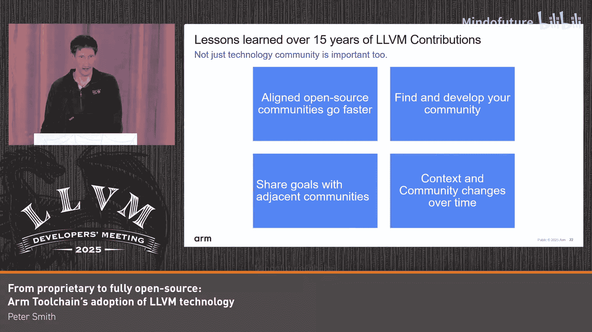

# 038：Arm工具链的采用

## 概述

在本教程中，我们将跟随Arm编译器工程师Peter的分享，回顾Arm公司如何将其编译器工具链从完全专有逐步迁移到完全基于开源LLVM生态系统的历程。我们将了解这一转变背后的商业、技术和社区驱动因素，以及在此过程中学到的宝贵经验。

---

## 章节 1：Arm工具链的起源与专有时代

上一节我们介绍了本教程的主题，本节中我们来看看Arm工具链的起点。

Arm的历史可以追溯到1985年。当时有一家名为Acorn的英国公司。Acorn在1987年发布了一台名为Acorn Archimedes的计算机。Acorn需要为这台计算机开发一个编译器，他们找到了剑桥大学的两位学者Arthur Norman和Alan Mycroft。他们开发的编译器被称为Norcroft编译器。这个工具链用于在Archimedes上开发软件。

随着时间的推移，Acorn的RISC机器部门演变为Advanced RISC Machine，也就是Arm，并从Acorn独立出来。Arm的工具链也必须随之演进。这个早期的工具链，我们暂且称之为armCC。Arm在移动电话和嵌入式领域取得了早期成功。因此，工具链必须被移植到Windows和当时各种Unix系统上以提供支持。

当时的软件开发主要是定制硬件和定制软件，几乎没有开源软件的概念。Norcroft编译器是80年代GCC的早期同代产品。它必须专注于满足当时市场的需求，主要是代码大小优化。如果能节省一点闪存成本，乘以数百万台设备，就能节省大量资金。当时的工具链是商业产品，附带印刷手册和光盘，主要销售对象是公司而非广泛的用户群体。

随着设备变得更加复杂，C++变得越来越重要。Arm当时并不想涉足C++前端业务，因为这是一个相当困难的挑战。Arm当时的优势在于代码生成。因此，他们授权了EDG前端。如果你有幸或不幸在Symbian系统上开发过，Arm的编译器曾是Symbian的平台编译器，而Symbian当时主要使用C++。

这个工具链在当时这个特定市场运行良好。但请注意，当时一切都很分散，没有一个通用的嵌入式平台来推动统一。事实上，直到2004年，Arm才真正有了一个ABI。

---

## 章节 2：市场变革与LLVM的机遇

上一节我们介绍了Arm专有工具链的早期发展，本节中我们来看看推动变革的市场力量。

进入21世纪后期，一切开始发生变化。生产定制硬件和定制软件的成本不断上升。在高端市场，人们开始从定制软件转向开放平台，例如Linux。有了这样的平台，你就会得到一个平台编译器，比如GCC。在这种情况下，很难让人们改用其他编译器。因此，一个不能在Linux上编译任何东西的专有编译器在那个特定环境下用处不大，尽管它在嵌入式领域仍然有用。

同时，其他方面也在发生变化。GCC有一个相对较弱的中端优化，但代码生成很强。然而，随着更复杂的处理器出现，代码生成的优势不再像性能那样关键。这时，像GCC这样具有强大中端优化的编译器开始变得重要。

Arm发现自己处于一个境地：在代码生成方面有些落后，市场正在转向开放平台，Arm处理器也变得更强大，开始与其他架构竞争。Arm真正想做的是不再单打独斗。Arm拥有广泛的合作伙伴生态系统，其中许多公司也有编译器工程师。如果能与他们合作，情况会好得多。GNU社区是一个可以合作的领域，但GPL许可证并不适用于所有合作伙伴。因此，还需要其他选择。

大约在2009年，Arm内部首次提到了LLVM。LLVM被视为可以解决armCC许多问题的方案。

以下是当时对LLVM的评估，分为技术和社区两方面：

**技术方面：**
*   LLVM拥有基于现代C++的代码库，而不是超过25年历史的C代码库，更容易开发和维护。
*   LLVM在中端优化方面很强，而这正是armCC的弱点。
*   尽管在2009年还处于早期阶段，但LLVM已经提供了一些Arm架构支持，可以进行测试。

**社区方面：**
*   LLVM的许可证（Apache 2.0 with LLVM Exceptions）更有利，这意味着可以更容易地与其他合作伙伴在代码生成方面进行协作。
*   其模块化设计让Arm设想：能否将LLVM插入到现有的编译器中？

在弱点方面，技术问题被认为是可以解决的，并非关键。社区方面可能是最大的风险，因为Arm真正想要的是在LLVM中建立一个能够自我维持的Arm社区。虽然事后看来这似乎是必然的，但在2009年，这只是未来可能发生的事情，并非既定事实。幸运的是，最终一切顺利。

---

## 章节 3：早期探索与原型设计

上一节我们分析了Arm选择LLVM的原因，本节中我们来看看他们最初的实施构想和早期实践。

基于LLVM的模块化特性，Arm设想了以下几种设计方案：

1.  **替换中端**：利用Arm在代码生成方面的优势，同时使用LLVM强大的中端。构想是：用客户源代码输入，转换为LLVM IR，然后转换回armCC的代码生成器。但这涉及到如何编写“桥梁”代码的棘手问题。
2.  **比较LLVM与armCC**：在2009年，Clang尚未完成。因此，Arm从一个EDG桥接原型开始。流程是：用armCC开始，然后转换到LLVM，再全程使用LLVM。这提供了一个比较两者的机会。
3.  **利用LLVM的前端**：如果armCC的代码生成真的那么好，理论上可以利用LLVM的更多前端（如Clang处理C++代码），然后转换到armCC的代码生成器。

这些构想听起来都很不错，但在实践中却更加困难。

接下来，我们看看在Arm开发原型期间，LLVM社区发生了什么。以下是基于LLVM社区博客的时间线：
*   **2010年1月**：Arm开始原型开发。
*   **2010年2月**：Clang实现自举（self-hosted）。
*   **2010年**：MC（现在依赖的组件）刚刚起步，对Arm的支持还很初级。
*   **2010年**：libc++宣布，这对当时没有C++11兼容库的Arm来说非常有趣。
*   **2010-2011年**：Arm后端有许多改进，Arm也体验到了从上游合并代码的“乐趣”。
*   **2011年4月**：Arm的原型完成，能够编译各种基准测试以与原始编译器比较，并通过了Plum Hall一致性测试套件，这对质量很重要。
*   **2011年**：LLVM获得了新的寄存器分配器。
*   **2011年**：举行了第一次欧洲用户组会议，可以说是EuroLLVM的前身。

---

## 章节 4：经验教训与社区参与

上一节我们回顾了Arm的早期原型和社区发展，本节中我们总结一下从中学到的关键经验。

首先，引用一段2009年LLVM开发者会议圆桌讨论的转述：
> “C++ API的易变性是故意的。它允许设计更快地演进，并强烈鼓励所有LLVM用户将他们的改进贡献给项目。任何未贡献的更改都可能在下一个版本中破坏，并增加维护成本。”

Arm在EDG桥接项目中深刻体会到了这一点。他们有两个组件（EDG前端和LLVM），两者都不独立受控，而Arm需要在中间处理阻抗匹配。这显然行不通。

他们还发现，当时LLVM的代码生成能力明显落后于armCC，但这并不意外，且当时无法立即解决。但同时，他们也看到了社区发展的速度有多快，并且在中端优化占主导的基准测试上，两者的差距要小得多。他们看到了未来的趋势。

因此，得出的明确结论是：**如果将来要迁移到LLVM，就必须尽可能贴近社区，避免不必要的差异化，以降低未来的维护成本。**

同时，Arm也意识到LLVM社区正在迅速成长。就像GNU社区对Arm的Linux生态很重要一样，无论Arm对其专有工具链做什么，LLVM社区都将变得重要。因此，Arm决定加入开源社区。此时，参与的人员并非在专有工具链上工作，而是完全致力于上游LLVM开发。

这给了Arm一个良好的开端，可以增加对LLVM的经验，并尝试在社区中建立影响力或了解社区运作方式。Arm当时已经拥有知名且成熟的汇编器和反汇编器，因此他们开发了一个名为“MC Hammer”的工具，用于进行汇编/反汇编的往返测试，以确保后端编码正确。此外，由于Arm总部在英国，他们也开始赞助欧洲开发者会议，帮助建立社区。

---

## 章节 5：战略决策：向Clang迁移

上一节我们讲述了Arm初步参与社区并吸取教训，本节中我们来看看他们做出的关键战略转变。

几年后，Arm发现他们需要同时支持LLVM、GNU工具链（GCC）以及旧的专有工具链。但情况开始变得难以为继。Arm意识到无法以所需的质量水平同时支持三个编译器工具链，必须放弃其中一个。在这个时间点，被放弃的显然将是问题最多的专有工具链。

对于嵌入式系统，可以选择GNU路线或LLVM路线。许可证问题使得选择LLVM几乎没有悬念。Arm也认为，LLVM是比GCC更好的嵌入式编译器基础。因此，他们决定尝试用Clang替换工具链中的独立编译器（armCC）。这是在2014年左右。

以下是当时做出的一些关键设计决策：

1.  **迁移策略**：说服用户迁移工具链非常困难。Arm的策略是，不需要在所有方面都更好，但如果在某个细分领域有优势，就可以从那里开始。Arm选择了**Armv8架构（特别是AArch64）和C++11库支持**作为突破口，这些新特性只在新工具链中提供。这意味着，如果用户要迁移到这些新特性，他们无论如何都需要做支持工作。新项目可以使用新工具链，而其他项目可以继续使用旧工具链，直到新工具链变得更好。Arm预计这个过程需要2到5年。

2.  **开发模型**：选择“紧跟上游”（`mainline`）模型，而不是维护一个定期更新的大型下游分支。主要原因包括：
    *   新的架构和指令需要上游到LLVM，贴近上游使这个过程更容易。
    *   可以实现“上游优先”开发：如果想在开源LLVM和专有编译器中都拥有某个功能，只需在上游实现一次，合并后第二天就可以拉取下来，无需重复工作。
    *   可以获得上游新特性的好处。
    *   缺点是必须持续支付任何下游补丁的维护成本。

3.  **最小化差异**：尽可能减少Clang中armCC特有的扩展，尝试通过宏和内联汇编等方式进行模拟，以保持下游补丁数量最少。

4.  **基准测试**：对于处理器公司，基准测试（如EEMBC、Dhrystone、Coremark）非常重要。当时在Coremark上甚至有一场“小型基准测试战争”。在这些方面取得好成绩很重要，但相关的优化并不总是容易上游。

5.  **共享二进制工具和库**：当时LLD还处于非常早期的阶段，LLVM libc也不存在，现有的二进制工具更像是LLVM开发者的工具，而非面向最终用户的产品级工具。因此，Arm决定**与专有工具链共享原有的binutils和库**。

最终的结构如下图所示：左侧是armCC和授权的Rogue Wave C++库（不支持C++11），右侧是Clang和libc++。两者共享相同的二进制工具（binutils）和C库。这种设计的负面影响是，这些共享组件必须保持不含LLVM技术，导致存在两个独立的技术基础。虽然这在一定程度上避免了上游的干扰，但也意味着如果上游发生变化，必须在下游做相应的修改，代价高昂。例如，对于链接时优化（LTO），Arm可能是少数实际使用`libLTO.so`的用户之一，而不是直接导入代码生成器。

---

## 章节 6：上游化的挑战与嵌入式平台兴起

上一节我们介绍了Arm向Clang迁移的设计决策，本节中我们深入探讨上游化面临的挑战以及新的机遇。

你可能会问，既然binutils和LLD当时不成熟，Arm为什么不帮助完善它们？或者为什么不尝试将那些下游补丁（如EEMBC、Coremark优化）上游化？

这里需要再次引用之前的观点：任何未贡献的更改都可能在下一个版本中破坏，并增加维护成本。但如果你处于一个细分领域，社区并不总是需要你的更改。**上游化不是馈赠，而是请求社区永久承担该更改的维护负担。** 上游社区必须能够理解这个更改，并且额外的复杂性必须有充分的理由。

如果是一个像当时嵌入式系统这样的细分领域，而大多数上游开发者都在桌面或服务器领域工作，那么他们就需要付出额外的努力来理解一个他们不熟悉的技术领域，甚至可能一开始就不明白为什么它重要。所以这在那时相当困难。

Arm观察到，当时嵌入式工具链的典型模式是：一个基于Clang的编译器，加上自己专有的链接器、专有的C库、各自为政的代码大小优化、以及用于嵌入式开发的C语言扩展。这方面没有标准，每家都以自己的方式行事，通常缺乏统一原则。也没有一个通用的软件平台来推动人们做同样的事情。如果你想上游化，就必须考虑每个人不同的实现方式，其工作量可能比仅仅做一个小的下游修改高出10倍。因此，人们最终做出了务实的选择，保持下游修改。

然而，当Arm说没有软件平台推动统一时，那只是“尚未”发生。将时间快进到2018年左右，Arm开始看到所谓的“嵌入式软件平台”复兴。就像Linux在桌面端推动发展一样，在嵌入式端出现了像Zephyr、FreeRTOS、Trusted Firmware等开源项目。当然，作为开源项目，它们自然需要一个开源编译器，并以此为基础构建所有基础设施。当时，这个编译器是GNU编译器。如果你不支持GNU编译器接口、GNU链接器脚本和binutils，那么尝试编译这些项目就会失败。Arm开始收到越来越多的支持请求，称无法用Arm的编译器构建某个开源项目。这表明，开源在嵌入式软件中正变得越来越重要，Arm需要采取行动。

同时，Arm也发现，由于他们在LLVM专有工具链上进行了投资，LLVM在某些新款微控制器上的代码生成已经优于GCC。Arm面临着如何将这些优势带给客户的需求。他们需要的是LLVM开源工具链，而不是专有版本，因为开源工具链才能适用于所有这些新兴平台。

---

## 章节 7：构建完全开源的LLVM嵌入式工具链

上一节我们看到了嵌入式开源平台的兴起创造了新需求，本节中我们来看看Arm如何利用社区成果构建完全开源的解决方案。

在一个幸运的巧合中，社区已经修复了许多问题，使得一个完全基于LLVM的嵌入式工具链成为可能。Arm特别感谢社区在链接器和二进制工具方面所做的工作，这主要不是嵌入式社区完成的，而是由Sony、Google等公司推动的，目的是让这些工具达到生产就绪状态。

关键进展包括：
*   **LLD**：在此期间获得了对链接器脚本（linker script）的强大支持。
*   **ClangBuiltLinux**：Linux内核本身就是一个巨大的嵌入式系统，对工具要求极高。能够构建Linux内核，就意味着有能力构建几乎任何嵌入式系统（只需少量改动）。这是实现嵌入式工具链的关键推动因素。

基于此，Arm创建了名为“LLVM Embedded Toolchain for Arm”的项目。这本质上是一套构建脚本，用于检出LLVM、一个名为Picolibc的开源C库以及（当时的）LLVM libc。LLVM libc当时对嵌入式支持还没有明确计划。Arm将它们组合在一起。

主要弱点是缺乏多库（multilib）支持。多库是指链接器驱动程序根据命令行选项（如架构、调用约定）自动选择对应目录下的库。对于覆盖整个Arm架构的工具链，可能会有数百种多库变体。由于没有多库支持，Arm不得不使用配置文件。初始版本有33个配置文件，用于定位正确的库，这对生产环境来说显然有些笨重，但勉强可用。

构建这个工具链的优势在于，它帮助Arm找到了社区中也在从事类似工作的其他伙伴。Arm可以在FOSDEM、Embedded World 2023等会议上宣传这个开源工具链。当人们在Discourse或邮件列表上询问如何构建时，可以指引他们到这个项目。这是一个良好的开端。

Arm还启动了社区电话会议（大约在2022年），用于协调代码审查和RFC讨论。他们发现许多社区成员都在朝着同一个目标努力。回顾之前提到的嵌入式社区分散且缺乏上游支持的观点，现在情况即将改变。Arm找到了其他愿意审查补丁并推动事项的公司。这是一个非常好的开始。Arm注意到许多其他类似的社区也开始了电话会议，并鼓励处于特定细分领域的开发者查看开发者日历，加入相关的社区电话会议。

---

## 章节 8：最终过渡与经验总结

上一节我们介绍了Arm构建开源嵌入式工具链的努力，本节中我们来看最终的决策和整个旅程的总结。

Arm一直在致力于这个LLVM嵌入式工具链，但同时仍需维护专有工具链。他们再次陷入了需要支持三个工具链（GNU、LLVM专有版、LLVM开源嵌入式版）的境地，并且资源不足以同时做好所有事情。因此，必须放弃其中一个。

Arm本质上是在押注：**随着时间的推移，这些开源平台将变得比以前的专有接口更重要。** 尽管新工具链可能会损失一些代码大小和专有工具链中的嵌入式特定功能，但其关键卖点是：**你可以用LLVM直接构建现有的开源软件平台。** Arm希望未来能将LLVM工具链的其他功能（如消毒剂）引入嵌入式领域，这将成为平台向前发展的关键特性。

Arm的长期目标之一是采用LLVM libc作为C库，这样整个工具链就可以从一个代码库构建。

最终，工具链完成了从“Arm Compiler 6”（专有工具链，包含Clang编译器、libc++和专有的binutils）到“完全基于LLVM”（除了Picolibc，LLVM libc目前是可选项）的转变。理想情况下，Arm希望将LLVM libc变为默认选项，而Picolibc作为备选。

以下是Arm在约15年贡献中学到的主要经验：

1.  **上游带宽 vs 下游延迟**：如果你能找到与你目标一致的开源社区，他们的发展速度会远快于你。下游开发决策快（低延迟），但上游拥有更多的开发者，发展带宽大得多。
2.  **社区建设**：如果社区的发展方向与你的目标不完全一致，你需要进行社区建设。寻找在同一细分领域工作的人，尝试组织定期聚会、协调代码审查。寻找有共同目标的相邻社区。例如，LLVM binutils和LLD链接器脚本的工作最初并非由嵌入式社区完成，而是由ClangBuiltLinux等其他社区为了其他目标完成的。找到共同目标，你仍然可以实现所需的功能。
3.  **社区会演变**：当Arm在2014年开始时，感觉像是唯一做嵌入式LLVM开发的。到了2025年，已经形成了一个完整的LLVM嵌入式开发生态。社区会随时间变化。即使你现在是孤身一人，未来也可能不是。保持与社区的联系，尝试引导其朝你想要的方向发展。有时只需要一家公司率先站出来展示成果，其他人就会跟进。

---

## 总结

在本教程中，我们一起学习了Arm编译器工具链从完全专有到完全基于开源LLVM的完整迁移历程。我们回顾了其历史起源、市场变革带来的挑战、早期对LLVM的探索与原型设计、从中吸取的经验教训、向Clang迁移的战略决策、上游化过程中的困难、嵌入式开源平台兴起带来的新机遇，以及最终如何构建并转向完全开源的LLVM嵌入式工具链。Arm的故事强调了拥抱开源社区、保持与上游一致、以及通过社区合作解决共同挑战的重要性。这段旅程虽然特定于Arm，但其经验教训对于任何考虑从专有技术栈迁移到开源生态系统的组织都具有宝贵的参考价值。