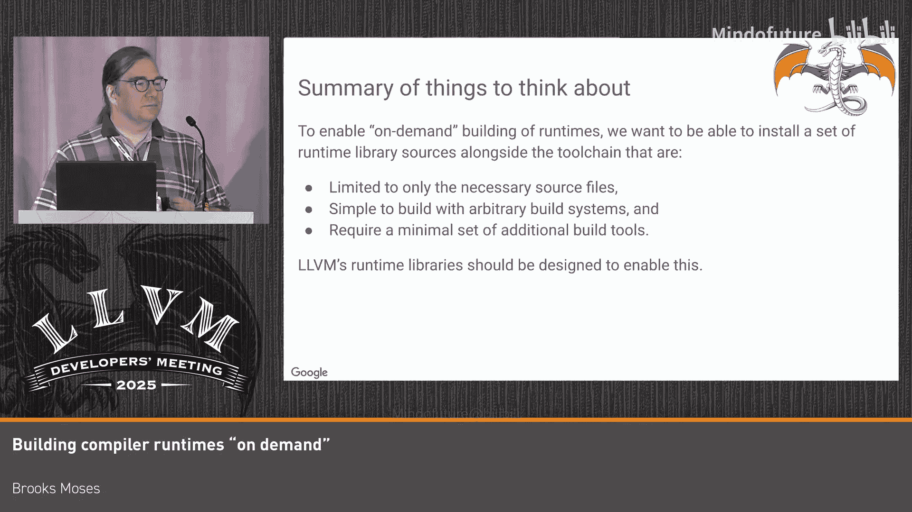

# 039：原因与方法

## 概述
在本节课中，我们将要学习一种名为“按需构建”的C++编译器运行时库部署模型。我们将探讨这种模型的重要性、其带来的优势，以及它对上游运行时库开发提出的新要求。

## 第一部分：为何采用按需构建模型及其实现方式

在传统的C/C++工具链安装中，运行时库（如libc、libc++、libcompiler-rt等）是在工具链构建时预编译好的。这些预编译的库文件（如`.so`或`.a`文件）会随工具链一同安装。

按需构建模型的核心思想是：工具链安装包中包含运行时库的源代码，而非预编译的二进制文件。当用户构建其目标代码时，工具链会根据需要，从这些源代码动态构建所需的运行时库。当然，这个过程会包含缓存等机制，以确保构建“Hello World”这样的简单程序不会耗时过长。

接下来，我们将探讨采用此模型的原因。

### 采用按需构建模型的原因
以下是几个关键原因：

1.  **支持广泛的目标平台**：Clang/LLVM工具链支持非常广泛的目标平台，包括不同的架构、指令集变体、ABI（例如因使用不同消毒器或配置libc++的稳定/不稳定ABI而产生差异）。预编译库通常只支持一种架构和一种ABI。若要让一个工具链支持多种目标，就需要预置大量库文件，并包含复杂的逻辑来选择使用哪一个。按需构建只需一份源代码，工具链可根据需要生成任何变体，这极大地简化了流程。

2.  **应对嵌入式平台的复杂性**：嵌入式平台以存在大量重要的微架构变体而闻名。按需构建能灵活应对这种多样性。

3.  **支持运行时配置选项**：运行时库本身可能有配置选项。例如，libc++可以配置为包含或不包含文件系统支持；`printf`可以包含或排除浮点支持以减小代码体积。用户可能还需要为速度、代码大小或基于性能剖析数据进行优化等不同目的构建库。按需构建使得这些定制成为可能。

4.  **参与链接时优化**：在构建时编译运行时库，使得它们可以参与应用程序的链接时优化过程。Clang的LTO机制需要IR比特码作为输入，这与预编译库不兼容。此外，内联许多小型运行时函数（常在循环中调用）能带来可观的性能提升。

5.  **支持基于性能剖析的优化**：按需构建允许使用应用程序特定的性能剖析信息来构建运行时库，从而更好地指导内联和其他优化决策。

6.  **改善开发体验**：对于运行时库的开发者而言，按需构建使得测试变更更加便捷。开发者只需修改源代码，然后重新构建目标程序即可测试，无需重新构建和安装工具链中所有的预编译库变体。

上一节我们介绍了按需构建模型的诸多优势，本节中我们来看看在Google生产工具链中是如何实现这一模型的。

### 当前的实现方式
目前，我们的实现是建立在标准工具链安装之上的，并且特定于Google基于Bazel的构建系统。实现方式如下：

*   构建系统将LLVM运行时库添加为C++应用程序的隐式依赖项。
*   使用`-nostdlib`、`-nostartfiles`等选项进行C++编译，从而依赖这些隐式包含的库。
*   结合自定义的构建文件与上游LLVM仓库中的Bazel覆盖文件来构建这些运行时库。
*   目前，该模型已成功应用于libc++和LLVM libc，并正在探索未来将其用于compiler-rt和消毒器。

当前实现是附加在标准工具链之上的。未来，或许可以探索如何将其更深度地集成到LLVM/Clang工具链本身中。

## 第二部分：按需构建对上游运行时库开发的影响

既然我们已经了解了按需构建模型，现在来看看这种使用模式如何影响上游运行时库的开发，以及我们对库开发者的一些期望。

这是一种与传统预编译、预安装模式非常不同的部署方式，因此也带来了新的、不同的需求。

### 对上游库开发的具体期望
以下是按需构建模型下，对运行时库开发的一些关键期望：

1.  **简单的构建规则至关重要**：目前，我们必须以临时方式将运行时库的构建规则整合到我们的构建系统中。像CMake、Bazel这样的构建工具功能强大，但其中的“巧妙”设计可能使得将其移植到另一个构建系统变得非常困难。更可取的是简单、直接的构建规则：例如，一个文件列表、一个编译选项列表，以及几条将它们编译并链接成库的规则。这更容易被其他构建系统采纳。

2.  **倾向于更少的构建规则**：这一点起初让我们感到意外，但事后看来又很明显。当构建系统需要为每次用户构建都解析庞大的构建文件（以判断运行时库是否需要重建）时，解析开销会变得显著。例如，LLVM libc的某些构建文件为每个库函数设置了独立的构建规则，这比整个库只有少数几条构建规则要耗时得多。

3.  **将测试相关规则分离**：如果测试规则或测试特定的依赖规则与库的构建规则放在同一位置，构建系统将不得不解析大量与构建运行时库无关的内容。将测试及其依赖放在独立的目录中会很有帮助。

4.  **限制构建时所需的工具**：运行时库在用户机器上构建。如果构建过程需要额外的工具（例如，用tblgen生成头文件），那么每个用户都需要安装该工具。更简单的方式是使用`#ifdef`等预处理指令，这样只需要`clang`即可。

5.  **确保库是自包含、可提取的**：LLVM仓库有超过5万个C++头文件和源文件。我们不希望工具链安装包包含如此庞大的源代码。像libc、libc++这样的库是自包含的。但对于性能剖析库等更专业的运行时，需要避免依赖整个LLVM库。理想情况是，将所需的小部分功能（例如一部分AST定义）提取成一个独立、自包含的基础库，放在一个可以单独提取且不会意外引入新依赖的目录中。

6.  **关于生成的头文件**：这是一个个人观点。对于预构建的库，从模板生成头文件并安装是可以的。但对于按需构建，生成的头文件是临时的构建产物，调试信息、断言失败信息都会指向它，用户需要找到这个构建产物才能理解错误信息。因此，我认为使用`#ifdef`等条件编译指令比基于模板生成头文件更可取。

当然，我们讨论的前提是工具链中安装的源代码必须与源码仓库中的内容一致。但这并非绝对。我们完全可以在工具链构建时对源代码进行修改后再安装。例如，可以用tblgen生成目标无关的头文件，然后将其作为“已安装的源代码”。同样，也可以处理项目的构建文件，提取出相关部分进行安装。一个具体的例子是，源码仓库的构建文件可能包含“安装源代码”的规则，而这个规则在已安装的源代码中是不需要的。

### 未来的可能性与总结
目前，我们的实现是叠加在标准工具链安装之上的。一个有趣的设计问题是：我们是否应该让工具链学会自动按需构建运行时库？例如，Rust语言已经提供了从源代码构建运行时的选项。这引发了诸如“是否应该调用CMake？”、“是否应该在Clang中实现？”等有趣的讨论。答案可能很复杂，或许需要为运行时库开发额外的专用工具。

总而言之，按需构建的核心思想是：我们希望能够从运行时库的源码仓库中，提取出一套有限、简单的源代码和构建规则，并将其随工具链一同安装。我们期望上游库的设计能够促进这一目标的实现。

最后，请注意今天下午在本会议室还有一场由Paul Kirth和Daniel Thornburg带来的相关演讲，他们将讨论将libc++纳入LTO时遇到的一些不显而易见的注意事项。此外，昨天和去年也有一些与LLVM libc相关的演讲值得参考。

## 总结
本节课中我们一起学习了“按需构建”C++编译器运行时库的模型。我们首先探讨了该模型在支持多目标、定制化、参与LTO、改善开发体验等方面的优势，并介绍了Google当前的实现方式。接着，我们深入分析了这种模型对上游运行时库开发提出的新要求，包括需要简单、少量的构建规则，分离测试依赖，限制构建工具，确保库的自包含性等。这些考虑旨在使运行时库更易于集成到按需构建的工作流中，为工具链和库的开发者带来更大的灵活性和便利。