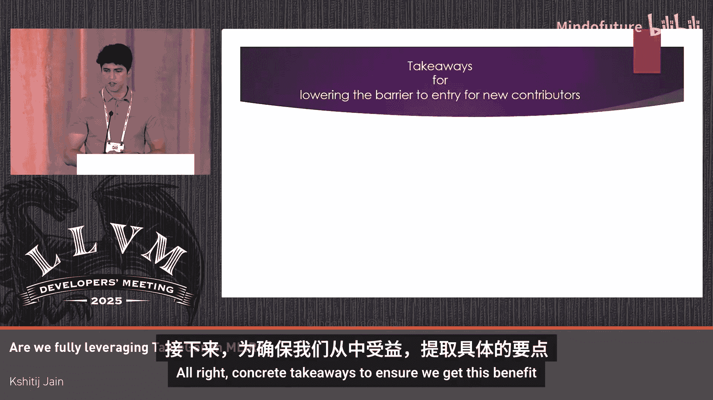

# 041：我们是否充分利用了MLIR中的TableGen？


在本教程中，我们将探讨如何在MLIR中更有效地使用TableGen。TableGen在MLIR中常被简化为避免样板代码的工具，但我们将展示，编写更丰富的TableGen代码可以带来显著优势。我们将通过具体示例，说明如何利用现有的上游TableGen工具和一些常被忽视的软件工程实践来实现这些好处。

## 🧠 优势一：减少编译器开发者的心智负担

上一节我们概述了本教程的目标，本节中我们来看看第一个具体优势：更丰富的TableGen代码可以减少编译器开发者的心智负担。

想象你正在开发一个机器学习编译器，并需要创建一个满足以下要求的填充操作：
1.  该操作执行边缘填充。
2.  该操作仅填充输入张量的最内两个维度。

以下是你可能编写的代码：
```tablegen
def MyPadOp : Op<"my.pad"> {
  let arguments = (ins
    AnyTensor:$input,
    AnyTensor:$pad_value,
    I64ArrayAttr:$padding
  );
  let results = (outs AnyTensor:$output);
}
```
这段代码可以工作，但存在一些问题。根据操作要求，我们可以推断出以下不变式：
1.  输入和输出张量的秩必须相同。
2.  输入、输出和填充值的元素类型必须相同。
3.  输入和输出的维度大小必须相同（除了最内两个可能被填充的维度）。

然而，当前的操作定义并未对这些不变式提供任何保证，这导致了几个问题：
1.  操作的语法与其语义之间的差距扩大，意味着无效操作状态的可能性增加。
2.  降低过程变得更加复杂，因为我们必须针对多种可能的无效状态进行防御性编程。
3.  手写IR更容易出错，因为操作定义约束不足，无法充分利用MLIR LSP服务器等开发工具的支持。

现在，让我们看看优化后的TableGen代码：
```tablegen
def MyPadOp : Op<"my.pad"> {
  let arguments = (ins
    AnyTensorOf<[AnyType]>:$input,
    AnyTensorOf<[AnyType]>:$pad_value,
    I64ArrayAttr:$padding
  );
  let results = (outs AnyTensorOf<[AnyType]>:$output);

  let invariants = [
    // 输入和输出张量秩相同
    CPred<"$0.getType().cast<ShapedType>().getRank() == "
          "$1.getType().cast<ShapedType>().getRank()">,
    // 输入、输出和填充值元素类型相同
    CPred<"$0.getType().cast<ShapedType>().getElementType() == "
          "$1.getType().cast<ShapedType>().getElementType()">,
    CPred<"$0.getType().cast<ShapedType>().getElementType() == "
          "$2.getType().cast<ShapedType>().getElementType()">,
    // 维度大小相同（最内两维除外）
    // 注：此约束可能需要用C++验证器实现
  ];
}
```
通过对比操作定义和不变式，我们可以看到：
*   输入和输出张量的秩将相同。
*   输入、输出和填充值的元素类型将相同。
*   输入和输出的维度大小将相同（最内两维除外）。

有了这些不变式的保证，我们获得了几个好处：
1.  我们获得了“构造即正确”的保证。
2.  降低过程保持机械性，因为我们需要处理的无效状态减少了。
3.  手写IR的错误率降低，因为我们现在可以获得MLIR LSP服务器等开发工具的支持。

以下是确保获得此优势的具体要点：
*   尽可能预先指定操作不变式，以获得“构造即正确”的保证，并缩小操作语法与语义之间的差距。
*   使降低过程尽可能机械化。
*   获得与MLIR LSP服务器等开发工具更好的集成。

这里提到的所有内容同样适用于属性和类型。我还想强调一些有用的上游操作、属性和类型约束的快速链接，它们对编写更丰富的TableGen代码很有帮助。

## 🔍 优势二：使编译器行为更明显且更健壮

上一节我们探讨了如何减少心智负担，本节中我们来看看第二个优势：更丰富的TableGen代码可以使编译器的行为更明显且更健壮。

想象你正在开发一个机器学习编译器，并需要创建一个满足以下要求的重塑操作：
1.  该操作根据指定的形状重塑输入张量。
2.  该操作不改变输入张量的数据和元素数量。

以下是你可能编写的代码：
```tablegen
def MyReshapeOp : Op<"my.reshape"> {
  let arguments = (ins
    AnyTensor:$input,
    I64ArrayAttr:$new_shape
  );
  let results = (outs AnyTensor:$output);
}
```
这段代码可以工作，但同样存在一些问题。让我们看看操作的不变式：
1.  输入和输出的元素类型必须相同。
2.  输入和输出的元素数量必须相同。
3.  新形状属性的值必须与输出形状相同。

同样，操作定义并未对这些不变式提供任何保证，这可能导致无意义的操作或令人困惑的错误级联。让我们重点关注后一种情况。

我们可能有这样一个重塑操作：我们有一个4x128的张量，要重塑成2x4x64的张量，而我们的输出类型可能是2x4x32（本应与新形状属性匹配，但由于没有约束，它并不匹配）。我们的编译器可能会将此重塑操作降低为一个拷贝操作。我们将4x128的张量沿列维度分成两部分，然后将每个切片存储到输出缓冲区的4x64块中。这个4x64块是由新形状属性告诉我们的，但我们可能是根据输出类型分配的输出缓冲区。因此，在某些时候，我们将执行越界的缓冲区访问，并得到一个与提取切片相关的令人困惑的错误级联。

现在，让我们看看优化后的TableGen代码：
```tablegen
def MyReshapeOp : Op<"my.reshape"> {
  let arguments = (ins
    AnyTensorOf<[AnyType]>:$input,
    I64ArrayAttr:$new_shape
  );
  let results = (outs AnyTensorOf<[AnyType]>:$output);

  let invariants = [
    // 输入和输出元素类型相同
    CPred<"$0.getType().cast<ShapedType>().getElementType() == "
          "$1.getType().cast<ShapedType>().getElementType()">,
    // 输入和输出元素数量相同
    CPred<"$0.getType().cast<ShapedType>().getNumElements() == "
          "$1.getType().cast<ShapedType>().getNumElements()">,
    // 新形状属性与输出形状相同
    CPred<"$new_shape == $1.getType().cast<ShapedType>().getShape()">,
  ];
}
```
通过对比操作定义和不变式，我们可以看到：
*   输入和输出的元素类型将相同。
*   输入和输出的元素数量将相同。
*   新形状属性将与输出形状相同。

有了操作不变式的保证，我们获得了构造即正确的合理操作，并且避免了令人困惑的错误级联。这里需要提到的另一个重要点是，新形状属性实际上是冗余的，它的值可以从输出推导出来。

以下是确保获得此优势的具体要点：
*   尽可能预先指定操作不变式。
*   尽可能消除操作中的重复信息，以避免令人困惑的错误级联，并在上下文明显的地方实现早期失败。
*   避免为同一信息设置多个数据源。

## 🧑‍💻 优势三：降低新贡献者的入门门槛

上一节我们讨论了如何使编译器行为更健壮，本节中我们来看看第三个也是最后一个优势：更丰富的TableGen代码可以降低新贡献者的入门门槛。

想象你刚加入一家拥有机器学习编译器的公司，担任编译器工程师，你的第一个任务是为编译器前端添加2D卷积操作。

你开始工作，在代码库中找到了这段TableGen代码：
```tablegen
def SomeOp : Op<"some.op"> {
  let arguments = (ins AnyTensor:$input, AnyTensor:$kernel);
  let results = (outs AnyTensor:$output);
}
```
这段代码让你产生了几个疑问。如果你没有机器学习背景，你可能甚至不知道卷积是什么。你可能会怀疑这是一个真实的任务，还是已经有人替你完成了。如果你有机器学习背景，你可能会想这是否是一个1D卷积，以及你是否可以重用它来实现2D卷积。

但是，如果在你的代码库中，你找到的是这段TableGen代码呢？
```tablegen
def Conv1DOp : Op<"conv.1d"> {
  let summary = "1D convolution operation";
  let description = [{
    Performs a 1D convolution over an input signal using a kernel.
    In this compiler, it is used as a building block for temporal pattern recognition.
  }];
  let arguments = (ins
    TensorOf<[F32]>:$input,  // [batch, length, channels]
    TensorOf<[F32]>:$kernel, // [kernel_size, in_channels, out_channels]
    I32Attr:$stride,
    I32Attr:$padding
  );
  let results = (outs TensorOf<[F32]>:$output); // [batch, new_length, out_channels]

  let invariants = [
    // 输入和内核的通道维度必须匹配
    CPred<"$input.getType().cast<ShapedType>().getDimSize(2) == "
          "$kernel.getType().cast<ShapedType>().getDimSize(1)">,
    // 输出长度由公式计算得出
    // new_length = floor((length + 2*padding - kernel_size) / stride) + 1
  ];
}
```
操作名称清楚地表明了它是什么以及它的作用。描述给出了卷积的一般解释，以及在编译器上下文中关于该操作的更具体信息。操作不变式已被明确指定。

现在，有了这些信息，你或许能够回答之前的问题。你对卷积操作有了一个普遍的和编译器特定的理解。你确实注意到你有一个真实的任务，因为这是一个1D卷积操作。根据操作不变式，你将能够推断出你不能（也可能不应该）将其重用于2D卷积，因为2D卷积将有其自己的一套操作不变式。

总而言之，这段TableGen代码清楚地表明了编译器支持的功能。有了这些信息，作为新贡献者，你可以更独立地完成任务。

以下是确保获得此优势的具体要点：
*   尽可能预先指定操作不变式。
*   编写详细的操作描述，以本地化新贡献者处理你的操作时可能需要的所有信息。
*   清楚地表明编译器实际支持的功能集。

这两点都应有助于新贡献者更高效、更独立地使用你的代码库并开展工作。

## 📝 总结

在本教程中，我们一起学习了在MLIR中更充分利用TableGen的三大优势及其实现方法。

首先，更丰富的TableGen代码可以减少编译器开发者的心智负担。通过预先明确指定操作不变式，我们可以获得“构造即正确”的保证，使降低过程更机械化，并更好地集成开发工具。

其次，更丰富的TableGen代码可以使编译器的行为更明显且更健壮。通过消除操作中的重复信息并强制不变式，我们可以避免令人困惑的错误级联，并实现早期失败。



最后，更丰富的TableGen代码可以降低新贡献者的入门门槛。通过编写详细的操作描述和明确指定不变式，我们可以本地化所有必要信息，并清晰地展示编译器支持的功能，从而帮助新贡献者更独立地工作。

希望这些具体的示例和要点能帮助你在MLIR项目中更好地利用TableGen的强大功能。

