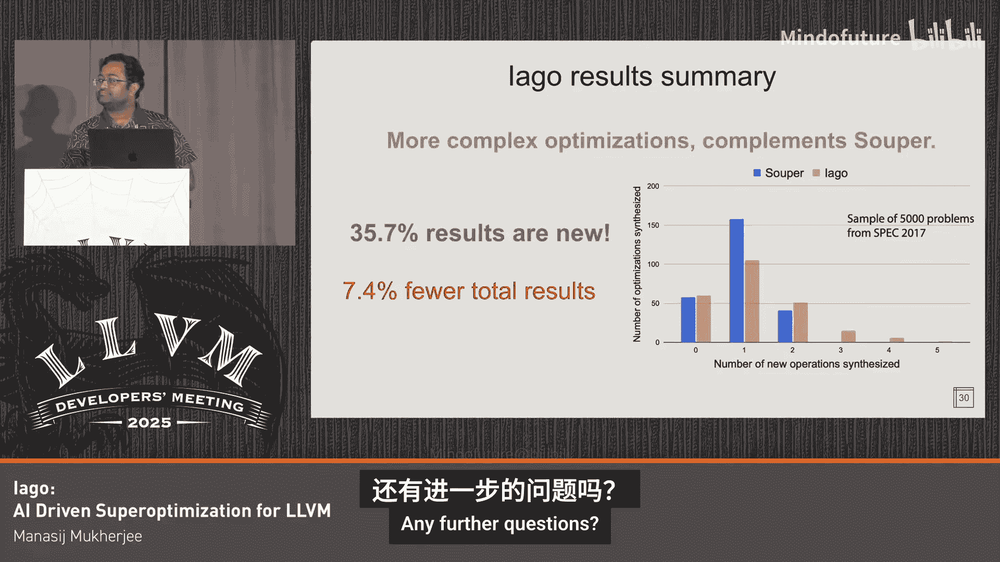

# 042：面向LLVM的AI驱动的超级优化

## 概述

在本节课中，我们将学习什么是超级优化，以及如何利用人工智能（AI）来辅助超级优化器，从而发现传统编译器可能遗漏的代码优化模式。我们将深入探讨一个名为Iago的AI驱动超级优化工具的设计、工作原理、效果，并从中总结出对编译器开发有普遍意义的见解。

## 背景：什么是超级优化？

这是关于此话题最常见的问题。让我们尝试解释一下。

超级优化器提出一个简单的问题：一段代码能否被改进？“改进”的定义由你决定，你可以选择任何指标，如性能、代码大小，甚至能耗。它非常灵活。

你可能会想，编译器做的不也是改进代码这件事吗？这里存在一个细微的差别。编译器必须为大量用户编写的程序良好工作，并且时间有限。而超级优化器不受此限制，它可以花费相当长的时间来完成工作。其工作方式与编译器不同：编译器通过一系列优化遍次（passes）并匹配固定数量的固定模式；超级优化器则通过搜索工作。

它搜索大量候选程序，并找到一个有效的、符合你指标的改进方案。

### 搜索如何工作？

我们不会深入细节，但给定一个程序片段，超级优化器将枚举大量替代方案。最终，它有望找到一个好的候选。然而，为了枚举这些候选，并且为了保证超级优化器的正确性，它必须进入一个验证阶段，使用SMT求解器或类似Alive2的工具。这两者都是昂贵的操作，导致计算量迅速爆炸式增长。

例如，超级优化一个非常有用且流行的技术SQLite3，仅枚举大小为1和2的程序就需要24小时，且是在一台拥有1.8个核心的大型机器上。

## 动机：为什么需要超级优化？

从根本上说，它针对一个模式产生一个替换。那么，当LLVM中已经存在`InstCombine`（指令合并）以及其他编译器也有类似的人手编写的优化遍次时，为什么还要做这个呢？

我们目前能放入`InstCombine`或GCC的匹配器（如PDD）中的，通常是匹配一到五条指令并将其替换为更短指令序列的模式。这在一般情况下效果很好。

但是，它不可能适用于所有可能的程序。你可能有一段对你非常重要的特定代码模式，而它完全没有覆盖。此外，如果你想匹配更长的序列，在编译器中是不切实际的。你不会想在`InstCombine`中匹配成百上千条指令。

毫不奇怪，这两点常常是相关的：特定模式往往更长，而更长的模式更具体。尝试优化它们是有价值的。

### 具体示例

让我们看一个具体的例子。这是一大段代码。我们需要费心优化它吗？我选择这个特定例子是因为在超级优化器40年的历史中，每个超级优化器项目和论文都包含了一个类似的例子。让我展示为什么这整段代码可以简化为一条`popcnt`（人口计数）指令。

有无数种编写`popcnt`的方法。这可能是更快的方法之一。如果你认识这些数字，它们来自《Hacker‘s Delight》，这是一种分块执行`popcnt`的方法。

因此，超级优化器可以将这个东西简化为一条指令。

另一个例子，我们最近在NVIDIA CUDA基准测试中发现了很多`sll`（逻辑左移）指令。它可以简化为一条`and`（与）指令。这是LLVM中缺失的优化，我打算很快实现它。

有趣的是，这里的第二个例子不是一个单一的优化。它是两个不同模式的伪装，`InstCombine`的工作列表必须多次处理才能实现。

但这两个例子，都有可能通过传统的基于枚举的超级优化器找到，因为输出相当有限。

## 引入AI

所以，我为此使用了AI。

如果你满足于枚举一两条指令，完全不需要使用AI，它扩展性很好，每次尝试大约需要30秒到一分钟。

如果你想枚举更大的程序，比如三、四、五条甚至更多指令，枚举法就行不通了。枚举三条指令对我来说需要接近12到24小时。

我们在这里想使用AI的原因是：与其遍历这个巨大的搜索空间，我们想让AI生成几个选项，然后我们评估它们。最终结果仍然是经过验证的，你仍然能得到正确的东西。这使我们能够更深入地探索搜索空间，找到更大的可优化模式。

### 优化现有模式

这里有一个非常重要的例子，说明找到更大的模式会有所帮助。左边的代码有一个`xor`（异或）和`trunc`（截断）以及`shift right`（右移），右边则稍微简单一些。这是一个非常、非常常见的操作，几乎出现在我们编写的所有代码中。它检查一个浮点数是否为NaN（非数字）。右边是超级优化器找到的、稍微更高效的方法，前提是你能高效地加载大常量等。这就是你期望从超级优化器中得到的那种东西。

希望这提供了足够的动机。接下来我将转向Iago的设计。

## Iago的设计：什么有效，什么无效

我们将探讨在构建基于AI的编译器工具时，一些可能想使用的技巧和窍门。

基线方法是：直接要求一个大语言模型（LLM）：“给定这段代码，请优化它。”不幸的是，如果你这样做，它开始胡言乱语。你会得到一句话，如果你告诉它别的，你会得到“你说得对”之类的回复。这在过去几年略有改善，但如果你只想使用普通的LLM，效果仍然不太好。

### 如何解决？

这里有两个问题。首先，我们希望输出格式正确，即正确的语法。当然，它必须是一个正确的优化，语义必须正确。让我们看看如何解决这些问题。

第一件事是，你需要一个好的系统提示。你解释超级优化的想法，描述可用的操作（无论你想生成什么），列出AI不应该做的事情（这效果不太好），并给出示例。最后一部分非常重要：根据我的经验测试，给出大约10到15个示例能显著改善效果。超过这个数量帮助不大，但少于这个数量肯定不行。

这使得它比上一张幻灯片中的情况更好，但你仍然没有得到正确性保证。

### 我们该怎么做？

我们有一个计划。你将结果发送给一个解析器（例如`llvm-as`或任何其他你想生成的格式）。如果格式不正确，你会得到错误信息。LLM神奇地在下一次生成正确格式的输出，这效果很好。所以，如果你有任何验证语法的方法，给它解析器的错误信息，它会起作用。

有时它不起作用。我将展示两个LLVM的例子。

我注意到在许多结果中，它不断重定义值。我尽力在提示中解释什么是SSA（静态单赋值），但没用。所以有时经过几次尝试它会成功，但更好的方法是直接添加一个后处理步骤，手动修复这个问题，这立即大大提升了我们的结果。

另一个问题是，我很难让它理解类型系统。例如，`select`（选择）指令产生一个一位的结果，而不是32位；`select`的条件是一个一位的条件，而不是32位。但你可以通过在代码中间插入适当的修复来解决这两个问题。

有了这两个主要调整，我们得到了正确的语法，即格式良好的LLVM IR。

但它仍然不正确。我们可以尝试用Alive2验证。如果结果有效，我们就完成了，找到了一个正确的转换。

如果无效。类似于解析器错误信息，Alive2可以产生一个反例，你把它反馈给LLM。让我们看看会发生什么，它不起作用。

基于Transformer技术的LLM不太适合理解反例这种否定性示例。当我尝试时，它不断重复产生相同反例的结果。没有简单的方法解决这个问题。

一个选择是不断重试。这有效，但效果不太好。不过，这是我们启动Iago时真正采用的解决方案，如果你没有更好的办法，这也不错。

### 如何做得更好？

我们提到，这些转换必须是正确的。我们不能在编译器或任何此类工具中实现不正确的转换。我们已经使用Alive2来验证结果。那么为什么不也在这里尝试使用它呢？

给定一个错误答案，我们想修复它以产生正确答案。引导我产生这个想法的见解是：即使Iago的结果是错的，它的结构在某种程度上是对的，如果你眯着眼睛看的话。所以它有正确的结构，部分工作已经完成。

让我们看看我们能对此做些什么。这里有一个例子：假设你有 `x * 42 + 1`。也许这里的常数42和1是错的。所以，你从中提取一个“草图”，这是程序综合领域的术语。这意味着你删除它的一些部分，在这里是常数。

然后你使用SMT求解器来填补空白，也许求解器能保证那些位置上的正确常数。这是一个非常有用的技巧，可以绕过反例不起作用的事实。

### 深入细节

不过多深入细节，SMT求解器在这里求解的逻辑公式是这样的。如果你不想读，简单来说，我要求求解器给我一个常数，这个常数能产生一个有效的改进。

但你会看到这个公式的前两项是两个量词，而求解器在处理交替量词时效果不佳。解决这个问题的一种算法叫做“反例引导的归纳综合”（CEGIS）。它基本上将其拆分为两个独立的循环，`yasm`汇编器求解器是这个算法早期的一个良好实现示例。

### 回顾

我们有一个大致如下的循环：从Iago得到一个LLM的结果。如果需要，修复它。之后，验证它是否良好。

你可能会认为这个循环需要大量尝试，但并非如此。对于像GPT-5或Claude 4.5这样的现代LLM，大约52次尝试就能获得大部分好结果。之后，是一个长尾，也许尝试200次能得到一个额外结果。所以52次尝试对此基本足够。

到目前为止，我们保证了Iago产生的结果是正确且可靠的。但完备性呢？我们不希望它错过优化。给定一段代码，如果存在有效的优化，我们不希望错过它。

### 我们能保证这一点吗？

答案是否定的，没有真正的方法能做到这一点。让我展示这里的差距有多大。

这里的蓝色条形图是超级优化器（Superopt）找到的结果数量。每一列代表它尝试综合的指令数量。蓝色和红色条形图之间的差距是Superopt和Iago之间的差距。所以，如果Iago必须产生所有结果，它需要填补那么大的差距。这非常困难，没有简单的方法能做到。

但另一方面，如果你看到Superopt或其他超级优化器难以触及的长尾结果，Iago在这方面效果很好。所以，对于0到2条指令，它不那么好，但在此之后效果非常好。

我发现的一个非常有效的技巧是：如果你在搜索的第一级枚举中，将枚举产生的、被剪枝的候选结果也提供给它，结果会略有改善。但同样，没有真正的方法解决这里的完备性问题。这就是为什么如果枚举在可处理范围内，基于求解器的枚举仍然胜出。

最好的部分是，所有这些都适合LLM的上下文窗口。对于现代LLM来说是这样的。

所以现在我们有了一个可靠但不完备的工具。希望一切都相当不错。

让我展示一个有趣的例子，说明它并不完美。这真正展示了编译器的漏洞和问题是如何渗透进来的，我希望你们都觉得这很有趣。

到目前为止，我们期望的是正确的语法，并且必须是一个有效的改进。所以，当我看到它产生这个时，你可以想象我的惊讶。需要明确的是，这完全错了。它看起来有点正确，但完全错了。

这里发生了什么？这是它产生的原始结果。别试图理解它，我马上告诉你错在哪里。它在结果中偷偷加入了一个前提条件。当然，如果你允许它产生自己的前提条件，它就是正确的，它就是这么做的。

这之所以能通过，是因为我们用来验证的解析器甚至没有考虑到结果中可能存在前提条件。前提条件是输入中才有的东西，不是结果。它就这样溜过去了。这是我遇到的唯一一个有趣的此类例子。

## 结果

现在我将快速浏览一下结果。Iago产生的结果比Superopt略少一些，但其中许多结果是新的，这些很重要，因为这些结果超出了所有传统超级优化器的范围。

因此，研究这些新结果，可能会引导你在LLVM中实现新的、有趣的优化。

这些是最近在LLVM测试套件上运行的类似结果。这个套件用于跟踪LLVM提交的性能，包含许多多源程序。即使在LLVM使用它跟踪编译器性能一段时间后，我们仍然在这里发现了相当数量的新优化。

同样地，对于Gzip，我们也发现了一些数量略低的转换，因为它是一个有30年历史的成熟代码库。

值得注意的是，对于这些Gzip结果，它在代码大小优化方面（`-Oz`）与Superopt的表现相当，`-Oz`是Clang中针对代码大小的优化级别。

我们可能想做这一切的原因之一是它比Superopt更快。让我们看看这是如何运作的。如果你让Superopt枚举一条指令，它更快，但Iago比尝试枚举两条指令的Superopt更快。如果你试图让Superopt枚举三条指令，它基本上大多数时候都会超时，因为枚举三条指令是非常困难和耗时的。

另一个大多数人会觉得有趣的点是：Iago发现的优化是否适用于所有后端？答案是否定的。我想指出的一个有趣现象是，x86和ARM64在判断一个优化是否有利可图方面，比它们各自与RISC-V的一致性更高。

我给你举个例子说明为什么。这是一个相当简单的例子：右边的`xor`指令在x86上产生两行代码，在RISC-V上产生一行，因为RISC-V有立即数`xor`指令。还有其他原因导致这种分歧，但记住这确实会发生是件好事。

这是x86与RISC-V、以及ARM64之间的分歧细分。需要注意的一点是，两个对角线方块指出的地方是架构之间对优化有分歧的情况。颜色较浅意味着分歧较少。所以，x86和ARM之间的分歧比RISC-V（这里指RISC-V）要少。

## 经验与启示

我将以从实现中得出的一些启示来结束演讲。

你在这里发现的东西常常是多个转换的伪装。就像这个例子，这是两个转换的伪装：1）合并两个`select`；2）将一个`select`和一个`or`合并为一个`select`。

另一个启示是，如果我们现在想在LLVM中实际实现这些，它们可能与LLVM期望的规范化形式冲突。这会导致终止问题，调试起来有点棘手。

第三点是，从中挑选正确的子集来实现，以使最终结果比你原有的性能更高。这是一个非常棘手的问题。考虑到成千上万的优化，我们确实需要好的工具来使这更容易处理。如何从中找出那20个能让你的代码快10倍或10%的优化来实施？

## 总结

最后，我用这张图来结束我的演讲，它展示了AI和形式化方法之间的共生关系：AI擅长生成文本，形式化方法则不然，但它能确保事物的正确性。

我的演讲到此结束。我想我们有足够的时间提问。

---

**问：** 非常有趣。用这种方法你能生成的最长序列大概是多长？因为我认为如果你看传统的Ahar或GSO，它们大概能做到7条指令，随机超级优化大概能做到15条。用这种方法你能做到的最大是多少？

**答：** 37条，来自这里的这个东西。是的，37条。好的，明白了，谢谢。

**问：** 抱歉，还有一个问题。当你进行有利性分析时，你只是计算IR通过后端降低后的指令数量吗？

**答：** 是的，对于这项工作，我有两种方法，但图中展示的是汇编指令的数量。我也有一个使用`llvm-mca`来统计机器成本的流程，但你也可以想办法运行并测量性能。这有点像微基准测试的工作。是的，我认为这是合理的。比如你可以通过`exegesis`运行它，但那会很困难，你会遇到上下文问题。所以，指令数量可能是一个很好的初步代理指标，就像你举的那个只有`mov`的例子，如果你不受前端限制，它只是寄存器重命名。所以，是的，谢谢。

**问：** 对于这里的NVIDIA同事，如果我们能得到`llvm-mca`对NVIDIA的支持，那将非常有帮助。

**答：** 所以。

**问：** 你谈到了正确性。你是否分析了结果的一致性？我的意思是，对于相同的输入，你是否得到相同的输出？

**答：** 好问题。OpenAI的LLM曾经有一个温度参数，他们最近移除了。有了那个参数，你可以控制一致性，但现在你不能了。所以你只能依赖于提供这项技术的人来决定你想要多一致。但你可以不断尝试一个输入，一旦得到一个好结果，就坚持使用那个好结果。

**问：** 好的，所以Alive2在处理更大的函数或循环时 fundamentally 受限。那么我们是否只是错过了一些它本可以用循环找到的很酷的优化？或者你对此有什么打算？

**答：** 是的，你说得对。所以到目前为止，这仅限于Alive2能够验证的范围。我知道你或这个房间里的其他人正在努力让Alive2扩展到循环。所以请好好干。

**问：** 嗯。好的，谢谢精彩的演讲。在第30张幻灯片，Iago找到了更多我综合出的零操作示例。这是怎么回事？

**答：** 综合一个常数会使用我简要提到的那个CEGIS循环。它是一个循环，所以你不能让它永远运行下去。你必须为那个循环选择一个最大界限。所以，每当你超过那个界限，Superopt就放弃了。

**问：** 还有问题吗？据我所知，你使用了OpenAI。所以是GPT-4还是GPT-5？在Claude的情况下呢？

**答：** 嗯，算是吧。有一个Azure API允许你通过与OpenAI相同的API访问其他LLM。你尝试过不同的LLM吗？

**问：** 是的，是的，结果有什么不同？

**答：** 好问题。所以，根据我的经验，目前Claude 4.5相当不错。GPT-5稍差一些，但仍然很好。所有这些都比我们一两年前的情况要好得多。我第一次尝试是在2023年初，现在的情况比那时好十倍。

**问：** 再次，好问题。是的，我尝试过推理模型。它并没有显著改善结果，但花费的时间要多得多。是的，是的，花费的时间长得多。

**问：** 你有没有考虑过，也许不用像GPT这样的东西，而是自己制作AI或者训练它，使其更适应这类任务？比如与一些AI研究人员合作之类的。

**答：** 根据我与专家的交流，这在两年前很有意义。那时，微调确实带来了巨大的不同。现在看来，这已经过时了，不再流行。有人告诉我，只要给它足够的例子，它就能做得很好。我不知道这有多正确，但这似乎是AI社区的看法。

**问：** 还有最后的问题吗？现在，让我们再次感谢演讲者。

**答：** 谢谢。

