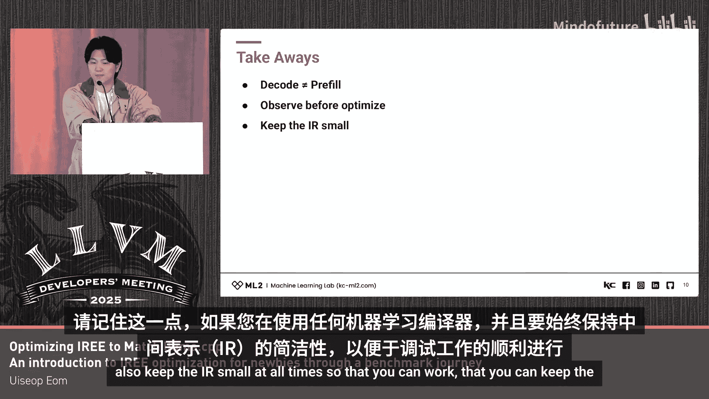

# 043：引言与概述

在本教程中，我们将学习如何优化IREE编译器，以使其在运行TinyLlama模型时的性能接近llama.cpp的水平。这是一段面向新手的优化探索之旅，我们将从基准测试开始，逐步深入到MLIR层面的调试与优化。

## 🎯 IREE项目简介

IREE是一个基于MLIR、可重定目标的机器学习程序编译器。它能够接收多种前端输入，例如PyTorch、TensorFlow等，并在不同的后端上执行，例如x86 CPU、ARM CPU和GPU。简而言之，IREE提供了一个运行时和编译系统，用于生成可在这些运行时上运行的字节码。这使得它非常适用于在边缘设备和异构计算环境中运行各种机器学习程序。

我们团队选择IREE作为学习和理解MLIR及LLVM的切入点，主要基于以下几点原因：IREE本质上是MLIR原生的，它是一个端到端的编译器栈。我们认为其规模非常适合新手，并且它包含了大量针对硬件的抽象。总的来说，它是一个能让你全面接触MLIR编译器栈的端到端解决方案。

## 🚀 基准测试起点

我们首先在TinyLlama模型上对基于MLIR的IREE项目进行基准测试。最初我们尝试了Llama 3.1 8B Instruct模型，但为了更快的迭代速度，后来决定改用TinyLlama。因为我们的主要目标是针对边缘设备进行优化，而我们的研究小组更侧重于机器人和边缘设备领域。因此，如果你也打算在边缘设备上对大型模型进行基准测试，建议使用TinyLlama而非Llama 3.1 8B Instruct，这样可以获得更快的迭代速度。

我们得到的基础基准测试结果显示，IREE处理每个令牌需要23秒，而llama.cpp仅需84毫秒，性能差距超过200倍。这个巨大的差异开启了我们后续的优化探索之旅，其中涉及了大量的MLIR实践和优化工作。

---

# IREE优化教程：第2章：调试与性能分析挑战

上一节我们介绍了基准测试的起点和巨大的性能差距。本节中，我们来看看在优化初期遇到的调试挑战以及如何应对。

在深入优化之前，我们意识到需要对IREE内部的MLIR栈进行大量调试。我们发现，CPU和内核性能分析工具并没有起到太大帮助。这主要是因为IREE项目本身使用了Python绑定，而C++代码栈被隐藏在这些绑定之后。因此，像CPU性能分析和内核性能分析这类工具，由于无法直接透视背后的C++栈，作用有限。

相反，使用诸如`perf`之类的C++框架分析器和火焰图分析器提供了很大帮助。通过使用`perf`来定位最慢的代码帧，再结合MLIR的`--print-ir-after-all`选项（这是一个MLIR优化选项，Google也经常使用），我们得以找到那些导致性能缓慢的MLIR代码块和瓶颈部分。

实际上，对比优化过程中产生的中间MLIR文件，是观察MLIR在优化间变化的唯一方法。这个过程比较困难，因为你需要阅读大量的文本信息。但这就是作为新手深入MLIR调试时所能采取的主要手段。

以下是调试MLIR时的一个重要注意事项：

*   **处理大型常量**：机器学习程序中的张量操作通常包含巨大的MLIR常量，这会严重恶化调试体验，因为MLIR文件可能因此膨胀到4GB、8GB甚至更大。
*   **优化技巧**：对于MLIR新手的一个建议是，始终使用`dense_resource_elements`属性来减小IR文件大小。这本质上是将张量常量从MLIR文件中分离出去。IREE项目在其自身的`flow`方言中也有一个类似的属性，称为`named_parameter`属性。如果你正在研究MLIR优化或MLIR文件，很可能会找到一个可以用来分离张量的属性或函数。

---

# IREE优化教程：第3章：优化策略与核心发现

上一节我们探讨了MLIR调试的挑战。本节中，我们来看看实际的优化尝试和关键发现。

在优化旅程的最后，我发现我所尝试的MLIR优化方法实际上都没有显著减少推理时间。真正的性能提升来自于针对推理代码本身的优化，而非MLIR编译过程。具体来说，**采用分页扩展的KV缓存**技术带来了巨大帮助。

这项优化成功地将处理每个令牌的时间从23秒降低到了421毫秒。这是一个非常关键的结果。

下图展示了优化前后的对比，你可以清晰地看到，在优化前，最耗时的函数是一个等待函数。这表明，如果我一开始就进行跟踪分析，可能会更早地发现瓶颈在于内存访问，而非编译优化错误。

*   **优化前**：最耗时的函数是一个等待函数，表明存在内存瓶颈。
*   **优化后**：性能得到显著提升，处理每个令牌的时间大幅下降。

---

# IREE优化教程：第4章：经验总结与要点

在本节中，我们将总结从这次优化之旅中获得的经验教训和关键要点。

以下是从这次旅程中得出的一些重要收获：

*   **先观察，后优化**：如果我遵循了这个原则，本可以节省大量时间。在深入优化之前，充分进行性能剖析和观察至关重要。
*   **编码与预填充阶段的差异**：在使用机器学习程序和编译器时，编码（decode）阶段和预填充（prefill）阶段的工作负载特性是不同的。预填充阶段主要涉及**GEMM**操作，而编码阶段则更多涉及**GEMV**操作。如果你正在使用任何ML编译器，请务必牢记这一点。
    *   **预填充**：`C = A * B` （GEMM，矩阵-矩阵乘法）
    *   **编码**：`y = A * x` （GEMV，矩阵-向量乘法）
*   **始终保持IR精简**：为了确保调试工作能够顺利进行，请始终想办法保持中间表示的体积尽可能小。

---

# 总结

在本教程中，我们一起学习了优化IREE编译器以匹配llama.cpp性能的完整过程。我们从IREE和基准测试的介绍开始，经历了MLIR调试的挑战，发现了通过优化推理代码（特别是KV缓存）而非MLIR编译本身才是性能提升的关键，并最终总结了“先观察后优化”、注意编解码阶段计算差异以及保持IR精简等重要实践经验。希望这篇教程能帮助那些刚刚接触MLIR和LLVM相关项目的新手们。