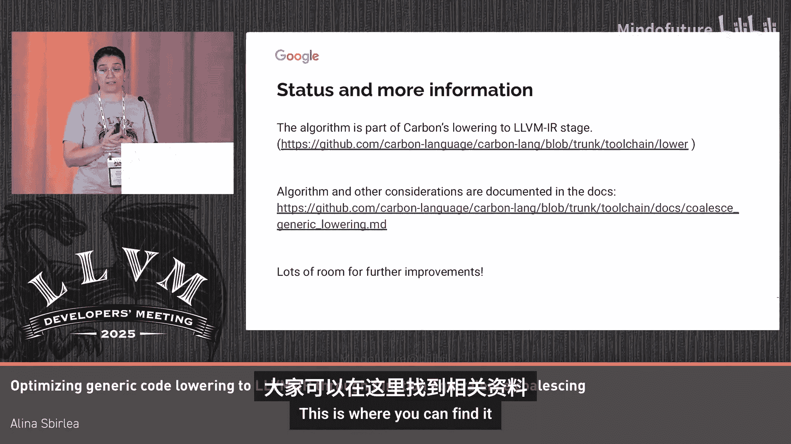

# 044：将泛型代码优化到LLVM-IR

在本节课中，我们将学习如何通过识别和合并等价的泛型函数实例，来优化泛型代码到LLVM IR的编译过程，从而显著减少代码体积并提升编译速度。

## 背景与问题

C++的模板和Carbon的泛型都允许在编译时对代码进行参数化。这样做的主要目的是提升性能和安全性，例如在编译时进行类型检查。然而，这也会导致代码体积增大和编译时间延长。本次讨论的核心就是：我们能否解决这个问题？

一个简单的例子是，当泛型函数的参数类型不同（如 `int` 和 `double`），但在降低到LLVM IR后，它们的参数类型可能相同（例如都变成了指针类型 `ptr`）。在这种情况下，我们是否真的需要两个函数来完成相同的操作？

因此，我们需要解决的问题是：当存在多个函数实例（或特化），其参数类型在源语言中不同，但在生成LLVM IR后具有相同的LLVM IR类型时，我们能否对这些函数进行去重或合并？

## 为什么这很重要？

优化泛型函数合并主要影响两个指标：**代码大小**和**编译时间**。减少冗余函数可以显著缩小最终二进制文件的大小，并加速编译流程中的优化和代码生成阶段。

## 现有实现概述

当前的实现在Carbon编译器中完成。Carbon编译器的工作流程包括：语法解析、生成前端IR的检查阶段，以及将前端IR转换为LLVM IR的降低阶段。本次讨论的重点就是这个降低阶段。

拥有前端IR是一个极佳的设计，因为它允许我们以单一函数体的形式表示泛型函数，并通过特定的“符号”进行参数化。这样，我们就可以在前端IR中查询特定指令或类型在给定上下文中的更多信息。

## 实现挑战与考虑

理论上，比较两个函数是否等价似乎很简单：只需逐条比较指令，并查询前端IR来确认它们在当前上下文中是否相同。然而，实际情况要复杂得多。

以下是实现过程中需要考虑的几个关键点：

1.  **函数调用**：如果指令中包含函数调用，我需要知道被调用的函数是否也等价。这意味着我必须考虑所有可能的调用链，即需要完整的调用图信息。
2.  **递归**：算法需要能够识别递归调用，并判断是否处于递归中，或者是否有先验信息可用。
3.  **接口与实现**：即使LLVM类型相同，通过接口调用的不同实现也可能对应不同的函数体，这必须被考虑在内。
4.  **前端特定信息**：某些前端特有的概念需要处理。例如在Carbon中，一个接口可以包含“关联常量”，泛型函数中可能声明该类型的常量变量。因此，算法还需要考虑诸如符号表位置等信息。
5.  **性能**：为了通过此优化节省总体编译时间，算法本身必须高效，尽可能减少增加的编译开销。

综合以上考虑，确保正确性的核心在于：必须进行完整的调用图分析，考虑所有LLVM类型信息，并涵盖特定前端的所有相关细节。

## 算法设计

为了平衡正确性与性能，我们选择为每个函数计算一个“函数指纹”。具体做法是，聚合函数的所有相关信息（如函数类型、依赖于特化参数的指令/类型，以及关键的调用图信息），然后使用高效的哈希算法（如LLVM采用的Blake3）生成一个哈希值作为指纹。

算法的高级定义分为两步：
1.  **生成与收集**：生成所有函数定义，并收集相关数据，计算并存储其函数指纹。
2.  **合并与消除**：执行等价性判断逻辑，消除所有重复的函数。

在第一步中，我们收集的数据包括函数类型、任何依赖于特化参数的指令或类型，并特别仔细地分析函数调用，以获取调用图信息。

第二步的合并逻辑很简单：对于任意两个特化，检查它们的指纹是否相同。如果相同，则它们等价。算法会返回整个调用图中所有等价的函数对，然后我们可以一次性完成所有替换。

指纹等价的检查，除了比较第一步创建的指纹，还会进行两次遍历以解决特定上下文中的等价性问题。

## 性能测试结果

我们通过自动生成的Carbon代码进行了压力测试，旨在模拟复杂调用图的极端情况。以下是初步的性能结果：

**代码大小方面**：
*   对于平衡类型（包括原始类型和指针类型），优化后LLVM IR的大小减少了45%到50%，汇编代码大小和生成的函数数量也相应减少。
*   如果大部分是指针类型，函数数量减少可达98%。
*   作为对比，LLVM内置的`mergefunc`优化pass在此类测试中，仅对约12%的测试用例有影响，平均减少函数数约1%，最大减少约4%。这表明前端分析能带来的优化潜力要大得多。

**编译时间方面**：
*   对于平衡类型，执行此优化逻辑本身导致编译时间增加约0.9%，但使得Carbon的降低阶段（生成LLVM IR）时间减少了2%。
*   更重要的是，在Carbon的优化和代码生成阶段，时间减少了25%到51%。
*   对于指针类型居多的情况，由于代码量大幅减少，在降低阶段耗时更少，优化代码所需的时间也显著降低。

## 总结与资源

本节课我们一起学习了如何通过前端IR分析，为泛型函数生成指纹并进行等价合并，从而有效优化LLVM IR的生成。这种方法能显著减少冗余代码，提升编译效率。

该算法已开源。
*   **算法代码**：可在提供的第一个链接中找到。
*   **相关文档**：详见第二个链接。
如果你有更多问题或想深入了解，欢迎联系我。

