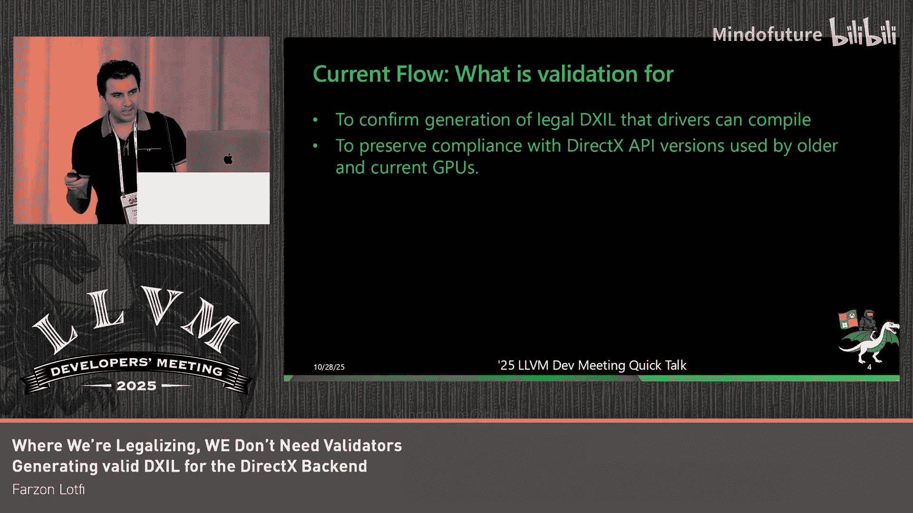

# 045：规范化中的位置——我们不需要验证器吗？生成有效的DXIL

## 概述

在本节课程中，我们将探讨如何通过将验证规则直接编码为转换过程，来生成有效的DirectX中间语言。我们将首先了解当前DXIL生成流程的问题，然后介绍一种新的合法化方法，旨在使中间表示本身在生成时就符合DXIL规范，从而减少对独立验证器的依赖。

## 术语定义

首先，我们来定义几个核心术语：

*   **DXIL**：DirectX中间语言。它本质上是**LLVM 3.7**的一个变体。
*   **DXC**：当前的生产编译器，负责输出DXIL。
*   **DXV**：验证器，用于检查DXIL模块的正确性和兼容性。

## 验证的目的与当前流程

验证的目的是确保我们生成的DXIL是合法的，并且与硬件和驱动程序栈兼容。这对于确保着色器能在不同GPU和API版本上正确运行至关重要。

当前，验证发生在代码生成之后、管道的末端。这意味着验证规则必须影响更早的优化过程，这并不理想。当DXC和验证器版本匹配时，我们不会看到代码生成问题。但在使用旧版本验证器时，这会成为问题。

因为验证发生得很晚，我们只能在最后阶段看到错误。维护兼容性变得被动，规则必须与编译器更改手动同步。这迫使合法化规则存在于前端和优化层中。对于每个版本，我们都有可能支持一个DirectX目标，这可能会影响我们SPIR-V后端的代码生成，这并不理想。

此外，我们有一个要求：新编译器必须能够跨DirectX API版本生成有效的DXIL。验证器是我们对硬件合作伙伴的承诺，确保新编译器不会破坏当前和旧的GPU驱动程序。新编译器确实可能破坏旧的验证器，这可能会延迟发布，使得这个过程脆弱且容易出错。我们不希望在现代化进程中延续这种做法。

## 验证器的作用与局限

那么，当前的验证器具体做什么呢？它检查结构和语义、资源使用以及着色器模型规则。如果一切合法，它会盖上验证通过的“哈希戳”，驱动程序就知道它是好的。

它不做什么呢？验证器不修复任何问题。如果DXIL是错误的，它只会报错，不会进行修复。因此，我们不想依赖DXV作为安全网，而是希望IR本身在生成时就已经是DXIL合法的。

## 重新构想管道：三步计划

上一节我们介绍了当前验证流程的局限性，本节中我们来看看我们如何重新构想整个生成管道。这是一个三步计划：

1.  首先，从一开始就不生成非法的DXIL。我们稍后会详细讨论这一点。
2.  我们将把验证器规则编码为DirectX后端内部的转换。
3.  我们将仅把DirectX验证器用作最终检查步骤，而不是作为正确性关卡。

这将使我们能够支持跨验证器版本的规则，以应对从前端和优化器接收到的不断演进的LLVM IR。

因此，流程将从 `LLVM IR -> DXIL -> 验证器 -> 失败` 转变为 `LLVM IR -> 合法化 -> DXIL -> 验证器（仅用于哈希戳）`。这使得输出可预测，并消除了交互中的隐藏规则。

## 数据转换

这些变化中我们必须做的一项就是数据转换。这里我想传达的关键信息是：我们将机械地重建LLVM数据类型和布局，以使其能够被DXIL处理。

我们正在使用现有的标量化路径，将向量操作转换为DXIL支持的标量操作。这在Shader Model 6.8之前是必须的（6.9显然会有向量支持，但在此之前没有）。我们还必须构建自己的数据标量化来处理诸如别名和全局变量之类的东西。你可以看到我们有一个类似这样的转换。

DXIL还有一个要求，即数组必须是扁平的。因此，我们将线性化多维数组。这实际上必须在标量化之后进行，因为当你运行标量化时，向量本质上会变成一个二维数组。

你可以看到我们展示了该转换是如何工作的。

## IR转换

接下来我们需要做的是一组IR转换。

我们引入了一个自定义的合法化过程。我们不能为此使用Global ISEL，因为我们有一个要求：我们仍然能够进行位码序列化。没有方法可以从Machine IR回到LLVM IR位码，但这个想法很大程度上受到了Global ISEL合法器的启发。

因此，这个过程会重写任何剩余的不映射到合法DXIL的构造。这实际上是一个“包容性验证器”，它进行转换，而不是拒绝。

那么这具体是怎样的呢？我们有以下几种指令转换：

*   **指令转换**：LLVM 3.7不支持 `fneg` 指令，也没有 `freeze`。因此，我们必须用合法的等效构造替换它们，或者完全移除它们。
*   **类型限制**：DXIL对类型有限制。一个例子是对整数宽度的限制。对于索引以及插入和提取操作，我们完全不支持任何i1类型，它们只能是32位。对于仅作为索引类型的情况，这很简单，我们可以移除或用32位类型替换那些64位类型。当我们试图合法化i1时，情况会变得更复杂，这实际上需要我们遍历使用链并找到类型转换。找到转换后，我们本质上必须选择最小的转换并进行变换，这样我们就不必在之后修改任何更大的转换。你可以在这里看到一个例子，我们有两个冲突的转换，我们选择较小的那个，并将其传播到别名。
*   **处理内部函数**：我们通常通过内部函数展开来实现。DXIL不支持任何内存内部函数。这意味着像 `memcpy` 和 `memset` 这样的操作需要被展开成符合DXIL内存模型的合法大小形式。
*   **特殊类型处理**：我们通过目标扩展类型使用了一些特殊类型。这些类型不能被像 `SimplifyCFG` 或我们稍后会谈到的 `GVN` 这样的过程修改。这些资源类型不能流经Phi节点或选择指令。我们需要一种方法来标记它们，以便优化过程不去动它们，并完全阻止某些优化。因此，我们提出了“类令牌”这个概念，它利用了优化过程中已经存在的关于令牌的一些规则。在这里我们可以看到，我们不将其传播到不同的基本块，我们将其保持在不同的基本块内，我们不试图将其下放到一个Phi节点中。

类似地，我们不得不对GVN过程做同样的事情。我们必须教会它什么是“类目标类型”，这样它就不会为其生成文件。这里的想法是，我们只是试图防止其被错误地重构。

## 总结

本节课中我们一起学习了如何通过将DXIL验证规则直接编码为LLVM IR的转换过程，来从根本上改变有效DXIL的生成方式。这种方法不打算一夜之间取代验证器，但它形成了一条路径，使得每一条验证器规则都可以变成一条转换规则，并确保未来生成的代码以及针对旧版DXIL的代码都能保持兼容。这使生成过程更具可预测性和鲁棒性。

是的，非常感谢。