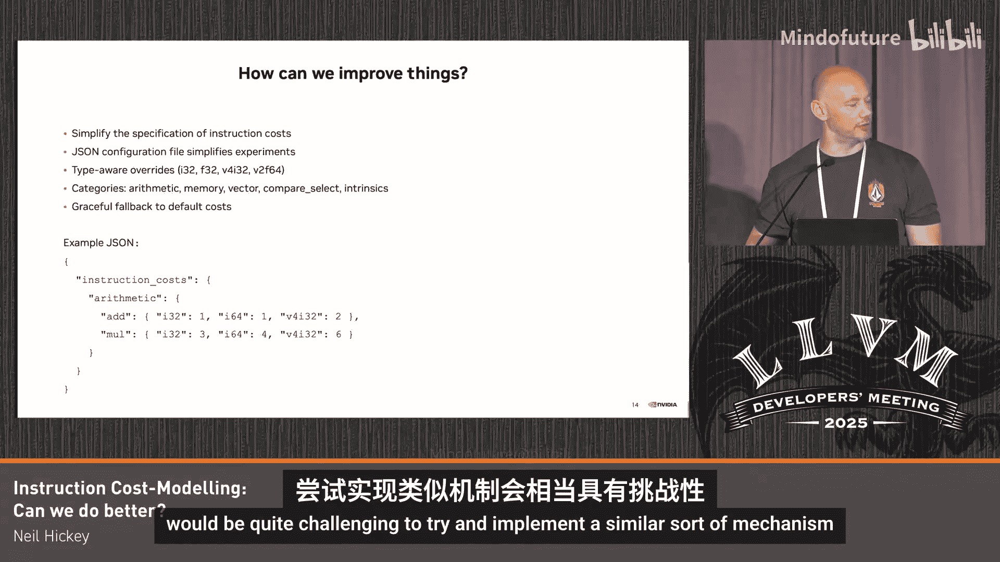

# 046：指令成本建模 - 我们能做得更好吗？🚀

在本节课中，我们将探讨 LLVM 中的指令成本模型。我们将了解它的工作原理、当前的优势、面临的挑战，并讨论一些潜在的改进方向。成本模型是 LLVM 优化器做出决策的关键工具，理解其现状和未来对编译器开发者至关重要。

## 成本模型简介

上一节我们概述了课程内容，本节中我们来看看 LLVM 成本模型的基本概念。LLVM 的指令成本模型是一个简单快速的近似工具。它接收 LLVM IR 作为输入，并为给定的后端提供一个指令成本估算。

它是一个高层次、可调优的启发式模型。它主要被视为一个相对指令成本。最初它试图表示指令的**倒数吞吐量**，但现在它更多地成为特定后端上指令一般成本的代理。它被用作优化决策的指导工具。

一个常见的问题是：成本模型必须完全精确吗？实际上，成本模型的主要目的是引导优化器做出正确的决策。只要它足够接近，通常就足够了。因此，讨论的焦点往往是：当前的成本模型是否“足够好”。

## 成本模型的工作原理

成本模型通过目标转换信息（TTI）钩子实现。你向特定后端的 TTI 传递一条指令，它会返回一个成本值。然后，优化器会为正在评估的代码段（例如一个循环或一个基本块）累加这些成本，得到一个总体成本值。

以下是其工作流程的简化描述：
1.  优化器需要做出决策。
2.  它生成一个或多个可能优化方案的示例 IR。
3.  查询 TTI 获取每个方案的指令成本。
4.  累加成本，并根据总成本做出最终代码生成决策。

## 当前成本模型的优势

在深入探讨挑战之前，我们先看看当前成本模型做得好的地方。它已经作为一个可行的启发式方法运行了很长时间。

以下是其主要优势：
*   **快速**：查询是常数时间复杂度（O(1)），不依赖于代码生成。
*   **可组合**：可以累加不同指令的成本，为更高级别的对象（如基本块）计算总成本。
*   **可覆盖**：不同的后端可以覆盖默认实现，提供特定于硬件的成本。
*   **共享基础设施**：它是 LLVM 中所有后端共享的通用基础设施。
*   **决策工具**：主要用作决策指导，不要求 100% 精确。

## 成本模型面临的挑战

尽管当前模型有其优势，但在我们的工作中也发现了若干挑战。上一节我们介绍了它的优点，本节中我们来看看它面临的问题。

以下是我们在研究中观察到的五个主要挑战：

1.  **可维护性**：成本模型基于启发式，代码遍布 LLVM 约 10 万行。不同的优化器（如循环向量化器、SLP 向量化器）以略有不同的方式使用它，实现各自的成本累加逻辑，甚至存在多个成本模型（如遗留模型和 VPlan 模型），这使得同步更改非常困难。

2.  **启发式调整的滞后性**：成本模型最初可能代表指令的倒数吞吐量，但已演变为纯粹的启发式数字。这导致成本模型的更改往往是事后补救，滞后于代码生成的改进。经常在硬件或代码生成变更数周或数月后，才有人来调整启发式数字。

3.  **粒度低**：许多后端的成本粒度很低。例如，`add` 指令的成本是 1。另一个指令可能比 `add` 稍贵，但并非两倍贵，然而成本只能是 1 或 2，缺乏中间值。有些后端（如 RISC-V）通过将所有成本乘以 100 来获得百分比粒度，但这导致了各目标自行其是的缩放方式。

4.  **简单的成本累加**：许多地方只是简单地对 IR 指令成本求和，以此估算一个基本块的执行时间。这是一种非常简化的方式，可能无法准确反映实际硬件执行情况。

5.  **IR 与硬件执行的差距**：由于模型基于 IR 级别，它不一定能精确匹配硬件实际产生和执行的内容。例如，IR 可能对应多条机器指令，但后端通过融合等技术可能生成更简单的汇编代码，而简单的 IR 成本求和无法捕捉这种优化。

## 潜在的改进方向

认识到这些挑战后，我们思考了一些可能的改进方案。请注意，本节的目的不是提出最终解决方案，而是开启与社区的对话，探讨是否有更好的方法。

以下是我们考虑过的几种思路：

*   **提取 JSON 配置文件**：创建一个简单的 JSON 配置文件，允许以更简单的方式覆盖后端的成本。这可以定义特定 IR 指令和类型的成本覆盖。这种方法便于通过机器学习或自动调优框架来大规模调整不同内核的成本。

*   **利用调度模型计算关键路径**：与其简单累加基本块内所有指令的成本，不如利用 LLVM 中某些内核已有的调度模型，尝试计算给定块的关键路径长度。例如，在考虑循环向量化时，可以只累加关键路径上的成本，而不是所有指令的成本。公式上，这可以表示为：`总成本 = Σ(关键路径上指令的成本)`。

*   **基于代码生成进行更精确的成本推导**：理论上，可以进一步深入代码生成阶段，理解后端最终会生成什么，并据此更精确地推导成本。这能更好地映射 IR 指令到真实的硬件效应（如指令融合）。然而，这种方法的主要问题是编译时间可能会显著增加。

## 社区讨论与总结

在演讲后的问答环节，社区成员提出了一些有价值的观点和建议：

*   **利用现有补丁**：有社区成员提到 Simon Pilgrim 几年前的一个补丁，该补丁通过后端 lowering 并利用 TableGen 驱动的方法来生成成本表。这被认为是一种可行且有趣的方法，可能是改进的第一步。
*   **使用 MCA 进行估算**：在讨论关键路径方法时，有建议指出既然已经进行了代码生成的繁重工作，可以直接使用 LLVM 的机器代码分析器（MCA）来估算成本。
*   **静态映射折中方案**：作为完全代码生成和纯 IR 成本之间的折中，可以考虑建立一个从 LLVM IR 指令到潜在机器指令的静态映射，然后使用调度模型对这些机器指令进行成本估算。
*   **成本种类的扩展**：目前成本模型主要使用一个启发式数字来代表一切（最初是吞吐量）。未来如果更紧密地结合调度模型，可能会更多地使用**延迟**、**吞吐量**等多种指标来指导成本计算。
*   **机器学习应用**：成本模型的调优被认为是可能应用机器学习（ML）的领域，通过自动迭代来寻找更优的启发式参数或特征组合。

本节课中我们一起学习了 LLVM 指令成本模型的基础。我们了解到它是一个用于指导优化决策的快速启发式工具，具有可组合、可覆盖等优点。同时，我们也探讨了它在可维护性、粒度、精度以及与硬件匹配度方面面临的挑战。最后，我们介绍了几种潜在的改进思路，并看到了社区对此的积极讨论。改进成本模型是一个持续的过程，目标是在保持编译效率的同时，提供更准确、更易维护的决策依据，以生成更优的代码。

