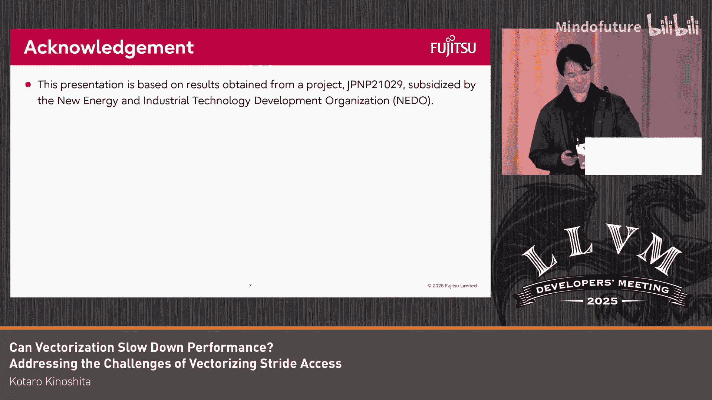

# 047：向量化性能问题与优化


## 概述
在本节课中，我们将要学习LLVM编译器在向量化过程中可能遇到的一个特定性能问题。我们将探讨向量化通常如何提升性能，但在某些特定场景下，例如处理跨步访问（stride access）时，向量化反而可能导致性能下降。我们将深入分析这个问题的根本原因，并了解针对不同硬件架构（如Arm的SVE和AArch64）的优化方案及其效果。

## 向量化会降低性能吗？🤔

向量化通常被期望用于提升程序性能。然而，我们发现，在某些跨步访问的场景下进行向量化，实际上会导致性能下降。

例如，在本幻灯片展示的测试案例中，向量化版本的性能实际上比标量版本更差。

我们发现，这种性能下降是由跨步访问的低效代码生成所导致的，并且我们已经为此问题提交了一个报告。

在本次讨论中，我们将探讨这个问题及其改进状态。虽然本次讨论主要关注针对SVE的AArch64架构，但我们相信这个问题也可能与其他架构相关。

## 当前向量化的问题：低效的地址计算 🔍

上一节我们介绍了向量化可能导致的性能问题，本节中我们来看看导致这个问题的核心原因之一。

当前由循环向量化生成的代码，其问题在于低效的地址计算。

对于SVE架构，跨步访问需要使用聚集（gather）指令。在当前向量化的代码中，操作的地址在循环内部使用向量指令进行更新，正如你在幻灯片示例中所见，向量寄存器Z1在每次迭代中都会被更新。

但是，如果我们能够识别出跨步访问的模式，就可以生成像这样更高效的指令序列。

以下是优化思路的代码描述：
```
// 低效方式（循环内更新向量地址）:
for (i=0; i<N; i+=VL) {
    addr_vec = base + stride * {i, i+1, ..., i+VL-1}; // 向量计算
    load(addr_vec);
}

// 高效方式（循环外初始化，循环内更新标量基址）:
addr_vec = initial_address; // 在循环外初始化向量寄存器
for (i=0; i<N; i+=VL) {
    load(addr_vec);
    addr_vec += stride * VL; // 使用标量指令更新基址
}
```

在幻灯片示例中，你可以看到基址寄存器X1在每次迭代中被更新。这段代码效率更高，因为它需要更少的资源用于地址计算。

## 问题改进状态与解决方案 🛠️

接下来，我将解释针对此问题的改进状态。

幸运的是，针对RISC-V架构（它拥有专用的跨步加载/存储指令）的补丁已经被提交。这个补丁在循环向量化过程中检测跨步访问模式，并将其分派给专用的跨步加载指令配方。

然而，AArch64架构并没有这些专用的跨步加载/存储指令，因此我们无法直接使用该指令配方。

所以，我们的贡献是创建了一个针对AArch64架构将配方合法化（legalize）的补丁。这个补丁用我们在上一张幻灯片中看到的指令序列替换了原有的配方。

实际上，对于引言中的测试案例，我们的方法相比当前的向量化方式，将性能提升了37%。

## 其他跨步访问向量化问题 📝

最后，我想简要提一下向量化跨步访问时遇到的其他一些问题。

以下是目前已知的其他相关问题：

1.  **具有可变跨步的循环**未能被有效向量化。这与循环版本化有关，通常只有跨步为1的版本会被向量化，而其他情况则保持为标量代码。
2.  在归纳变量简化器中，当将跨步访问的索引拓宽到64位时，可能会**潜在使内存访问指令的数量翻倍**。

我们已经将相关问题的编号列在了幻灯片上。

## 总结



本节课中我们一起学习了LLVM向量化中一个关于跨步访问的性能陷阱。我们了解到，尽管向量化旨在提升性能，但在处理特定内存访问模式时，如果地址计算不够高效，反而可能导致性能下降。我们分析了问题的根本原因，并探讨了针对AArch64架构的优化方案，该方案通过将循环内的向量地址计算转化为更高效的标量基址更新，成功提升了性能。最后，我们还简要了解了向量化跨步访问时面临的其他挑战。理解这些细微之处对于编写高性能代码和进行有效的编译器优化至关重要。