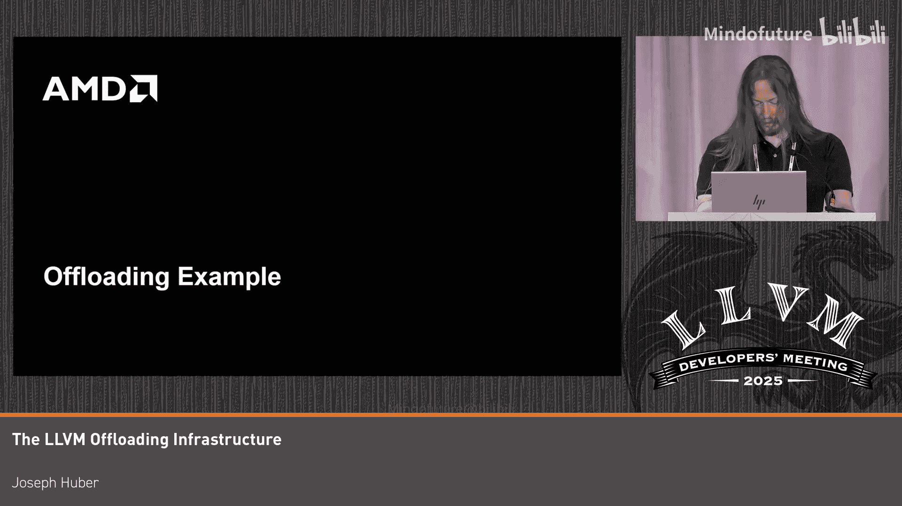
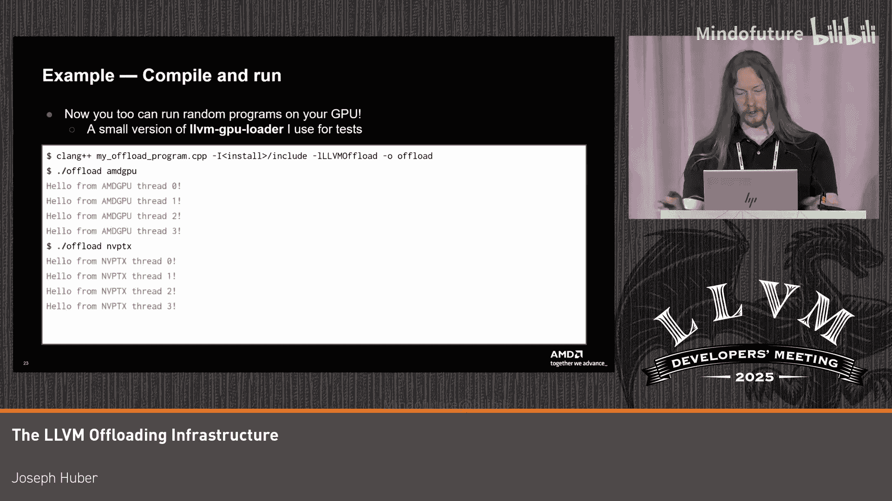
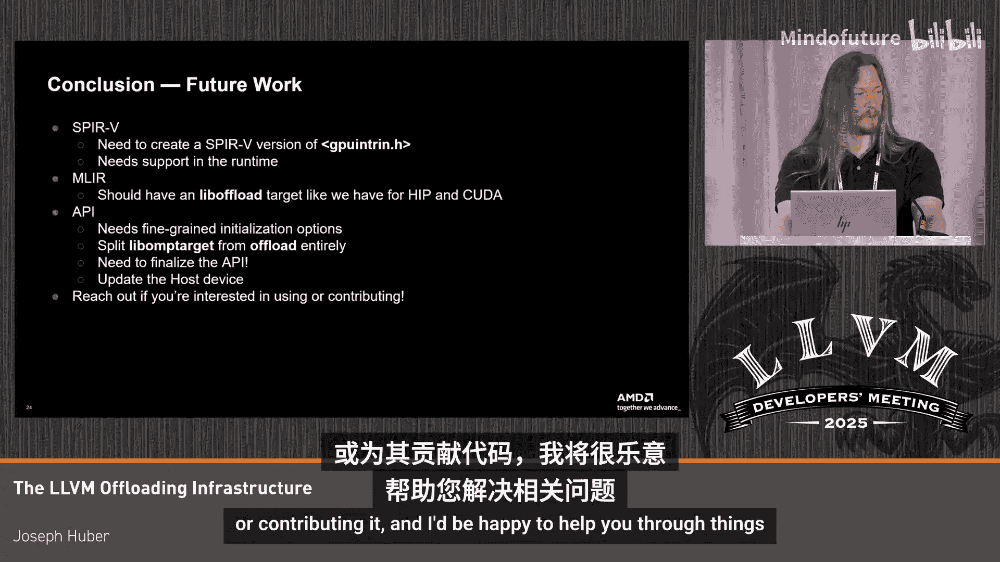
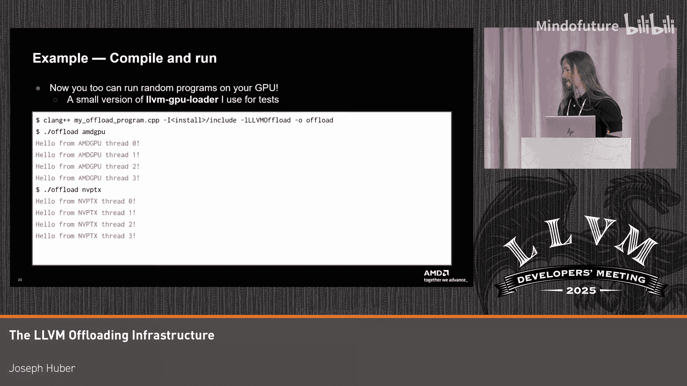

# 048：LLVM卸载基础设施教程


## 概述
在本节课中，我们将要学习LLVM卸载基础设施。这套工具集用于在外部加速器（如GPU）上运行程序。其核心思想是提供一个通用、可复用的框架，以便不同的语言前端和厂商编译器都能受益，避免重复实现。我们将通过一个快速导览，了解当前在Clang和LLVM中进行GPU编译的概况。

## 编译基础：将GPU视为嵌入式目标

上一节我们介绍了LLVM卸载基础设施的概览，本节中我们来看看如何将GPU编译视为一个标准的嵌入式目标工具链。

可以将GPU视为一个嵌入式目标。其工具链包含一个名为Clang的编译器。你向该工具链的编译器提供源文件，它会执行必要的步骤，生成一个可用的可执行文件。这种编译模式简化了与现有工具的集成。

以下是一个示例，它使用了通用的GPU内部函数头文件，使其在我们支持的所有目标之间基本通用。

```c
#include <clang/gpu_intrin.h>
__global__ void kernel() {
    printf("Hello from thread %d on platform %s\n",
           __builtin_gpu_thread_id(),
           __builtin_gpu_get_platform());
}
```

你可以为每个GPU使用Clang工具链进行编译，例如针对AMD GCN或NVIDIA PTX，从而获得适用于所需硬件的可执行文件。目前对SPIR-V的支持尚不完善，主要缺少对非统一内存访问等功能的支持。

我提出这一点，是因为目前我正在基于这个思路推动LLVM基础设施来构建GPU运行时库。GPU确实有运行时库，例如数学库。在类似HIP的环境中，还有`malloc`和`printf`等。OpenMP也有一个相当复杂的运行时库。

构建这些库的方法就是使用直接编译的理念，将其视为一个标准的交叉编译工具链，就像你熟悉的任何其他嵌入式系统一样。

你可能也听过今天其他讲座提到的目标工具链库，例如`multiarch`。它的作用是将你的目标文件放入一个限定目录中，以便安装所有库而不用担心冲突。我一直在逐步将每个GPU运行时库迁移到这种方式，目前可能只缺`libclc`。

关于如何在CMake中构建，我们没有时间深入探讨，但卸载项目中有个缓存文件叫`Offload.cmake`，它就像是这方面的动态文档。如果你想了解具体做法，可以查看它。

## 异构编译与卸载工具

上一节我们介绍了如何将GPU作为独立目标进行编译，本节中我们来看看更常见的异构编译场景及其使用的卸载工具。

一旦我们构建了运行时库，就可以将它们用于编译更常见的GPU卸载语言，例如OpenMP、HIP、SYCL和CUDA。SYCL带星号是因为其上游功能尚不完整。

这里的主要区别在于这些是异构编译，它们将主机编译与一个或多个设备编译结合在一起。这给工具链带来了很多复杂性，为此我们有许多卸载工具来帮助管理。

你可以看到下面这个示例，它是之前示例的HIP版本。如果你加上`-###`标志，会看到很多步骤。我将快速概述这些步骤在做什么。

```bash
clang -### --target=amdgcn-amd-amdhsa -mcpu=gfx1030 -nogpulib example.hip
```

你提供源文件。如果使用`-###`，你会看到Clang前端生成了多个编译任务，产生一个主机对象文件和多个设备对象文件。每个Clang编译工具链都期望一个输出，但由于我们生成了多个设备对象文件，我们需要使用`llvm-offload`二进制工具将它们合并成一个。这只是一种包含元数据的二进制格式，用于在链接时重建原始的Clang任务。然后，我们将其嵌入到主机对象文件中，得到一个包含主机和设备代码的“胖二进制文件”。

接着，我们通过Clang链接器包装工具处理它，这个工具内部有很多魔法，但概括来说，它提取那些胖二进制对象，调用之前提到的直接目标编译来获得可执行文件，用注册代码包装它，然后将其合并到最终的`a.out`可执行文件中。这样，当你运行程序时，它会一次性初始化。

快速看一下嵌入的内容，它只是一个命名段。查看这个命名段，你会发现它只是一些元数据和一个二进制对象，并不太复杂。

如前所述，我们使用Clang链接器包装工具，这是一个为你完成所有工作的魔法步骤。但如果你愿意，也可以自己动手，假装自己是一个编译器驱动程序，使用`llvm-offload`二进制工具来提取文件。

以下是一个示例，展示了如何手动操作：使用`llvm-offload`提取文件，然后使用目标链编译器获得可执行文件，接着使用`llvm-offload-wrapper`将其包装在一个模块中，该模块包含类似`hipRegisterModule`的调用（具体名称我忘了）。这将被放入一个构造函数中，当用户启动程序时，该构造函数会被调用，然后你就可以访问你的GPU可执行文件了。

如果你不知道其中包含的架构，可以使用`llvm-objdump`配合卸载标志来查看。

## 卸载运行时库：通用GPU接口

上一节我们介绍了编译阶段，本节中我们来看看程序编译完成后，如何在GPU上实际运行它。

最近，LLVM项目增加了一个卸载运行时库，它是卸载项目的一部分，最初是从OpenMP支持中分叉出来的。

这个库旨在为所有我们打算支持的厂商GPU运行时提供一个通用接口。我说“通用”带星号，是因为我总是想警告人们不要试图创建真正通用的东西，因为这通常只会得到一个所有GPU功能的最小有用子集。因此，在需要的地方必须有扩展。目前我们支持AMD和NVIDIA的卸载，也有支持Intel GPU的补丁。这些主要是对实际厂商运行时的动态包装，但它提供了一个统一的接口，所以你只需要链接一个东西，它就能知道该怎么做。

这个库最初用于OpenMP，但我们发现其中大部分内容非常通用，实际上可以开始导出它。其他目标如SYCL也希望开始使用相同的接口。因此，最近有一个推动力，开始创建一个新库，将OpenMP拆分成自己的部分，并将通用部分提取到一个API中，这个API被称为`liboffload`。

那么，`liboffload`是什么？它是一个用于卸载到GPU程序的C API。我知道你们中有些人会想，我们不是已经有足够多的这类API了吗？答案可能是的，但在LLVM内部工作时，拥有一个我们可以控制的API是非常好的。

它仍在开发中，但可以说已经过了最小可行产品阶段，所以你肯定可以使用它，但有些东西可能会改变。像任何优秀的GPU运行时一样，它的每个API函数都以两个字符为前缀，比如VK、CL、CU。有人讨论过将其命名为LLVM卸载库，但我否决了，因为我不想在我的运行时代码中调用`LO_`。

像许多人之前做过的那样，我们通过`TableGen`生成头文件。你将API函数放在那里，给出描述以生成文档，然后它还会自动生成函数验证（例如检查参数是否为NULL等）和跟踪功能。当你运行程序时，可以选择性地获得打印输出，例如在哪个线程执行了什么、错误值等。这在调试时非常有用。

这对LLVM人员来说是老生常谈了。我们将这些东西安装在类似`offload-api.h`的头文件中，然后使用我们创建的新的`TableGen`可执行文件来生成实现。这将把它简化为如下形式：它进行跟踪检查，如果是，我们就发出函数名，调用实际运行时的实现，然后返回任何错误并打印出来。

从高层次看，许多GPU运行时看起来都一样，对象都暴露为不透明的句柄。如果你有一个设备，那只是一个你不知道的奇怪指针，你把它交给运行时，运行时为你做事。我们真的希望提供这个，让人们可以用于他们的编译器来发出卸载代码，对吧？



为了使这更容易，我们提供了丰富的错误消息，包含自定义的错误字符串，而不是像大多数运行时那样只给出一个通用错误和一个查找表。我们实际上为不正确的参数生成自定义的错误消息。

我们做的另一件事是，为每个函数提供一个接受代码位置的变体。因此，如果你是一个GPU编译器，你可以说错误发生在第52行，而不是在一个上万行的文件的某个地方。

在高层次上，我们基本上只是将所有东西都暴露为一个带有平台的设备，平台基本上是该设备的一个属性。因此，如果你有一个异构机器，上面有NVIDIA、AMD GPU甚至CPU，你只会看到一个大的设备列表，由你来挑选出你感兴趣的那个。

## 实践示例：加载与运行GPU内核

上一节我们介绍了通用的卸载运行时API，本节中我们通过一个具体的例子来看看如何使用它。

首先，我们需要一个可以在我们高级GPU上执行的GPU程序。我想使用之前的直接方法，这是严格的C代码。为了让它更高级一点，我将使用我编写的`libc`库运行时。

你可以看到这里我调用了GPU内部函数包含，这适用于几乎任何C风格的语言。我只是用`#ifdef`检查我们实际编译的目标。这是标准做法。

我声明了一个名为`kernel`的东西，它是一个GPU内核，将调用`__builtin_gpu_printf`，这会导致它以内核调用约定被发出到对象中，以便你可以在运行时查找并调用它。我们只是用线程ID打印那个平台。

现在，我可以使用之前的相同标志，为我的AMD GPU设置目标`amdgcn-amd-amdhsa`，并链接C库，然后得到一个可以在我的AMD GPU上运行的可执行文件。对NVIDIA GPU做同样的事情，得到一个可以在NVIDIA GPU上运行的可执行文件。

现在我们有了那个镜像，第一件事是编写一个可以加载它的程序。显然，我们只是从命令行读取那个镜像，然后我们想要初始化运行时。你可以看到我们调用了这个`ol_init`函数。

我们有一个很好的小助手宏来检查错误，这只会说，哦，如果有错误，就打印出来并退出。因为像许多其他运行时一样，这里的一切都会发出错误，你应该能够使用这种预检查机制。

假设你的初始化成功了，那么下一步是发现一个可以运行该镜像的设备。

由于所有设备都暴露为一个大的列表，你可以做的是遍历这些设备，然后找到一个可以加载你提供的二进制文件的设备。你使用`ol_is_valid_binary`函数和`ol_iterate_devices`函数来实现。这只需要一个回调函数和一些用户数据指针，你可以在回调函数中使用它来尝试加载。

这个镜像到这个设备上，如果成功，我们只返回`false`并退出循环，返回我们的设备；如果失败，我们继续下一个，直到找到一个。这样做的成本很低。

一旦我们知道了我们的设备，并且知道它会工作，我们需要做的就是获取一个程序和一个队列。你可以看到我们获取我们的设备，我们想要基本上加载那个镜像到我们的设备上。

这被称为`ol_program_handle`。所以我们调用`ol_create_program`，使用我们发现的、我们知道能够加载这个GPU镜像的设备，以及镜像来创建程序。这就是物理上将我们编译的二进制文件移动到设备上，以便我们可以在上面执行。



为了在GPU上做任何工作，你需要一个可以像FIFO风格推送任务的队列。所以我们继续创建一个队列。

最后，剩下的就是启动内核。因为我们知道这个内核的名字就是`kernel`，因为我这样命名它。我们需要做的是创建这个符号句柄，并在我们创建的程序中查找那个字符串名称。

这将遍历加载的二进制文件，找到这个内核符号的字面地址，并将其返回给我们，以便我们基本上可以调用它。

一旦我们有了那个，我们需要做的就是设置我们的参数和启动参数。在这个例子中，我只打算在四个线程上启动它（我本可以为更复杂的例子留出更多空间，但这只是打算在四个线程上启动它）。

我们调用`ol_launch_kernel`，将这个内核推送到这个设备上的这个队列，参数只是作为一个带有大小的结构体传递。一旦我们这样做了，我们需要做的就是同步队列，等待工作完成，然后清理我们之前创建的所有程序。所以我们销毁队列，清理程序，然后关闭设备。

现在完成了，我们需要做的就是编译它，并将我们编译的镜像传递给它。这只是一个标准的编译，链接到安装位置的卸载头文件和LLVM卸载库。

然后我们创建这个卸载二进制文件，并将我们的AMD GPU镜像传递给它，它成功地找到了我的AMD GPU，然后为我启动了这个程序。因为这是为了通用性而设计的，我实际上也有一台带有NVIDIA GPU的机器，我可以使用相同的程序，传递我的NVIDIA二进制文件，它会找到我机器上的那个NVIDIA GPU，然后使用相同的实现基本上执行相同的事情。



我认为这是一个非常有说服力的例子，展示了如今这一切是多么简单。你只需要一些源代码，将其编译成可以运行的东西。这只有几行C代码和不到50行的C++代码使用这个库，我基本上已经可以执行任何我想要的内核，将任务推送到那个队列，而且我不需要担心，你知道，所有这些都是通用的，我只有一个`#ifdef`，我只是放在那里以有一个不同的字符串。

## 未来工作与总结

上一节我们通过一个完整示例演示了基础设施的使用，本节中我们简要展望一下未来的工作方向。

是的，这基本上就是我要展示的全部内容。我可以更详细地介绍，但显然时间有限。所以我只简要谈谈我认为我们可以在这里做的一些未来工作。

SPIR-V正在兴起，但其中肯定有很多工作要做。我真的很想有一个SPIR-V版本的我的GPU内部函数头文件，因为那样我就可以轻松移植我所有的运行时库，这样你理论上就可以获得像我的`printf`和所有`libc`的东西，以及OpenMP，因为如果你没有看到那样的东西，它们几乎会自动发生，因为我已经将这些移植为通用的了。

SPIR-V还需要在运行时支持，我们实际上还没有即时编译它，但我不认为这会那么困难，只需要一些代码处理来调用一些外部工具。我不是MLIR专家，但我知道我们有一个像GPU方言的东西，可以做启动之类的事情，并且有后端实现会发出对HIP和CUDA的调用。我认为如果我们有一个可以卸载到这个的方言，那将非常酷。也许MLIR的人如果有兴趣可以联系我，但就像我说的，我不是MLIR专家。

显然，对于我们正在编写的实际API库，还有很多工作要做。你知道，我们需要更细粒度的初始化或功能选择。我真正想做的一件事是从卸载接口中提取更多`libomptarget`的东西。我们已经做了很多，但如果你查看源代码，仍然有很多东西上面写着OpenMP，我更希望它们都消失。另外，显然你希望这个库达到1.0版本并最终确定。我们需要更新我们的卸载文档，以便你实际上可以使用它。

但这基本上就是我要说的全部了。所以，如果你有兴趣使用这个或贡献代码，请联系我，我很乐意帮助你解决问题。



## 总结
在本节课中，我们一起学习了LLVM卸载基础设施。我们从将GPU视为嵌入式目标的基础编译开始，了解了如何构建运行时库。接着，我们探讨了异构编译的复杂性以及Clang和LLVM提供的卸载工具如何管理这些复杂性。然后，我们介绍了新的通用GPU运行时API——`liboffload`，它旨在为不同的厂商后端提供一个统一的接口。最后，我们通过一个完整的实践示例，演示了如何使用这套基础设施编译一个GPU内核，并编写一个主机程序来发现设备、加载二进制文件并启动内核。这套工具集使得在GPU上进行通用计算变得更加简单和高效。