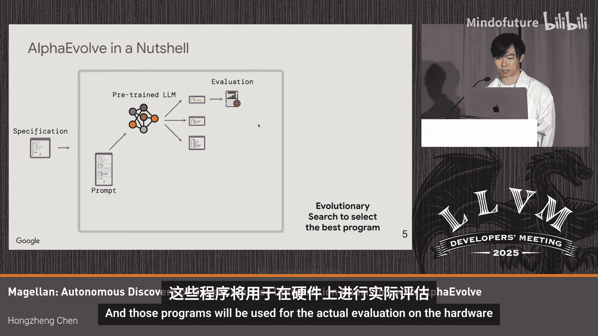

# 049：新型编译器优化的自主发现

在本教程中，我们将学习如何利用大型语言模型（LLM）自主发现新颖的编译器优化。我们将探讨Google团队提出的Magellan项目，该项目使用AlphaEvolve框架，在LLVM编译器中自动化地寻找和生成高效的优化启发式算法。

## 概述

作为性能与编译器工程师，我们每天都会遇到许多优化问题，其中大部分是NP难问题。传统上，我们通过编写启发式算法来解决这些问题，但这个过程既费力又复杂。如今，我们可以利用人工智能，特别是大型语言模型，来自动化这一过程。Magellan项目正是将AlphaEvolve框架集成到LLVM编译流程中，以实现编译器优化的自主发现。

## 核心流程：AlphaEvolve框架

上一节我们介绍了利用AI进行编译器优化的动机，本节中我们来看看其核心实现框架AlphaEvolve。

AlphaEvolve是一个由Google DeepMind提出的通用代码生成智能体框架。其工作流程是一个迭代过程：

1.  **问题描述输入**：首先，将待优化问题的文本描述作为提示词输入给预训练的大型语言模型。
2.  **程序生成**：语言模型根据提示生成候选的优化程序（例如，一个编译器Pass）。
3.  **实际评估**：生成的程序在真实硬件上被编译和运行，以评估其性能。
4.  **结果反馈**：评估结果（如性能得分）和程序本身被存入程序数据库。
5.  **进化搜索**：在下一轮迭代中，AlphaEvolve使用进化算法从程序数据库中筛选出表现最佳的程序，并将其上下文信息附加到新的提示词中，再次输入给语言模型。

经过多轮迭代，最终可以得到性能最优的程序。

## 集成到LLVM编译流程

了解了AlphaEvolve的基本原理后，我们来看它是如何具体集成到LLVM编译器中，形成一个自动化优化发现循环的。

以下是集成后的完整流程，每一步都紧密衔接：

1.  **新策略提议**：AlphaEvolve在每次迭代中提出一个新的优化策略（程序）。
2.  **集成到LLVM**：将该新策略（即一个编译器Pass）放入LLVM的`lib/`文件夹中。
3.  **构建新编译器**：用集成了新Pass的LLVM源码构建出一个新的Clang编译器。
4.  **编译基准测试**：使用新编译器编译一组基准测试程序，生成可执行文件。
5.  **性能评估**：在真实硬件上运行这些可执行文件，进行性能剖析和评估。
6.  **反馈闭环**：将性能得分作为奖励，连同编译日志和剖析结果一起反馈给AlphaEvolve。AlphaEvolve利用这些反馈和从程序数据库中采样的历史程序，为下一次迭代提出新的策略。

## 实验与应用案例

在将框架成功集成后，研究团队将其应用于多个具体的编译器优化问题。以下是几个关键实验及其结果。

### 案例一：函数内联优化（用于代码大小缩减）

这是MLGo项目先前用神经网络解决过的试点问题，被选作AlphaEvolve的首个基准测试。实验分为两种设置：

*   **设置A：基于预定义特征的局部启发式**
    *   **输入**：与MLGo神经网络模型相同的预定义特征集。
    *   **输出**：一个布尔值，决定函数是否应该内联。
    *   **结果**：从一个简单的初始策略（拒绝所有内联）开始，经过两天迭代，生成的策略比上游LLVM的启发式算法实现了超过4%的代码大小缩减。

*   **设置B：基于任意LLVM API的完整启发式**
    *   **输入**：只有LLVM中间表示（IR）。
    *   **输出**：AlphaEvolve需要实现完整的函数来决定内联与否。
    *   **关键设计**：将正确性检查与实际实现分离，确保生成的程序总是正确的。
    *   **结果**：虽然需要更多的试错，但在1.5天内达到了比设置A更好的结果。生成的代码已是可读的C++代码，长度仅为上游启发式代码的1/15，并能达到相似的优化效果。

此外，生成的策略展现了良好的泛化能力：
*   **时间泛化**：在不同时间点的代码库上评估，性能依然稳健。
*   **应用泛化**：将同一优化策略应用于其他内部基准测试，平均能实现超过8%的代码大小缩减，与之前的神经网络模型水平相当。

AlphaEvolve不仅复现了人工发现的特征，还自主发现了一些新的或简化了的特征，例如基于指令吞吐量的加权指令计数，以及对函数接口中指针类型转换的惩罚项。

### 案例二：其他LLVM性能优化问题

除了代码大小优化，团队还将该方法应用于更具挑战性的性能优化问题。

*   **`-ffast-math`性能优化**：在Clang的`-ffast-math`标志相关优化中，AlphaEvolve从一个最初导致性能倒退的启发式开始，最终自动找到了一个与人工编写启发式性能相当的策略。
*   **寄存器分配优先级队列**：让AlphaEvolve为寄存器分配问题的优先级队列生成启发式。在搜索引擎应用上进行端到端评估后，它发现了一个简单的启发式，其性能与人工编写的版本持平。

### 案例三：扩展到MLIR优化问题

团队还将此方法从LLVM扩展到MLIR领域，评估了两个代表性问题：

*   **图重写（Graph Rewrite）**：基于Google今年在MLIR会议上发表的`EqualityGraph`数据结构工作，让AlphaEvolve为其提出`Yield`指令的启发式。最终发现的启发式效率远高于人工版本。
*   **自动分片（Auto Sharding）**：在Google举办的SPU 2025竞赛问题上进行评估。AlphaEvolve生成的解决方案在20支参赛队伍中取得了约第4名的成绩。

## 优势、挑战与未来方向

通过上述实验，我们总结了该方法的优势、面临的挑战以及未来的发展方向。

**优势：**
*   **提升生产力**：自动化了费力的启发式算法设计过程，编译器工程师无需手动调整模型。
*   **采样效率高**：通常只需数百次样本评估即可逼近最优启发式。
*   **生成可集成代码**：直接生成人类可读、可修改、可调试的C++代码，易于集成到生产环境。

**挑战：**
*   **性能上限与收敛性**：目前尚不清楚AlphaEvolve最终是否能收敛到全局最优解，以及能否在所有类型的编译器优化启发式上超越人类专家。

**未来方向：**
*   尝试更多技术以突破性能边界。
*   尝试解决“绿地问题”，即训练数据中未曾出现过的新颖优化问题。
*   致力于基于开源大型语言模型和AlphaEvolve框架实现开源版本。

## 总结

本节课中我们一起学习了如何利用AlphaEvolve框架和大型语言模型实现编译器优化的自主发现。我们探讨了其核心流程、在LLVM中的集成方法，并通过函数内联、性能优化和MLIR优化等多个案例看到了其有效性和潜力。这种方法显著提升了优化探索的效率，并能生成可直接用于生产的代码，为编译器优化领域开辟了新的自动化途径。