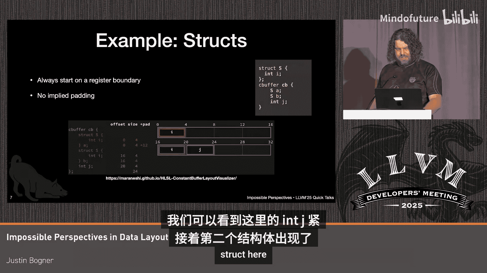

# 050：数据布局中的不可能视角

在本节课中，我们将要学习LLVM中数据布局的描述方式，特别是如何处理那些无法通过标准对齐和大小规则来描述的复杂内存布局。我们将探讨当前方法的局限性，并介绍一种潜在的解决方案：引入显式的填充类型。

大家好，我是Justin Bogner，我在微软工作。我们目前正致力于将HLSL语言引入Clang和LLVM。今天我们将讨论数据布局，即我们如何描述数据在内存中的排布方式。

LLVM中用于此目的的主要工具是一个称为**数据布局字符串**或**数据布局规范**的东西。它基本上描述了各种类型的大小和对齐方式，例如指针大小等。通过这种方式描述的对齐约束，以及关于对象大小的隐式或显式规则，我们或多或少可以推算出数据将如何布局。

然而，有些情况无法通过这种方式解决。因此，我们必须在那些情况下使用显式填充。

例如，假设你有一个像 `alignas` 这样的关键字，结构体中的第二个 `int` 以某种奇怪的方式对齐。那么它如何被降低表示呢？我们只是在元素之间插入这种 `i8` 数组作为填充。我们最终还会在末尾添加填充，这使得这些结构体在容器等场景中表现良好。

现在，让我们稍微离题，谈谈HLSL中的构造，这也是我们正在做这些工作的动机。

HLSL有一个叫做**常量缓冲区**的东西。它源于许多旧的、遗留的设计思想，与早期GPU相关。但你可以将常量缓冲区想象为一组16字节的寄存器，附带一系列打包规则。对于整数、小向量和浮点数（标量和小向量），它们会尽可能紧密地打包在一起。

例如，这里有一个浮点数，后面跟着一个三元素浮点向量，它们会被打包到同一行或同一个寄存器中。然后这里有一个三元素浮点数，它在另一个寄存器中。接着是一个二元素向量，它放不下了，所以进入下一个寄存器。因此，这些数据会尽可能打包，但它们会尽量避免跨越这些寄存器边界。

另一方面，**结构体**总是从一个寄存器边界开始。所以即使它很小，即使后面有空间，也不会在它后面打包另一个结构体，它总是从一个寄存器边界开始。但我们仍然可以像之前一样，在它后面自由地打包标量。我们可以看到这里的 `j` 就紧跟在第二个结构体后面。

数组变得有点奇怪，因为在数组中，我们希望每个元素都独占自己的寄存器。所以它实际上会把数组拆开，在所有元素之间插入填充。但关键且让这些布局变得棘手的是，我们仍然可以在数组之后将其他数据打包到同一行中，所以那个 `float` 就放在里面。

因此，我们在元素之间有填充，但在数组之后没有填充。回想一下之前的 `alignas` 例子，它们是在元素之后添加填充，所以我们不能做完全相同的事情。但我们采用了相同的基本思路，即使用显式填充，只是我们必须使用一些非常扭曲的类型来实现。我不会展示这些类型的样子，它们非常丑陋。

现在，让我们谈谈如何识别那些显式填充。如果我们只有一个 `i8` 数组，这实际上可能非常模糊，因为你无法判断这到底是一个实际的字符串还是填充。在大多数CPU后端，这不太重要，因为我们根本无法访问它，可能没问题。但在DirectX和SPIR-V后端，我们实际上需要能够为元数据与驱动程序的通信等目的重现原始类型。在SPIR-V中，类型甚至编码了访问的逻辑索引和偏移量，因此我们需要能够获取这两者并跳过填充。

我们在这里所做的是，实际上创建了一个目标扩展类型，即显式填充类型。这是一个目标扩展类型，用于声明“这是填充，它这么大”。这在很大程度上是可行的，但有点尴尬，因为你需要为你支持的每个目标使用不同的目标扩展类型，但大体上可以应付。

但我认为，有理由在LLVM中引入一种更“一等公民”的显式填充类型。问题是，我们是否应该有一个 `pad8` 类型？这本质上将是 `i8` 的别名，但明确表示这是“填充”。这可以在几个地方使用：

*   **完全控制布局**：例如，当你使用 `alignas` 或类似Vulkan属性 `[[vk::offset]]` 时，你可以完全控制数据最终的位置。
*   **聚合体的标量替换**：在分解聚合体并提取其部分时，这些信息很有用，可以表明“这部分不重要”。对整个结构体的 `memcpy` 等同于复制每个成员，而你可以直接跳过填充部分。
*   **变换验证**：在像Alive这样的工具中，当你试图判断两段IR是否在语义上完全等同时，拥有“这是填充，从中读取是poison”的信息会很有用。因此，我们可以直接跳过它，或者判断对整个结构的复制与对各个部分的复制是等价的。
*   **其他用途**：在定义影子内存的消毒工具中，或者只是声明某个访问是非法的，也可能有其他用途。

我在这里想听听其他人的意见，关于你们认为这在其他哪些地方可能有用。这是我们应当推进的事情吗？我是否应该提交一个提案，将这个类型添加到LLVM？它是否具有普遍用途，能让我们清理目标布局相关的东西？还是我们应该只待在自己的沙盒里，保持现状也不错？

以上就是我今天的全部内容，非常感谢大家。

**本节课总结**

本节课我们一起学习了LLVM中描述数据布局的机制。我们首先回顾了标准的数据布局字符串如何描述类型大小和对齐。接着，我们探讨了HLSL常量缓冲区等复杂场景中，标准规则无法描述的布局问题，这需要通过显式填充来解决。然后，我们分析了当前使用目标扩展类型来表示填充的局限性。最后，我们讨论了一个潜在的通用解决方案：在LLVM中引入一个一等公民的显式填充类型（如 `pad8`），并探讨了其在布局控制、优化变换和验证等多个方面的潜在应用价值。