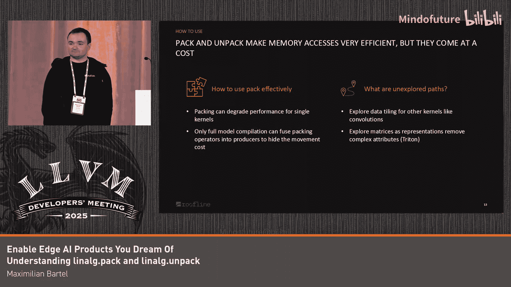

# 052：理解linalg.pack和linalg.unpack

在本节课程中，我们将学习MLIR中`linalg.pack`和`linalg.unpack`操作的核心概念、工作原理及其在性能优化中的应用。我们将通过简单的例子解释它们如何通过数据重排来提升内存访问效率。

## 概述：为何需要Pack/Unpack操作？🚀

首先，我们通过一个例子来说明这些操作的价值。考虑一个非常著名的分块矩阵乘法算法。

在第一次迭代中，我们使用红色值来计算蓝色值的部分结果。在第二次迭代中，我们使用绿色值来获得完整结果。

观察其内存布局，情况看起来并不算太差。一些值彼此靠近，我们可以从中获得一定的局部性。缓存表现尚可。这是一个被广泛研究和熟知的算法。

然而，仔细观察，其中仍然存在一些不足。例如，红色值在内存中并非全部相邻。

## 打包布局的优势📦

在打包布局中，我们主动改变内存中的值排列。这样，我们就能始终进行连续的加载操作。

这是同一个矩阵乘法，但经过了一些重排。现在，红色值在内存中彼此相邻，我们可以高效地加载它们。同样，绿色值也彼此靠近。

在右侧的下一次迭代中，可以看到非常连续的浮点数。通过这样的算法，我们获得了极佳的缓存局部性。

这种布局被称为PE布局，而实现这种布局的算法通常被称为数据分块，正如我的同事Iga之前提到的。

## Pack/Unpack操作的核心机制🔧

为了理解`pack`和`unpack`，需要将二维张量重新组织为四维张量。在我的思维模型中，我首先对张量应用一个视图。从一个逻辑上的二维张量开始，然后应用四维索引，就像你看到的红、绿、蓝、橙色块一样。

到目前为止，我们还没有改变任何内存布局，这只是改变了索引方式。

打包布局则获取这种索引方式，并将其实际体现在内存维度中。这里有一个简化的示意图，现在我们拥有四个维度而不是两个。当然，这些数据移动并非没有代价，我稍后会讨论如何分摊这些成本。

## Pack操作示例📐

让我们看几个`pack`和`unpack`操作的例子。这里有一个`pack`操作。

它的一项功能是将分块大小填充到特定尺寸，例如，为了在GPU上使用张量核心。这是通过一个名为`pad`的参数来实现的。

这里，输入张量是3x1，而内部分块大小是5x2。该操作会在维度之间进行填充。可以看到，红、绿、蓝值现在并非彼此相邻，而是被分开了。

## Unpack操作示例📤

既然我们可以创建这样一个填充后的张量，自然也有其逆操作，即将填充后的张量解包回原始状态。

这里，输入尺寸是1x1x2x3，输出尺寸是1x2。

内部高阶尺寸在某种程度上反映了输入尺寸。`unpack`操作会检查结果中的元素数量是否小于输入张量的元素数量，然后对输入的一个子集进行切片提取，而不是使用完整的维度。

## 动态形状支持🔄

这些操作也支持动态形状。这里是一个`unpack`操作示例。输入是动态的，输出也是动态的。

现在，内部分块尺寸有`tile_h`和`tile_w`参数。看起来像是属性的一部分，但实际上不是，这只是为了打印美观。它们是操作的参数。

降低此操作时，代码中会出现一系列张量维度操作。首先，创建一个空的张量。然后转置值，折叠形状。接着，因为需要能够进行填充的逆操作，必须获取输出张量的维度，然后按输出大小进行切片提取。

最后，使用`linalg.copy`将结果复制出来。

`linalg.pack`操作同样完全支持动态形状。

## 实现细节与观察🔍

在准备这些幻灯片时，我注意到一个有趣的现象：`linalg.pack`操作本身并不直接降低。但`linalg.unpack`可以。查看代码，会发现一条大约两年前的注释，指出`insert_slice`和`extract_slice`操作功能不够强大，不支持动态形状。但现在它们已经支持了。我认为只是目前还没有人需要直接降低`pack`操作。

## 单位维度的挑战⚡️

`pack`操作的一个主要痛点出现在处理单位维度时。单位维度是指大小为1的维度。在生成打包布局后，对外部维度应用分块时，最终外部维度经常会是1。

有几个模式会对单位维度进行特殊处理，因为它们经常出现在代码中。棘手之处在于，大小为1的维度是一个特殊情况，它不执行任何操作，但又必须考虑它。这里经常出现很多错误，不过我认为现在大部分问题都已解决。

观察这个操作本身，它实际上除了改变张量的视图外什么也没做，四个元素仍然存在，每个维度的大小都是1。然而，我们有一个需要在上游修复的测试用例或操作，并为此编写了测试。

现在，也可以在单位维度之间拥有非单位维度，并得到特殊处理。J在几周前实现了这个功能，非常方便。

## 性能收益📈

如果我们能利用数据布局并分摊内存移动的成本，就能获得显著的加速。需要说明的是，这是在Ega用于基准测试的Arm Neon指令集上测试的。

朴素的分块矩阵乘法已经相当快了。但当我们能够分摊数据移动的成本时，就能获得前所未有的速度提升。延迟降低范围从7.66%到惊人的92%。

## 有效使用指南🎯

如何有效使用这些操作？如果只有一个独立的计算内核，大多数情况下，切换到打包布局可能看不到性能提升。

要看到性能提升，需要转向像AI编译器这样的框架，能够将打包操作与生产者操作融合，从而隐藏与数据重排和内存移动相关的延迟。例如，我们使用IREE作为底层支持，它可以从中获得非常出色的性能。

## 未来方向与总结💡

目前还有哪些未探索的路径？回顾基准测试，大部分是计算密集型工作负载。我们也非常关注卷积，卷积的数据分块是我们目前尚未探索的领域，时间有限。

另一件事是关于`linalg.pack`和`linalg.unpack`操作的设计。它是基于属性的。如果看看其他项目，比如Triton，它们使用矩阵来表示这种内存重排。在我看来，那种方法比我们基于属性的方法优雅得多。如果我们探索类似的方法，或许可以自动将其应用于像`linalg.generic`这样的操作，然后用它来创建`linalg.pack`和`linalg.unpack`操作。这样，就可以用一个矩阵来表示你的内存层次结构，并自动将其应用于通用操作，这将非常棒。

本节课中，我们一起学习了`linalg.pack`和`linalg.unpack`操作如何通过改变数据布局来优化内存访问模式，从而提升计算性能。我们了解了它们的基本用法、对动态形状的支持、处理单位维度的挑战，以及在实际应用中分摊数据移动成本以获得性能收益的关键。

