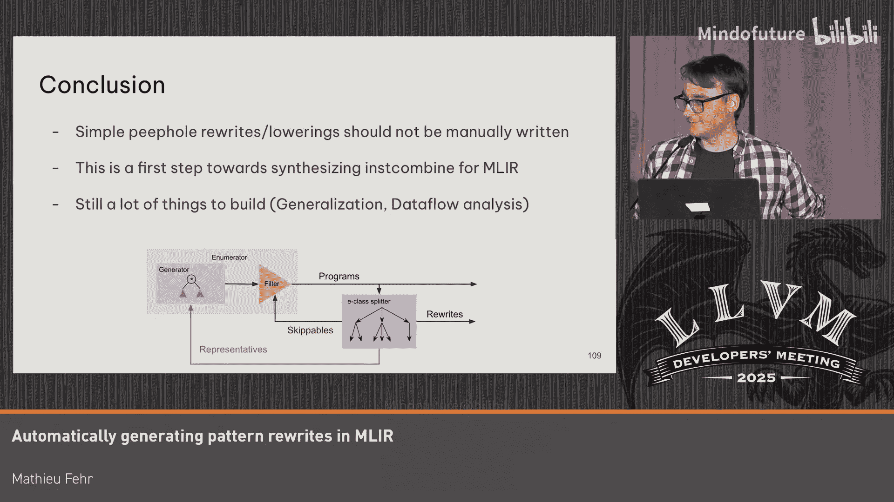

# 053：自动生成重写与降级模式 🧠

在本教程中，我们将探讨如何为 MLIR 中的不同方言自动生成重写和降级模式。MLIR 承诺提供共享抽象，允许你为特定领域编写编译器，并定义一次优化，即可在多个管道中复用。然而，现实是存在许多语义各异的算术方言，导致需要为每个方言重复实现优化，这既容易出错又耗费人力。我们将介绍一种利用计算能力而非人力的方法，通过合成工具自动生成这些模式。

## 问题背景：为何存在众多算术方言？

上一节我们提到了 MLIR 的共享抽象愿景。本节中，我们来看看为何在实践中，MLIR 生态系统中存在如此多不同的算术方言。

这些方言虽然都涉及算术运算，但在语义上存在重大差异：
*   **毒值语义**：某些方言（如受 LLVM 影响的）引入了毒值概念，例如除以零或溢出可能产生任意结果，以便进行激进优化。
*   **多值逻辑**：某些方言（如硬件相关方言）支持三值或九值逻辑。
*   **除法定义**：对于除法的行为，有些是已定义的，有些则未定义。
*   **溢出处理**：有些方言设计上不允许溢出，有些则可以。
*   **位宽成本**：在某些上下文中（如硬件或 LLVM），增加整数的位宽成本可能很低或很高。

这些语义差异直接导致了优化规则的不同：
*   **结合律**：大多数方言支持，但 `arith` 方言如果设置了 `NSW`（无符号溢出）标志，则可能不支持。
*   **乘幂转换**：大多数方言可以将乘以 2 的幂转换为移位操作，但在 `index` 方言中，由于位宽未知，这可能产生毒值。
*   **乘除抵消**：在不允许溢出的方言中，`(x * c) / c` 可以简化为 `x`；但在允许溢出的方言中，此优化不成立。

因此，为每个方言手动实现一套完整的优化（如指令合并）不仅工作量大，而且容易出错和遗漏。

## 解决方案愿景：自动合成模式

面对为众多方言手动编写优化规则的挑战，我们提出一个愿景：能否自动合成或生成每个方言的指令合并等价物？我们能否用计算能力替代人力？

为了实现这个愿景，我们构建并正在改进三款工具：
1.  **重写合成器**：输入方言描述，自动生成一组重写规则。为了保证可行性，需要设置模式左侧和右侧操作的最大数量限制，并可能限制常量集（如仅 0 和 1）。
2.  **降级合成器**：给定源方言和目标方言，自动生成降级规则。例如，将 `shift_right` 从 `SMT` 方言降级到 `arith` 方言时，需要处理移位量的边界检查，以避免引入毒值。
3.  **超级优化器**：给定一个输入程序（使用特定方言）和该方言的描述，找出可以应用于该程序的所有重写规则。例如，将 `x * 2` 重写为 `x << 1`。

## 核心技术：枚举合成

我们使用**枚举合成**技术来实现上述工具。其核心思想很简单：给定一个规范（例如 `2 * x`），枚举所有不超过特定大小的程序，然后逐一测试它们是否在语义上等价。

一个可用的枚举合成系统需要三个核心组件：
1.  **枚举器**：用于生成 MLIR 程序。
2.  **成本模型**：用于筛选出比原始程序更优的候选程序。
3.  **等价性检查器**：用于判断两个程序是否语义等价。

### 等价性检查器

我们使用 SMT 求解器（如 Z3）来构建等价性检查器。具体方法是，将两个 MLIR 程序编译到 SMT 方言，添加必要的粘合代码，然后交给 SMT 求解器判断它们对于所有输入是否产生相同输出。

### 通用枚举器

我们希望构建一个能枚举任意 MLIR 方言程序的通用枚举器，而不是为每个方言重写。我们利用 **Guided Tree Search** 库来实现。

以下是生成程序的基本思路：
1.  为给定结果类型选择一个操作。
2.  选择该操作所需操作数的数量。
3.  为每个操作数递归地选择其类型，直到达到所需的操作数量。

为了确保生成合法的程序（例如，`add` 操作的操作数类型必须匹配），我们利用 MLIR 的 `IR` 方言来获取操作的元信息（操作数数量、类型约束等），从而指导枚举器生成有效的程序。

结合枚举器和等价性检查器，我们就可以执行枚举合成。这对于前两个工具（重写和降级合成器）是直接可用的。对于超级优化器，我们寻找与输入程序等价的程序（对于优化）或“精化”程序（对于降级，确保不引入未定义行为）。

## 核心算法：高效生成所有重写

我们承诺能生成特定大小范围内的**所有**重写规则。一个朴素的方法是枚举所有左侧程序，并为每个左侧程序枚举所有右侧程序。但对于 3 个操作的程序，约有 1000 万种可能，这意味着需要检查 100 万亿个候选对，这是不可行的。

关键在于，许多候选程序是冗余的。例如，`x + 0` 和 `0 + x` 都可以简化为 `x`。我们可以利用这种冗余来大幅缩减搜索空间。

以下是高效生成所有重写的算法步骤：

1.  **初始化**：从大小为 1 的程序开始枚举。
2.  **分类**：使用分类器找出所有等价的程序，形成等价类。
3.  **提取代表与可跳过模式**：
    *   从每个等价类中选出一个**代表**（通常是最简单、操作数最少的程序）。
    *   将类中其他程序标记为**可跳过**，因为它们在任何上下文中都可以被其代表替换。
    *   这些“代表 -> 可跳过”的关系本身就是重写规则。
4.  **迭代枚举**：在枚举更大尺寸的程序时，只使用当前尺寸的“代表”程序作为子表达式来构建新程序。同时，利用已积累的“可跳过”模式库，在生成时直接过滤掉包含这些低效子模式的程序。
5.  **使用 PDL 加速过滤**：为了高效地检查一个程序是否包含任何“可跳过”模式，我们将这些模式编译到 MLIR 的 **PDL 方言** 中。PDL 可以将大量模式编译成一个高效的状态机，使得检查复杂度与最大模式大小呈线性关系，而非模式总数，从而极大提升速度。

通过这种迭代的、利用已知等价信息来引导后续枚举的方法，我们可以将搜索空间减少几个数量级，使得生成所有重写在计算上变得可行。

## 实践评估与结果

我们以 MLIR 中的 **SMT 方言**（约 30 个操作）为例进行实验，并允许使用常量 `true`, `false`, `0`, `1`。

以下是生成不同大小重写的结果：

*   **大小 1**：共 372 个程序。我们生成了 100% 的重写，但只有 20% 的程序是“代表”（即最优形式），80% 的程序可被重写。同时提取出 115 个“可跳过”模式。整个过程约 1 秒。
*   **大小 2**：利用大小 1 的“可跳过”模式，我们仅需枚举原计划 16% 的程序，过滤后仅需处理 8.9%。最终只有 4.5% 的程序是“代表”，并发现了约 1000 个新的“可跳过”模式。总耗时不到 1 分钟。
*   **大小 3**：原始有 1400 万个程序。我们的算法仅需处理其中的 1.8%。最终 1.3% 为“代表”，并发现了约 43，000 个“可跳过”模式（即重写规则）。在 M2 MacBook 上耗时约 10 小时。

这些“可跳过”模式库也能加速超级优化和降级合成，通常有 3-5 倍的性能提升。

对于 `arith` 方言，由于其语义更复杂（涉及毒值），等价性检查更慢，生成时间比 SMT 方言长得多。

在**降级合成**方面，我们尝试为 SMT 到 `arith` 的 34 种操作（及不同类型）生成降级规则。大多数单操作降级可在 1 分钟内找到，双操作降级需要 2-10 分钟。我们还发现了一些需要 3 个甚至更多操作才能完成的降级案例。

## 总结与展望

本节课中，我们一起学习了如何利用枚举合成技术，为 MLIR 中的不同方言自动生成重写和降级模式。我们介绍了三款工具：重写合成器、降级合成器和超级优化器，并深入讲解了其核心算法——通过迭代分类和利用“代表/可跳过”模式来高效枚举所有可能的重写。

目前这些工具已能工作，但生成时间仍有优化空间。我们认为，对于简单的、重复性的重写和降级规则，不应再手动编写，而应使用合成工具自动生成。这是迈向在 MLIR 中大规模自动生成优化规则的第一步。

未来的工作包括：
*   改进运行时性能。
*   开发**泛化算法**，以便从具体的重写实例推导出更通用的规则。
*   集成**数据流分析**，以支持更强大、上下文相关的重写规则。

通过自动化这些模式生成过程，我们可以提高编译器开发的效率与可靠性，并确保不同方言间优化规则的一致性。

---

**问答环节要点**

*   **测试生成**：有观众询问该工具是否可用于生成测试用例。演讲者确认，他们已使用枚举器和检查器来测试 `arith` 方言，并发现了测试套件中的 4-5 个错误。方法是枚举所有大小不超过 2 的程序，并检查它们是否被正确优化。