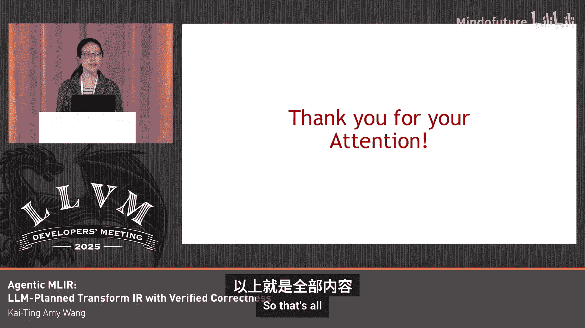

# 054：基于MLIR的面向多面体引擎的LLM调度原语生成器

## 概述

在本教程中，我们将学习一个基于MLIR和LLM的自动化代码优化系统。该系统旨在利用大型语言模型为多面体编译器生成有效的调度策略，从而替代或辅助经验丰富的性能工程师。我们将首先回顾其基础——一个名为Pomorphous的基于MLIR的、由变换驱动的多面体编译器，然后深入探讨如何集成LLM来自动生成正确的MLIR变换方言代码。

## 1：背景与基础工作

本节我们将介绍本项工作的基础——Pomorphous编译器。理解其工作原理是理解后续LLM集成部分的关键。

这项工作是Robert Jin Man、Aan和Xin Yu的合作成果。本次演讲建立在先前一项名为Pomorphous的、基于MLIR的、由变换驱动的多面体编译器工作之上。

先前工作的高级理念是：由专家用户（例如性能工程师）向Pomorphous工具提供一个计算内核以及一些变换策略。该工具会在计算内核的上下文中验证这些变换，以检查是否存在任何依赖违规。如果用户提供的变换序列是合法的，工具将继续应用变换并相应地生成代码。如果变换序列是非法的，工具会尝试修复违规，同时尽可能保留用户的策略。

以下是一个使用PDL（Pomorphous的前端）编写的Polly基准测试`andVT`内核的简单示例。如果您昨天参加了我的演讲，就会知道PDL可以生成MLIR。

用户希望应用于内核源代码的变换策略在`MVT_schedule`方法中描述。在该方法中，首先匹配两个目标嵌套的`for`循环，用户希望先应用分块，然后融合，接着以`32, 32`进行分块，之后重新排序两个内层点循环，并并行化最外层的分块循环。

这个`MVT_schedule`展示了变换序列的可组合性及其与内核代码的分离。这是利用MLIR变换方言基础设施的主要优势。然而，一个关键区别是，这里的调度实际上并不转换有效载荷IR。相反，它会为后续的验证过程记录每个变换操作对应的变换矩阵。

整个代码库已通过PDS网站开源。

## 2：验证过程与多面体概念回顾

上一节我们介绍了Pomorphous的基本流程，本节中我们来看看其核心的验证过程。为了阐明Pomorphous如何最大限度地利用MLIR的现有基础设施，我们先快速回顾一些多面体概念。

多面体调度函数在语句级别表达。这里，语句S依赖于语句R。`Cta(S)`描述了执行时间戳，即每个S实例运行的时间，`Cta(R)`同理。

调度函数具有如下所示的格式，其中矩阵C中的系数允许我们在可能时通过倾斜或平移来纠正非法的变换。并且需要`Farca Lambda`来线性地构造约束。

那个复杂方程中的D描述了依赖多面体。

为了在需要纠正调度时找到正确的平移或倾斜值，我们通过利用MLIR中可用的Presburger集合求解器来求解方程组，以找到矩阵C中的系数。

## 3：利用MLIR构建依赖多面体

在初步了解之后，让我们深入探讨如何利用MLIR。本节将展示如何利用MLIR的分析基础设施轻松构建依赖多面体。

这张幻灯片演示了一个简单的内核，并利用操作1（对`A[3]`的加载）和操作2（对`A[3]`的存储）之间的读后写依赖关系，来展示我们如何轻松构建依赖多面体。

我们通过编写一小段代码来调用MLIR中针对这对内存访问操作的`checkMemrefAccessDependence`方法，从而利用MLIR的分析基础设施。

我们需要为`Uar`循环（层级0）、内层`arc5`循环（层级1）以及最后的公共循环层级（`+1`，即层级2）调用此方法三次。因此，构建了两个依赖多面体：一个在层级0，另一个在层级2。这得益于MLIR，得以精确且准确地完成。

## 4：转换为求解器输入格式

在调用MLIR的单纯形求解器之前，我们编写了一个`compute_farcus_rhs`方法。该方法将上一张幻灯片中看到的依赖多面体转换为二维整数矩阵表示，如最右侧所示。

矩阵的行代表循环迭代器和程序参数，列是`farcus`乘数。类似地，使用`fars_leftenci`计算，我们寻找的矩阵C的系数是二维整数矩阵的列，并且我们寻求字典序最小解。

将变换矩阵和依赖多面体转换为调用单纯形求解器之前的适当整数矩阵布局的代码大约有850行。总而言之，我们以极小的努力就能够构建一个完整的多面体验证器，再次感谢MLIR。

## 5：引入LLM生成调度策略

在初步成功后，我们的领导团队要求我们探索是否可以用LLM来为Pomorphous生成优化策略，以替代经验丰富的用户。此外，我们还希望了解LLM是否能生成语法正确的MLIR代码，以替代PDL这样的DSL。

因此，这是演讲的第二部分：一个生成式MLIR LLM规划与变换IR生成器。

这是这部分工作的高级设计。它包含一个路由器、几个代码生成代理，以及作为守护最终正确性大门的验证器Pomorphous。相当简单。再次强调，该系统的目标是为Pomorphous生成变换IR。现在，让我们首先深入了解路由器。

## 6：路由器设计

路由器本质上是一个检索增强生成数据库。它接收待优化的输入内核，将其分类为与其数据库中前K个参考程序最相似的程序。数据库中参考程序的优化策略由人类专家提供。

分类网络是一个简单的、经过预训练的CodeBERT MLP Softmax架构，使用LLM生成的代码和真实数据进行训练。

路由器或LLM将从数据库中获取关于如何优化某些参考程序的确定性知识，并将这些知识应用于优化当前的输入代码。这是LLM的非确定性部分。

路由器会生成关于如何优化输入内核的人类可读策略（如图所示），并且它也能沿着热图中的对角线相当好地对程序进行分类。

## 7：LLM生成MLIR代码与实验结果

路由器与协作的代码生成代理共同输出语法正确的MLIR代码。以下是生成的MLIR变换方言代码。

一些实验结果。是的，我翻页太快了，但无论如何，早期的实验结果表明，所有30个Polly基准测试都生成了代码并正确执行。这对LLM来说是一个鼓舞人心的好成绩。其中27个程序的运行时性能优于或等于仅使用GCC13 -O3编译的代码，14个程序的运行时性能优于或等于最初在Pomorphous论文中发布的人工编写的调度方案。

## 总结

本节课中我们一起学习了如何将基于MLIR的多面体编译器Pomorphous与大型语言模型相结合，构建一个自动化代码优化系统。我们回顾了Pomorphous如何利用MLIR基础设施进行依赖验证和调度纠正，并深入探讨了LLM如何通过检索增强生成和协作代理来生成有效的、语法正确的MLIR变换策略。初步实验表明，该系统能够为基准测试生成正确且往往更优的代码，展示了AI辅助高性能代码生成的潜力。

