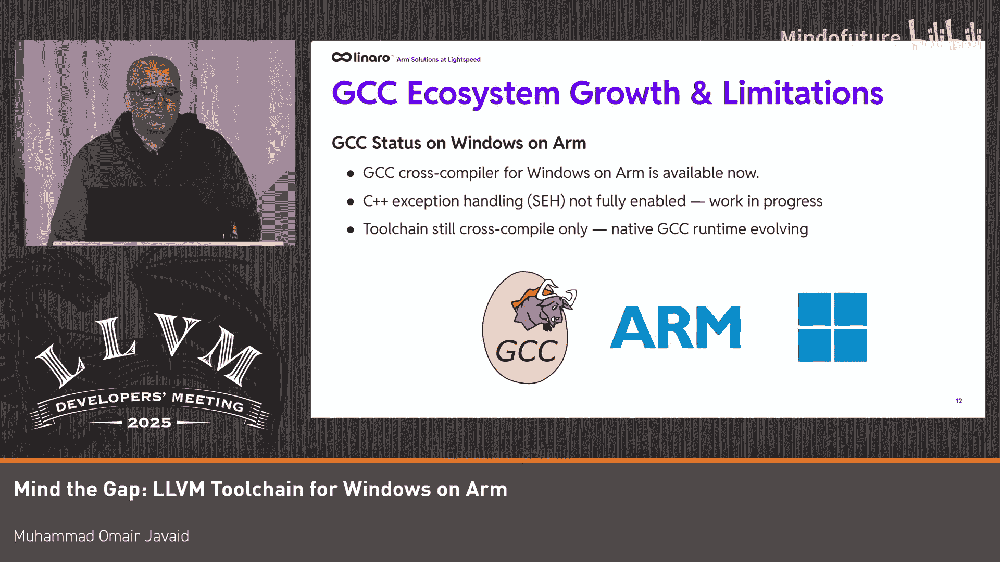

# 055：Windows平台上的LLVM工具链中缺失的关键功能

## 概述

在本节课中，我们将回顾LLVM工具链在Windows on Arm平台上的进展，并重点指出当前存在的一些关键功能差距。我们将从已实现的功能开始，然后深入探讨在调试器、链接器、编译器和其他工具方面仍需完善的地方。

## 已实现的功能

上一节我们介绍了课程的目标，本节中我们来看看LLVM工具链在Windows on Arm上已经取得的成就。

自LLVM 16版本以来，我们已经拥有了原生的LLVM工具链。其核心组件均能正常构建和运行，代码生成质量、运行时性能表现良好，并且获得了广泛采用。目前的目标是弥合最后的差距，使其在功能上与AArch64 Linux以及Windows x64的开发体验看齐。

以下是当前可用的主要组件列表：
*   **Clang/LLD**：能够生成原生的Arm64位二进制文件。
*   **Clang-cl**：提供与MSVC的命令行兼容性，以及整体的ABI兼容性。
*   **Flang**：Windows on Arm平台上的原生Fortran编译器，这是LLVM工具链的一个亮点，因为它是该平台上的首个Fortran编译器。
*   **LLDB调试器**：支持原生调试工作流。
*   **OpenMP**：已启用支持。
*   **MinGW工具链中的LLVM**：在GCC工具链尚未就绪的情况下，MinGW工具链目前使用LLVM作为支持。

## LLVM成为生态核心的原因

那么，LLVM是如何成为Windows on Arm生态系统支柱的呢？这主要得益于其共享的后端和前端设计。

*   **共享后端**：Arm64后端在Windows、Linux和macOS之间共享。针对x64平台已实现的代码视图（CodeView）和结构化异常处理（SEH）支持，大部分可直接复用。Windows on Arm主要需要处理大量ABI相关的工作，在修复一些问题后便已就绪。
*   **共享前端**：C++、Rust、Fortran、MLIR等语言的前端支持也是共享的。这使得这些语言的编译器能够为Windows on Arm平台提供支持，其中一些虽处于实验阶段，但如C、C++、Fortran、Rust等已在该平台上可用。

这种共享架构带来了显著的性能优势，并且在Windows on Arm上尤为重要，因为MSVC工具链缺少一些原生LLVM工具链具备的功能。

## 生态系统采用情况

接下来，我们看看LLVM在Windows on Arm生态系统中的实际应用。许多重要项目都在使用它。

例如，Python这一主要项目使用了Clang/LLVM库。同样，Chrome、Edge、Firefox等团队也广泛使用Windows on Arm编译器来为这些项目提供原生的Arm64 Windows二进制文件。

我们LLVM团队一直密切关注Windows on Arm生态系统，并建立了一个名为“Works on Windows on Arm”的网站，用于追踪不断增长的原生应用。如果你想了解哪些应用已原生支持该平台，可以参考这个网站。

## 性能表现

在性能方面，LLVM的表现非常出色。它不仅超越了模拟运行的性能（这是显而易见的），在SPEC2017基准测试以及各种实际工作负载（如编译时间对比）中也优于MSVC。

一个突出性能优势的项目是Blender，使用LLVM（Clang）相比MSVC带来了大约20-30%的性能提升。

至于Flang的性能，由于它是目前唯一的Fortran编译器，我们尚未在Windows on Arm上使用SPEC2017进行验证，但目前还没有用户提出相关投诉。

然而，需要指出的是，Windows平台（包括Arm）的整体开发体验速度相比Linux和macOS较慢。构建LLVM等项目时，NTFS文件系统开销或Windows进程创建开销会导致速度下降，对于需要生成大量目标文件的项目尤其如此。我们需要寻找新颖的方法来解决这些问题，例如探讨将Clang作为服务器使用的可能性，但这些想法尚未深入讨论。

## 关键功能差距：调试器 (LLDB)

现在，让我们进入核心部分，探讨需要投入时间解决的实际差距。我们发现了LLDB调试器存在最多的问题。

以下是已识别出的部分关键差距列表：
*   **Arm64EC不支持**：Arm64EC是微软开发的ABI，允许在同一二进制文件中混合x64模拟代码和Arm64原生代码，并可以来回跳转。LLDB目前不支持这种混合模式调试。此外，如果一个二进制文件使用了x64模拟，原生LLDB目前也无法调试它。
*   **Armv9功能缺失**：虽然目前市面上还没有搭载Armv9的Windows on Arm笔记本电脑，但云服务器硬件和QEMU模拟器已支持所有Armv9功能。LLDB目前缺少SVE/SME寄存器可见性支持。
*   **硬件观察点限制**：硬件观察点虽受支持，但由于Windows内核的限制，目前只能设置一个。我们已向微软报告此问题，他们正在尝试修复。同样，硬件断点也存在来自Windows内核的限制，需要底层修复后才能在LLDB中实现。
*   **DAP体验不稳定**：DAP是LLDB的一个组件，允许其与VS Code等IDE通信。目前上游LLDB中的DAP体验非常不稳定，我们因此禁用了许多相关测试。可能存在一些下游公司的补丁，但上游版本问题较多。
*   **功能对比缺失**：与Linux或macOS版本相比，LLDB在Windows上缺少许多功能。
*   **PDB调试体验**：LLDB需要设置PDB读取器插件（微软PDB读取器或原生PDB读取器）。虽然近期有一个PR修复了使用原生PDB读取器时失败的测试，但整体调试体验仍有差距。例如，使用MSVC可以进行“编辑并继续”，但使用LLDB（即使配合VS Code）则无法实现。此外，Clang生成的PDB调试信息有时会省略变量或将它们标记为已优化，这在用LLDB或MSVC调试器调试时都会出现问题。我们需要在Windows平台（特别是Windows on Arm）上对PDB调试体验进行大量测试和检查。

## 关键功能差距：其他工具

除了调试器，其他工具也存在一些差距。

**LLD链接器**：
*   与LLDB类似，LLD也不支持链接Arm64EC代码。这意味着你可以使用Clang编译Arm64EC代码，但无法用LLD进行链接，必须使用微软链接器。原因是链接Arm64EC二进制文件所需的某些信息未公开，这限制了我们实现LLD支持。我们一直在与微软沟通，但不确定相关信息是否会很快公开。
*   **LTO（链接时优化）**：我们尚未充分验证在Windows on Arm平台上使用LLD进行链接时优化的能力。如果有人有相关信息或发现缺失环节，请与我们分享。

**Flang编译器**：
*   Flang为Windows on Arm提供了Fortran编译器，但仍存在一些障碍。例如，它不支持类似MSVC风格的命令行驱动程序（像`clang-cl`为C/C++所做的那样）。这意味着在混合使用Flang和MSVC链接器或需要复杂构建系统的项目中，集成Flang会面临问题，这也是我们未能在Windows上成功运行Flang的SPEC2017基准测试的原因之一。我们需要找到方法为Flang启用Windows上的命令行兼容性。

**其他**：
*   **Sanitizers（消毒剂）**：目前不支持Sanitizers（如ASan、UBSan等）。我们知道这个问题已有几年，但每当开始着手修复时，优先级总会发生变化。我们希望在未来支持该功能的LLVM版本中将其加入。

## 未来工作：Armv9启用

展望未来，Armv9的启用是重点。我们知道在未来6-18个月内，将有更多搭载Armv8.3+或Armv9功能（如SME、MTE）的硬件出现在Windows平台。LLVM已经支持大部分这些功能（主要在Arm Linux上）。我们需要等待Windows内核提供支持以及硬件上市，然后进行测试并修复剩余问题。

## 测试、CI与发布

在测试和持续集成方面，我们运行着多个构建机器人（bot）：
*   用于测试Flang的单阶段构建bot。
*   用于测试Flang/OpenMP编译器组合的bot。
*   LLDB测试bot。
*   一个不太稳定的两阶段构建bot（运行在Surface Pro平板电脑上，硬件不太适合此类测试）。

最近，我们成功在Windows on Arm上启用了LNT和LLVM测试套件，并有一个暂存bot在运行相关测试。我们计划与合作伙伴共同努力，修复目前尚不支持的其他测试（如GFortran测试、单源/多源测试）。

关于发布，我们自LLVM 16起就开始制作Windows on Arm版本，并使用上游脚本。我们改进了脚本以支持该平台，最近还添加了基于PGO的版本。几个月前，GitHub Actions提供了原生的Windows on Arm运行器，我们计划很快将发布流程迁移过去。

至于SVE测试和验证，我们拥有支持Armv9的Azure云硬件，但资源有限，尚未能测试SVE验证工具是否能在该云基础设施上工作。

## 生态系统增长：GCC支持

生态系统增长对我们至关重要。最近，GCC实现了对Windows on Arm的支持（尽管仍处于早期交叉编译阶段，C++支持因结构化异常处理补丁仍在进行中而缺失）。这解锁了构建Git等依赖GCC的应用的能力，并有望帮助我们运行多源/单源测试以及GFortran测试。

## 总结

本节课中，我们一起学习了LLVM工具链在Windows on Arm平台上的现状。我们回顾了已取得的显著进展和广泛采用，也深入探讨了在LLDB调试器（如Arm64EC、Armv9支持）、LLD链接器、Flang编译器以及Sanitizers等方面存在的关键功能差距。此外，我们还了解了未来的工作重点（如Armv9启用）、当前的测试CI基础设施以及生态系统的最新发展（如GCC支持）。解决这些差距需要社区和合作伙伴的共同努力，以进一步完善Windows on Arm平台上的LLVM开发体验。