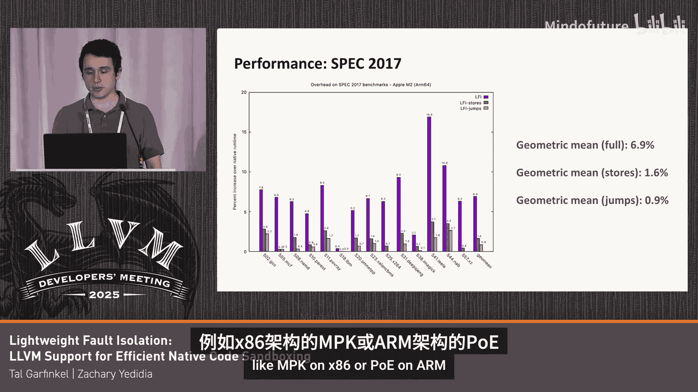

# 057：LLVM对高效沙盒化的支持

## 概述

在本节课中，我们将要学习一种名为“轻量级故障隔离”的新特性。这是一种用于进程内隔离的新功能，其RFC已获批准，我们正致力于将其引入LLVM。这项技术旨在为那些我们对其内存安全性存疑的代码（无论是第三方还是第一方原生代码）提供高效的进程内隔离。

## 引言：内存安全的挑战与现有方案

上一节我们介绍了LFI的概述，本节中我们来看看它要解决的核心问题。如今，内存安全是一个公认的重大挑战，我们需要更好的工具来应对它。不幸的是，目前我们处理此问题的选择非常有限。

以下是当前主要的几种方案：

*   **不健全的缓解措施**：例如栈金丝雀、控制流完整性等。这些措施的优点在于它们能与现有代码协同工作，只需启用编译器标志即可。但问题在于它们经常被绕过，并且很难评估其实际收益。用户付出了性能代价，但安全收益不明确。
*   **用安全语言重写代码**：这能提供健全的安全性，但通常伴随着巨大的工程成本。你需要重新构建一个系统，并且这可能与开源社区的协作模式不兼容。
*   **基于进程的沙盒化**：这能提供健全的安全性，并且适用于现有代码。但其缺点在于性能开销巨大（如上下文切换、创建开销），难以扩展，并且破坏了开发者的原有体验，将单一应用变成了分布式系统。

## 轻量级故障隔离的愿景

上一节我们分析了现有方案的不足，本节中我们来看看LFI如何提供一种新的选择。我们期望找到一种兼具两种优点的方案：既能提供健全的安全性，又能与现有代码协同工作。

LFI的灵感来源于在Firefox中使用WebAssembly对第三方库进行沙盒化的实践。WebAssembly提供了一种高效的隔离模型，其上下文切换速度极快，启动时间短，将隔离视为一种语言和编译器构造，而非操作系统层面的介入。该方案自2021年起已在Firefox中部署。

然而，WebAssembly有其设计上的局限性，这限制了其对现有代码的兼容性和性能表现。因此，我们开始探索一种更低层次的沙盒化技术。LFI正是在此背景下诞生的，它旨在提供高性能、高兼容性、强安全性和简单性的低层次沙盒化方案。

我们与Android团队合作，成功地将一个解码器库用LFI进行了沙盒化，性能开销仅为4%。这证明了LFI的潜力。LFI不是内存安全的唯一答案，但它是一个强大的新工具，可以与边界安全等其他LLVM能力相辅相成。我们计划在2026年将其引入Android系统。

## LFI技术架构：以AArch64为例

上一节我们了解了LFI的愿景和背景，本节中我们来看看它的具体技术实现，首先以AArch64架构为例。

LFI的整体编译器架构涉及创建一个新的目标子架构（例如AArch64的子集）。在编译管道的最后阶段（汇编器/MC指令层面），会进行一些模式重写，使生成的指令符合一个安全的架构子集。这种方法的好处是能处理手写汇编和内联汇编。

编译过程只需保留少量寄存器并添加重写阶段。编译后，你会得到一个经过重写的ELF二进制文件。你可以运行一个静态分析验证工具来确保所有指令都符合安全子集。然后，该二进制文件将在LFI运行时环境中加载和执行。

执行环境被限定在一个4GB的虚拟地址空间区域内。该区域分为不可写的代码段和不可执行的数据段。限制访问的核心思想是：将一个基地址存储在专用寄存器中，并确保所有加载和存储指令都表示为相对于该基地址的32位偏移量（最大4GB范围）。

以下是重写的具体示例：

*   **普通加载指令的重写**：不安全的64位加载指令 `ldr x0, [x1]` 会被重写为安全的指令 `ldr x0, [x27, w1, uxtw]`。这里，`x27` 是保留的基址寄存器，`w1` 是32位偏移量。
*   **复杂指令的处理**：对于像 `ldp`（加载寄存器对）这样不支持上述寻址模式的指令，需要引入额外的指令和第二个保留寄存器（如 `x28`）。首先通过掩码操作将地址加载到 `x28`，然后从 `x28` 加载数据，因为 `x28` 始终保证包含沙盒内的有效地址。

控制流方面，间接分支也采用类似的掩码操作来确保目标地址在沙盒内。Arm架构的定长指令编码是一个优势，因为无法跳转到指令中间，硬件会捕获此类错误。

对于系统调用等指令，会将其重写为从特定只读页加载函数入口点，然后分支到外部运行时代码来处理。线程本地存储也通过保留寄存器或运行时调用来虚拟化。

## 运行时与x86架构支持

上一节我们介绍了AArch64的实现，本节中我们来看看运行时环境以及x86架构的不同挑战。

LFI运行时是沙盒外部的可信代码，负责处理系统调用。它实现了Linux API的一个子集，这对于许多需要沙盒化的库（如解码器）来说已经足够，它们通常只需要分配内存和管理缓冲区。

将上述组件组合起来，使用流程如下：将软件编译为特殊目标，然后通过 `lfi-run` 工具在命令行运行，或者将沙盒库链接到应用程序中。

x86架构的支持面临不同的挑战：

*   **变长指令与捆绑**：x86使用变长指令，可以跳转到指令中间。为了防止这一点，LFI采用“捆绑”策略，强制每条指令属于一个32字节的“束”，并在必要时填充NOP指令。在每条间接分支指令前，会清零地址的低5位，确保跳转总是对准束的起始位置。
*   **内存访问优化**：x86没有Arm那种32位+64位的寻址模式。但可以利用 `GS` 段寄存器前缀进行优化，这比使用单独的指令来清零地址高32位性能更好。这被称为“段寄存器优化”。

## 性能评估与未来应用

上一节我们讨论了不同架构的实现，本节中我们来看看LFI的性能表现及其潜在应用场景。

我们在SPEC等基准测试上评估了LFI的性能，测试了多种配置：
*   **完全沙盒**：标准的沙盒模式。
*   **仅存储沙盒**：允许沙盒读取外部内存，但不能写入或破坏外部内存（适用于某些威胁模型）。
*   **仅跳转沙盒**：不沙盒化加载和存储，可与MPK（x86）或PORE（Arm）等硬件内存隔离机制结合使用。

在AArch64上，完全沙盒模式的平均开销约为5%，仅存储模式约为1%，仅跳转模式约为0.5%。在x86上，完全沙盒模式性能相似，但仅存储和仅跳转模式的开销略高，这主要源于控制流隔离（捆绑机制）带来的开销。

针对Android的特定用例（如音频解码器），我们也进行了测试。例如，对Opus音频解码器和libvpx（VP8/VP9解码器，包含大量手写汇编）进行沙盒化，开销大约在5%左右。LFI在处理包含大量手写汇编的媒体解码器方面具有独特优势。

微基准测试显示，LFI的沙盒域切换开销极低，仅为数十个CPU周期，远低于进程间切换所需的数千个周期。

LFI还有一些正在进行的、有趣的应用探索：
*   **浏览器JIT引擎**：修改JIT编译器，使其生成符合LFI安全子集的代码，并通过动态验证器确保安全性，从而大幅减少可信代码基。
*   **内核设备驱动隔离**：在内核环境中，无法使用独立进程。LFI可以作为隔离第三方设备驱动程序、减少权限提升攻击面的潜在解决方案。

## 总结

本节课中我们一起学习了轻量级故障隔离技术。我们探讨了当前内存安全解决方案的局限性，介绍了LFI作为一种高效、兼容性强、安全的进程内沙盒化方案的愿景。我们深入了解了其在AArch64和x86架构上的技术实现细节，包括指令重写、控制流安全和运行时环境。最后，我们查看了LFI的性能评估数据，并展望了其在浏览器JIT和内核驱动隔离等领域的潜在应用。LFI旨在成为开发者工具箱中的一个强大新工具，以较低的代价为现有原生代码提供强大的隔离保障。