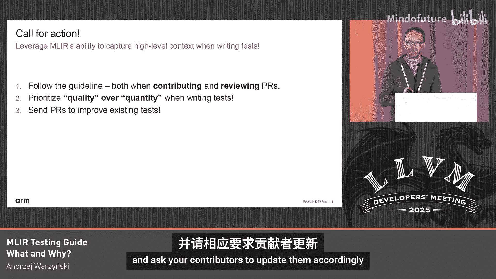

# 058：编写高质量测试


在本教程中，我们将学习如何为MLIR编写高质量、清晰且可维护的测试。我们将通过对比“好”与“坏”的测试示例，深入理解MLIR测试指南的核心原则，并掌握编写有效测试的具体技巧。

## 概述：为何测试指南至关重要

上一节我们介绍了本课程的目标。本节中，我们来看看测试为何如此重要。测试是我们代码库的一部分，它们为代码提供了文档。我们应该像对待产品代码一样认真编写和维护测试。

以下是测试的几个关键作用：
*   **文档功能**：测试是理解特定转换或功能如何工作的绝佳资源。
*   **可发现性**：我们需要确保测试易于查找和理解。
*   **一致性**：一致的测试风格可以节省开发者的时间，避免他们在命名、格式等方面重新发明轮子，同时也让扫描测试以理解测试内容和边界条件变得非常容易。

## 核心原则：聚焦与简洁

现在，让我们通过一个具体例子来理解第一个核心原则。这个例子来自测试指南，展示了同一测试的“好”版本和“坏”版本。

**输入MLIR代码（两个版本相同）**：
```mlir
func.func @test() -> index {
  %c1 = arith.constant 1 : index
  %c2 = arith.constant 1 : index
  return %c1 : index
}
```
这段代码定义了一个函数，其中常量`1`被定义了两次。测试会运行公共子表达式消除（CSE）来删除其中一个常量。

**“坏”的检查指令**：
```
// CHECK: func.func @test() -> index
// CHECK:   %[[C1:.*]] = arith.constant 1 : index
// CHECK:   return %[[C1]] : index
// CHECK: }
```
**“好”的检查指令**：
```
// CHECK: func.func @test()
// CHECK:   %[[C1:.*]] = arith.constant 1
// CHECK:   return %[[C1]]
```
这两个版本看起来相似，但“坏”版本存在几个问题：
1.  检查了结尾的右花括号`}`，这对于测试转换是不必要的。
2.  检查了索引类型`index`，但对此转换而言，类型并不相关。
3.  在“好”版本中，我们使用了`%[[C1:.*]]`这样的变量捕获和块替换，使检查更清晰、更健壮。

这个例子虽然简单，但意义重大。当测试文件包含成千上万行时，保留不必要的内容会影响可读性和维护性。我们的测试应该只关注转换本身产生的影响。

## 避免重复与提供上下文

接下来，我们看看如何处理多个相似测试用例。这是一个来自真实测试文件的例子，测试将向量收缩（vector.contract）转换为外积（outer product）的转换。

最初，文件中有两个测试用例，它们看起来不同，但差异并不明显，难以一眼看出各自测试的边界条件。经过仔细比较，发现两个测试中定义访问模式的`affine_map`虽然变量名不同，但实际完全一样，这导致了不必要的重复。最终，其中一个测试被移除，因为它们在检查指令上没有体现出任何有意义的差异。

这个例子给我们的启示是：
*   **避免重复**：重复的测试浪费资源且令人困惑。
*   **提供注释**：如果你的测试用例有特殊之处（例如测试特定形状、数据类型或边界条件），请添加注释说明。否则，后来者只能猜测测试的意图。

## 利用命名传达语义

命名是让测试清晰易懂的强大工具。让我们看另一个测试向量掩码加载（vector.maskedload）降级的例子。

**原始版本（存在问题）**：
```mlir
// 函数和变量名信息量低
func.func @test_vector_mask_load_f32(%arg0: memref<4xf32>, %arg1: vector<4xi1>) -> vector<4xf32> {
  %v1 = vector.maskedload %arg0[%c0], %arg1, %pass_thru : memref<4xf32>, vector<4xi1>, vector<4xf32> into vector<4xf32>
  return %v1 : vector<4xf32>
}
```
原始版本的问题在于：
*   函数内的向量变量被命名为`%v1`，重复了类型信息。
*   函数名`@test_vector_mask_load_f32`和参数名`%arg0`、`%arg1`没有传达任何语义。
*   测试意图不清晰。

**改进后的版本**：
```mlir
// 命名清晰传达了上下文
func.func @mask_all_true_f32(%base: memref<4xf32>, %pass_thru: vector<4xf32>) -> vector<4xf32> {
  %all_true_mask = vector.constant_mask [4] : vector<4xi1>
  %result = vector.maskedload %base[%c0], %all_true_mask, %pass_thru : memref<4xf32>, vector<4xi1>, vector<4xf32> into vector<4xf32>
  return %result : vector<4xf32>
}
```
通过改进命名：
*   向量被命名为`%all_true_mask`，明确指出掩码全为真。
*   参数命名为`%base`（内存基址）和`%pass_thru`（穿透值），说明了它们的角色。
*   函数名`@mask_all_true_f32`直接点明了测试场景：当掩码全为真时，`maskedload`应退化为普通`load`。

清晰的命名让我们立刻理解了测试目的，并很容易发现测试覆盖的缺口。基于此，我们可以自然地补充更多边界测试用例：
```mlir
// 补充测试：掩码全为假
func.func @mask_all_false_f32(%base: memref<4xf32>, %pass_thru: vector<4xf32>) -> vector<4xf32> {
  %all_false_mask = vector.constant_mask [4] : vector<4xi1>
  // 应直接返回 %pass_thru
  %result = vector.maskedload %base[%c0], %all_false_mask, %pass_thru : memref<4xf32>, vector<4xi1>, vector<4xf32> into vector<4xf32>
  return %result : vector<4xf32>
}

// 补充测试：混合掩码（负测试，模式不应触发）
func.func @negative_mixed_mask_f32(%base: memref<4xf32>, %pass_thru: vector<4xf32>) -> vector<4xf32> {
  %mixed_mask = vector.constant_mask [4] : vector<4xi1>
  // 此场景下转换不应发生
  %result = vector.maskedload %base[%c0], %mixed_mask, %pass_thru : memref<4xf32>, vector<4xi1>, vector<4xf32> into vector<4xf32>
  return %result : vector<4xf32>
}
```
在负测试的函数名中使用`negative_`前缀，可以清晰地表明这是一个期望转换*不*发生的测试。

## 工具使用与人工审查

编写测试，特别是生成检查指令（CHECK lines），可能是一项繁琐的工作。幸运的是，我们有自动化工具来辅助。

例如，可以使用Python脚本从MLIR输出自动生成初始的检查指令。这是一个很好的起点，可以节省大量手动输入的时间。

**但是，工具生成的结果只是起点，而非终点。** 开发者有责任对生成的检查指令进行审查和精炼：
*   **删除冗余**：确保只检查转换必需的部分，移除无关的类型、符号或格式。
*   **添加上下文**：使用有意义的变量名（如`%[[RESULT:.*]]`）和必要的注释。
*   **保持聚焦**：检查指令应像测试代码一样清晰、简洁。

请务必使用自动化工具，但也请务必仔细审查它的输出。

## 总结与行动号召

本节课中，我们一起学习了MLIR测试指南的核心内容。我们了解到，编写高质量的测试需要做到**聚焦简洁**、**避免重复**、**通过命名和注释提供清晰语义**，并**善用工具但不忘人工审查**。

最后，我们发出一个行动号召：请帮助我们共同维护测试指南的质量。无论是您自己编写测试，还是在代码审查中看到他人的测试，都请确保它们符合本指南的要求。在审查时，请指出不遵循指南的测试，并请贡献者相应地更新它们。一致的、高质量的测试套件对整个社区都有益。



谢谢。