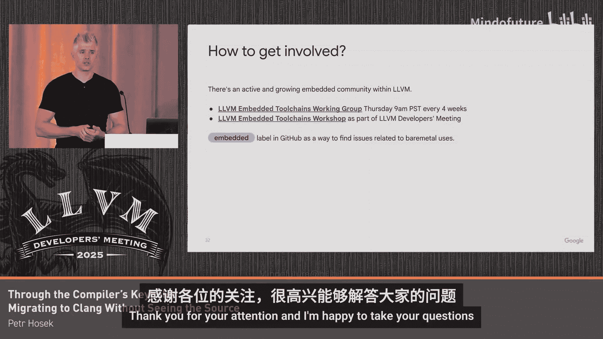

# 059：通过编译器锁孔窥探迁移至Clang

在本教程中，我们将学习如何将一个现有的代码库从GCC工具链迁移到Clang/LLVM工具链。我们将以Pixel Buds Pro第二代充电盒的迁移为例，探讨在迁移过程中遇到的关键挑战，特别是当目标平台（如RISC-V）包含自定义指令和重定位时，如何在不直接访问源代码的情况下，通过“锁孔”协作的方式解决问题。

## 概述：迁移的挑战与背景

上一节我们介绍了本次迁移的背景。本节中，我们来看看迁移面临的核心挑战。

我们之前已经成功将第一代Pixel Buds Pro从GCC迁移到了Clang。然而，第二代充电盒的迁移带来了更大的挑战，主要区别在于其核心从ARM切换到了RISC-V。这个RISC-V核心包含了供应商扩展，特别是自定义的分支指令，这些指令需要自定义的重定位。

不幸的是，供应商的工具链默认启用了这些扩展，且无法禁用。由于LLVM和LLD（LLVM链接器）目前不支持处理这些自定义重定位，我们无法将供应商的SDK与我们的代码链接起来。虽然LLD中有一个支持自定义重定位的PR正在审核，但尚未合并。

为什么这是个问题？在传统的操作系统（如Linux）中，应用程序和操作系统之间有明确的ABI（应用程序二进制接口）边界。然而，在微控制器（MCU）系统中，通常没有这样的边界。开发者需要将供应商提供的SDK（包含驱动、RTOS等）直接与应用程序代码静态链接，以优化二进制大小。这就要求应用程序和SDK之间的ABI必须兼容，而由于自定义重定位的存在，目前无法实现。

## 潜在解决方案与协作模式

上一节我们明确了问题所在，本节中我们来看看有哪些潜在的解决方案。

我们考虑了以下几种方案：
1.  **继续使用供应商工具链**：这是我们最初的做法，但产品团队希望为耳机和充电盒使用统一的Clang工具链。
2.  **重写供应商SDK**：重写所有使用自定义指令的代码以避免它们。但这没有现成的解决方案，且工程量巨大。
3.  **使用我们的Clang工具链重建供应商SDK**：这需要供应商的支持。幸运的是，供应商非常配合，决定与我们合作迁移他们的代码库。但有一个关键限制：SDK代码是他们的专有IP，我们无法直接查看代码。

因此，整个协作模式就像是通过“锁孔”工作：
*   我们构建一个Clang工具链（通常是上游最新版本，偶尔包含一些进行中的补丁或自定义Clang-Tidy检查），并将其发送给供应商。
*   供应商使用该工具链构建新版本的SDK，链接应用程序，运行所有测试，然后将日志发送给我们。
*   我们分析日志，尝试解决出现的问题，然后重复这个过程。

## 迁移策略：编译、优化与运行

上一节我们确定了协作方式，本节中我们来看看迁移代码库的一般策略。

迁移通常遵循三个步骤：首先让它能够编译，然后优化其大小，最后确保它能正确运行。在实践中，这些步骤往往是迭代和交叉进行的。

### 第一步：让它能够编译

即使Clang/LLVM努力支持大多数GCC扩展，它们也并非直接的替代品，仍然存在需要解决的重大差异。

以下是编译阶段常见的挑战：
*   **不同的警告**：Clang可能会触发GCC未触发的警告。
*   **LLVM libc的限制**：在裸机（bare-metal）构建中，我们有意省略了某些接口（如`pthread`），因此有时需要修改代码以避免使用某些头文件。
*   **链接器（LLD）的诊断信息**：LLD的错误信息有时不够友好。例如，错误信息“section can’t have both LMA and loaded row region”没有指出问题出现在链接脚本的哪一行、哪个段，这使得在大型链接脚本中定位问题非常困难。我们已提议改进LLD的链接脚本解析器。

### 第二步：让它能够适配（优化大小）

编译成功后，下一步是优化二进制大小，这对资源受限的MCU至关重要。

许多MCU使用异构内存布局，这意味着内存不是统一的，符号的放置位置对正确性和性能都很重要。然而，标准的C/C++后段（backend）并不直接支持异构布局，开发者通常需要借助非标准扩展。

以下是一个处理异构内存布局的常见模式及其问题：
假设我们想将代码放入一个名为`retain_ram`的特定内存区域。我们有几个不同的符号（变量和函数）。在裸机系统中，通常会使用`-ffunction-sections`和`-fdata-sections`编译，以便链接器可以进行垃圾回收（GC），移除未使用的代码。每个符号会进入自己的段（section）。

为了便于管理，开发者通常使用`section`属性来注解所有应放入`retain_ram`的符号，然后在链接脚本中手动放置整个`.retain_ram`段。但这样做有一个大缺点：它将所有符号集中在一个段里，破坏了链接器的垃圾回收功能，因为链接器无法丢弃该段中未使用的单个符号。

**我们最初的解决方案**是编写一个Clang-Tidy检查，自动将每个使用`section`属性的符号拆分到独立的、名称唯一的段中（例如`.retain_ram.foo`， `.retain_ram.bar`）。但这非常侵入式，供应商代码库中有数千个`section`属性实例，难以维护。

**更好的解决方案**：我们最终在LLVM中推广并实现了一个新特性：`-fseparate-named-sections`。启用此标志后，每个被`section`属性注解的符号都会获得自己独立的段（但段名相同）。这恢复了链接器的垃圾回收能力，且无需修改源代码。其原理是，在ELF格式中，允许存在多个同名的段。

不过，这种方法无法完全恢复所有语义。例如，对于应进行零初始化（`.bss`）的变量，如果手动将其放入`.retain_ram`段，它们就会占用二进制空间。理想的解决方案可能是引入一种新的语法来更好地表达“将此符号放入特定内存区域”的语义，并配合新的链接脚本语法。这仍在讨论和开发中。

为了进一步缩小体积，我们还尝试了**链接时优化（LTO）**。我们最初尝试用`-flto=thin`编译运行时库，但发现LTO与运行时库的配合存在一些问题。目前，我们仅对应用程序代码使用LTO，并希望未来能扩展到整个应用。

### 第三步：让它能够运行

即使代码编译成功且大小合适，也可能无法正确运行。我们遇到的主要问题是**性能**。

该应用有严格的时序要求（涉及蓝牙通信）。性能问题的根源在于**内存访问对齐**。虽然该MCU支持非对齐读写，但基准测试显示其速度比对齐读写慢大约4倍。由于原始代码依赖一些未定义行为，而GCC和Clang在处理这些未定义行为时存在差异，导致Clang生成的代码将某些符号放在了非对齐地址上，从而引起性能下降。

我们使用**未定义行为消毒剂（UBSan）** 来定位所有非对齐访问。我们使用了`-fsanitize=alignment`，并搭配一个比现有版本更精简、且与我们的RISC-V架构兼容的自定义运行时库。未来我们希望能在上游直接支持这种轻量级的嵌入式UBSan。

我们还遇到了其他性能瓶颈。开发者并不总是能准确预测代码性能，例如可能将热函数（hot function）放在源文件（`.c`）中，导致编译器无法跨编译单元内联；或者将冷函数放在头文件中标记为`inline`，不必要地增加了代码体积。

为了解决这些问题，我们采用了**基于插桩的性能分析（PGO）**。我们使用标准的插桩标志编译代码，通过JTAG连接设备运行程序并收集性能分析数据，然后使用优化备注（optimization remarks）为开发者提供改进代码的指导。例如，编译器可能会提示“无法内联函数`foo`，因为看不到其定义（但它很热，应该被内联）”，开发者据此将函数移到头文件中并标记为`static inline`。未来我们希望自动化这个过程。

最后，在调试此类问题时，调试器非常有用。我们成功使用了LLDB。但当应用崩溃时，我们常常会陷入像中断处理程序这样的地方，而这些程序通常用汇编编写。为了获得良好的堆栈回溯，需要编写正确的DWARF调用帧信息（CFI）注解，但这非常容易出错。

这促使我们提议并开发了一个**DWARF CFI验证器原型**。它是一个简单的抽象解释器，可以运行在你的CFI注解上，尝试发现并标记问题。目前原型仅支持x86_64，但我们正计划将其扩展到ARM或RISC-V等嵌入式领域更常见的架构。

## 总结与社区邀请

本节课中我们一起学习了将一个嵌入式代码库从GCC迁移到Clang/LLVM的完整过程，特别是在无法直接访问供应商SDK源代码的“锁孔”模式下所面临的独特挑战和解决方案。

回顾整个努力，有人可能会问：为单个应用程序做这一切是否值得？对我们而言，答案是肯定的。原因如下：
1.  在嵌入式领域，硬件平台的生命周期较长，同一款MCU可能用于多代产品。投入精力使其与最新的编译器工具链协同工作是值得的。
2.  在此过程中，我们提出了许多新特性和改进的想法，其中一些已经融入LLVM，另一些有望在未来实现。
3.  我们开发的所有自动化工具不仅适用于本项目，也对其他嵌入式项目乃至整个社区有益。

如果你对嵌入式开发感兴趣，欢迎加入LLVM内部日益壮大的嵌入式社区。我们有一个公开的工作组，每四周举行一次会议（太平洋时间周四上午9点）。我们还会举办研讨会。期待你的参与！

---

**问答环节**

**问：** 你提到供应商SDK迁移到了你们的LLVM工具链，这包括所有工具吗？还是只包括编译器？
**答：** 包括所有工具。我们使用与所有项目相同的工具链，即直接从LLVM Git仓库构建的Vanilla LLVM。我们使用Clang作为编译器，使用所有LLVM工具，使用LLD作为链接器，并且使用LLVM libc作为C库，libc++作为C++库。我们与LLVM libc团队（包括Michael）密切合作，他们非常出色地解决了我们遇到的各种问题，例如缺失的函数、内存拷贝（memcpy）的性能改进等。这次协作至关重要。

**问：** 这个设备里大概有多少行代码？
**答：** 实际上我不知道具体的代码行数，因为我们通常不以代码行数来衡量。但我知道二进制大小，这才是我们真正关心的。对于Pixel Buds Pro第二代充电盒，镜像文件大约在1MB左右。

**问：** 与供应商的互动有多困难？说服他们尝试新编译器容易吗？
**答：** 互动非常积极。我们很幸运，在供应商那边找到了一位非常乐于合作的工程师。最具挑战性的方面是沟通延迟，因为他们不在美国，位于不同的时区。此外，他们将新工具链集成到自己的工作流程中也需要时间。因此，整个项目持续了一年多，但大部分时间是等待反馈，并非全是主动开发时间。

**问：** 关于你添加的链接器标志（`-fseparate-named-sections`），它是否完全尊重指定的段名？你是在ELF中放置多个同名的段，还是像`-fdata-sections`那样附加变量名？
**答：** 使用`-fseparate-named-sections`时，我们完全不修改段属性。我们完全尊重属性中指定的内容，只是在ELF中生成多个同名段。

**问：** 我的客户有很多汇编代码，他们抱怨调试困难，因为他们不写DWARF信息。你提到的DWARF CFI验证器何时能在上游可用？
**答：** 我展示的功能已经在上游了。目前有一个开放的PR（尚未合并）改进了我们能检测到的问题类型。最大的挑战是，这项工作是由我们团队去年夏天的一位实习生完成的，实习期结束后需要找到其他人愿意接手继续开发。另一个问题是，我们在MC层缺少足够的语义信息来真正理解单个指令的作用（例如对堆栈的影响）。我们发现这些信息已经存在于LLVM的其他地方（例如LLVM的MCPlus），但将其引入到LLVM中以供验证器使用将是一项重大的重构工作。

**问：** 我们尝试用Clang编译GCC编译的代码时，遇到过一些Clang无法编译的结构，后来发现这些根本不是有效的C++代码，只是GCC有自己的（可能是错误的）解释。你们遇到过类似情况吗？
**答：** 我们偶尔会遇到类似问题。一个非常具体的、几乎在每个嵌入式代码库中都能看到的例子是`optimize`属性。这个属性很流行，它允许你告诉编译器仅针对特定函数改变优化级别。Clang/LLVM不支持这个属性，而且基于LLVM优化管道的工作方式，我认为我们永远不会支持。解决方法是改变代码组织方式，例如在编译单元（P）级别进行设置。我认为整理一份“常见迁移问题与解决方案”手册会非常有益，或许可以发布在LLVM网站上，同时提供更多像Clang-Tidy这样的自动化工具来帮助开发者解决这些问题。