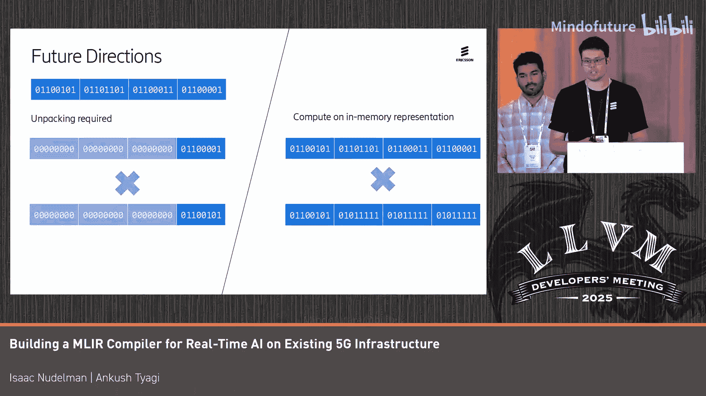

# 060：性能优化实践与未来方向

## 概述

在本节课中，我们将学习如何为爱立信（Eson）的自研多核架构（MC）构建MLIR编译器，以实现实时AI推理。我们将重点探讨在追求低延迟和低功耗的约束下，如何通过编译器优化提升性能，以及在此过程中遇到的挑战和获得的经验教训。

---

## 上游优先的开发策略

我们采用了“上游优先”的开发策略，即优先将代码贡献到LLVM/MLIR等开源项目的主线。这一策略带来了显著的开发效率提升。

以下是该策略带来的主要优势：
*   **快速原型验证**：重用从Linalg到LLVMIR的现有方言，使我们能在约两周内让模型在实际硬件上运行。
*   **无缝工具链集成**：与现有的基于LLVM的工具链实现了良好的集成。
*   **免费优化**：能够直接利用上游社区开发的多种优化技术。

---

## 卷积优化的尝试与取舍

上一节我们介绍了上游优先策略的优势，本节中我们来看看具体的优化尝试。我们尝试了不同的卷积优化方法。

以下是我们的具体发现：
*   **Im2col优化**：这种流行的优化方法对我们的硬件并不有利。因为我们并非针对专门的AI加速器，而是普通核心，无法从中受益于其内存访问模式。
*   **Winograd优化**：这种方法为我们带来了不错的性能提升。然而，Winograd算法在数值上并不稳定，我们遇到了模型崩溃的问题。在后续尝试量化时，问题变得更加严重。因此，我们不得不暂时搁置这项技术。

---

## 探索指令级并行（ILP）

对于我们的硬件而言，性能提升的“北极星”是指令级并行（ILP）。向量化是实现ILP的一种自然思路。

我们选择了仿射向量化（Affine Vectorization），而非循环向量化（Loop Vectorization），因为后者对一些我们想运行的模型支持不足。但遗憾的是，启用向量化后，我们并未看到性能提升，反而观察到了**三倍的性能下降**。

经过深入分析，我们发现了两个关键问题：
1.  **向量化维度选择不当**：仿射向量化器总是选择最内层循环进行向量化。对于卷积而言，这通常是卷积核维度，其循环次数（trip count）很低。这导致生成的向量操作中，大部分通道（lane）都被掩码（mask）关闭，效率低下。理想的向量化维度应该是图像维度。
2.  **后端支持缺失**：我们的后端并未对掩码向量操作（masked vector ops）进行优化处理。这些操作被完全展开成了大量的条件判断语句，导致单个向量操作可能膨胀为上百条指令。

这个教训非常重要：**优化并非免费的午餐**。一项优化本身不会自动带来性能提升，必须确保它以合理的方式应用，并且具备必要的底层支持机制才能发挥效果。

---

## 融合：更有效的ILP驱动因素

尽管向量化的尝试受挫，但这推动我们寻找其他提升ILP的方法。我们发现，对于我们的硬件，**操作融合（Fusion）是比向量化更有效的ILP驱动策略**。

我们可以与模型开发者协作，共同创造更好的ILP机会。例如，将标准卷积替换为**可分离卷积（separable convolution）**。这使得线性元素级操作融合能够更有效地工作，因为它可以垂直方向进行融合，而不再受限于归约迭代器。

通过这种方式，我们在其他方面等效的模型上，观察到了**超过100倍的性能提升**。

---

## 量化的必要性与协同设计

对于我们的DSP核心，它们为定点计算而非浮点计算进行了深度优化。因此，**量化对我们至关重要**。

然而，最好的量化策略是从模型侧开始构建。在DSP聚焦的系统中，输入数据很可能已经是量化的。模型开发者可以利用量化感知训练（QAT）技术，在最大化精度和性能的同时进行量化。

通过将这些经验教训传达给模型开发者，我们实际上在很大程度上绕开了编译器层面繁重的性能优化工作，通过软硬件协同设计取得了显著成效。

---

## 未来方向

最后，我们展望一下未来的工作方向。

以下是几个我们正在探索的重点领域：
*   **超低比特量化**：行业趋势正朝向4比特或更低的超低精度量化。这类操作在我们的硬件上原生支持不佳，解包操作ILP极低，会导致严重的性能回退。我们正在研究如何启用自动SIMD，以不解包的方式直接进行计算。
*   **加速器集成**：探索如何让模型开发者通过AI框架（如JAX）有效地利用我们的DSP和定制加速器。
*   **全栈可观测性**：在整个MLIR栈中启用可观测性，包括IR快照、诊断信息、变换过程的可追溯性，并确保其与现有的追踪基础设施有效集成。我们希望很快能在上游社区完善这些功能。

---

## 总结

本节课中我们一起学习了为爱立信多核架构构建MLIR编译器的实践经验。我们认识到上游优先策略能加速开发，但优化技术的选择必须结合硬件特性。我们经历了向量化带来的性能陷阱，发现了操作融合是提升ILP的更有效途径，并强调了模型与编译器协同设计（尤其是量化）的重要性。最后，我们展望了应对超低精度量化和提升系统可观测性等未来挑战的方向。