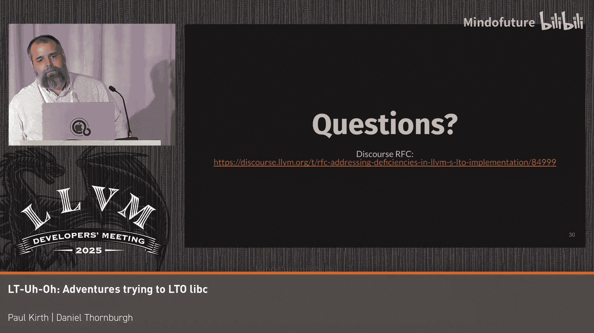

# 061：使用libc进行链接时间优化的历险记


## 概述
在本节课中，我们将要学习在LLVM工具链中，将标准C库（libc）作为源码参与链接时优化（LTO）所遇到的挑战和解决方案。我们将探讨LTO的基本流程、遇到的问题、以及如何通过更精细地控制编译器的“内置函数”处理机制来安全地实现优化。

## LTO流程简介
上一节我们介绍了课程主题，本节中我们来看看链接时优化的标准流程。大多数关注代码体积的项目更倾向于使用完全LTO，因为它在体积优化上通常比瘦身LTO效果更好。

完整的LTO流程如下：
1.  链接器接收一组LLVM IR文件，进行符号解析。
2.  控制权移交到LTO管线，开始合并模块并进行内部化。
3.  最终得到一个近乎完整的、单块的LLVM IR程序。
4.  对该IR进行优化和代码生成。
5.  常规链接过程从此点恢复，最终生成输出文件。

我们的核心动机是最大化编译器的优化能力。LTO通过合并模块、模糊由独立编译单元引入的边界，为编译器优化接口、删除无用代码提供了绝佳机会。

## 遇到的问题：符号消失之谜
上一节我们介绍了LTO的理想目标，本节中我们来看看实践中遇到的第一个问题。如果你尝试对libc源码使用LTO，传递 `-flto` 标志，编译过程可能会失败。

你可能会遇到一个关于 `bcopy` 的未定义隐藏符号错误。这很奇怪，因为 `bcopy` 明明是你编译的源码的一部分，它就在 `libc.a` 库里。

为了探究原因，我们可以使用 `-save-temps` 标志来查看优化管道中发生了什么。你可能会注意到，`bcopy` 在IR中确实有定义。那么，为什么链接时会说它未定义呢？

让我们通过一个简化示例来深入理解。假设我们有一个函数 `foo`，它包含一个条件分支，分支中调用了 `memcpy`。

```llvm
define void @foo(...) {
  ...
  call void @memcpy(...) ; 外部符号
  br i1 %cond, label %true, label %false
  ...
}
```

同时，模块中也有 `bcopy` 的定义。在全局死代码消除（Global DCE）运行后，`bcopy` 没有被引用，因此被编译器删除。这看起来是合理的优化。

然而，随后 `simplify-libcalls` 优化会运行。这个优化可能会将 `memcpy` 调用转换为 `bcopy` 调用，因为它在分支条件中被使用。但此时，`bcopy` 在模块中只剩下一个外部引用声明，其定义已在之前的DCE阶段被删除。因此，当链接最终完成时，就会因为找不到 `bcopy` 的定义而失败。

**总结问题原因：**
1.  libc的所有API在LTO开始时被标记为内部（internal）。
2.  全局DCE发现 `bcopy` 未被使用，将其删除。
3.  `simplify-libcalls` 优化将 `memcpy` 调用转换为 `bcopy` 调用。
4.  链接失败，因为 `bcopy` 已不存在。

## 根本原因：编译器对libc的假设
上一节我们看到了一个具体的失败案例，本节中我们来分析其背后的根本原因。使用 `libc` 作为源码与常规使用方式有本质区别。

传统编译器对libc有一系列假设，这些假设基于静态或动态链接模型。编译器将libc接口视为一个抽象的、保证提供的接口，从而可以进行高级转换，例如将 `memcpy` 模式匹配并优化为 `bcopy`。

控制这种行为通常通过 `-fno-builtins` 等标志实现。此外，LLVM后端也有一套用于处理库调用和内置函数的低级转换，这些转换无法单独关闭。

## 初步解决方案：使用运行时库调用
上一节我们分析了问题的根源，本节中我们来看看第一个想到的解决方案。运行时库调用机制看起来很有吸引力，例如 `memcpy` 就是这样处理的。

这些调用在优化管道中被区别对待：
*   它们不能被删除，因为预期可能由外部提供定义。
*   它们总是从比特码归档文件中提取，因此始终可用。

我们最初的尝试是直接使用这个机制。但在实施前，我们了解到这并非最佳方案。我们需要在概念上区分两个阶段：
1.  **允许使用内置函数的世界**：例如 `memcpy`、`bcopy`。此时libc被视为完全抽象的接口，LLVM通过 `-fno-builtins` 等机制使用它。
2.  **无内置函数的世界**：进入此阶段后，优化器将整个程序视为一个整体，可以自由进行任何它认为合适的变换。

我们需要在IR中编码这种区分，并在管道中找到一个安全点来切换。

## 实现更精细的控制
上一节我们讨论了概念模型，本节中我们来看看如何具体实现。一个天真的想法是：在管道的某个安全点，简单地为模块中的所有函数添加 `nobuiltin` 属性。

我们构建了这样一个Pass。它确实有效，因为 `bcopy` 不再被DCE删除，`memcpy` 也不会被重写为 `bcopy`。

然而，这种方法副作用很大。无论你在管道的哪个位置添加 `nobuiltin` 属性，它都会显著改变编译器的行为，影响后端通过目标库信息（TLI）进行的许多优化。例如，原本可以将 `sqrtf` 调用替换为单条X86指令的优化将无法进行。这相当于“把婴儿和洗澡水一起倒掉了”。

## 构建安全的后期函数使用规则
上一节我们看到了简单方案的局限性，本节中我们将介绍一套更安全、更精细的规则。我们意识到，问题在于链接完成后，我们需要对如何处理这些符号有更精确的认识。

我们制定了一套规则，用于安全地在链接完成后使用函数：

以下是安全使用函数的核心规则：
1.  **允许添加对已链接比特码的引用**：如果一个符号（如 `bcopy`）因为某种原因被拉进了链接，那么将 `memcpy` 转换为对它的调用是安全的。我们需要允许这类安全的转换发生。
2.  **保护已链接的函数**：为了安全地进行上述转换，被转换的目标函数必须被视为“神圣不可侵犯”。LLVM已有机制实现这一点：将其标记为外部（external）链接，并防止其被内部化。这样，优化通道就不能删除它或更改其ABI。
3.  **禁止添加对新函数的引用**：链接完成后，哪些libc函数在链接中、哪些不在，这个集合就冻结了。不允许在编译过程中途再决定引入新的比特码并重新进行内联等操作。如果链接时 `bcopy` 没被需要，那么之后即使发现可以将 `memcpy` 优化为 `bcopy`，也不允许这样做。我们认为这是一个合理的取舍。

基于这些规则，我们构建了一个补丁。令人惊讶的是，实现起来并不复杂，只有几百行代码，且对现有代码的修改面广但改动点小。



## 解决方案的工作流程
上一节我们介绍了安全规则，本节中我们详细看看解决方案的具体工作流程。

以下是该方案的关键步骤：
1.  **链接器收集信息**：LLD需要知道哪些是libc函数。我们可以借鉴已有的 `getRuntimeLibcall` 函数机制。通过目标三元组查询目标库信息（TLI），可以获得一个保守的libc函数列表（如 `memcpy`， `bcopy`， `fmemcpy`...）。
2.  **链接器解析符号**：链接器遍历这个列表，查看这些符号解析到了什么。确定哪些是以比特码形式存在的（这些是潜在的问题点），哪些是手写汇编实现（无需特殊处理）。
3.  **LTO侧确定可用集合**：在LTO阶段，扫描接收到的所有IR（完全LTO）或模块摘要（瘦身LTO），确定哪些libc函数通过直接调用等方式实际进入了项目。这个集合将被冻结。
4.  **构建受限的TLI**：在LTO过程中调用代码生成和优化时，负责构建TLI对象。此时，可以根据上一步的“可用集合”，禁用那些未进入链接的函数的转换，并将已进入链接的函数标记为外部链接以保护它们。

这个方案的一个重要优点是：除非你确实在尝试对libc进行LTO，否则它完全是一个空操作，这增加了其被上游接受的可能性。

## 未来方向与社区协作
上一节我们介绍了一个可行的技术方案，本节中我们展望未来的工作并呼吁社区协作。我们还有一些评估工作要做，并希望能在Google内部更广泛地测试。

我们正在几个嵌入式项目中进行调查，目前效果良好，获得了不错的代码体积改进。我们相信通过调整还可以做得更好。

未来需要与上游社区进行大量讨论：
*   是否需要为libc函数添加属性以使方案更完善？
*   是否应该修改Pass管道？
*   是否应该以更原则性的方式在IR中编码这些信息？
*   我们是否也想对内置函数（builtins）进行类似处理？
*   我们需要明确LTO在这些情况下的确切语义，以及它与传统链接模型的区别。

我们无法独自完成这一切，期待社区成员的思考和参与。我们将在相关讨论中发布更新和补丁链接。

## 总结
本节课中我们一起学习了在LLVM工具链中对libc源码使用链接时优化所面临的挑战。我们从LTO流程和遇到的问题出发，分析了编译器对libc的传统假设为何在源码LTO场景下失效。接着，我们探讨了从简单的运行时库调用机制到更精细的“无内置函数”世界切换方案，并指出了其局限性。最后，我们介绍了一套安全的后期函数使用规则，以及基于此实现的一个具体工作流程，该流程通过在链接后冻结libc函数集合并保护已链接函数，使得对libc的LTO成为可能。我们认识到这只是一个开始，未来需要在性能权衡、机制设计和社区协作上继续努力，以充分释放编译器在源码LTO场景下的优化潜力。