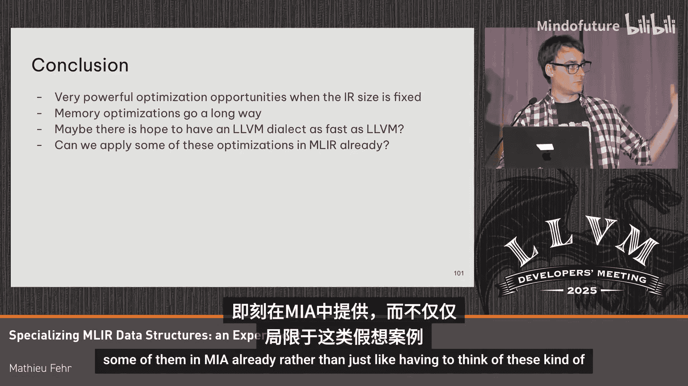

# 062：探索性能优化机会

## 概述

在本节课程中，我们将探讨如何通过专业化MLIR的数据结构来提升编译性能。我们将分析两种主要的权衡：**可扩展性**和**可用性**，并评估通过限制某些MLIR特性所能获得的潜在性能收益。核心思想是：如果MLIR的数据结构是一个接口，允许我们为特定编译器替换更优的实现，我们能获得怎样的性能提升？

## 可扩展性的权衡

MLIR的一个主要优势是其强大的可扩展性，能够表示机器学习、硬件设计、计算机图形等多个领域的中间表示。然而，这种通用性带来了运行时开销，进而影响了编译时间。

操作的内存布局需要更大以支持可变数量的操作数和结果。
检查操作是否实现了某个接口或特质需要间接层，存在开销。
操作码检查和属性字典的使用也带来了额外成本。

## 可用性的权衡

与LLVM类似，MLIR提供了高效的IR操作算法，例如快速替换、插入和移动操作。这些算法的实现依赖于指针链接，维护这些链接的正确性需要大量的簿记工作。

例如，替换一个操作的汇编代码量相当可观，而直觉上这可能只是简单地设置一次内存。

## 核心问题：数据结构作为接口

那么，我们能否在保留MLIR可扩展性的同时，获得类似LLVM这种具有固定IR的即时编译器的性能？我们能否同时拥有高效的渐近算法，并在愿意以不同方式编写编译器通道的前提下，使某些通道运行得极快？

本质上，我们提出的问题是：**如果MLIR的数据结构是一个接口，允许我们为当前编译器替换更优的定义，会怎样？**

## 性能优化机会

以下我们将通过几个微基准测试，探索专业化数据结构可能带来的性能提升。

### 操作码检查优化

目前，MLIR使用`dyn_cast`/`cast`机制来检查操作类型。我们可以实现一个类似的机制，为每个操作分配一个固定的操作码，从而减少内存使用并加速检查。

**性能对比：**
*   迭代操作向量：**0.31纳秒/操作**
*   MLIR当前检查（如检查是否为`add`操作）：**0.51纳秒/操作**
*   使用固定操作码检查：**0.29纳秒/操作**

在缓存命中的理想情况下，有显著提升。在非缓存场景下，仍有约10%的性能收益。

### 接口访问加速

目前访问接口需要遍历操作的所有特质和接口，速度较慢。如果改用基于`switch-case`的实现，理论上可以获得**4倍的加速**，达到LLVM在此类操作上的性能水平。

### 减少内存占用

通过分析操作的内联结构，我们可以移除编译器特定场景下不需要的特性，以减少内存占用。

**可移除或缩小的部分：**
*   **属性字典**：如果编译器已知所有操作属性，可使用操作属性替代。
*   **操作名称**：如果操作数量有限，可将其编码为16位或8位整数。
*   **支配索引**：如果通道不使用支配关系或验证，可移除。
*   **位置信息**：发布版本中可移除调试位置信息。

通过上述优化，操作创建速度可获得**10%-20%** 的提升。在一个将常量置于右侧的规范化通道中，处理十亿级操作时，时间可从**7.1秒**降至**6.1秒**。

### 固定操作属性大小与分配重用

在MLIR中，操作属性大小差异很大。如果我们已知所用方言的操作属性大小固定且很小，可以将其内联分配到每个操作中。

这带来了一个关键优化：**操作分配重用**。

**传统操作替换流程：**
1.  为新操作分配内存。
2.  初始化新操作。
3.  替换所有使用旧操作结果的地方（检查每个用户，成本高）。
4.  删除旧操作。
5.  释放旧操作内存。

**分配重用优化流程（当操作数列表相同时）：**
1.  重用旧操作的内存分配。
2.  更改操作码字段。
3.  删除旧操作数。
4.  就地初始化新操作（例如设置新常量）。

在一个简单的常量折叠基准测试中：
*   迭代IR：**3.6纳秒/操作**
*   传统常量折叠替换：**114纳秒/操作**
*   分配重用替换：**~7.2纳秒/操作** （约为迭代成本的两倍）

**此项优化带来了约15倍的加速**。这只有在已知操作属性大小固定时才可能实现。

## 限制MLIR特性的权衡

上一节我们探讨了在可扩展性方面进行专业化的机会。本节中，我们来看看如果主动限制MLIR的某些特性，例如定值-使用链，能带来哪些性能提升。这类似于WebKit等超快编译器采用的策略。

### 移除定值-使用链

定值-使用链用于从操作结果获取所有使用该结果的地方，它通过链表实现。移除它可以减少内存访问和指针维护开销。

**性能影响：**
在创建具有多个操作数的操作时，移除定值-使用链可以显著降低开销。例如，创建具有七个操作数的操作，时间可以从**77纳秒**减少到**45纳秒**，提升明显。

在之前的“常量置右”规范化通道中，移除定值-使用链能带来额外的**1.5倍加速**。

需要注意的是，移除定值-使用链后，替换单个操作将变得复杂，可能需要同时替换一批操作或使用更复杂的算法来跟踪用户。

### 使用向量替代链表

另一个想法是将操作存储在连续向量中，而非链表中。这能进一步提升局部性和访问速度。

然而，这带来了**巨大的代价**：你无法在IR中任意位置高效地插入或替换单个操作，可能需要重写整个IR片段。这改变了MLIR的核心操作模型。

### 竞技场分配

当前，每个操作都通过`malloc`单独分配内存，每次分配都有成本，且每个指针占用64位空间。

我们可以采用**竞技场分配**策略：预分配一个大数组（竞技场），操作在其中分配，并使用数组索引而非直接指针来引用操作。

在假设所有操作大小相同的实验中：
*   对于最多包含7个操作数的操作，创建IR的速度可提升**4-5倍**，重写IR（常量折叠）的速度提升约**50%**。
*   对于最多包含3个操作数的操作，创建IR的速度可提升**5倍**，重写IR的速度提升**2倍**。

这种数组分配机制若能集成到MLIR中，可能带来显著的益处。

## 总结

本节课我们一起探索了通过专业化MLIR数据结构来优化编译性能的实验和思路。

**主要发现：**
1.  **内存优化收益显著**：通过减少内存占用和固定数据结构布局，能在多个微基准测试中获得10%-20%的性能提升。
2.  **分配重用潜力巨大**：在已知操作布局固定的前提下，重用内存分配可使特定操作替换获得数量级（15倍）的加速。
3.  **限制特性以换取速度**：移除如定值-使用链等特性，可以进一步减少开销，但会改变编程模型，需要更复杂的算法支持。
4.  **竞技场分配有前景**：采用基于数组的分配策略，能大幅提升操作创建和重写的速度。

这些实验表明，如果能够约束MLIR的使用范围或引入可配置的数据结构策略，存在强大的性能优化机会。未来，也许我们能在MLIR中提供一个LLVM方言，使其内部的LLVM通道运行得和原生LLVM一样快。同时，也可以考虑将其中一些优化（如可控的分配重用或竞技场分配）作为可选项暴露给MLIR用户，而不仅仅是停留在理论探讨层面。