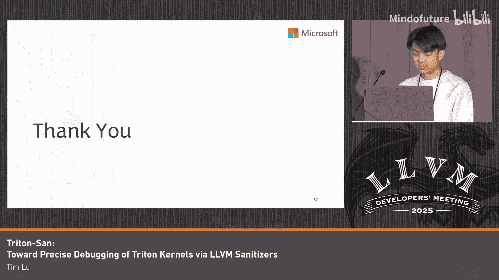

# 065：迈向 Triton 内核的精确调试 🐛


## 概述
在本教程中，我们将学习一个名为 **TritonSan** 的工具，它旨在帮助开发者精确调试基于 Python 的 GPU 编程语言 **Triton** 中的程序错误。我们将了解 TritonSan 如何利用成熟的 LLVM Sanitizer 技术，通过将内核执行卸载到 CPU 上来检测缓冲区溢出、未初始化内存使用和数据竞争等难以发现的错误。

---

## Triton 语言简介 🚀

Triton 是一种用于高性能计算和人工智能领域的、基于 Python 的 GPU 编程语言。它以学习曲线平缓和语法简洁而闻名，同时又能表达出高效的内核代码。

与任何编程语言一样，如果错误地使用其提供的结构，可能会在代码中引入一些难以察觉的程序错误。目前，可用于帮助程序员检测这些隐蔽错误的工具非常有限。

以下是三类在 Triton 代码中难以检测的编程错误，也是 TritonSan 工具重点关注的类型：
*   **缓冲区溢出**
*   **未初始化内存的使用**
*   **数据竞争**

这些问题之所以难以检测，是因为它们通常在代码中表现出静默或非确定性的行为。例如，在 GPU 上，程序有时会被分配远超其实际需要的内存。如果缓冲区溢出发生在程序分配的总内存范围内，它可能不会被标记为非法访问，从而静默地发生，导致代码出现意外行为。

---

## Triton 的工作流程与错误示例 ⚙️

上一节我们介绍了 Triton 语言及其面临的调试挑战。本节中，我们来看看 Triton 的即时编译工作流程，并通过具体代码示例理解错误是如何发生的。

Triton 使用即时编译。Python 程序逐行执行，直到遇到 GPU 内核调用。此时，该内核会被即时编译。这个过程经过一系列编译器传递：Triton 前端、MLIR 传递，最后通过 GPU 特定的后端编译成可在目标 GPU 上运行的可执行文件。

以下是一个包含数据竞争错误的 Triton 程序示例：

```python
@triton.jit
def kernel(X):
    pid = tl.program_id(axis=0)
    block_start = pid * 2
    offsets = block_start + tl.arange(0, 2)
    mask = offsets < X.shape[0]
    x = tl.load(X + offsets, mask=mask)
    tl.store(X + offsets, x + 1.0, mask=mask) # 数据竞争发生在此行
```

在这个例子中，我们定义了一个大小为 256 的张量和 128 个同时向该张量写入数据的程序实例。由于程序员错误地将 `block_start` 设置为 0，导致所有实例都试图同时写入索引 0 和 1，从而引发了数据竞争。

以下是另一个缓冲区溢出的例子：

```python
@triton.jit
def kernel(X):
    pid = tl.program_id(axis=0)
    block_start = pid * 2
    offsets = block_start + tl.arange(0, 2)
    mask = True  # 错误：掩码始终为真
    x = tl.load(X + offsets, mask=mask)
    tl.store(X + offsets, x + 1.0, mask=mask) # 缓冲区溢出发生在此行
```

这里定义了一个大小为 3 的张量和 2 个写入实例。第二个实例试图写入索引 3，但该索引不存在。错误在于程序员将掩码设置为始终为 `True`，使得每个程序都认为其访问在范围内，从而导致了缓冲区溢出。

这些小型程序被称为“微基准测试”，用于评估 TritonSan 等工具的精度。

---

## TritonSan 的工作原理 🛠️

上一节我们通过示例了解了 Triton 中典型的错误。本节中，我们来看看 TritonSan 工具是如何工作的。

TritonSan 的核心思想是**利用现有的 LLVM Sanitizer**。我们选择这样做是因为这些 Sanitizer 成熟、可靠且持续维护。为了利用它们，我们需要将内核执行**卸载到 CPU** 上，因为这些 Sanitizer 是为在 CPU 上运行而构建的。这样做也带来了优势，例如能够利用 CPU 编译中内置的更成熟、更健壮的 MLIR 和 LLVM 传递，并能使用 OpenMP 等现有 LLVM 运行时来帮助并行化程序。

以下是 TritonSan 工作流程的详细步骤：
1.  **前端处理**：Triton 内核首先被 Triton 前端摄取，并转换为 Triton 方言。
2.  **自定义 MLIR 传递**：引入一个自定义的 MLIR 传递，添加一些线性代数操作。
3.  **降低至 LLVM IR**：利用现有的 LLVM 和 MLIR 内置传递，将代码一直降低到 LLVM IR。
4.  **Sanitizer 插桩**：在此阶段引入 Sanitizer 标志，将代码编译为目标文件。
5.  **驱动脚本与链接**：该目标文件与一个 C++ 驱动脚本结合。该脚本负责执行 Triton 网格的每次迭代。所有这些被组合成一个共享库。
6.  **加载与执行**：通过 Python 的 `importlib` 库立即在 CPU 上加载并启动该共享库。

为了使工具正常工作，我们还需要进行以下关键调整：

*   **并行化执行**：默认情况下，驱动脚本按顺序运行 Triton 网格的每次迭代，这意味着不会发生数据竞争。我们使用 **OpenMP** 并行化内核执行，为每次迭代分配自己的工作线程，从而允许它们并行执行并暴露数据竞争。
*   **添加调试信息**：最初报告的错误信息对程序员帮助不大。我们添加了一个 MLIR 传递，以 DI 属性的形式将调试信息插入 IR，并确保这些信息在后续的所有 LLVM 和 MLIR 传递中得以保留，从而在运行时能显示包含文件名和行号的有用错误信息。
*   **预加载 Sanitizer**：确保在 Triton 程序开始执行之前预加载 Sanitizer，使其有机会初始化并分配自己的“影子内存”来跟踪执行元数据。
*   **注册钩子回调**：拦截操作系统级别的 API 调用，如内存分配或访问。
*   **使用抑制列表**：告诉 Sanitizer 忽略哪些非 Triton 模块的错误，以减少无关的误报，专注于内核内的重要错误。

---

## 工具评估：精度与性能 📊

上一节我们深入探讨了 TritonSan 的内部机制。本节中，我们通过评估来看看它的实际效果。

我们使用两个主要数据集来评估 TritonSan：
1.  **微基准测试套件**：包含特定错误的小型程序。
2.  **注入错误的现实案例**：来自官方 Triton 教程和 `Triton-Bench` 仓库的更复杂内核。

我们从**精度**和**性能**两个方面进行评估：
*   **精度**：指工具是否能检测到数据集中我们感兴趣的 bug。
*   **性能**：指工具引入的运行时的内存和时间开销是否合理。

在精度方面，TritonSan 能够在微基准测试套件中检测到所有我们感兴趣的问题，且没有产生误报。

为了对比，我们还评估了另一个工具 **Compute Sanitizer** 的精度。Compute Sanitizer 来自 NVIDIA，是 Triton 官方推荐的、用于检测在 NVIDIA GPU 上运行的 Triton 内核中隐蔽程序错误的解决方案。

以下是精度对比结果：
*   **缓冲区溢出**：TritonSan 能够检测到所有溢出。Compute Sanitizer 只能检测到“大”的溢出，这可能与 GPU 内存分配机制有关。
*   **数据竞争**：TritonSan 能够检测到全局内存中的数据竞争。Compute Sanitizer 不支持检测共享内存中的数据竞争，而 Triton 的同步结构对程序员是透明的，因此数据竞争可能发生在全局内存中。
*   **未初始化内存使用**：TritonSan 尚未集成对应的 LLVM Sanitizer，这是未来的开发步骤。

在性能方面，TritonSan 目前支持的 AddressSanitizer 和 ThreadSanitizer 的性能数据与其他应用场景相似，我们认为这对于工具的可用性来说是一个好迹象。



---

## 安装与使用指南 📖

上一节我们评估了 TritonSan 的效果。本节中，我们来看看如何安装和使用它。

TritonSan 已作为一个可选功能集成到名为 **Triton-Shared** 的 CPU 后端中。因此，你需要克隆 Triton-Shared 仓库。该仓库中提供了一个现成的构建脚本，它会安装兼容版本的 LLVM、Triton 和 Triton-Shared，并生成一个便于运行时调用的脚本。

以下是安装和使用步骤：

1.  **安装 TritonSan**：
    ```bash
    git clone <triton-shared-repo-url>
    cd triton-shared
    ./build.sh  # 运行构建脚本
    ```

2.  **修改 Triton 程序以使用 CPU 后端**：
    在你的 Triton Python 文件顶部添加以下两行，告诉 Triton 使用 CPU 后端编译代码：
    ```python
    import os
    os.environ[‘TRITON_INTERPRET’] = ‘1’
    ```
    由于在 CPU 上运行内核，你还需要确保张量没有卸载到 GPU。

3.  **使用 TritonSan 运行程序**：
    使用 `triton-san` 驱动脚本来调用 Sanitizer。指定 Sanitizer 类型（目前支持 `asan` 用于缓冲区溢出，`tsan` 用于数据竞争），然后加上你通常用来运行 Triton 程序的命令。
    ```bash
    ./triton-san asan python your_program.py  # 检测缓冲区溢出
    ./triton-san tsan python your_program.py  # 检测数据竞争
    ```

---

## 总结与问答要点 🎯

在本教程中，我们一起学习了 TritonSan 工具，它通过结合 LLVM Sanitizer 和 Triton 的 CPU 后端，为检测 Triton 内核中隐蔽的程序错误提供了更精确的解决方案。

**核心要点总结**：
*   **动机**：GPU 编程语言 Triton 中难以调试的隐蔽错误（如缓冲区溢出、数据竞争）缺乏有效的检测工具。
*   **解决方案**：TritonSan 将内核执行卸载到 CPU，利用成熟的 LLVM Sanitizer（AddressSanitizer, ThreadSanitizer）进行动态分析。
*   **关键技术**：通过 OpenMP 实现并行化以暴露数据竞争；添加调试信息以精确定位错误；使用抑制列表减少误报。
*   **评估结果**：在检测精度上优于现有的 Compute Sanitizer（特别是在缓冲区溢出和数据竞争方面）；性能开销在可接受范围内。
*   **使用方式**：作为 Triton-Shared CPU 后端的一个可选功能，通过简单的环境变量和脚本进行调用。

**问答环节要点回顾**：
1.  **局限性**：TritonSan 要求内核能被其 CPU 后端编译。某些仅限 GPU 运行或不被该后端支持的内核无法使用此工具。
2.  **CPU vs GPU Sanitizer**：在 CPU 上运行 Sanitizer 的主要优势是能直接利用 LLVM 生态中成熟、健壮的工具链。虽然硬件架构不同，但对于错误检测（而非性能调优）这一主要目的，CPU 环境通常足够。
3.  **精度差异原因**：与 Compute Sanitizer 的精度差异可能源于两者不同的内存分配和访问检查机制（如 CPU 的 `malloc` 与 GPU 的内存分配）。
4.  **性能**：对于受支持的内核，在 CPU 上运行 Sanitizer 虽然比原生 GPU 执行慢，但对于调试目的通常是可接受的。


TritonSan 扩展了 LLVM Sanitizer 在基于 Python 的 DSL 中的应用，为 Triton 开发者提供了一个有价值的调试工具补充。未来的工作可能包括集成未初始化内存检测的 Sanitizer，以及进一步扩展 CPU 后端以支持更多内核类型。