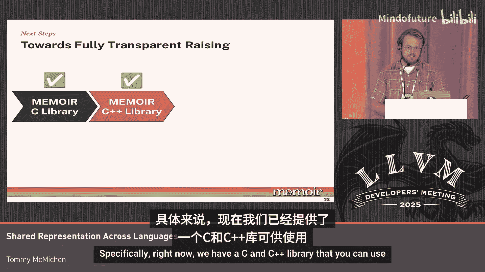

# 066：迈向面向集合的编译


在本节课程中，我们将探讨如何在LLVM中迈向面向集合的编译。我们将了解当前LLVM在处理数据集合时的局限性，并介绍一个名为Memoir的解决方案，它通过扩展LLVM IR，将数据集合提升为一等公民，从而为分析和优化开辟新的可能性。

## 当前LLVM中集合表示的局限性

上一节我们介绍了LLVM作为多种编程语言的共享中间表示。本节中我们来看看数据集合这一常见特性。

数据集合为组织数据组、执行操作、操作数据及访问元素提供了逻辑表示。它们蕴含了丰富的语义信息，可用于分析和优化。例如，它们分离了存储在集合内的数据与集合本身的组织结构。在某些语言中，它们还提供了额外的类型保证。

然而，当我们审视LLVM时，它对集合的视图是较低层次的。具体来说，集合被降低为内存块和指向这些内存块的指针。因此，我们的数据和描述集合组织的元数据都必须被降低到这些内存块中，导致数据和元数据混杂在一起。

结果就是，当我们查看程序中的加载或存储指令时，无法分辨我们正在查看的是数据还是集合本身的元数据，这使得分析这些程序变得非常困难。此外，在很大程度上，这些类型保证基本被丢弃了，我们只剩下一些额外的元数据信息。

## 缺乏集合表示带来的问题

正如之前提到的，这种表示的缺失给我们的分析和优化带来了问题。让我们来看一个具体的例子。

以下是C++中使用无序映射的一个示例：
```cpp
std::unordered_map<int, int> map;
map.insert({1, 10});
map.insert({2, 20});
std::cout << map[1]; // 期望总是输出10
```
人类很聪明，知道打印语句总是会输出常量值10。但我们正在构建的编译器并没有那么智能。目前，没有任何生产级编译器能够将常量10传播到下面的打印语句中。

这是因为第二次插入操作可能导致集合的重新哈希。结果，键`1`对应的逻辑元素可能被移动到一个新的内存位置。由于我们的编译器只在内存位置的概念上操作，我们丢失了关于逻辑元素及其值未改变的所有信息。

## Memoir：面向集合的LLVM IR扩展

为了解决这类问题，我们引入了Memoir。它通过将数据集合作为SSA形式中的一等公民，扩展了LLVM IR。

Memoir接收来自C、C++或Rust的代码，并生成扩展的LLVM IR。这种扩展包括为这些集合添加额外的类型，以及用于访问和更新它们的操作符。

以下是Memoir中集合类型和操作的示意：
```
// 伪代码表示Memoir扩展
%map = memoir.collection.alloc unordered_map<int, int>
memoir.collection.insert %map, {1, 10}
memoir.collection.insert %map, {2, 20}
%val = memoir.collection.access %map, 1
```

## Memoir带来的优化能力

有了Memoir，我们能够执行以集合为中心的优化。以前面的代码为例，现在它被翻译成了Memoir的SSA形式。利用Memoir，我们可以执行之前所需的静态分析。这种分析既易于实现，成本又低，因为它本质上是一种数据流分析。

利用分析结果，我们能够执行之前期望的优化，现在打印语句总是输出常量10。我们还可以消除现在已失效的读取操作。

除了这类简单优化，Memoir还能在这些程序上启用一种新的数据转换范式。例如：
*   **安全地执行死字段消除**：移除集合中不再使用的数据字段。
*   **缓存局部性优化**：例如将“冷”字段从“热”对象中迁移出去。
*   **基于用例的内存布局特化**：例如，根据程序使用模式，使用位集（bitset）替代哈希集合（hashset）。

## Memoir的性能与内存优势

通过Memoir，我们能够提供显著的性能提升，其幅度远大于当前使用LLVM、GCC和ICC等工具所能达到的水平。此外，Memoir能够减少程序的内存使用量，这是现代编译器目前不太具备的新能力。

优化完成后，我们将Memoir集合降低为来自C++标准库、Abseil或Boost的具体实现。这会产生一个LLVM程序，然后我们将其传递给现有的通用编译流水线。

## Memoir的易用性与未来计划



目前，我们正在努力使Memoir更易于使用。具体来说，我们现在有一个C/C++库，你可以用它向编译器暴露这些集合以进行优化。

我们正致力于使其成为一个即插即用的STL替代品，以便更容易地集成到你现有的代码库中。未来，我们计划通过一个Clang前端插件使其完全透明化。然而，目前我们正在进行一些工作，开发一个AI移植工具。如果你等不及完全透明化的方案，这个工具可以将你当前的STL代码转换为使用Memoir集合。

## 总结

本节课中，我们一起学习了当前LLVM在处理高级数据集合语义时的挑战。我们探讨了Memoir如何通过扩展LLVM IR，将集合作为一等公民引入，从而保留丰富的语义信息，并实现更强大、更高效的编译器分析和优化。Memoir不仅提升了性能，还降低了内存占用，并为未来的编译器优化开辟了新的道路。

