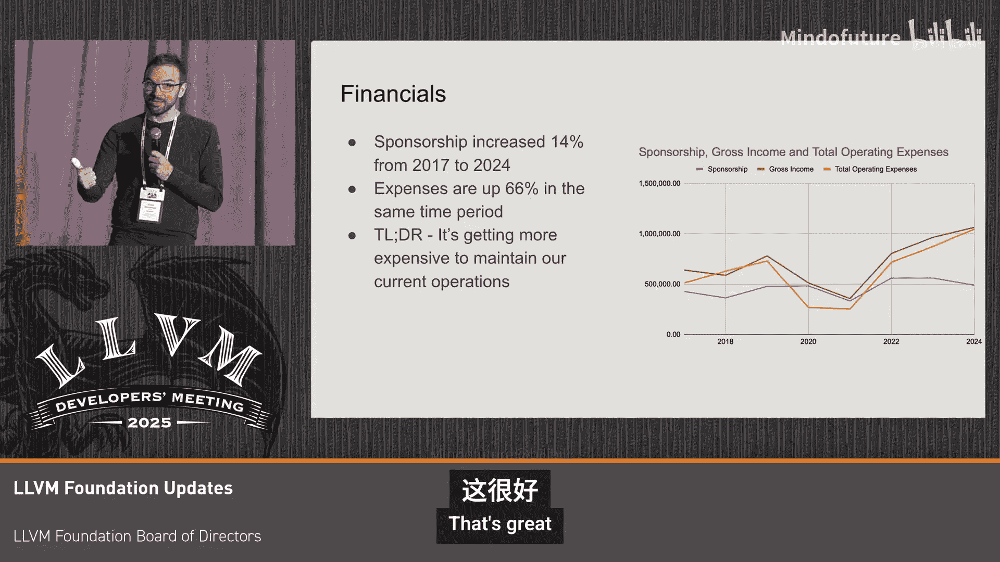

# 067：走近LLVM基金会

## 概述
在本节课中，我们将了解LLVM基金会的基本情况、使命、运作方式以及当前面临的挑战与机遇。我们将学习基金会如何支持LLVM社区，并探讨其财务现状与未来计划。

## 基金会简介
我的名字是Tanya Lattner，我是LLVM基金会的执行董事兼主席。欢迎参加这次非正式的讨论，我们将介绍基金会项目的一些更新，并回答大家的问题。

LLVM基金会是一个501(c)(3)公共慈善组织，成立于2014年。作为一个公共慈善机构，我们服务于公共利益。我们有一个由11人组成的董事会，每两年选举一次，目前基金会有两名员工。

我们的使命如下，其中最后一段最为重要：我们通过帮助社区成长、促进社区互动、通过基础设施保持LLVM开发的高效性，并努力确保LLVM项目的长期健康，来支持LLVM社区。我们希望LLVM在未来许多年都能持续成长和繁荣。

## 基金会项目
我们通过以下项目来执行我们的使命：
*   **教育推广**：包括教育材料和活动，例如LLVM开发者大会。
*   **社区0**：这是我们的多元化和包容性推广计划，提供奖学金和资助。
*   **社区健康与成长**：支持项目基础设施、法律问题以及其他跨领域的工作。

## 董事会成员介绍
现在，我想借此机会介绍一下LLVM基金会的董事会成员。

*   **Chris Bieneman**：我是董事会财务主管，同时也是微软的工程师。
*   **Chris Lattner**：你们可能知道我做的某些事情，我主要在董事会提供建议或帮助解决争议。
*   **Mike Edwards**：我自2018年起担任董事会成员，之前负责财务工作，现在主要在财务委员会帮忙。
*   **Anna**：我在苹果工作，一年前加入董事会，但参与LLVM社区已超过18年。我非常乐意帮助新人，并为未来几代人服务。
*   **Kristof Beyls**：我加入董事会几年了，负责一些事务。
*   **An**：我是一名LLVM贡献者，也在帮助董事会处理各种事务。你们可能通过Google Summer of Code认识我。
*   **David Chisnall**：我是董事会的新成员，从LLVM还是学校项目时就开始参与。我热爱社区的构建方式以及基金会的帮助。
*   **Hera**：我在剑桥大学从事硬件安全工作，也是Linux对冷门安全硬件架构的支持者。我是董事会新成员，但曾在其他八个开源基金会董事会任职，帮助提供历史知识和与其他基金会的联系，并帮助支持基础设施团队获取CI资源。

此外，有两位董事会成员今天无法到场：Wei Wu和Ralf K?chners（董事会秘书）。

## 加入董事会
如果你有兴趣参与，可以加入我们的董事会。我们是自我延续的董事会，每两年进行一次选举，下一轮选举将在2026年8月进行。

我们正在寻找具备不同技能的人来帮助我们完善董事会并实现目标。所需的技能包括：
*   非营利组织经验
*   法律经验
*   会计和财务经验
*   先前董事会服务或开源倡导、社区建设等经验

这并非详尽列表，只是一个示例。但最重要的是，你必须拥有帮助LLVM繁荣发展的热情。

我们有一个申请流程，包括与董事会成员的面试。我们可能会在未来几个月内稍微修改这个流程，并会就此进行沟通。如果你有兴趣了解更多关于日常工作或月度工作的情况，可以与在场的任何董事会成员交谈。

## 项目更新：教育推广
接下来，我们进入项目更新部分，主要讨论教育推广项目。如果你对其他项目有疑问，可以在最后提出。

我们在教育推广项目上取得了巨大成功，本次会议就是明证。我们每年持续组织两次开发者大会。今年六月，我们在亚洲地区（东京）举办了首次活动，有130名与会者。我们看到活动持续增长，几乎回到了疫情前的水平。所有的演讲都会被录制并发布，这是关键的知识库。

然而，我们也面临挑战，因为成本非常高且持续上涨。

这张图表显示了多年来欧洲和美国LLVM开发者大会的出席人数。你可以忽略2020年至2022年的缺口，因为疫情期间我们没有持续举办活动。但如图所示，我们开始接近2019年的水平。

另一方面，正如我们提到的，成本正在上升。从2018年到2024/2025年，这些活动的成本增加了一倍多，这是一个巨大的增长。

尽管如此，得益于赞助商、个人和企业支持者的慷慨捐赠，我们仍然努力使活动尽可能成功。我们仍然能够逐年补贴门票价格。

这张图表显示了开发者大会每年的收入和支出，这是另一种查看方式。你可以看到，我们的门票收入并不完全能覆盖活动的实际支出。

## 财务状况
如果你对我们除了教育推广或活动之外的资金去向感兴趣，开发者大会确实占我们支出的绝大部分，你可以在此饼图中看到亮蓝色的部分。第二大支出是薪酬。奖学金、资助、社区0和基础设施等其他项目占比较小。这些图表展示了我们2024年的支出以及2025年的预测。

让我们谈谈财务状况。从2017年到2024年，我们的赞助收入增长了14%。然而，同期我们的支出增长了66%。简而言之，维持我们现有运营的成本越来越高。

我们的赞助计划在过去10年里变化很小。因此，鉴于活动成本上升以及我们实现使命的能力，董事会成立了一个专门的子委员会，专注于改革我们的赞助计划，以帮助我们实现一些财务目标。

这是我的呼吁：我们确实在寻找更多赞助商，以帮助我们弥合支出与收入之间的差距，同时继续使我们的活动易于参与。因此，如果你有兴趣赞助LLVM基金会，请联系我或任何董事会成员。

## 问答环节
现在，我想深入探讨你们的问题。我将开放提问，任何董事会成员如果想对财务讨论做出更多贡献，也可以发言。

**提问：关于门票价格与赞助**
（Chris Lattner补充）我想指出这张图表。蓝线是我们的赞助收入，红线是我们的总收入，黄线是我们的总支出。目前，我们主要通过提高门票价格来平衡预算。我们一直在讨论的是，门票价格现在高达1200美元，这实际上已经到了一个地步，即使是公司的员工，公司也可能因为价格昂贵而决定减少派遣人数。我们正在讨论是否应该将门票价格降低，比如降到500美元以下。这张图表清楚地表明，如果我们想做到这一点，我们几乎需要将赞助翻倍。因此，我们未来12个月的重点之一将是：如何引入更多资金？如何实现更可持续的基础？另外，图表未显示但很重要的一点是，为了举办这次活动，我们在收到任何门票收入之前，就必须预先支付大约30万美元。我们必须维持足够的现金储备来覆盖所有这些预付款。目前我们的现金储备尚可，但随着活动成本增加，五年后可能就不够了。因此，我们也在思考如何确保拥有可持续的基础和收入增长，以在未来支持社区。

**提问：关于参会人数上限**
我们总是基于场地空间和物流对参会人数有一定限制。此外，因为我们向酒店保证了一定的消费额，并且我们尽量保守以避免超额支付，所以也会有一些限制。今年我们没有售罄，最多可容纳550人。尽管今年没有售罄，但我们的参会人数同比增长了近13%，增长非常显著。

**提问：最大的成本是什么？**
最大的成本是餐饮，而不是场地租金。

**提问：关于基金会法律结构的影响**
（Chris Lattner回答）LLVM基金会是501(c)(3)非营利组织，这与教堂等属于同一类别。这意味着我们的章程是确保社区成功。其他许多非营利基金会，如Linux基金会，是501(c)(6)组织，这类组织通常是会员制，可能导致“付费即玩”的情况，公司可以通过投入资金获得权利等。这导致公司可能为Rust（注：此处为举例，Rust基金会也是501(c)(6)）投入比LLVM更多的资金，这看起来不太合理。我们选择(c)(3)结构是为了确保LLVM的长期可持续性，并有一个由选举产生的董事会来确保LLVM长期成功，而不是被公司政治左右。但另一方面，这带来了资金挑战。因此，我们需要帮助向你们的组织解释基金会的价值，沟通和理解这一点非常重要。

**提问：关于税收抵扣**
（Mike Edwards补充）作为501(c)(3)组织，赞助商给我们的捐款赞助费是完全免税的。这是一个很好的卖点，可以告诉你的老板，如果他们开出更大的支票，年底报税时可以获得相应的更大税收减免。

**提问：是什么阻止了大公司赞助商捐赠更多钱？**
我认为关键是我们从未要求过更多资金。我们的赞助商年复一年非常慷慨地开出支票，但可能10年前批准的金额就一直沿用至今，因为一旦进入支付流程，再去要求更改很困难。未来一年，我们的财务委员会和赞助委员会将会主动去敲门，礼貌地请求更多帮助，因为做所有这些事情的成本越来越高了。

（Chris Bieneman补充）董事会需要做的是，清楚地告诉赞助商我们将用这些钱做什么，以及这将如何为他们的员工和整个生态系统带来价值。我们需要更好地阐明这一点，这是我们今年要做的事情。

**提问：关于其他收入来源（如拨款、个人捐赠）**
我们目前没有考虑拨款，过去也没有。这不意味着我们不会改变主意，但这取决于拨款是否附带条件。至于个人捐赠者，你可以在LLVM网页上找到捐赠按钮直接捐款。我们也尝试通过商品等方式激励捐赠，但这部分收入很少。此外，今年我们加入了Github Sponsors，你可以在Github上赞助我们。

（David Chisnall补充）个人捐赠是免税的。许多人可能不知道，如果你捐赠增值资产（如股票），可以避免资本利得税，同时获得慈善捐赠的税收减免。你可以将股票捐赠给基金会，基金会出售时无需支付资本利得税，而你获得全额捐赠价值的税收减免。此外，你的公司可能提供企业匹配捐赠，你应该查看是否适用于向LLVM基金会的捐赠。

（Chris Lattner补充）捐赠增值股票可以获得三到五倍的捐赠价值效益，如果再结合公司匹配，效益倍数更高。这对慈善机构非常有益。

**提问：关于增加赞助商数量**
我们绝对没有达到上限。有很多使用LLVM的公司目前并未赞助LLVM基金会。作为董事会，我们需要改进对公司的外联工作，提出赞助请求。我们之前要求得不够多，这可能是因为很长时间以来我们不需要这样做。此外，今年在亚洲举办活动也是为了开拓新市场，开辟更多赞助机会。建立赞助渠道需要时间，我们有很多工作要做。使用或基于LLVM构建产品的公司数量巨大，其中很多不在我们的赞助商名单上，因此我们有很多机会。

**提问：LLVM的贡献是否集中在少数几家公司？**
不，绝对在增长。我们看到每年都有新公司加入这个项目。LLVM项目正在广泛增长，社区变得如此庞大和活跃，我们需要思考如何将这种增长也带入基金会的赞助中。

## 总结
本节课中，我们一起学习了LLVM基金会的使命、组织结构和核心项目。我们了解了基金会主要通过教育推广（如开发者大会）、社区0和社区健康项目来支持LLVM生态。同时，我们也深入探讨了基金会当前面临的财务挑战，特别是活动成本上升与收入增长之间的差距，以及董事会为寻求更可持续的运营模式所做的努力。最后，我们看到了社区参与和支持（无论是通过赞助、个人捐赠还是加入董事会）对于基金会和LLVM项目长期健康发展的重要性。

感谢大家的参与。请随时与任何董事会成员交流，提出更多问题或分享你对社区的需求和想法。本次会议结束后，大家可以前往海报展示区，那里有一些点心和咖啡。