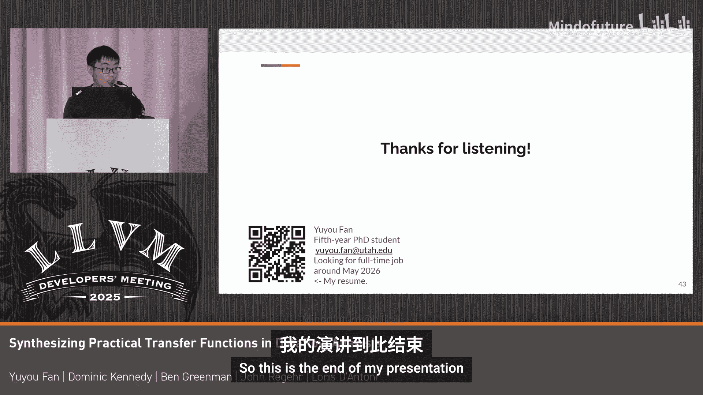

# 068：数据流分析中实际传递函数的合成

## 概述
在本教程中，我们将学习如何在数据流分析中合成实际的传递函数。我们将从数据流分析的基础概念开始，逐步解释已知位分析，探讨手动编写传递函数的挑战，并最终介绍一种能够自动合成正确且精确的传递函数的方法。

## 数据流分析与已知位分析回顾
上一节我们概述了本教程的目标，本节我们来回顾数据流分析的基本概念。数据流分析旨在获取在所有程序执行路径上都成立的信息或属性。

右侧是一个简单的LLVM IR示例函数。数据流分析试图获取在所有执行中都成立的信息。一个具体的例子是“已知位”分析。它试图确定某个比特位在所有执行中是否总是0或总是1。

对于已知位，有三种可能性：
*   **0**：在所有执行中，该位都是0。
*   **1**：在所有执行中，该位都是1。
*   **未知**：该位可能是0，也可能是1。

根据这个定义，我们来看第一个操作 `%n3 = and i4 %a, 3`。`%a` 是一个4位宽的未知操作数，`3` 是常量。经过这个 `and` 操作后，我们知道结果的高两位总是0，低两位未知。这意味着 `%n3` 可能的运行时值是0、1、2、3。

类似地，对于下一个操作 `%n1 = and i4 %b, 1`，我们知道结果的高三位总是0，最低位是1。因此 `%n1` 可能的运行时值是0和1。这就是已知位信息。

LLVM使用两个成员变量来实现已知位信息：`KnownZero` 和 `KnownOne`。右侧附有两个示例：
*   如果一个位总是0，那么 `KnownZero` 中对应的位被置位。
*   如果一个位总是1，那么 `KnownOne` 中对应的位被置位。
*   如果未知，则两个位都不置位。

## 传递函数的作用
既然我们知道了 `%n3` 和 `%n1` 的已知位信息，如何推断出 `%xor` 结果的已知位信息呢？

右侧附有异或操作的已知位真值表。通过应用这个真值表，我们可以得到结果。在LLVM中，他们通过一个传递函数来实现这个真值表。这个函数接收两个操作数（`%n3` 和 `%n1`）的已知位信息，执行几行代码来计算，并将结果信息附加到 `%xor` 上。

在这个例子中，传递函数接收两个操作数的已知位信息，并返回结果的已知位信息。这是一个简单的异或操作转换。

LLVM为已知位域中的不同操作实现了许多传递函数，其中一些非常复杂。例如，加法操作的传递函数 `computeForAddCarry` 是一个用于加法和减法的实用函数。它接收两个已知位操作数，调用 `getMinValue`、`getMaxValue` 等函数，结合位运算，最终返回结果。这个过程至少可以说不够直观。

总结一下，已知位只是LLVM提供的一个分析域。还有其他域，如整数范围分析或活跃变量分析。LLVM为不同域上的不同操作实现了各种传递函数。

## 为什么需要合成器？
上一节我们了解了传递函数的作用，本节我们来看看为什么需要自动合成器。首先，让我们看看合成器能做什么。

简而言之，合成器读取一个规范。以已知位为例，规范包括：
1.  已知位域的定义。
2.  要应用的操作（例如，`xor`、`add`）。
3.  传递函数的签名（例如，接收两个已知位信息作为参数）。

合成之后，我们可以产生一个结果：一个正确的传递函数。它能确保：
*   **正确性**：总是给出正确的信息。
*   **合理性**：至少返回合理的结果。
*   **可用性**：可用于优化或过程间分析。
*   **可嵌入性**：可以直接包含在您的项目中，并在数据流分析中调用。

那么，为什么需要合成器呢？首先，当然是为了获得更多的传递函数。

以下是不同平台上已实现传递函数的内在函数数量与内在函数总数的对比表（基于公开信息）：
*   **X86 (LLVM)**：已实现 30 个，总数 1714 个。
*   **ARM**：已实现 5 个。
*   **AArch64**：已实现 2 个。

通过使用合成器，我们可以获得更多传递函数。

另一个例子是MIR（Machine IR）中的CodeGen。CodeGen是LLVM后端项目中使用的一个域，它只包含7个操作的传递函数，而操作总数是20个。对于RISC-V，则完全没有已知位分析。因此，我们相信其他领域（如WebAssembly、AMDGPU）也能从合成器中受益，从而获得更多的传递函数。

您可能会问：没有传递函数也没关系，我可以复用LLVM IR中现有的那些。

接下来，我将解释复用现有传递函数的困难所在。

首先，是的，他们确实尝试过复用。上面的例子是CodeGen中使用的最长的传递函数。如果传入的操作是常量操作，CodeGen会直接复用LLVM的已知位结构，调用 `KnownBits::makeConstant` 函数并返回结果。

第一个问题是操作语义可能不同。底部有一个关于移位操作的例子。在CodeGen中，如果移位量大于或等于位宽，结果是0。例如，移位量是5，位宽是4，结果是0。

然而，在LLVM IR中，它定义移位量必须小于位宽，否则结果返回 `poison`。这是第一个问题。

第二个问题涉及MIR中的另一个分析：整数范围分析。它试图确定一个变量是否总是落在某个整数范围内（通过上下界表示）。有一个文件 `inferIntRange` 提供了一组实用函数，被两个后端（AArch64和AMDGPU）共享。

在顶部的例子中，AArch64后端的 `and` 操作直接调用了 `inferIntRange` 文件中的 `inferAnd` 函数，这很好。

然而，对于AMDGPU后端，它首先调用 `inferAnd`，然后调用一个适配器函数 `inferIndexOp` 将结果转换到索引域。这意味着程序员必须手动编写这些适配器，这很容易出错，并且可能包含错误。这是一个挑战。

合成器的最后一个好处是我们可以证明传递函数的正确性。

为了定义正确性，这里引入两个概念：
1.  **正确性**：结果必须覆盖所有可能的运行时值。
    *   示例：假设实际的运行时值集合是 `{0}`。如果一个错误的不正确结果说“未知”（可能的值是 `{0, 1}`），这仍然是正确的，因为它覆盖了实际值。如果一个错误的不正确结果说“总是1”（可能的值是 `{1}`），这就不正确，因为它没有覆盖实际值0，可能导致错误的优化。
2.  **精确性**：结果中包含的、永远不会在运行时出现的值越少越好。
    *   示例：假设实际的运行时值集合是 `{0}`。
        *   最精确的结果是“总是0”（`{0}`）。
        *   一个不那么精确但仍然是正确的结果是“未知”（`{0, 1}`），因为它包含了不会出现的值1。
    *   在图表中，如果A和B都是正确的，且A是B的子集，那么A比B更精确。

## 合成器的设计
上一节我们探讨了需要合成器的原因，本节我们来看看合成器的设计。合成器的大致流程是：读取规范，生成一批候选传递函数，评估这些候选函数，将正确的候选函数加入解决方案集，不断修剪解决方案集，最终快速生成解决方案。

现在让我们看看规范包含什么。规范包含三个部分：
1.  **域的定义**：例如，对于已知位域，包括域成员（`KnownZero`, `KnownOne`）。
2.  **域的约束**：例如，在已知位中，一个位不能同时是0和1。
3.  **构造函数**：例如，已知位的默认构造函数返回“全未知”；`meet` 操作接收两个已知位信息，返回它们的交集。
4.  **操作的定义**：假设操作必须配备SMT语义（例如，可以将 `xor`、`add` 转换为SMT表达式）。操作本身可能包含一些约束（例如，移位量必须小于位宽）。
5.  **传递函数的签名**：例如，接收左操作数和右操作数的已知位信息。

有了规范之后，我们从函数签名开始，用随机操作填充函数体，并逐步进行变异。

我们使用随机搜索的原因是搜索空间极其庞大，无法穷举所有可能性。以下是一个单步变异的具体例子。代码片段中包含 `autogen9`, `autogen10`, `autogen11` 等变量。有两种变异可能：
1.  随机选择一个操作，改变其操作数（例如，将 `autogen9 & autogen10` 改为 `autogen9 | autogen10`）。
2.  改变一个操作数（例如，将第一个操作数从 `autogen6` 改为 `autogen9`）。

找到可能的候选函数后，我们需要评估它们。评估引擎从底部接收一个候选函数，将其发送到SMT求解器检查正确性。如果正确，则加入解决方案集；否则拒绝。

另一种方式是在低位宽上进行穷举测试，以评估其精确度。如果一个候选函数正确但精确度很低，我们仍然不想要。

合成器保留两种候选函数：
1.  正确且高精确度的候选函数。我们保留它。
2.  仅在特定条件下正确（但仍有高精确度）的候选函数。这意味着它们只在一小部分情况下正确，必须通过前提条件来捕获。对于这类候选函数，我们不是合成函数体，而是合成一个 `if` 前提条件。如果前提条件为真，则执行候选函数体并返回结果。

通过不断将候选函数加入解决方案集，解决方案集会变得越来越大。我们希望移除那些效率较低的函数。这里我们使用一种贪心策略：
1.  从旧的解决方案集开始（初始为空）。
2.  基于新的（当前）解决方案集评估所有候选函数。
3.  选择贡献最大的候选函数（例如，能处理最多之前未覆盖的输入情况）。
4.  如果其贡献大于0，则将其加入新的解决方案集，并重复此过程。
5.  如果最大贡献为0，意味着剩余的候选函数无用，我们停止此过程。

最终，我们将得到一个包含一组候选函数的解决方案集，并生成一个简单的传递函数。我们合并所有候选函数或部分解决方案的结果。以下是合成出的 `xor` 传递函数示例，它包含两个候选函数（部分解决方案），最终通过 `meet` 操作合并结果。

另一个更复杂的例子是减法操作，它包含16个部分解决方案，需要多次合并才能返回最终结果。这种方法有效的原因是，我们确保每个候选函数都是正确的，因此合并所有结果后仍然是正确的，因为它必须覆盖所有运行时值。

## 实验结果与总结
最后，我们来看一些实验结果。我们在已知位域上对39个操作进行了合成测试，使用随机API输入进行评估。

左侧表格显示了我们表现良好的操作：
*   `and`、`or`、`xor`：与LLVM的精确度相同。
*   `mul`（乘法）：我们达到59%的精确度，优于LLVM的53%。
*   `shl.sat`（饱和左移）：我们达到79.7%的精确度，而LLVM不支持此操作。
*   `mul`（另一种形式）：我们达到60%的精确度。

右侧表格显示了我们表现不佳的操作：
*   `averageFloor`：我们只有不到40%的精确度。
*   `sadd.sat`、`ssub.sat`、`absdiff`：我们只有约60%的精确度，而LLVM接近100%。

结果表明，结果对随机因素（如初始程序和随机变量）非常敏感。

我们还在2017年的CPU上使用SPEC基准测试进行了评估。总体而言，我们做得不算差。与GCC相比，我们比较了LLVM实现的已知位分析和我们合成的分析。我们只损失了1.78%的精确度，甚至与MCF项目达到了相同的结果。在其他项目中，我们有大约3-5%的损失。我们在X64上也做了一些不好的工作，我们认为这可能包含了许多我们的合成器处理不佳的指令。

总结一下，我们的目标不是超越LLVM，而是在面对新的数据域、新的分析域或新的操作时，生成正确且精确的传递函数。通过读取规范以及配备了SMT语义的操作，用户可以生成可用于数据流分析的正确传递函数。

本教程到此结束。