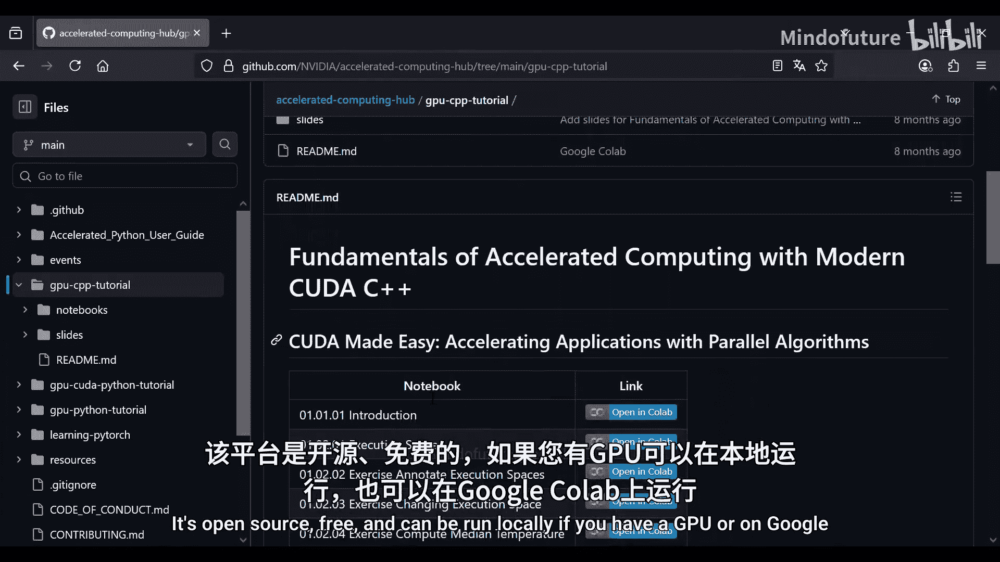
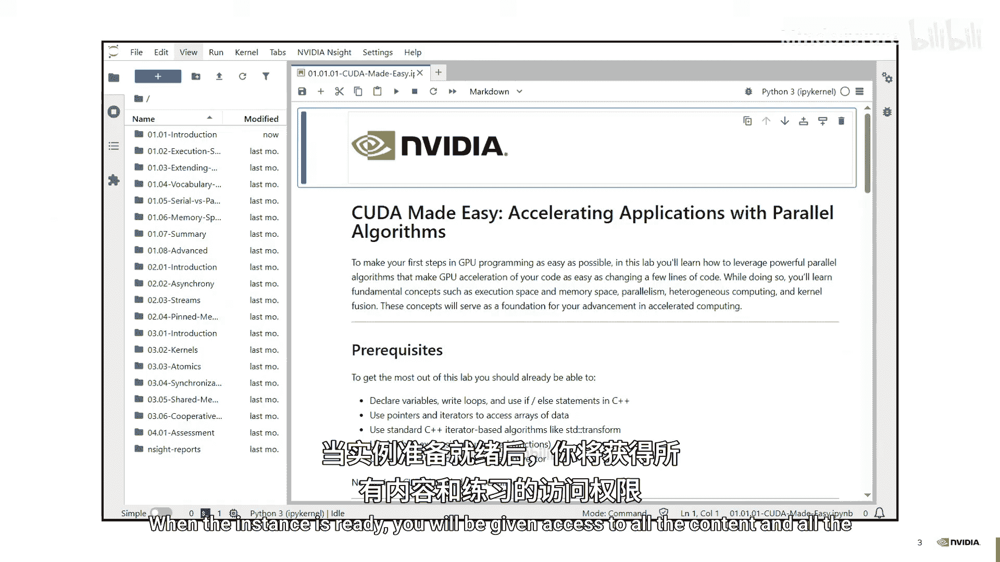

# 001：使用并行算法加速应用






## 概述
在本节课中，我们将学习如何使用NVIDIA最新的编程工具在GPU上进行编程。我们将从理解CPU与GPU的基本区别开始，逐步学习如何通过简单的代码修改，利用并行算法和CUDA生态中的库（特别是Thrust）来显著加速应用程序。课程内容涵盖执行空间、并行算法、迭代器、内存空间等核心概念，旨在让初学者能够轻松上手GPU编程。

---

## 1. CPU与GPU的区别

上一节我们介绍了课程概述，本节中我们来看看CPU和GPU的核心区别。

我们可以用公交车和汽车来类比CPU和GPU。公交车一次可以运送很多人，但速度通常比汽车慢。汽车速度更快，但一次只能运送少数人。哪个“更快”取决于你的目标：是快速运送少数人，还是高效运送大批人。

CPU和GPU的关系与此类似。
*   **CPU**：延迟低（约100纳秒），但内存带宽有限（约100 GB/s）。它像汽车，处理少量数据时速度极快。
*   **GPU**：延迟较高（约500纳秒），但拥有极高的内存带宽（约1 TB/s）。它像公交车，虽然处理单个数据项稍慢，但能同时处理海量数据。

因此，选择CPU还是GPU取决于问题的规模：处理少量数据时CPU更高效；处理海量数据时，GPU的巨大带宽优势将带来显著的性能提升。

---

## 2. 一个简单的模拟问题

理解了硬件区别后，我们来看一个具体的例子：模拟多个杯子在室温下的冷却过程。

假设我们有多个杯子，每个都有不同的初始温度。我们想模拟它们随时间逐渐接近室温（20°C）的过程。每个杯子的温度变化遵循一个简单的独立公式：

**`T_next = T_prev + k * (T_room - T_prev)`**

其中，`k`是冷却系数。每个杯子的温度演化是独立的，互不影响。这种大量独立、可并行执行的任务，正是GPU擅长处理的。

以下是使用C++标准库在CPU上实现的代码：

```cpp
#include <vector>
#include <algorithm>
#include <iostream>

int main() {
    float k = 0.5f; // 冷却系数
    std::vector<float> temps = {42.0f, 24.0f, 50.0f}; // 初始温度
    float room_temp = 20.0f;

    // 定义温度更新公式的Lambda函数
    auto update_temp = [k, room_temp](float t_prev) {
        return t_prev + k * (room_temp - t_prev);
    };

    // 模拟3个时间步长
    for (int step = 0; step < 3; ++step) {
        std::transform(temps.begin(), temps.end(), temps.begin(), update_temp);
        // 打印当前温度
        for (auto t : temps) std::cout << t << " ";
        std::cout << std::endl;
    }
    return 0;
}
```
`std::transform`算法将`update_temp`函数应用于`temps`向量的每个元素。目前，这一切都在CPU上串行执行。

---

## 3. 执行空间：指定代码运行位置

上一节我们看到了CPU上的串行实现，本节中我们来看看如何告诉编译器让代码在GPU上运行。

编译器（如`g++`用于CPU，`nvcc`用于NVIDIA GPU）负责将高级C++代码转换为特定硬件能执行的机器指令。然而，仅仅使用`nvcc`编译并不会自动让代码在GPU上运行。我们需要在代码中明确指定哪些部分应在GPU（设备）上执行，哪些部分应在CPU（主机）上执行。这就是**执行空间**的概念。

我们通常不从头编写所有GPU代码，而是使用库。NVIDIA提供了Thrust库，它提供了类似于C++标准模板库（STL）的接口，但算法能在GPU上执行。这让我们能够以熟悉的方式编写高性能GPU程序。

要将之前的冷却模拟代码移植到GPU，需要进行几处修改：

```cpp
#include <thrust/device_vector.h>
#include <thrust/transform.h>
#include <thrust/execution_policy.h>

int main() {
    float k = 0.5f;
    thrust::device_vector<float> temps = {42.0f, 24.0f, 50.0f}; // 数据位于GPU
    float room_temp = 20.0f;

    // Lambda函数需要标明可在主机和设备上执行
    auto update_temp = [k, room_temp] __host__ __device__ (float t_prev) {
        return t_prev + k * (room_temp - t_prev);
    };

    for (int step = 0; step < 3; ++step) {
        // 使用thrust::transform并指定在设备上执行
        thrust::transform(thrust::device, temps.begin(), temps.end(), temps.begin(), update_temp);
        // ... 输出结果（需要将数据拷贝回CPU）
    }
    return 0;
}
```

关键修改点：
1.  **容器**：`std::vector` 替换为 `thrust::device_vector`，确保数据分配在GPU内存中。
2.  **执行空间限定符**：在Lambda函数前添加`__host__ __device__`，指示编译器为此函数生成CPU和GPU均可执行的代码。
3.  **算法与执行策略**：`std::transform` 替换为 `thrust::transform`，并通过 `thrust::device` 参数明确要求算法在GPU设备上执行。

**执行空间限定符**（`__host__`, `__device__`）在编译时告诉编译器为哪个架构生成代码。**执行策略**（`thrust::host`, `thrust::device`）则在运行时告诉Thrust库在哪个硬件上执行算法。两者需要配合使用。

---

## 4. 并行算法与Thrust

我们已经学会了如何运行一个简单的变换操作，本节中我们来看看Thrust中更多的并行算法。

Thrust提供了丰富的并行算法，其接口与STL算法相似，使得移植代码变得简单。例如，计算一个温度序列的中位数，可以先排序再取中间值。在CPU上，我们使用`std::sort`。在GPU上，我们只需将其替换为`thrust::sort`。

```cpp
// CPU版本 (串行)
#include <algorithm>
float median_cpu(std::vector<float>& data) {
    std::sort(data.begin(), data.end());
    return data[data.size() / 2];
}

// GPU版本 (并行)
#include <thrust/device_vector.h>
#include <thrust/sort.h>
float median_gpu(thrust::device_vector<float>& data) {
    thrust::sort(thrust::device, data.begin(), data.end());
    return data[data.size() / 2];
}
```
直接尝试在标记为`__device__`的函数中调用`std::sort`会失败，因为STL算法没有为GPU编译的版本。而`thrust::sort`是专为GPU设计的并行排序算法，能够充分利用GPU的众核优势。

---

## 5. 组合算法与性能陷阱

有时我们需要组合多个算法来实现复杂功能。例如，计算两个时间步之间温度的最大差值。朴素的方法是先计算差值数组，再求该数组的最大值。

```cpp
// 朴素方法：先变换，后归约
thrust::device_vector<float> diff(N);
// 1. 变换：计算差值
thrust::transform(thrust::device, A.begin(), A.end(), B.begin(), diff.begin(),
                  [] __host__ __device__ (float a, float b) { return fabs(a - b); });
// 2. 归约：求最大值
float max_diff = thrust::reduce(thrust::device, diff.begin(), diff.end(),
                                0.0f, thrust::maximum<float>());
```
这种方法需要分配临时数组`diff`，导致 `3N` 次内存读取（两次读A/B，一次读diff）和 `N` 次内存写入（写diff）。如果手动编写循环，可以在单次遍历中同时计算差值和更新最大值，只需 `2N` 次读取和 `1` 次写入（存储最终结果）。这引出了一个问题：如何让Thrust以更高效的方式组合操作？

答案就是使用**Fancy Iterators（花式迭代器）**。

---

## 6. Fancy Iterators（花式迭代器）

上一节我们发现组合算法可能产生额外开销，本节中我们介绍一种强大的工具——Fancy Iterators来消除这种开销。

迭代器是指针的泛化，它提供了类似指针的接口（如解引用、递增），但行为可以自定义。Thrust提供的Fancy Iterators允许我们在数据“流动”的过程中进行即时转换，而无需物化（分配内存存储）中间结果。

以下是几种重要的Fancy Iterators：

### 计数迭代器 (`thrust::counting_iterator`)
它不存储任何序列，而是在被访问时动态生成连续的整数。
```cpp
// 打印1到42。没有内存分配，数字是即时生成的。
thrust::for_each(thrust::device,
                 thrust::make_counting_iterator(1),
                 thrust::make_counting_iterator(43),
                 [] __host__ __device__ (int i) { printf("%d\n", i); });
```

### 变换迭代器 (`thrust::transform_iterator`)
它在迭代过程中，将给定的函数应用于底层迭代器的每个元素。
```cpp
thrust::device_vector<int> vec = {1, 2, 3};
// 创建一个视图，使得所有元素看起来都乘以了2
auto doubled_view = thrust::make_transform_iterator(
    vec.begin(),
    [] __host__ __device__ (int x) { return x * 2; }
);
// 此时遍历doubled_view，会得到2, 4, 6，但原vec并未改变。
```

###  zip迭代器 (`thrust::zip_iterator`)
它将多个序列“压缩”成一个，迭代时同时返回多个序列中对应位置的元素组成的元组。
```cpp
thrust::device_vector<int> A = {0, 1, 2};
thrust::device_vector<int> B = {5, 4, 2};
// 创建一个迭代器，同时遍历A和B
auto zipped = thrust::make_zip_iterator(thrust::make_tuple(A.begin(), B.begin()));
// 解引用zipped会得到一个元组，例如 (0, 5)
```

---

## 7. 使用Fancy Iterators优化

现在，我们可以使用Fancy Iterators来优化之前计算最大差值的问题。我们可以创建一个迭代器，它“看起来”像一个存储了绝对差值的序列，但实际上是在迭代时动态计算。

```cpp
// 高效方法：使用zip和transform迭代器组合，在归约过程中即时计算差值
auto diff_iterator = thrust::make_transform_iterator(
    thrust::make_zip_iterator(thrust::make_tuple(A.begin(), B.begin())),
    [] __host__ __device__ (const thrust::tuple<float, float>& t) {
        return fabs(thrust::get<0>(t) - thrust::get<1>(t)); // 计算绝对值差
    }
);

float max_diff = thrust::reduce(thrust::device,
                                 diff_iterator,
                                 diff_iterator + N,
                                 0.0f,
                                 thrust::maximum<float>());
```
通过这种方式，`thrust::reduce`遍历的“数组”就是我们动态生成的差值序列。整个过程只需要读取`A`和`B`（共`2N`次），一次归约操作，并写入最终结果。完全避免了临时数组`diff`的分配和读写，性能显著提升，内存占用也更少。

---

## 8. 更复杂的案例：2D热扩散模拟

前面的例子都是独立操作，本节我们看一个更贴近实际、元素间有依赖关系的案例：二维热扩散模拟。

在2D热扩散中，一个单元格下一时刻的温度取决于它自身及其上下左右四个邻居的当前温度。我们使用一个5点模板（Stencil）来计算。虽然计算涉及邻居，但每个单元格的计算仍然可以并行进行，因为所有计算都基于同一时刻的数据。

我们需要将二维网格展平为一维数组进行处理。对于每个线程（处理一个单元格），我们需要根据其全局一维索引`id`计算出对应的二维坐标`(row, col)`。
```cpp
int row = id / width;
int col = id % width;
```
然后，在Lambda函数中，我们根据`row`和`col`访问自身及邻居的数据，应用物理公式计算新温度，并注意处理边界条件（例如，边界温度保持不变）。

Thrust的`transform`或`tabulate`算法非常适合这种模式：每个线程处理一个独立的单元格。
```cpp
thrust::tabulate(thrust::device,
                 output.begin(), output.end(),
                 [input_ptr, width, height] __host__ __device__ (int id) {
                     int row = id / width;
                     int col = id % width;
                     // 边界检查
                     if (row == 0 || row == height-1 || col == 0 || col == width-1) {
                         return input_ptr[id]; // 边界保持不变
                     }
                     // 内部点：使用5点模板计算新温度
                     float center = input_ptr[id];
                     float left   = input_ptr[id - 1];
                     float right  = input_ptr[id + 1];
                     float top    = input_ptr[id - width];
                     float bottom = input_ptr[id + width];
                     return some_physics_formula(center, left, right, top, bottom);
                 });
```

---

## 9. 使用CUDA C++标准库中的词汇类型

在编写GPU代码时，我们经常使用像`std::pair`, `std::tuple`这样的词汇类型。然而，STL中的这些类型通常没有标记为`__device__`，无法在GPU代码中直接使用。

NVIDIA提供了`libcu++`（CUDA C++ Standard Library），它包含了为GPU优化且带有`__host__ __device__`注解的对应类型，可以作为STL类型的直接替代品。

```cpp
// 使用 libcu++ 中的 pair
#include <cuda/std/utility>
auto my_pair = cuda::std::make_pair(42, 3.14f); // 可在主机和设备代码中使用
```

此外，对于多维数组访问，手动计算索引容易出错且代码冗长。`libcu++`也提供了`mdspan`（多维视图），它允许我们以多维方式访问底层的一维数据，使代码更清晰、更安全。

```cpp
#include <cuda/std/mdspan>
// 假设data_ptr指向一个height * width大小的float数组
cuda::std::mdspan<float, cuda::std::dextents<int, 2>> grid_2d(data_ptr, height, width);
// 现在可以像使用2D数组一样访问
float val = grid_2d(row, col); // 访问第row行，第col列
float neighbor_left = grid_2d(row, col - 1);
```
使用`mdspan`后，热扩散模拟中的邻居访问代码变得非常直观，极大地减少了索引计算错误。

---

## 10. 高级并行模式：按Key归约

在模拟中，我们可能想计算每行温度的总和。一种简单的方法是使用`tabulate`，让每个线程处理一行，并在线程内循环累加该行所有列。但这种方法在行数远少于列数时，GPU并行度很低，利用率不足。

更好的方法是使用**按Key归约**。我们将每个单元格的**行号**作为Key，**温度值**作为Value。`thrust::reduce_by_key`算法会自动将具有相同Key（即同一行）的所有Value归约起来（例如求和）。

```cpp
// 1. 创建Key数组（行号）。可以使用计数迭代器和变换迭代器动态生成，避免分配。
auto row_id_iterator = thrust::make_transform_iterator(
    thrust::make_counting_iterator(0),
    [width] __host__ __device__ (int id) { return id / width; } // 动态计算行号
);

// 2. 执行按Key归约求和
thrust::device_vector<float> row_sums(height); // 存储每行的和
// 我们不需要输出的Key，使用discard_iterator丢弃
thrust::reduce_by_key(thrust::device,
                      row_id_iterator, row_id_iterator + total_cells, // Key范围
                      temperatures.begin(),                           // Value范围
                      thrust::make_discard_iterator(),                // 输出Key（丢弃）
                      row_sums.begin()                               // 输出Value（行和）
                     );
```
这种方法将工作均匀分布到所有处理单元格的线程上，并行度最大化，性能远高于`tabulate`内嵌循环的方法。

---

## 11. 内存空间与数据传输优化

到目前为止，我们主要关注计算优化。本节我们关注另一个关键性能因素：内存。

我们一直使用`thrust::universal_vector`，它位于**统一内存**中。统一内存让数据可以被CPU和GPU透明地访问，系统在背后自动进行数据迁移。然而，这种自动迁移是有成本的。如果CPU和GPU频繁交替访问数据，就会产生大量的隐式数据传输，严重拖慢程序。

例如，在模拟循环中：在GPU上计算一个时间步 -> 将结果保存到磁盘（需要CPU访问） -> 在GPU上计算下一个时间步。使用统一内存时，保存到磁盘会触发设备到主机的数据传输，而下一个时间步的计算又会触发主机到设备的数据传输，导致计算被传输延迟。

解决方案是使用显式的内存空间，并手动控制数据传输：
*   `thrust::host_vector`: 数据仅位于主机内存。
*   `thrust::device_vector`: 数据仅位于设备内存。
*   `thrust::copy`: 在主机和设备之间显式拷贝数据。

优化后的流程：
```cpp
thrust::device_vector<float> d_data(N); // 设备数据
thrust::host_vector<float> h_data(N);   // 主机数据

for (int step = 0; step < steps; ++step) {
    // 1. 在GPU上模拟
    simulate_on_gpu(d_data);
    // 2. 显式拷贝到主机（仅在需要时）
    thrust::copy(d_data.begin(), d_data.end(), h_data.begin());
    // 3. 在CPU上保存到磁盘
    save_to_disk(h_data);
    // 4. 下一个循环，d_data仍在GPU上，无需传输即可直接计算
}
```
通过这种方式，我们确保了计算数据常驻GPU，只在必要时支付一次性的、显式的数据传输开销，从而避免了模拟循环中的性能抖动。

---

## 总结
本节课中我们一起学习了现代CUDA C++编程的基础知识，重点是如何使用Thrust库和并行算法加速应用。我们涵盖了以下核心内容：

1.  **硬件理解**：CPU与GPU在延迟和带宽上的根本区别，决定了它们分别适合处理不同规模的问题。
2.  **执行模型**：通过`__host__`/`__device__`限定符和Thrust的执行策略（`thrust::device`），明确控制代码在何处编译以及在何处执行。
3.  **Thrust库**：作为GPU上的“STL”，提供了丰富的并行算法（如`transform`, `sort`, `reduce`），使得移植CPU代码到GPU变得简单。
4.  **Fancy Iterators**：强大的工具，通过组合计数、变换、zip等迭代器，能够动态生成和转换数据视图，消除不必要的中间存储和内存访问，极大提升性能。
5.  **复杂模式实现**：学习了如何利用`tabulate`处理映射问题，以及使用`reduce_by_key`实现高效的分组归约，以充分利用GPU并行性。
6.  **CUDA C++标准库**：使用`libcu++`中的`pair`, `mdspan`等类型，编写更安全、更清晰且兼容GPU的代码。
7.  **内存管理**：理解统一内存的便利与潜在开销，学会使用显式的`host_vector`/`device_vector`和`thrust::copy`来精确控制数据位置和传输，避免性能陷阱。


通过掌握这些概念，你已经能够开始使用GPU的强大并行能力来加速自己的C++应用程序。记住关键思路：**将问题表达为数据并行的操作，利用高效的库和算法，并谨慎管理内存和数据传输**。