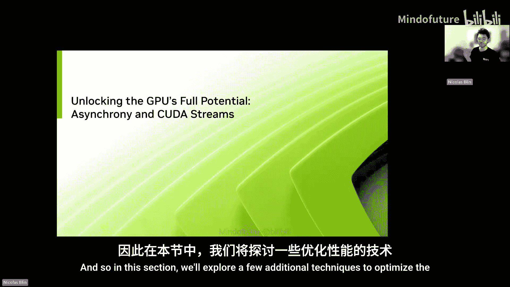
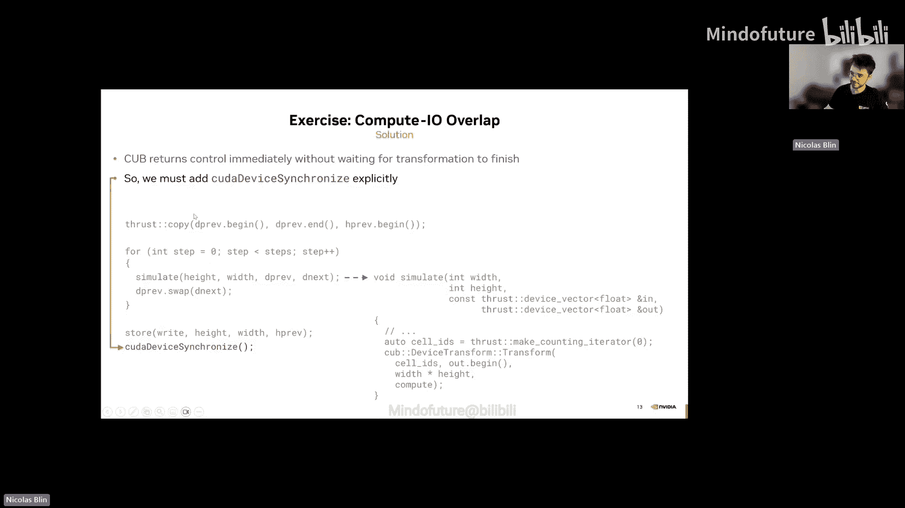
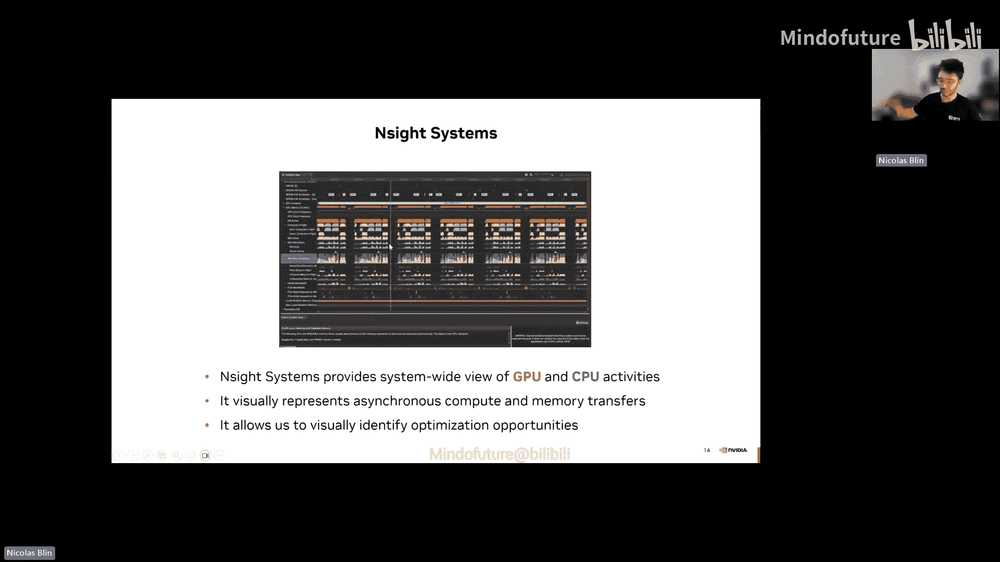
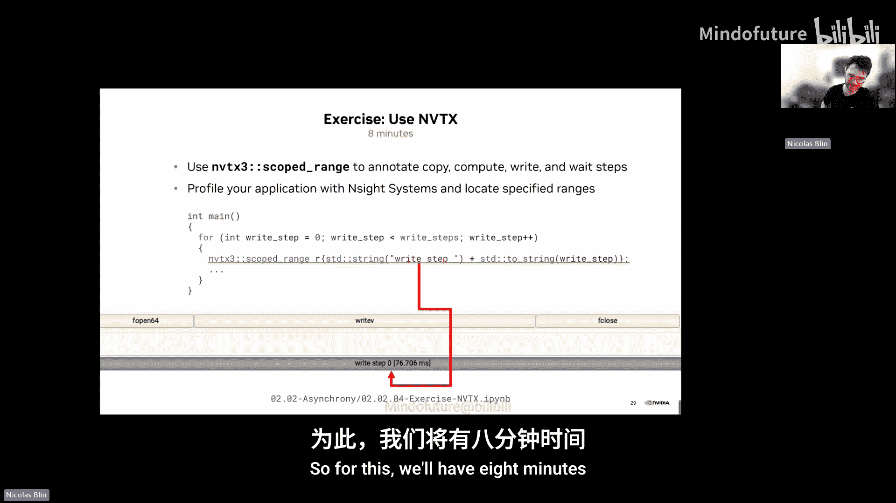
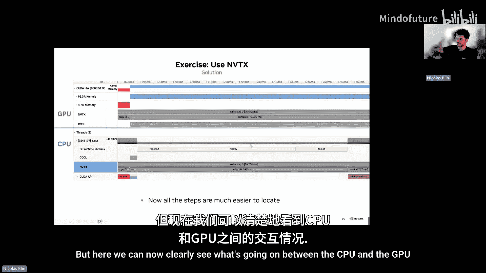
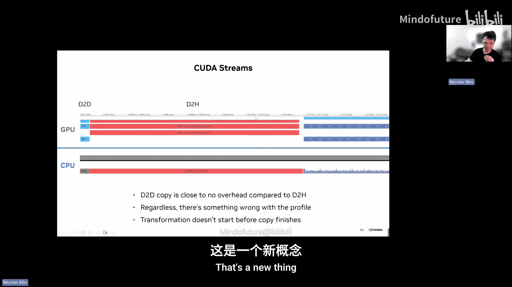
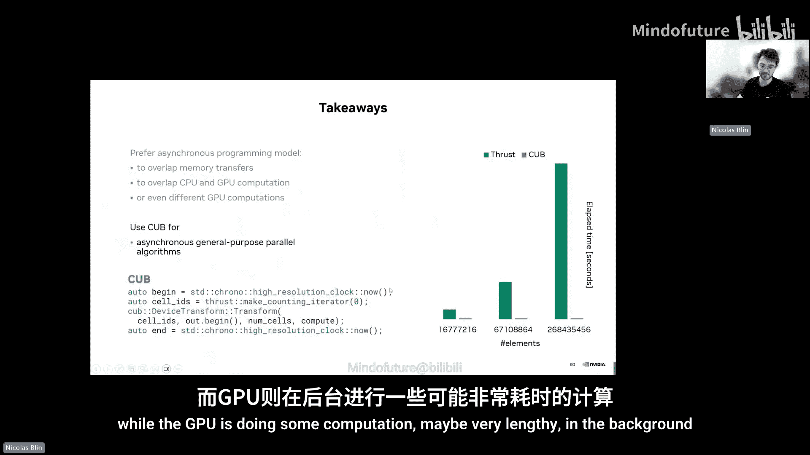
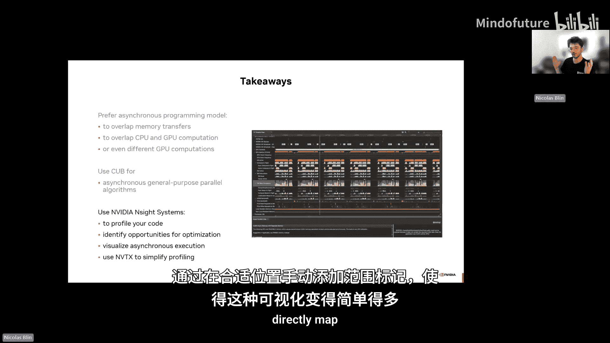
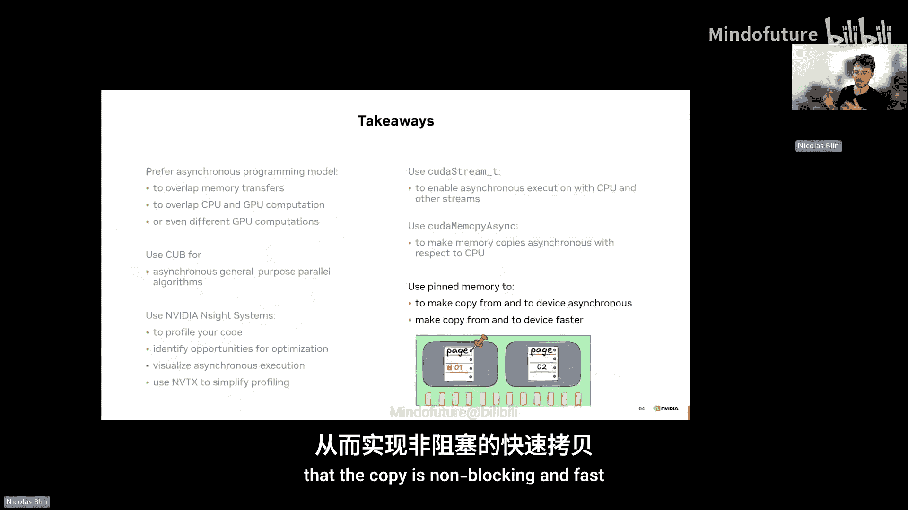
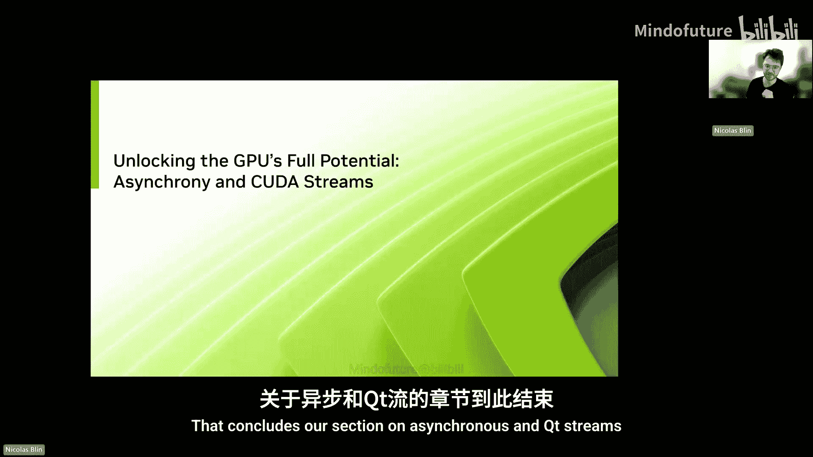

# 002：异步性与CUDA流



在本节课中，我们将要学习如何通过异步编程和CUDA流来优化GPU程序的性能。我们将探讨如何让CPU和GPU的工作重叠，以及如何使用CUDA流来让GPU上的不同任务并发执行，从而更充分地利用系统资源。

---

## 概述

在上一节中，我们介绍了执行与内存空间、词汇数据类型和并行算法等核心概念，并创建了一个功能性的2D热方程模拟器。虽然它目前在GPU上运行，但我们的模拟器仍未充分利用系统的全部能力。

在本节中，我们将探索一些额外的技术来优化性能。首先，我们将讨论异步性，以及如何重叠通信和输入/输出操作以加速程序。然后，我们将学习CUDA流的概念，看看如何让计算与内存传输重叠。最后，我们将学习页锁定内存，了解如何使内存传输异步且更快。

---

## 2.2：异步性与重叠

上一节我们介绍了基本的GPU编程模型。本节中我们来看看如何通过异步操作来提升效率。

回顾我们模拟器的当前状态：首先将数据从GPU复制到主机，然后写入磁盘。一旦完成，我们使用Thrust在GPU上计算下一组温度值。我们可以看到，CPU启动了计算，然后GPU进行计算，而CPU在此期间空闲等待。

这是因为`thrust::tabulate`在底层调用CUDA时，会等待GPU完成计算后才将控制权交还给CPU。这是一个被浪费的机会。要编写高效的异构程序，我们需要充分利用所有资源，包括CPU。

那么，我们能否在GPU计算时，为CPU找到有意义的工作呢？答案是肯定的。首先，让我们看看数据依赖关系。写入磁盘的步骤读取的是上一步操作的主机内存结果，而计算步骤读取的是设备内存。由于这些操作使用不同的数据，它们彼此不依赖。因此，CPU可以在GPU计算下一个温度值时，将结果写入磁盘。

为了实现这种重叠，我们理想情况下需要将Thrust调用拆分为独立的启动和等待步骤。不幸的是，Thrust本身不支持这种拆分。但Thrust是基于另一个核心库CUB实现的，而CUB支持我们需要的异步性。

### 同步与异步操作的区别

首先，让我们更好地理解同步操作和异步操作之间的区别。

CUDA操作本质上是异步的。这意味着当你从主机启动一个在设备（GPU）上执行的操作时，它会立即将控制权交还给CPU。它启动GPU上的操作，然后直接返回控制权。

Thrust的做法则不同：它在底层使用CUDA启动计算，然后使用`cudaDeviceSynchronize`等待GPU完成，之后才将CPU控制权交还。这就是为什么`thrust::tabulate`操作是阻塞的。

以下是一个示例，展示了使用Thrust（同步）和CUB（异步）在CPU等待时间上的差异：



```cpp
// 同步版本 (Thrust) - CPU等待时间随元素数量增加
auto start = std::chrono::high_resolution_clock::now();
thrust::tabulate(device_data.begin(), device_data.end(), computation_functor());
auto end = std::chrono::high_resolution_clock::now();
// CPU 等待了 (end - start) 时间

// 异步版本 (CUB) - CPU等待时间很短且恒定
auto start = std::chrono::high_resolution_clock::now();
cub::DeviceTransform::Transform(nullptr, temp_storage_size,
                                device_data_in, device_data_out,
                                computation_functor(), stream);
auto end = std::chrono::high_resolution_clock::now();
// CPU 几乎立即获得控制权，等待时间极短
// 如果需要等待结果，可以显式调用 cudaDeviceSynchronize()
```



使用CUB启动异步工作后，CPU被立即释放，因此它可以在GPU执行其他操作时并行工作。在我们的案例中，我们可以在GPU进行计算时，开始将数据写入磁盘。然后，我们只需要在GPU完成模拟步骤后进行同步。由于我们无论如何都需要等待GPU，我们并没有损失任何时间。相反，等待步骤变得更短，从而更高效地利用了系统。因此，我们可以预期这种方法会带来显著的性能提升。

之前我们的流程是：从设备复制到主机 -> 写入磁盘 -> 调用`thrust::tabulate`（进行计算并等待）-> 重复。
现在我们的目标是：从设备复制到主机 -> 调用CUB异步启动计算 -> 在GPU计算的同时，CPU写入磁盘 -> 在进入下一步复制前，等待计算完成。

### 练习：实现计算与I/O的重叠

在这个练习中，你需要将`thrust::tabulate`替换为使用`cub::DeviceTransform::Transform`，以便从需要等待数据的同步代码转变为异步代码，使得CPU可以在GPU工作时写入磁盘。你还需要在正确的位置调用`cudaDeviceSynchronize`，以确保在进行下一次数据复制时，数据确实已被处理。

以下是实现的关键步骤：
1.  将 `thrust::tabulate` 替换为 `cub::DeviceTransform::Transform`。
2.  确保在写入磁盘操作之后、下一次数据复制之前，添加 `cudaDeviceSynchronize()` 来等待GPU计算完成。

---

## 2.3：使用Nsight Systems进行性能分析

随着我们深入异步编程，理解和调试程序行为、追踪性能问题可能变得棘手。因为CPU和GPU上的事件同时发生，不容易理清。

为此，NVIDIA提供了Nsight Systems工具。它是一个软件，允许你可视化程序在CPU端和GPU端的执行情况。你可以在时间线上直观地看到CPU何时工作、何时启动异步工作、GPU何时工作。

### 练习：生成并分析Nsight Systems报告

在这个练习中，你将学习如何为你的代码生成Nsight Systems报告。
1.  打开对应练习，执行命令生成Nsight Systems报告。
2.  报告生成后，通过Nsight Systems UI打开它。
3.  在UI中，你可以可视化主机和设备之间发生的事件。你可以选择时间区域来查看特定时间段内的详细信息。例如，你可以放大查看0.5秒到0.7秒之间发生的事件。
4.  你的练习是：生成报告，使用Nsight Systems打开它，并尝试理解：GPU计算何时进行？CPU何时异步启动GPU计算？CPU何时写入磁盘？CPU何时等待？数据传输何时发生？请花时间熟悉这个工具。

分析报告后，我们可以看到重叠执行的效果：CPU启动GPU计算（耗时很短），然后GPU开始实际计算。在GPU进行长时间计算的同时，CPU时间线上显示正在执行写入磁盘的I/O操作（`fopen`, `fwrite`, `fclose`）。我们并不担心写入磁盘耗时较长，因为无论如何GPU计算都需要更长时间。通过重叠这两者，在任何时间点，CPU和GPU资源都得到了利用。

如果你对比早期同步版本的模拟器，你会看到清晰的性能差异。在同步版本中，每个CPU调用都精确对应一个GPU调用，并且CPU需要等待每个调用完成，最后才进行写入操作。而在异步版本中，CPU快速启动所有GPU调用（因为异步启动很快），然后在GPU异步计算的同时进行磁盘写入，最后再进行同步。这使得异步版本比同步版本快大约2倍。

---

## 2.4：使用NVTX标注代码

分析两个版本在时间线上的差异仍然需要手动将时间线上的事件与代码匹配，这可能有些繁琐。



幸运的是，我们有一个工具可以更轻松地将Nsight Systems中看到的内容与你的代码关联起来，这就是NVTX（NVIDIA Tools Extension）。当处理具有许多函数、GPU和CPU事件同时发生的复杂应用程序时，我们通常会使用NVTX。NVTX API允许你将自定义标记和范围直接插入到代码中。这样，当你在Nsight Systems报告中查看时，就会看到对应的标签。

例如，你可以在主循环中添加一个范围，命名为“Write Step”，并包含迭代ID。这样，在Nsight Systems中，你会看到“Write Step”实际上由`fopen`、`fwrite`和`fclose`组成。你不需要知道写入磁盘的具体底层调用，只需要知道在这个阶段你正在进行“写入磁盘”操作。



### 练习：使用NVTX标注代码步骤

你的练习是为所有不同的步骤添加NVTX范围标注：复制步骤、计算步骤、写入步骤以及等待步骤。通过添加这些标注，你将能够在Nsight Systems中更好地可视化所有事件。

添加标注后，你的Nsight Systems视图将变得更加清晰易懂。在CPU时间线上，你可以清楚地看到：首先进行复制，然后启动计算（注意，这只是启动命令，并非实际计算），接着是漫长的磁盘写入，最后是等待。在GPU部分，你可以看到复制步骤和占用大部分时间的计算步骤。现在，CPU和GPU之间发生的事情一目了然。

---

## 2.5：使用CUDA流重叠复制与计算

至此，我们已经学会了如何使用异步性来重叠CPU和GPU任务。通过将磁盘写入与GPU计算重叠，我们获得了巨大的性能提升。我们的代码现在的工作流程是：将数据从GPU复制到CPU，使用CUB启动异步计算，然后将结果写入磁盘。

然而，我们仍有改进空间。GPU计算实际上不必等待复制完成。我们可以将相同的重叠策略应用于复制和计算步骤。但这要求复制操作本身是异步的，而目前它并不是。

`thrust::copy`是通过一个更低级的API `cudaMemcpyAsync`实现的。这个函数可以在不阻塞（即异步地）的情况下在主机和设备内存之间复制数据。让我们仔细看看如何使用它来重叠复制和计算步骤。

首先，了解`cudaMemcpyAsync`如何被Thrust调用。`cudaMemcpyAsync`接收四个参数：目标内存地址指针、源内存地址指针、要复制的字节大小（注意是字节数，不是元素数量）以及复制方向（如主机到设备）。

异步操作的一个微妙之处是，错误并不总是在发生时立即浮现。因为操作是异步的，错误可能会在稍后才被捕获。例如，你可能启动了一个越界的内核，但GPU并没有立即开始执行。你可能在之后启动另一个内核时，才通过`cudaMemcpyAsync`的启动发现前一个内核的错误。因此，在每次CUDA调用后检查错误代码至关重要，并且要意识到错误可能比你预期的出现得晚。

那么，简单地将我们的示例中的`thrust::copy`替换为`cudaMemcpyAsync`是否足以重叠计算与复制？答案是否定的。因为默认情况下，GPU上的所有操作都是有序的。即使你调用了非阻塞的`cudaMemcpyAsync`，CPU会立即返回，但GPU仍然会按顺序执行它和之后的其他操作。这意味着GPU将等待复制完成，然后再进行下一个计算步骤。默认情况下，这两者不会重叠。

控制操作顺序的机制就是CUDA流。默认情况下，如果不指定流，则使用默认流，这意味着GPU上的一切都将按顺序发生。我们不必使用默认流，我们可以创建自己的CUDA流，实际上可以创建任意多个。当操作在不同的流中运行时，它们彼此之间不再有序，因此可以完全并发地执行。

这正是我们想要的。如果我们在一个流中发送异步复制，在另一个流中进行计算，那么这两个操作就可以重叠。

### CUDA流的基本操作

以下是CUDA流的基本操作：
1.  **声明流对象**：`cudaStream_t copy_stream, compute_stream;`
2.  **创建流**：`cudaStreamCreate(&copy_stream);` `cudaStreamCreate(&compute_stream);`
3.  **在流中启动异步操作**：将流作为参数传递给如`cudaMemcpyAsync`或CUB的函数。
4.  **流同步**：`cudaStreamSynchronize(stream)` 使CPU等待指定流中的所有操作完成。
5.  **销毁流**：`cudaStreamDestroy(stream);` 在使用完毕后销毁流。

通常，我们建议显式使用流和`cudaStreamSynchronize`，而不是使用默认流和`cudaDeviceSynchronize`。因为`cudaDeviceSynchronize`会导致CPU等待所有流上的所有GPU操作完成，而你可能只需要等待特定流中的操作。

### 引入数据竞争

让我们开始为计算和复制创建CUDA流。我们声明两个流，分配它们，然后调用`cudaMemcpyAsync`并传递复制流以启动异步复制。接着，我们通过向CUB传递计算流来启动计算。由于复制和计算发生在不同的流中，它们本应在GPU上并行执行。

然后，因为复制是异步的，我们必须确保它在读取主机数据之前确实完成了。我们需要在启动磁盘写入之前，在复制流上调用`cudaStreamSynchronize`。之后，我们还需要在进入下一步之前同步计算流。

然而，恭喜，我们刚刚引入了第一个数据竞争。让我们遍历前几次迭代来看看原因。第一次计算迭代从`d_prev`读取并写入`d_temp`，这没问题。但下一次迭代从`d_temp`读取并写回`d_prev`。由于这些操作在不同的流中运行，GPU可能会以意想不到的方式交错执行它们。这意味着当数据仍在从`d_prev`复制到主机时，它可能会被另一个流中的下一次计算迭代覆盖。我们创建了一个数据竞争，导致结果可能不一致。

### 解决方案：使用暂存缓冲区

像许多计算机科学问题一样，我们可以通过添加一个间接层来解决这个问题。我们可以分配一个额外的设备缓冲区作为暂存区。首先，将数据同步复制到这个暂存缓冲区，然后再从暂存缓冲区复制回CPU。由于没有其他操作写入这个暂存缓冲区，因此没有数据竞争的风险。

这是否违背了重叠计算与传输的初衷？乍一看，我们引入了额外的工作（一次复制和一个额外的缓冲区），这可能会使事情变慢。但如果我们仔细审视整个系统的带宽，这种方法就合理得多。GPU内部的数据复制（设备到设备）可以达到每秒数千GB的速度，而通过PCIe总线在CPU和GPU之间移动数据则要慢得多。设备到设备的复制速度非常快，与主机到设备的复制相比，其开销实际上可以忽略不计。

### 练习：实现流与异步复制

在这个任务中，你将用`cudaMemcpyAsync`替换`thrust::copy`，使设备到主机的传输异步化。你还需要将复制操作放在独立的流中，并按照幻灯片图所示精确地同步它们。最后，在Nsight Systems中分析代码，看其行为是否符合预期。

解决方案的关键步骤包括：
1.  创建两个流（复制流和计算流）。
2.  首先，使用`thrust::copy`（或`cudaMemcpy`）将设备数据同步复制到暂存缓冲区。这可以防止数据竞争。
3.  然后，在复制流上调用`cudaMemcpyAsync`，将数据从暂存缓冲区异步复制到主机。使用`thrust::raw_pointer_cast`获取底层指针。
4.  更新CUB变换调用，使其在我们创建的计算流上运行。
5.  在写入磁盘前，同步复制流 (`cudaStreamSynchronize(copy_stream)`)。
6.  在进入下一次迭代前，同步计算流 (`cudaStreamSynchronize(compute_stream)`)。

分析Nsight Systems的性能剖析图，有好消息也有坏消息。好消息是，我们对传输成本的直觉是正确的：设备到设备的复制（左侧）明显快于设备到主机的复制（右侧）。这证实了PCIe传输是真正的瓶颈，而添加设备到设备的复制开销很小。我们也不再存在数据竞争。

但坏消息是，即使我们使用了不同的流，复制和计算之间仍然没有重叠。计算似乎在等待复制完成后才启动。这与我们使用流的初衷相悖。我们遗漏了某些东西。

---

## 2.6：页锁定内存（Pinned Memory）

要理解为什么我们的复制和计算操作没有重叠，我们需要看看内存实际上是如何工作的。

当程序使用虚拟内存时，内存被划分为内存页。大多数时候，这些内存页由物理RAM支持。但如果RAM空间不足，操作系统可以将内存页从RAM交换到磁盘。这意味着在任何给定时刻，你都不能完全确定某些内存页是在RAM中还是在磁盘上。

为了确保特定的内存页位于RAM中并且不会被移动到磁盘，我们需要所谓的页锁定内存或固定内存。通过固定这些内存页，你可以确保操作系统不允许将这些内存页从RAM移回磁盘。



那么，这与GPU有什么关系呢？事实证明，GPU只能从固定内存中直接读取数据。那么，在我们没有为CPU和GPU之间的数据传输做任何特殊处理的情况下，事情是如何工作的呢？

在幕后，CUDA运行时使用一个小的固定缓冲区作为传输的暂存区。当你从常规的可分页内存复制数据时，驱动程序会将数据块移动到固定暂存缓冲区，然后将其发送到GPU，等待完成，然后重复这个过程。这个过程有效地使复制操作变成了同步的，即使我们使用了`cudaMemcpyAsync`，因为它需要反复执行这个过程，从而阻塞了其他操作。


好消息是，我们可以通过自己分配固定内存来避免这种情况。在Thrust中，有一个简单的接口：`thrust::universal_host_pinned_vector`。它允许我们分配保证是固定的内存，从而绕过这个隐藏的、导致复制同步化的暂存步骤。

### 练习：使用固定内存

在这个最后的练习中，你需要分配一个固定内存向量，而不是常规的主机向量。将容器从`thrust::host_vector`更改为`thrust::universal_host_pinned_vector`。完成更改后，启动Nsight Systems查看差异并进行可视化。

解决方案的更改非常简单：只需使用`thrust::universal_host_pinned_vector`替代`thrust::host_vector`。完成之后，设备到主机的传输现在可以与计算重叠了。在时间线上，我们可以看到GPU可以启动一个接一个的计算操作，而设备到主机的内存复制同时发生。这是因为现在数据位于固定区域，因此不需要先将数据分块复制到固定暂存区，它可以直接并行执行这两项操作。这样，我们通过使用流和固定内存，成功重叠了设备到主机的传输和计算，从而进一步提高了程序的效率。

---

## 总结

本节课中我们一起学习了如何通过异步编程和CUDA流优化GPU程序性能。关键要点如下：

1.  **优先使用异步性**：当可以重叠主机和设备工作时，应使用异步操作。例如，将Thrust替换为CUB，利用其异步编程模型，使CPU任务与GPU任务重叠。调用CUB时，主机以异步方式启动设备计算，这意味着它不会等待GPU完成。无论GPU上要解决的问题规模多大，主机几乎都会立即返回，然后CPU可以继续执行其他工作，而GPU则在后台进行可能很耗时的计算。



2.  **使用Nsight Systems进行性能分析**：我们学会了如何生成报告、打开报告，并查看CPU和GPU上的执行情况，识别时间浪费点或GPU利用率不足的情况。该工具也让我们能够可视化异步操作。



3.  **使用NVTX简化代码映射**：NVTX允许我们通过手动在代码中有意义的地方添加范围标记，使性能可视化变得更加容易。我们可以直接将代码段映射到Nsight Systems报告中的事件。

4.  **利用CUDA流实现GPU内部并行**：异步性通过CUB允许CPU和GPU工作并行化。而使用CUDA流则允许我们在GPU上并行化工作。例如，计算步骤和复制步骤可以并行执行。默认情况下，所有操作都在GPU的默认流上启动，因此工作将按顺序运行。为了并行运行可并行的操作，我们应该使用不同的流。`cudaMemcpyAsync`不仅允许我们异步启动主机到设备的内存复制，还允许我们添加流参数，从而能够在一个流上启动复制，在另一个流上启动计算。

5.  **使用固定内存加速传输**：默认情况下，主机内存是可分页的，可能位于磁盘上。为了确保复制快速且非阻塞，我们应该使用正确的Thrust主机容器（如`thrust::universal_host_pinned_vector`）来确保内存是固定的，从而使复制操作非阻塞且快速。






通过掌握这些概念和技术，你可以显著提高CUDA应用程序的性能和资源利用率。