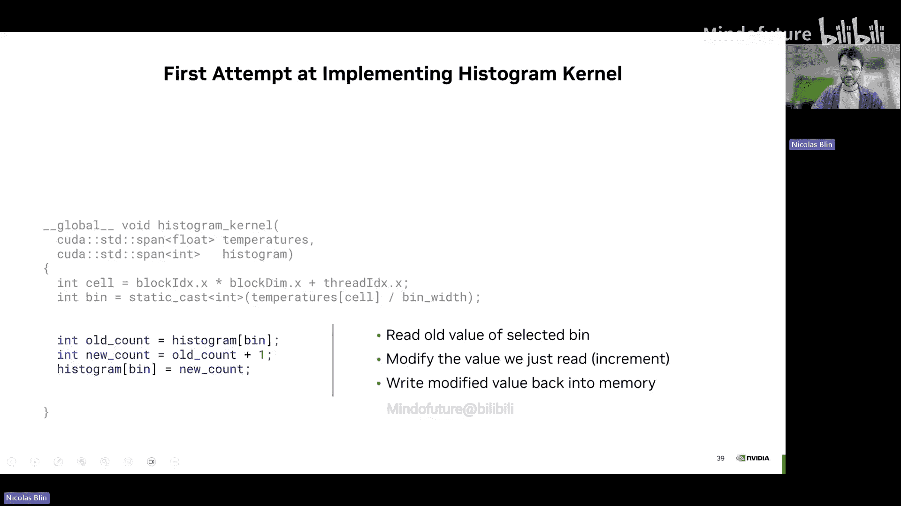
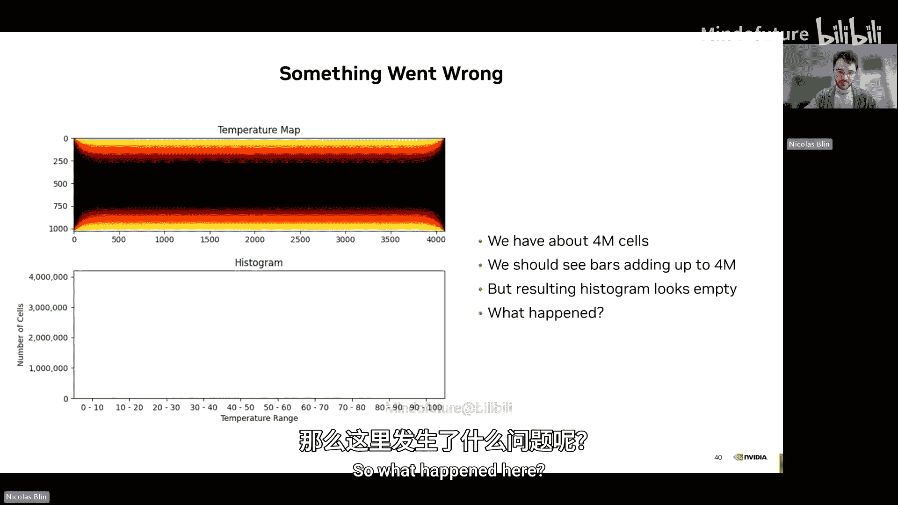
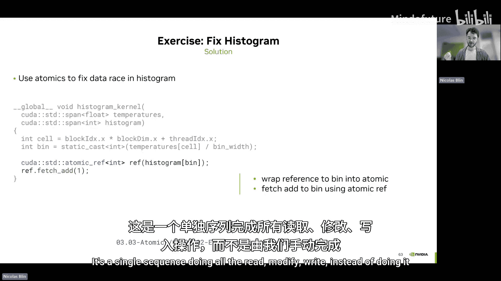
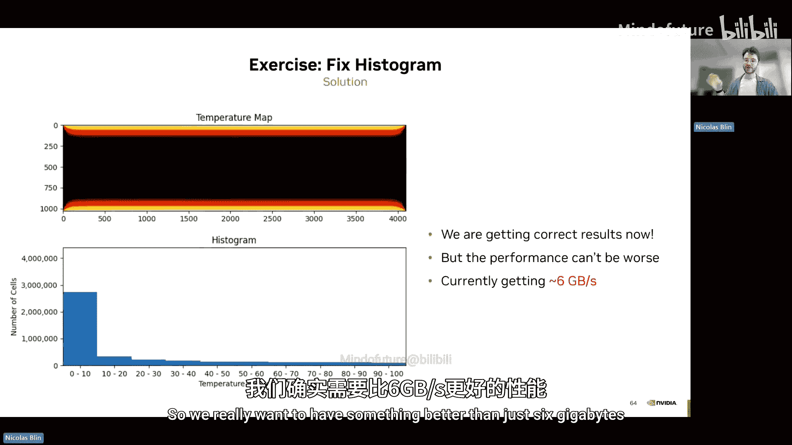
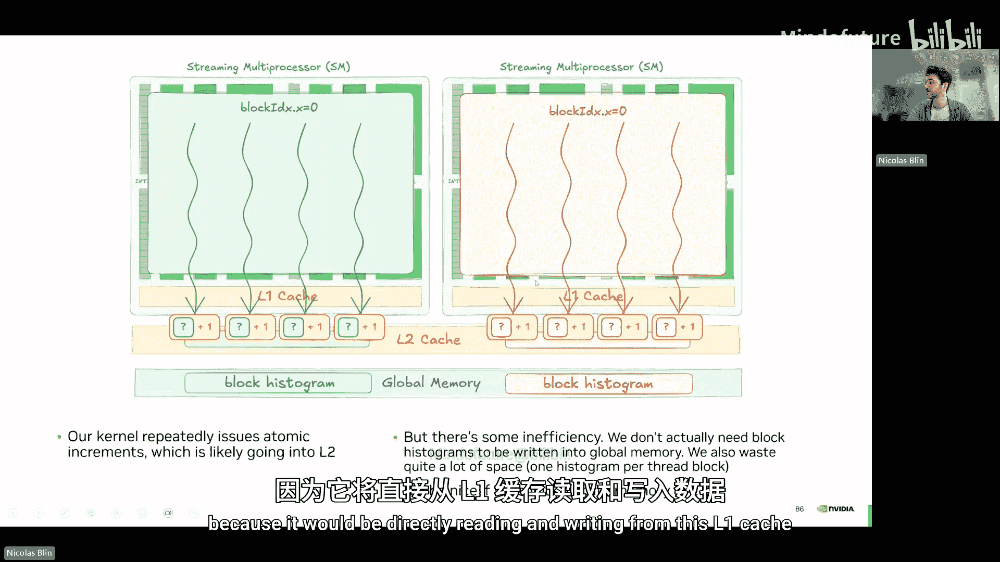
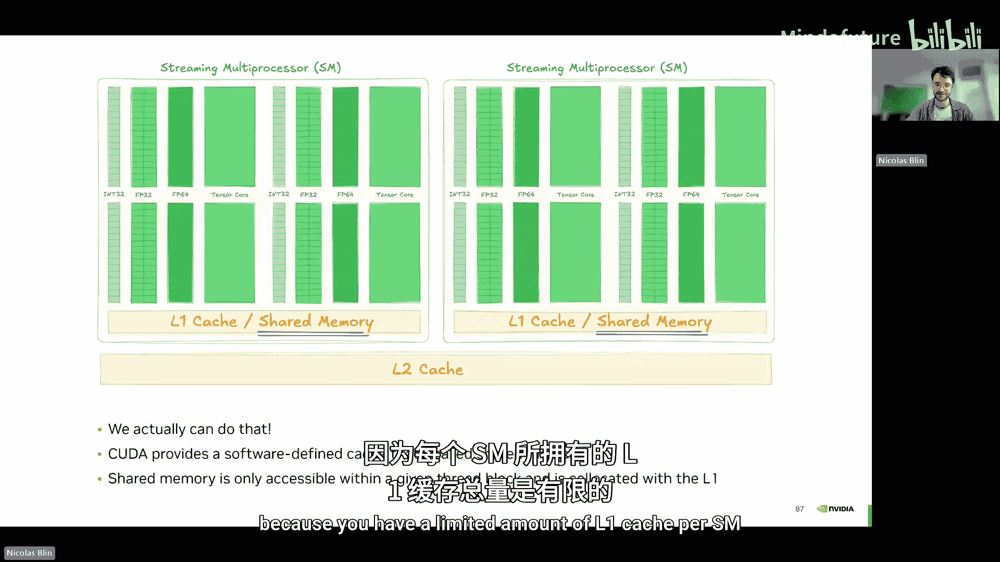
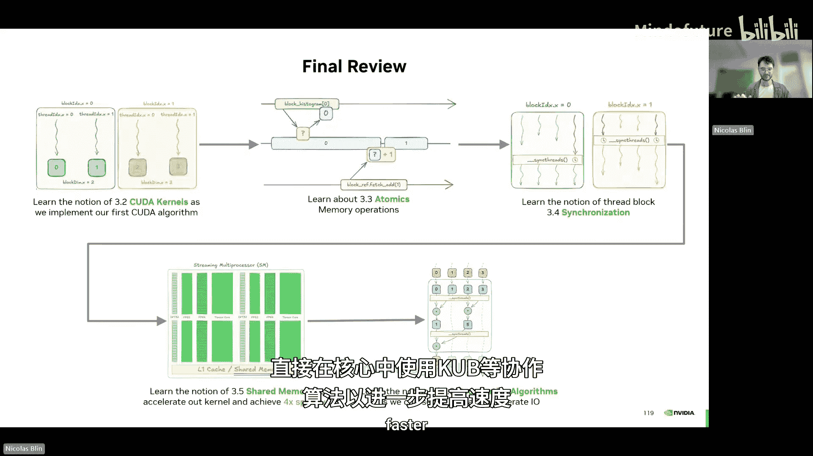
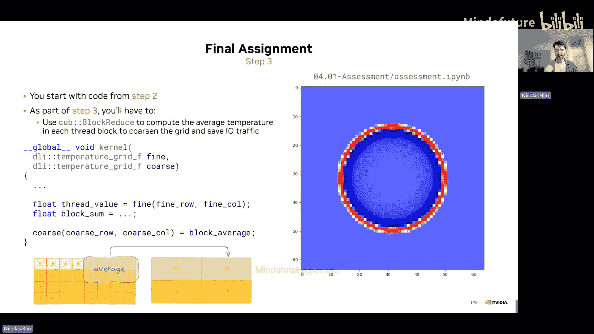

# 003：通过CUDA内核实现新算法

在本节课中，我们将学习如何编写自定义的CUDA内核来实现特定算法。当现有的库（如Thrust、cuBLAS）无法满足需求时，这是必要的技能。我们将从理解CUDA内核的基础开始，逐步深入到原子操作、线程同步、共享内存以及协作算法等高级概念。

---

## 执行空间回顾

上一节我们探讨了异步并行算法如何提升性能。但如果你的特定用例没有现成的算法呢？这时，你需要使用CUDA内核编写自己的算法。

首先，我们回顾一下执行空间。到目前为止，我们讨论过：
*   **`__host__`**：指定函数在主机（CPU）上执行，编译器为其生成CPU指令。
*   **`__device__`**：指定函数在设备（GPU）上执行，编译器为其生成GPU指令。

还有一个我们尚未讨论的关键字：
*   **`__global__`**：与`__device__`类似，编译器会为函数生成GPU指令。但标记为`__global__`的函数可以从CPU调用，并在GPU上执行。这就是我们所说的**CUDA内核**。

从CPU调用CUDA内核的语法看起来有些特殊，使用了三重尖括号`<<< >>>`，我们稍后会讨论其中的参数含义。

另一个重要细节是，内核启动是**异步**的。CPU启动内核后，会继续执行后续代码，而不会等待GPU上的内核完成。

---

## 编写第一个CUDA内核

在开始编写自己的CUDA内核之前，我们先回顾一下模拟器当前的工作原理。我们使用`mdspan`获得温度网格的二维视图，然后使用`thrust::device_transform`将单元索引转换为新温度。`thrust::device_transform`内部使用CUDA内核实现，因此是异步运行的。

现在，让我们尝试重写模拟器，直接调用CUDA内核，而不是依赖Thrust。

以下是一个简单的CUDA内核示例，它遍历所有单元并将索引转换为新温度。

```cpp
__global__ void naive_kernel(mdspan2d grid) {
    for (int i = 0; i < grid.extent(0); ++i) {
        for (int j = 0; j < grid.extent(1); ++j) {
            // 计算新温度...
        }
    }
}
// 启动内核
naive_kernel<<<1, 1, 0, stream>>>(grid_view);
```

注意，当我们启动内核时，使用了三重尖括号语法。最后一个参数是CUDA流，通过传递一个流，你可以在指定的流上异步运行计算。

GPU不会自动并行化你的代码。在这个例子中，**单个GPU线程正在串行计算每个单元**。总体而言，这使得我们的内核比使用cuBLAS慢大约10,000倍，因为我们只启动了一个线程来完成所有计算。

---

## 增加线程数量

我们可以轻松增加CUDA使用的线程数量。例如，要启动两个线程而不是一个，只需在第二个参数中传递`2`。在三重尖括号中，第二个参数代表你想要启动的线程数量。

使用两个线程几乎可以使内核速度翻倍，这是合理的，因为我们使用了两倍的线程。但仅仅启动更多线程是不够的。如果它们都在处理相同的单元，实际上不会有任何加速。

为了解决这个问题，我们需要修改内核，使每个线程能够区分自己并处理不同的单元子集。这时就需要用到`threadIdx.x`。

`threadIdx.x`是一个内置变量，在CUDA内核内部可用，它保存当前线程的索引。如果我们启动两个线程，第一个线程的`threadIdx.x`为0，第二个线程的为1。

使用这种方法，每个线程处理不同的单元子集。在内核中，我们首先读取`threadIdx.x`来识别当前线程索引，然后每个线程开始处理与其线程索引匹配的单元。

这意味着第一个线程处理单元0，第二个线程处理单元1。处理完一个单元后，我们通过将单元索引增加线程总数来前进。这样，第一个线程处理单元0、2、4...，第二个线程处理单元1、3、5...

这种方案允许我们并行计算所有单元，确保一个单元永远不会被多个线程处理。

另一个观察是，我们的代码中没有限制只能使用两个线程。我们可以使用更多线程。让我们尝试增加处理此计算内核的线程数量。

从2个线程增加到256个线程，性能显著提升，因为我们使用了更多线程。但可以看到，我们仍然远远达不到cuBLAS所能达到的性能。

---

## 线程块与网格

为什么不能直接添加更多线程呢？如果我们尝试用2048个线程启动内核，会得到一个神秘的错误：“invalid configure argument”。这是因为单个线程块中的线程数量是有限制的。

在CUDA中，线程被分组为**线程块**，所有线程块的集合称为**网格**。每个线程块可以包含32、64、128直到1024个线程，不能超过这个数量。

当你启动一个CUDA内核时，所有线程块将拥有完全相同数量的线程。当你使用`threadIdx.x`时，你得到的是线程在**本地块内**的索引。如果线程0在块0中，你会得到0；如果线程0在块1中，你也会得到0，因为`threadIdx.x`返回的是块内的索引，而不是跨块的索引。

你还可以使用`blockDim.x`获取块的宽度（即每个块的线程数），使用`gridDim.x`获取网格的长度（即线程块的数量），以及使用`blockIdx.x`获取当前块的ID。

通过组合这些信息，我们可以计算线程在整个网格中的全局索引。`blockDim.x`告诉我们每个块有多少线程，`gridDim.x`告诉我们有多少个块。将两者相乘，可以得到线程总数。

为了计算线程的全局索引，我们将块ID（`blockIdx.x`）乘以块的长度（`blockDim.x`），得到到达正确块的偏移量，然后加上本地线程ID（`threadIdx.x`）。

例如，最后一个块的第二个线程：块ID为2，乘以块长度2，得到偏移量4，然后加上线程ID 1，得到全局索引5。

---

## 选择块大小和网格大小

现在我们知道如何找到每个线程在网格中的唯一索引，也知道了线程总数。剩下的一个问题是：我应该使用什么样的块大小？不幸的是，没有一个适用于所有情况的神奇数字。通常，你必须根据问题微调这个数字。

一个有用的指导原则是始终使用32的倍数。例如，选择50或60没有太大意义。通常我们建议的默认值是256，但这取决于你的问题，你应该查看哪个值最好。

第二个问题是我们应该启动多少个块？网格大小通常取决于问题大小，因为我们希望最大化并行性。问题是如何将问题的元素分配给线程。

例如，如果我们希望每个线程只处理一个元素，使用简单的整数除法是行不通的。假设我们有6个单元要处理，选择块大小为4个线程。6除以4得到1，我们只会使用一个线程块。但这样，用一个4线程的块处理6个单元，每个线程处理一个元素，我们会遗漏最后两个元素。

在CUDA中，我们提供了`cuda::std::ceil_div`函数，它会向上取整。你可以使用它自动计算当你希望每个线程恰好处理一个元素时所需的正确线程块数量。

在我们的例子中，6和4，调用`ceil_div`将返回2而不是1，因此你将正确分配两个线程块，每个块有4个线程来处理所有6个单元。

要传递给内核你希望使用的每个块的线程数，它是第一个参数。你可以先声明块大小（例如256），然后计算需要多少个块。再次使用`cuda::std::ceil_div`，用总问题大小除以每个块的大小，得到所需的总块数。然后，在调用内核时，首先传递网格大小（即所需的线程块数量），然后是每个块的大小。

通过这些更改，我们现在启动了大约500万个线程，终于接近了cuBLAS的性能。当然，cuBLAS在底层有更高级的优化，你可能无法匹配其速度，但对于这样一个简单的内核，仅通过添加更多线程并正确计算ID和线程局部性就能实现这样的加速，已经非常不错了。

---

## 边界检查与调试

我们已经修改了模拟器，但尚未确认它是否仍然正确工作。因为我们的设置是对称的，网格顶部和底部的温度是相同的，所以我们可以通过检查对称性来进行快速冒烟测试。

想法很简单：对于给定的单元，我们通过从网格高度减去行索引来找到其镜像行。如果一切正确，对称单元的温度应该几乎相同。

在屏幕上，你会看到一个执行此检查的C++函数。作为本练习的一部分，你需要将此CPU C++函数转换为CUDA内核，并使用三重尖括号语法启动它，选择正确的块和线程数量。

要将对称检查函数转换为CUDA内核，我们必须用`__global__`说明符注释它。`__global__`允许你在GPU上启动代码。这个函数将被编译以在GPU上工作，并且可以从CPU以异步方式调用。

之后，我们需要使用我们讨论过的三重尖括号语法启动它。这里因为没有真正的并行工作，我们可以只启动一个包含单个线程的块。为了确保检查在正确的流上运行，我们只需指定最后一个参数为我们想要使用的流。

现在思考一下，整个行应该是对称的，而不仅仅是一组。在本练习中，你将修改内核，使每个线程恰好处理一列。

就像之前一样，如果我们使用块和线程索引，我们可以计算线程的全局ID。我们在顶部这样做是因为我们想知道我们在哪一列：我们使用块ID（我们的块索引）乘以块的宽度，然后加上我们在块内的当前线程ID。通过这样做，我们可以计算列索引。

然后，当我们想要调用实际的内核时，就像之前一样，我们可以声明块宽度（我们使用默认值256），计算网格大小，检查问题的总大小（在我们的例子中是宽度），然后使用`cuda::std::ceil_div`除以块大小。

当我们调用内核时，我们只需传递网格参数和块参数。这样，每个线程恰好处理一列，并行检查整个行。

但这样做，我们刚刚导致了第一次越界访问。因为我们向上取整以确保每个线程至少有一个元素，我们可能会启动比实际问题大小更多的线程。在这种情况下，我们启动了两个线程块，每个块有4个线程，但我们总共只有6个元素。第一个块将用其4个线程处理前4个元素，第二个块也有4个线程，但只有两个元素要处理，所以最后两个线程将尝试访问实际上不存在的元素。

这两个线程发出的地址将越界。我们需要找到一种方法来修复这个问题。一个简单的方法是在内核中添加所谓的边界检查。在计算全局线程ID之后，我们只需要将此值与总列数进行比较，如果没有工作要做，就跳过它。

在我们计算了列ID之后，我们可以检查列ID是否小于宽度（我们可以通过`mdspan`的`extent(1)`找到），只有当我的列ID小于这个宽度时，我才进入这里进行检查。

如果我们不知道这些边界检查，我们如何自己发现这个问题呢？在NVIDIA，我们提供了一个名为**Compute Sanitizer**的特殊工具，帮助检测CUDA内核中的越界访问和其他内存问题。

如果你使用幻灯片上显示的标志编译此模拟器代码，Compute Sanitizer将准确指出非法访问发生在哪一行。例如，你可以看到我们拥有所有需要的信息：我们知道它进行了无效的全局读取（大小4字节，因为我们使用浮点数），我们知道它来自这个特定的内核`symmetry_check_kernel`，我们甚至知道是第7行。我们知道它来自哪个线程和哪个块，我们甚至知道最近的有效分配是什么。

通过这种方式，Compute Sanitizer确实为我们提供了理解问题所需的所有信息：我们缺少的确实是一个边界检查条件。

实际上，`mdspan`也可以自行检测越界访问。默认情况下它是关闭的，但如果你在编译时定义了`_CCCL_ENABLE_ASSERTIONS`，就像我们在顶部展示的那样，这将使`mdspan`在访问时检测你是否越界。如果发生越界，它将触发一个断言。同样，你将知道是哪个线程在哪个块中进行了越界访问。这是通过检查当我们通过`mdspan`访问数组时，我们尝试访问的索引是否大于`mdspan`的大小来实现的。

通过添加这些边界检查，我们刚刚修复了这个错误。

---

## 直方图计算与数据竞争

现在很自然地会问：为什么我们需要线程层次结构的所有这些复杂性，比如线程、线程块、网格？为了理解为什么需要所有这些，我们首先需要稍微修改一下问题，看看为什么线程块层次结构实际上很有意义。

现在让我们为模拟器产生的温度创建一个直方图。直方图帮助我们查看某些温度范围出现的频率。

首先，我们将整个温度范围划分为不同的区间。在我们的例子中，我们将有10个不同的区间。对于模拟中的每个单元，我们确定其温度将落入哪个区间。将温度划分到特定区间的简单方法是向下取整。

例如，如果单元温度为4度，我们除以10得到0，因此我们知道这个4度应该进入区间0。如果单元温度为15度，我们想将15放入第一个区间，同样只需将15除以10得到1，因此我们知道这个15度必须放入区间1。

一旦我们将每个单元分配到正确的区间，我们只需计算有多少个单元落入每个区间，这就可以成为直方图中条形的高度。

现在让我们思考构建我们自己的内核签名来完成这个直方图。因为它是直方图，只需要一个维度，所以我们不需要`mdspan`，因为`mdspan`是多维的跨度，这里我们只有一个维度。这就是为什么这里我们使用`cuda::std::span`而不是`cuda::std::mdspan`。

在CUDA中，就像在C++中一样，`span`是访问数据的首选方式，而不是仅仅使用原始指针，因为它更安全（可以检测越界），你也可以避免对指针进行奇怪的操作，还可以访问大小等。

要构造一个`span`，就像`mdspan`一样，只需传递你想要视为跨度的底层容器的数据和大小即可。然后，要访问它，就像任何常规容器（如向量）一样，只需使用方括号来访问。

将温度和直方图传递给内核后，我们再次需要计算我们的全局线程ID，使用与之前相同的公式：块ID乘以块维度加上线程ID。然后每个线程加载其对应的温度值，并将其除以区间宽度（在我们的例子中是10），以再次找到正确的区间索引，我们将基于温度值在该区间上加1。



在生产环境中，你还需要确保这些内存访问在边界内，但为了简单起见，在幻灯片上我们将跳过边界检查，并假设问题大小确实是块大小的倍数。



接下来，每个线程从其分配的区间读取当前计数，增加值，然后将其写回直方图。我们首先加载整个直方图值，然后递增。

例如，我发现我的温度是4，我想让它进入第一个区间，通过除以区间宽度的计算将返回0，因为4在0到10之间，所以我得到区间0。然后，我将通过直方图获取区间0的值（假设是13），我只想增加1，因为我有一个新值要添加到此区间0，然后我可以将结果写回内存。

但是，如果我这样做，我在直方图中看不到任何东西，所以看起来出了问题。我们在网格中大约有400万个单元，条形应该在百万范围内，但我们什么也看不到。发生了什么？

问题在于我们的内核在代码的高亮行中存在**数据竞争**。所有数百万个线程都在到处读取和写入相同的内存位置。让我们看看这里到底发生了什么。

假设我们只有两个线程。线程0想从区间0读取，线程1也想从区间0读取。它们都发出相同的内存读取请求。线程1首先发出对直方图的内存读取，然后内存子系统将响应存储在直方图区间中的当前值（在我们的例子中是0）。然后，线程1将1加到该变量并将结果存储在`new`中。但同时，当线程1这样做时，线程2也在向直方图发出读取。由于此加法尚未在内存中发生，线程2也从直方图读取值0。然后线程2也将1加到旧值并想再次存储它，但同时，线程1正在将值1写入直方图。所以这里1被写入直方图，现在直方图值是1。但问题是线程2也有值1，它也将开始将1写入直方图值。这个线程不知道另一个线程当前正在写入值1，因此应该使用这个1值来增加自己的计数器，但为时已晚，值已经被读取，所以它也会将1写入此直方图。

最终，直方图内部的值将是1，而两个不同的线程都试图向此直方图值加1。这就是两个线程时发生的情况。现在想象一下，当数百万个线程试图这样做时会发生什么。

这就是为什么我们的直方图看起来是空的，因为当我们递增时，没有考虑到其他线程也在尝试做同样的事情，这就是我们所说的**数据竞争**。

---

## 原子操作

为了修复这个竞争，我们需要确保“读取-修改-写入”这个序列被当作一个单一的、不可分割的内存操作来处理。我们不希望先读取，然后修改，再写入；我们希望整个操作在一个块中完成。

在C++中，我们可以使用**原子操作**来实现这一点。你可以将原子操作视为存储指令本身，而不仅仅是字节；我们真的希望整个操作一步完成。在右边的例子中，我们将“加一”存储到内存中，当操作到达内存系统时，它读取当前值，递增它，然后在单个步骤中将结果写回。

在左边，之前我们是先读取，然后更新局部变量，再写入。现在，因为我们执行的是`fetch_add`（在C++中也可以这样做），所有操作都在一个步骤中完成。通过这样做，我们防止了任何线程同时读取或修改，每个线程将发出一个原子操作，而整个“读取-修改-写入”将在一个序列中发生。

幸运的是，CUDA也通过`cuda::std::atomic_ref`提供原子操作，它允许你将任何现有的内存位置视为原子变量。你获取任何当前可用的内存位置，可以将其视为原子引用。

在这个例子中，我们通过将`count0`包装到`atomic_ref`中来创建对`count0`的原子引用。这意味着，然后我们可以通过这个引用（它是一个原子引用）对`count0`执行原子操作。我们现在可以执行原子加、原子减、原子与等操作，每次我们这样做时，这些操作都将是原子的。它们都将在单个操作中执行，不会有先读取、再修改、后写入的情况。

这将允许我们并行修改多个线程的计数，而没有任何竞争条件。让我们看看如何将其放入我们自己的内核中。

在我们的内核中，现在会发生的是：线程1将在原子引用上使用`fetch_add`向直方图加1，线程2也将想在直方图上执行`fetch_add`加1。

现在可能发生的情况是：线程1执行`fetch_add`，这将到达内存，执行读取、修改和写入，所有操作都在一个序列中完成，结果将存储回内存。所以现在当线程2也想执行其操作时，当它最终到达内存时，它将正确地读取新值（即1），因为第二个`fetch_add`不能在第一个`fetch_add`之前执行。当这个`fetch_add`到达时，第一个已经完成，这就是为什么我们可以正确地看到1，然后正确地加1，并正确地将最终的直方图值（现在是2）更新回内存。现在我们知道结果是正确的，并且在此过程中没有丢失任何增量。

在本练习中，你需要修改我们现有的直方图代码，不再使用三行代码进行“读取-修改-写入”（这会导致数据竞争），而是使用我们讨论过的`atomic_ref`来使代码工作。

修改实际上只有几行代码。我们需要做的就像我们在示例中展示的那样，将我们要写入的直方图区间包装到`atomic_ref`中。现在，当我们通过这个原子引用写入时，我们正在写入直方图区间，但我们是原子地写入，所以我们确信当我们在这里发出`fetch_add`时，这个`fetch_add`操作是一个原子操作，因此它是一个执行所有“读取-修改-写入”的单一序列，而不是我们自己操作（这会导致数据竞争）。



修复之后，我们的结果终于正确了，我们可以看到有意义的直方图。注意初始温度接近零，意味着第一个区间拥有最多的单元，随着热量在网格中扩散，我们看到更多区间开始填充。

---



## 性能问题与私有化

但现在我们还有另一个问题：性能非常差，我们只达到了6 GB/s，这远远低于GPU的最大内存带宽。我们真的想要比6 GB/s更好的性能。

上次我们看到如此差的性能是因为序列化，当时我们只使用了几个线程，而没有使用所有线程。但这次我们的代码中没有任何循环，我们使用了所有线程，并行地使用线程和线程块，这是怎么回事？

但这次，序列化来自原子操作本身。是的，它们解决了数据竞争问题，但**由于设计原因，它们不能并行运行**。所有线程都针对相同的内存位置，现在我们有许多许多原子操作一个接一个地排队。当我们启动大约256个线程时，总共有大约16,000个块，我们发出了400万个原子操作，所有这些操作都在排队。

这显然太多了，我们不想排队那么多原子操作，因为这会使代码非常慢。我们有什么选择可以解决这个问题？

一种解决方案是所谓的**私有化**。我们不是让所有线程更新同一个全局直方图，并首先在所有区间上发出太多原子操作，而是可以为每个线程块分配一个小的私有直方图。

每个线程块将有一个私有直方图，可以在其中安全地使用原子操作。这不会减少原子操作的总数，但现在它分布在更多的内存位置上。不是所有线程都写入相同的内存位置，现在线程块首先写入自己的内存位置，然后再传播回全局直方图。完成后，块聚合其私有直方图的计数，并使用一个内存原子操作将它们更新到主直方图。

在我们简单的两个块的例子中，每个块递增自己的本地块直方图，然后才将结果传播回完整的最终直方图。虽然在这个例子中，显然不是很有帮助，因为我们只有两个块，但想象一下真实情况，我们有16,000个块。在这个场景中，我们将有16,000个私有直方图并行更新，随后只有16,000个原子操作。之前我们在全局内存中进行了400万个原子操作，它们都在排队；现在因为每个线程块只做一个，我们在全局内存中只有16,000个原子操作。

为了实现这种私有化，我们需要为内核添加一个新参数，我们称之为块直方图。接下来，我们为当前线程块的私有化直方图部分创建一个子跨度。`subspan`函数接受一个偏移量和一个大小，我们通过将块索引乘以直方图大小来计算偏移量。第一个块的偏移量为0，第二个块的偏移量为10，等等。这确保每个块写入自己的内存切片，每个块将拥有自己的私有化直方图切片。

然后就像之前一样，每个线程计算其区间索引，但是，我们现在递增私有化的块直方图，而不是全局直方图，因为我们想递增每个块的私有化直方图，而不是全局的。之后，每个块将其部分计数从其私有化直方图添加回全局直方图内部。在CUDA代码片段中，块中的前10个线程每个处理一个区间，用于块的私有直方图，并并行化对全局直方图的写入，它们再次使用原子引用来安全地将其本地计数添加到最终直方图。

但不幸的是，这样做我们引入了一个新的错误。

---

## 线程同步

让我们仔细看看发生了什么以及为什么这里有一个错误。在代码中，我们假设所有线程在下一段代码开始之前都完成了对本地块直方图的更新。我们假设所有线程在写入全局块直方图之前都写入了本地块直方图。

然而，CUDA线程在一个块中并发运行，并且没有任何顺序保证。这意味着你块中的一些线程可能甚至还没有开始，而其他线程可能已经开始退出你的内核。所以你无法保证线程块中所有线程的调度顺序，一个线程可能处于代码的最开始，而一些线程可能处于代码的最后。

一种可能的情况是，一些线程可能在所有块中的线程完成更新之前读取了块直方图，然后才写入全局直方图。

为了解决这个问题，我们必须以某种方式确保所有线程在读取之前都完成了对本地块直方图的更新。为此，CUDA提供了`__syncthreads()`。

`__syncthreads()`是一个特殊的CUDA函数，它充当块中所有线程的屏障。当一个线程到达此屏障时，它会等待，直到线程块中的所有其他线程也到达此屏障。

在这个意义上，它类似于标准C++库中的`std::barrier`，但这里有一个重要的区别：块中的每个线程必须从相同的逻辑路径调用`__syncthreads()`。

`__syncthreads()`将解决我们的功能问题，但仍然存在性能问题。

---

## 线程作用域

如果我们回顾CUDA概述，你会注意到两组不同的原子引用：一组在`cuda::std`命名空间中，另一组在`cuda`命名空间中。这自然引出一个问题：两者之间有什么区别？

`cuda::std::atomic_ref`和`cuda::atomic_ref`提供了基本相同的接口。然而，`cuda::atomic_ref`通过添加一个`thread_scope`参数扩展了`cuda::std::atomic_ref`。选择正确的线程作用域可以显著影响性能。

让我们试着更好地理解什么是线程作用域。线程作用域表示可以使用给定原子进行同步的线程集合。作用域可以是整个系统、仅设备，甚至只是线程块。

例如，当所有线程彼此相关时，对于原子操作，你会使用`cuda::thread_scope_system`。这意味着来自任何GPU的线程都可以与GPU中的任何其他线程甚至CPU线程同步，它是整个系统。

`cuda::std::atomic_ref`实际上与没有`std`的`cuda::atomic_ref`相同，但作用域是系统。下一个作用域，当它不是整个系统时，是设备。`device`作用域意味着单个GPU内的任何线程。使用此作用域，多个GPU无法向同一内存位置发出原子操作，GPU和CPU也不能写入同一内存位置，但GPU内的任何线程都可以自动写入一个位置，而同一GPU的任何其他线程也正在写入此相同内存位置。

最后一个线程作用域是`thread_scope_block`，它将原子操作限制在单个块内的线程。只要它们在同一线程块内，多个线程可以对同一内存位置执行原子操作，但如果线程来自另一个线程块，则不行。

在我们的例子中，我们可以看到，因为每个线程块都在更新自己的本地直方图，这非常适合使用`thread_scope_block`。

这引出了下一个练习。这次你必须使用线程块同步来确保所有线程在读取和写入全局直方图之前都完成了对块直方图的更新。如果时间允许，你还可以通过添加线程作用域来提高原子操作的效率。

首先，我们将`cuda::std::atomic_ref`替换为`cuda::atomic_ref`。然后，我们将块直方图上的原子操作作用域限制为`thread_scope_block`，因为我们知道，当我们写入这个对每个块私有的直方图时，我们只由同一线程块中的不同线程执行原子操作。这就是为什么我们可以使用`cuda::thread_scope_block`。

然后我们还添加了`__syncthreads()`，因为在完成直方图更新后，我们想确保所有线程在更新全局直方图之前都完成了对此块直方图的更新。

同样，在更新此全局直方图时，我们可以使用`scope_device`而不是默认的系统原子，因为我们知道我们只从设备写入直方图。但我们必须使用`device`而不是`block`，因为我们知道这个直方图是全局的，由所有块中的所有线程共享。

仅通过这些更改，我们就从6 GB/s一路提升到100 GB/s，这是一个巨大的改进，仅仅通过改变我们执行的原子操作的作用域。

但我们还可以做得更好。

---

## 共享内存

在进一步优化直方图内核之前，让我们回顾一下到目前为止学到的东西。我们刚刚介绍了原子操作、线程作用域和同步。但我们最初的问题呢？最初的问题是：为什么我们首先需要线程层次结构，为什么需要线程块？让我们再看看线程块同步和线程块作用域的原子操作，它们仅在给定线程块的线程之间可用。



跨线程组同步要昂贵得多。线程层次结构在这里有好处。仅同步块内的线程远比同步所有块内的所有线程成本低。

但是，在某些线程组内是否有其他可访问的设施？为了找出答案，我们来谈谈GPU架构。



GPU由统一的构建块组成，我们称之为**SM（流式多处理器）**，这就是你在屏幕上看到的绿色部分。单个GPU可以包含数百个SM。

每个SM有很多核心，但也有一个本地L1缓存。全局内存，即主要的GPU内存，位于这些SM之外，这就是为什么它被称为全局内存。访问全局内存的延迟比访问L1缓存中的内容要大得多，因为L1缓存是SM本地的，而且访问L2也比访问全局内存快。

因为GPU与CPU相比，通常延迟不高但带宽很好，这就是为什么我们希望通过利用L2和L1缓存来使延迟尽可能好。

像线程块同步这样的功能是专门构建在SM硬件中的。因为当我们进行线程同步时，只是针对一个线程块，我们不是同步整个网格，所以它只需要在SM级别运行，这就是为什么它更快。

现在让我们思考一下我们的直方图内核是如何映射到硬件上的。每个线程块在单个SM上运行，块直方图存储在全局内存中。然后每个线程向我们的私有块直方图发出原子操作，这很可能由L2缓存支持。这效率不高，因为我们实际上不需要在内核完成后保留此块直方图，它们只是临时存储，而L1缓存正好位于SM上，目前我们没有使用它。

如果我们可以直接在L1缓存中分配此块直方图，那将对我们非常高效，首先不会浪费全局内存，而且速度会更快，因为我们将直接从L1缓存读取和写入。

幸运的是，我们可以在CUDA中做到这一点。CUDA提供了一个显式的、可编程的线程块本地内存，我们称之为**共享内存**。

共享内存位于L1缓存所在的位置，它具有与L1缓存相似的延迟和带宽。共享内存的唯一缺点是它有限制，你不能拥有无限量的共享内存，因为每个SM的L1缓存数量有限。

如果你想分配共享内存，只需将`__shared__`说明符添加到变量中。在这个例子中，我们只是声明了一个大小为4的数组，即共享内存中的4个整数。

但不幸的是，共享内存中的变量不能有非平凡的构造函数，只能是像`int`、`float`等平凡类型。

在线程块内，你可以像任何其他数组一样读取和写入这些数组。在这个例子中，每个线程会将其自己的线程索引写入数组的当前扩展元素中。线程0将0写入位置0，线程1将1写入位置1，等等。

为了不忘记任何数据竞争，我们需要在完成对此共享内存的任何写入之后、想要进行任何读取之前，不要忘记调用`__syncthreads()`。

为了强调这个共享数组确实在线程块内共享，你可以看到这里我让第一个线程打印出存储的每个值，所以所有线程在此时都会看到所有其他线程的更新，并且它将打印值0、1、2、3，因为我们使用了`__syncthreads()`。

`__syncthreads()`不仅强制我们这里的四个线程完成，而且还使更改对其他线程可见。这就是为什么在我们完成三次写入并进行同步之后，线程0能够看到，并且我们知道它能够看到，因为当我们打印结果时，我们正确地看到了0、1、2、3。这是因为`__syncthreads()`允许线程块中的所有线程看到同一线程块中其他线程所做的所有修改。

现在让我们进入下一个练习。这次，你必须将块直方图分配在共享内存中，而不是全局内存中，这应该有望提高我们代码的性能。

首先，我们需要更改函数签名，因为我们不再需要块直方图跨度，现在我们不再使用全局内存。为了分配这个共享内存，我们想要的是一个块直方图，它将再次对每个线程块是局部的。

这就是为什么我们使用区间数量（这里是`num_bins`）的大小来分配它。然后我们想确保因为它是一个直方图，但初始化为零，因为然后我们将逐步向其中加一，所以它需要从零开始。这就是为什么我们使用我们的线程将前`num_bins`个元素分配为0。然后我们不应该忘记使用`__syncthreads()`，因为我们刚刚写入共享内存，所以在真正读取内存之前，我们需要同步。

最后，我们再次将这个共享块直方图包装到原子引用中，就像之前一样。然后其余的代码可以保持不变，我们做相同的`fetch_add`，相同的`__syncthreads()`，相同的一切，只是现在我们在共享内存中而不是全局内存中做。

通过进行这个小小的更改，我们再次从100 GB/s一路提升到400 GB/s，即4倍加速。现在，我们的内核功能完善且性能良好。

---

## 协作算法

问题是，我们在这里犯了一个更高层次的错误。当我们第一次开始使用GPU时，我们依赖加速库，但现在因为我们编写自己的内核，我们试图从头开始重新实现一切，而我们本可以使用库。

编写CUDA内核并不意味着你必须重新发明一切。是的，也许你的特定用例非常特殊，所以你无法使用cuBLAS、Thrust或cuFFT，因此你需要一个CUDA内核。但即使在你自己的CUDA内核内部，我们仍然有一些工具可以提供给你。

CUDA提供了一系列我们称之为**协作库**的工具，可以加速你的内核并缩短开发时间。

例如，除了从主机启动的并行算法（如Thrust和cuBLAS）之外，我们还有设备端的版本。我们有像cuBLAS DX和cuFFT DX这样的东西，可以直接从设备启动BLAS线性代数操作或傅里叶变换操作。

cuRand也是如此。但“协作”在这种情况下意味着什么，为什么我们称之为协作库？

我们说协作是因为我们在CUDA中有不同类型的算法。让我们以排序为例。当我们谈论串行算法时，它由单个线程调用和执行。如果两个不同的线程各自调用串行算法，一个线程的输入不会影响另一个线程的输出。

另一方面，协作算法由多个线程调用，并由所有线程同时集体执行。你可以将此协作算法的输入想象为一个恰好被分割到不同线程的大型虚拟数组，输出也是如此。

在幻灯片上的例子中，协作排序从第一个线程获取元素1、3，从第二个线程获取2、4，排序后，第一个线程的输入变为1、2，第二个线程变为3、4，即使这两个值最初来自线程1。这就是为什么我们说它是协作的，输入和输出由所有线程共享。

我们还使用了并行算法，它们由单个线程调用，但在幕后由许多线程执行。从用户的角度来看，这些算法看起来是串行的，因为你只是像调用任何其他函数一样调用它们。然而，在幕后，它们分布在多个线程上以使任务更快。

到目前为止我们使用过的一些并行算法的例子有`thrust::transform`或`cuda::device::transform`。

现在让我们仔细看看这些协作算法。在幻灯片上，你可以看到协作归约可能如何工作。这里，所有线程都向协作归约提供一个值。线程1贡献值0，线程2贡献值1，等等。

在协作算法内部，这些值被写入共享内存。在线程块同步之后，一组较小的线程计算部分和并将其写回，再进行一次同步后，总和我们例子中的6被写回第一个线程。

虽然这是一个非常基本的模型，但它说明了协作算法的两个关键点：它们依赖共享内存在线程之间交换数据，并且可能包含同步（这里我们看到有两个`__syncthreads()`使归约工作）。

这意味着块中的任何线程如果未能调用协作算法，整个内核可能会出现问题。我们需要所有线程在调用此协作算法时都被包含在内。

现在让我们看看这种直觉如何应用于实际代码。在屏幕上，你可以看到由cuRand提供的协作归约。与传统的面向函数的接口不同，cuRand将其协作算法公开为模板化结构。

模板参数用于针对手头的问题专门化算法。例如，这里我们可以指定我们想要归约特定类型（这里是整数），并且我们需要指定我们的块宽度将是256个线程。

协作算法有一个嵌套的临时存储标签，它指定每种类型以及协作算法进行内部通信所需的临时存储量。

我们在共享内存中分配此类型的实例，然后在构造协作算法时传递对该共享内存实例的引用。最后，成员函数提供特定协作算法的不同变体。

如果我们把所有这些东西放在一起，协作算法的使用看起来像这样。我们首先通过声明我们想要归约整数并且线程块大小为4来实例化块归约。然后我们在共享内存中分配临时存储。接下来，我们构造此协作算法结构的一个实例。最后，当此对象可用时，我们最终可以从块中的所有线程调用协作算法。

cuRand提供了许多线程块级别的通用算法，你可以看到我们有交换、直方图、加载/存储、归约、扫描、洗牌等。我们可以看到，我们这里需要的是块直方图，而不是自己实现块直方图并可能产生未高度优化的代码，我们可以使用cuRand块直方图。

这个块直方图算法有一些模板参数。首先，我们必须指定直方图的类型，在我们的例子中是整数。然后我们需要指定线程块大小，在我们的例子中是256。然后我们需要指定每个线程将贡献多少个区间。最后，我们必须指定我们的直方图中有多少个区间。

此协作原语的使用类似于我们在归约案例中看到的。这引出了本节的最终练习。这次，我们必须在直方图内核中使用cuRand块直方图，而不是自己实现它。



我们首先从网格加载单元，就像之前一样。这次，我们在栈上本地分配区间，使用C数组而不是跨度。然后我们实例化块直方图类型，在共享内存中分配其临时存储。然后我们可以调用直方图方法来使直方图发生。最后，我们不应该忘记，在之后进行任何内存读写之前，我们仍然需要同步。

---

## 总结



在本节课中，我们一起学习了如何编写自定义CUDA内核来实现特定算法。我们涵盖了以下关键概念：


1.  **执行空间**：回顾了`__host__`、`__device__`和`__global__`函数说明符，理解了CUDA内核的启动机制和异步特性。
2.  **线程层次结构**：深入理解了线程、线程块和网格的概念，学会了使用`threadIdx`、`blockIdx`、`blockDim`和`gridDim`计算线程的全局索引。
3.  **内核编写与优化**：从编写一个简单的串行内核开始，逐步通过增加线程、正确计算索引来并行化，并学习了如何选择块大小和网格大小。
4.  **边界检查与调试**：认识到越界访问的风险，学会了在内核中添加边界检查，并了解了使用Compute Sanitizer和