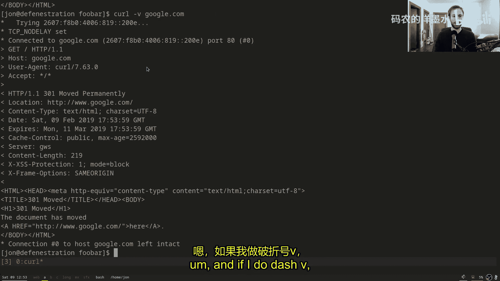
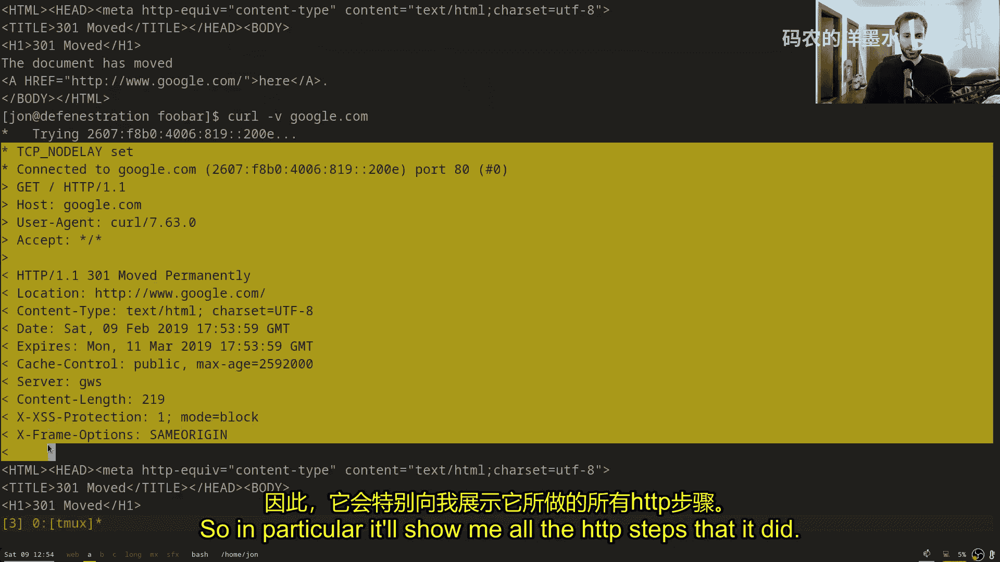
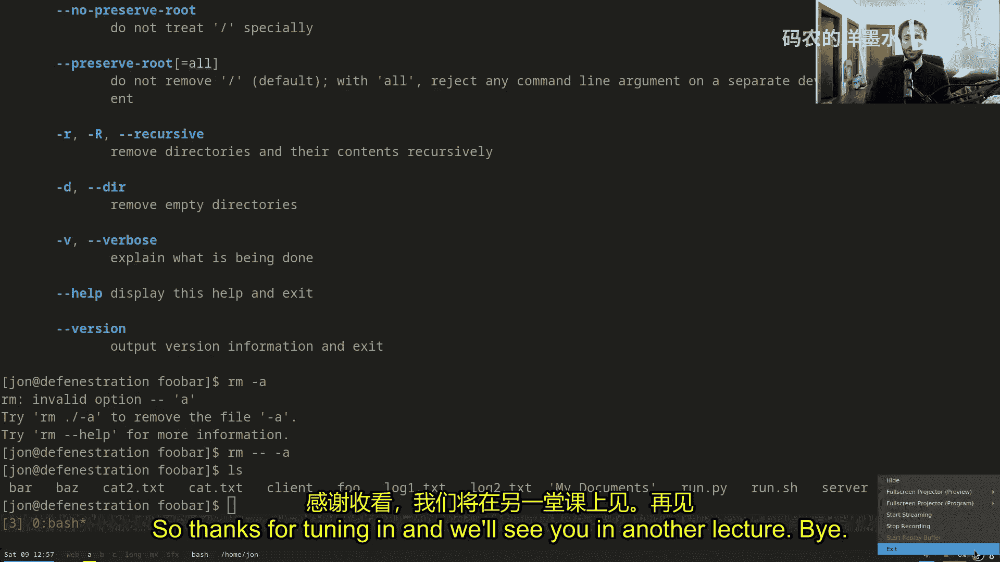

# 002：Shell与脚本 😊

在本节课中，我们将要学习Shell的基础知识及其脚本编程能力。Shell是一个强大的文本界面，允许你高效地与计算机交互和执行任务。我们将从基本命令开始，逐步深入到变量、控制流、命令组合等高级主题，帮助你理解如何利用Shell自动化工作流程。

## Shell简介

Shell是一个高效的文本界面，允许你通过命令与计算机交互。熟悉Shell后，你会发现几乎无需使用鼠标即可完成大部分操作。

当你打开Shell时，会看到一个提示符，允许你运行程序和命令。例如，`mkdir`创建目录，`cd`切换目录，`ls`列出文件，`mv`移动文件，`cp`复制文件。

```bash
mkdir foobar
cd foobar
touch foo bar
ls
mv bar baz
cp foo foobar
ls
```

这些是Shell的基础操作，但Shell的功能远不止于此。你可以调用计算机上的任何程序，命令行工具通常比图形界面更高效。

## Shell脚本编程

Shell本质上是一种交互式编程语言，通常称为脚本。有多种不同的Shell，如`sh`、`bash`、`csh`、`fish`、`zsh`和`ksh`。本课程主要使用`bash`，因为它最普遍。

Shell脚本非常有用，你既可以直接在命令行输入命令，也可以将命令写入文件执行。文件顶部的`#!`行（称为shebang）指定了解释器。

```bash
#!/bin/sh
echo "Hello"
```

```bash
#!/usr/bin/python
print("Hello from Python")
```

通过`chmod +x`命令使文件可执行后，即可直接运行。

## 变量与特殊变量

在Shell中，你可以使用变量存储数据。变量赋值时不能有空格。此外，还有一些特殊的预定义变量。

```bash
foo=bar
echo $foo
```

特殊变量包括：
*   `$0`：脚本或命令的名称。
*   `$1` 到 `$9`：脚本的参数。
*   `$#`：参数的数量。
*   `$$`：当前脚本的进程ID。

```bash
#!/bin/bash
echo "程序名: $0"
echo "第一个参数: $1"
echo "参数个数: $#"
```

## 控制流：循环与条件判断

Shell支持`for`循环和`if`条件判断等控制流结构，其语法与其他编程语言略有不同。

`for`循环遍历一个由空格分隔的列表。

```bash
for i in 1 2 3 4 5
do
    echo $i
done
```

你可以使用命令替换`$(command)`来生成循环列表。

```bash
for i in $(seq 1 5)
do
    echo $i
done
```

`if`语句根据命令的退出状态码（0表示成功，非0表示失败）决定是否执行代码块。`test`命令（或`[`）用于进行各种测试。

```bash
if [ -d "$file" ]
then
    echo "$file 是一个目录"
fi
```

**注意**：在`bash`中，使用双括号`[[ ]]`是更好的选择，它能更智能地处理变量，特别是空值。

```bash
if [[ -d "$file" ]]
then
    echo "$file 是一个目录"
fi
```

## 引号与空格问题

Bash默认会按照空格分割参数，这可能导致文件名包含空格时出现问题。使用引号可以防止单词被分割。

```bash
# 错误示例：文件名“my documents”会被分割成“my”和“documents”
for file in $(ls); do echo $file; done

# 正确示例：使用通配符*，Bash会正确处理文件名
for file in *; do echo "$file"; done
```

在变量替换时，也应使用引号。

```bash
if [ -d "$file" ]; then ... fi
# 或更好：
if [[ -d "$file" ]]; then ... fi
```

## 通配符

通配符（Globbing）是Shell用于匹配文件名的强大模式。
*   `*`：匹配任意字符串。
*   `?`：匹配任意单个字符。
*   `{a,b,c}`：匹配a、b或c。

```bash
ls *.txt          # 列出所有.txt文件
ls ?.txt          # 列出所有单个字符的.txt文件
ls {foo,bar}/*.py # 列出foo和bar目录下的所有.py文件
```

## 组合命令：管道与重定向

Shell的强大之处在于能够组合多个简单的程序。管道`|`将一个命令的输出作为另一个命令的输入。

```bash
ls | grep o           # 列出包含字母‘o’的文件
ps aux | grep username # 查找属于特定用户的进程
journalctl | grep kernel | tail -5 # 查找最后5条包含‘kernel’的系统日志
```

重定向可以改变命令的输入/输出源。
*   `>`：将标准输出重定向到文件（覆盖）。
*   `>>`：将标准输出重定向到文件（追加）。
*   `<`：将文件内容作为标准输入。
*   `2>`：将标准错误重定向到文件。

```bash
cat < input.txt > output.txt # 从input.txt读取，写入output.txt
command 2> error.log         # 将错误信息保存到error.log
```

进程替换`<(command)`允许你将命令的输出视为文件。

```bash
diff <(journalctl -b -1) <(journalctl -b -2) # 比较两次启动的日志
```

## 任务控制

你可以在后台运行程序，并管理这些任务。
*   `&`：在后台运行命令。
*   `jobs`：列出后台任务。
*   `fg %1`：将任务1切换到前台。
*   `bg %1`：将任务1在后台继续运行。
*   `Ctrl+Z`：暂停前台任务并放入后台。
*   `disown`：使任务与当前Shell分离，即使退出Shell也不会终止。

```bash
server &          # 在后台启动服务器
jobs              # 查看后台任务
fg %1             # 将服务器切换到前台
Ctrl+Z            # 暂停服务器
bg %1             # 让服务器在后台继续运行
disown %1         # 分离任务，退出Shell也不影响
```

## 进程管理

你可以查看和管理系统上运行的其他进程。
*   `ps`：查看进程。
*   `pgrep`：根据名称查找进程ID。
*   `pkill`：根据名称发送信号给进程。
*   `kill`：根据进程ID发送信号。
*   `kill -9` 或 `Ctrl+\`：强制终止进程（不推荐，不进行清理）。
*   `kill` 或 `Ctrl+C`：请求进程终止（推荐，允许清理）。

```bash
ps aux
pgrep -af server
pkill server
kill 12345
kill -9 12345 # 强制终止
```

## 命令行标志





大多数命令行工具接受以`-`开头的标志来修改其行为。
*   短标志：`-h`（帮助），`-v`（详细输出），`-a`（全部），`-f`（强制）。
*   长标志：`--help`，`--verbose`，`--all`，`--force`。
*   组合短标志：`-avf` 等同于 `-a -v -f`。
*   使用`--`可以明确指示后续参数不是标志，例如创建以`-`开头的文件：`touch -- -foo`。

```bash
ls -a           # 显示所有文件（包括隐藏文件）
rm -f file      # 强制删除文件
curl -v https://example.com # 显示详细输出
command --help  # 显示帮助信息
touch -- -myfile # 创建名为“-myfile”的文件
```

## 总结



本节课我们一起学习了Shell脚本编程的核心概念。我们从Shell的基本命令和变量开始，探讨了控制流、引号与空格处理、以及强大的通配符功能。接着，我们深入了解了如何通过管道和重定向组合命令，以及如何进行任务控制和进程管理。最后，我们介绍了命令行标志的常见用法。掌握这些知识将使你能够更高效地在命令行环境中工作，并编写脚本来自动化复杂任务。建议你通过实践练习来巩固这些概念，并进一步学习数据整理和命令行环境优化等相关主题。