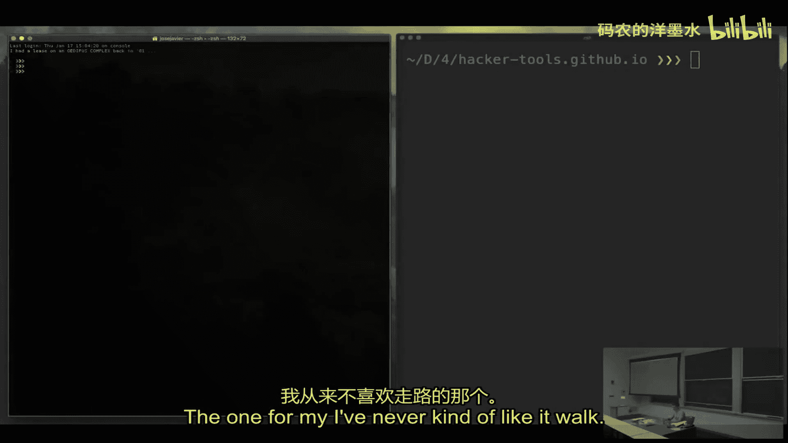
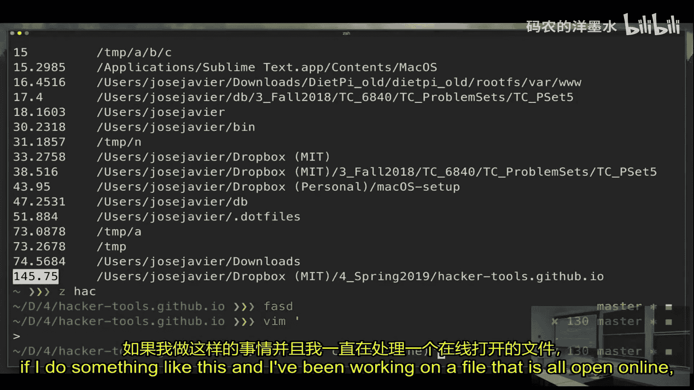
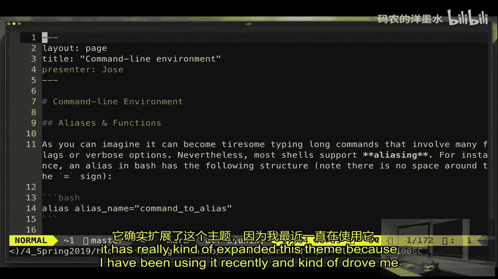
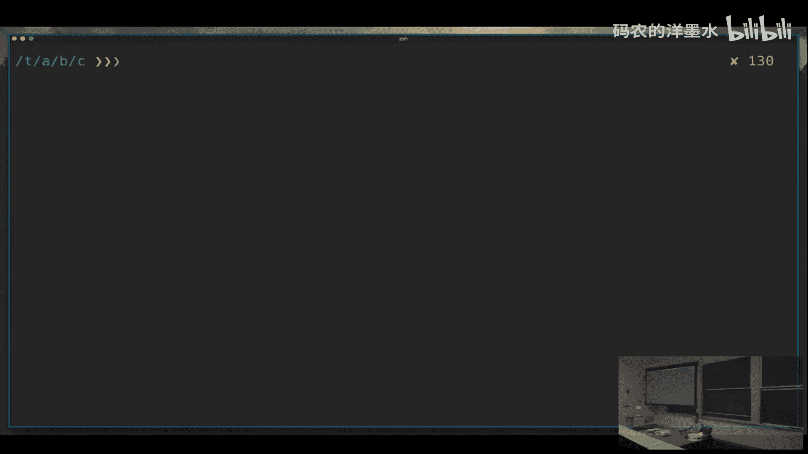
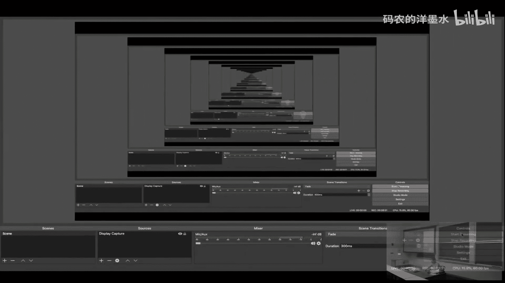

# 003：命令行环境

在本节课中，我们将学习如何定制和优化你的命令行环境，使其更高效、更符合你的工作习惯。我们将涵盖别名、Shell配置、终端模拟器、终端复用器以及一系列能极大提升生产力的工具。

## 概述

上一节我们介绍了基本的Shell操作。本节中，我们将深入探讨如何通过定制Shell、使用高效的终端工具和复用器来打造一个强大的命令行工作环境，让你的日常操作事半功倍。

## Shell别名

在Shell中，你可以为常用命令创建简短的别名，以节省输入时间。

例如，如果你经常使用 `ls -l` 命令，可以为其创建一个别名：

```bash
alias ll='ls -l'
```

现在，当你输入 `ll` 时，它就会自动展开为 `ls -l`。

别名可以组合使用。例如，你可以先定义一个别名，再基于它创建另一个：

```bash
alias ll='ls -l'
alias lla='ll -a'
```

输入 `lla` 会先展开为 `ll -a`，再进一步展开为 `ls -l -a`。

你甚至可以覆盖现有的命令名。例如，将 `ls` 定义为其他内容：

```bash
alias ls='ls --color=auto'
```

如果你想临时使用命令的原始版本，而不是别名，可以在命令前加上反斜杠 `\`：

```bash
\ls
```

或者使用 `command` 命令：

```bash
command ls
```

要永久删除一个别名，可以使用 `unalias` 命令：

```bash
unalias ls
```




## Shell配置与启动文件

在当前的Shell会话中定义的别名是临时的。为了让它们在所有新会话中生效，你需要将别名定义写入Shell的启动配置文件。

以下是不同Shell常见的配置文件：
*   **Bash**: `~/.bashrc`
*   **Zsh**: `~/.zshrc`
*   **Fish**: `~/.config/fish/config.fish`

例如，在Bash中，你可以编辑 `~/.bashrc` 文件，将别名定义添加进去。这样，每次打开新的终端时，这些别名都会被自动加载。

一个很好的做法是将配置集中管理，例如创建一个单独的配置文件（如 `~/.aliases`），然后在主配置文件中引用它：

```bash
# 在 ~/.bashrc 中添加
if [ -f ~/.aliases ]; then
    . ~/.aliases
fi
```

## 更智能的Shell：Zsh

除了Bash，还有许多其他Shell可供选择，例如Zsh。Zsh提供了许多开箱即用的便利功能。

Zsh支持强大的路径扩展。例如，使用 `**` 可以进行递归匹配：

```bash
# 查找当前目录及所有子目录下的 .txt 文件
ls **/*.txt
```





它还具有出色的自动补全功能，可以补全命令、参数和路径。许多Zsh配置框架（如Oh My Zsh）还提供了主题、插件（如语法高亮、命令纠错）等，能显著提升用户体验。

例如，启用语法高亮后，当你输入无效命令时，它会立即显示为红色。命令纠错功能可以在你输错命令时提示正确的命令。

## 终端模拟器

Shell是解释命令的程序，而终端模拟器则是运行Shell的图形界面程序。你可以选择不同的终端模拟器来获得更好的特性支持，例如：
*   更丰富的快捷键绑定
*   可自定义的字体和配色方案
*   更好的性能（如GPU加速渲染）
*   分页或分割面板功能

## 终端复用器：Tmux

Tmux是一个终端复用器，允许你在一个终端窗口内运行多个Shell会话。

使用Tmux，你可以：
*   创建多个标签页。
*   在垂直或水平方向分割窗格。
*   从Tmux会话中分离，让程序在后台继续运行，稍后再重新连接。这对于在远程服务器上运行长时间任务特别有用。

基本Tmux命令：
*   `tmux new -s <session_name>`: 创建新会话。
*   `Ctrl-b d`: 分离当前会话。
*   `tmux attach -t <session_name>`: 重新连接到指定会话。
*   `Ctrl-b %`: 垂直分割当前窗格。
*   `Ctrl-b "`: 水平分割当前窗格。

## 高效的文件导航

在文件系统中快速跳转可以节省大量时间。除了 `cd` 命令，还有一些更智能的工具。

`fasd` 工具通过记录你访问最频繁和最近使用的文件和目录，实现快速跳转。

```bash
# 快速跳转到经常访问的目录
z project
# 快速打开最近使用的文件
v config.yaml
```

`ranger` 是一个控制台下的文件管理器，提供可视化导航、预览文件等功能，比单纯使用 `ls` 和 `cd` 更高效。

## 改进的基础命令替代品

许多经典Unix命令都有功能更强大、用户友好的现代替代品。

*   `exa` 替代 `ls`：支持图标、更好的文件大小显示（如KB、MB）和Git状态集成。
    ```bash
    exa -l --git
    ```
*   `ripgrep (rg)` 替代 `grep`：速度极快，默认递归搜索，能自动忽略.gitignore中的文件。
    ```bash
    rg "function_name" --type py
    ```
*   `fd` 替代 `find`：语法更简单，默认忽略隐藏文件，搜索速度更快。
    ```bash
    fd "pattern"
    ```
*   `fzf` 是一个通用的模糊查找器，可以交互式地筛选列表（如文件、命令历史）。它常与Ctrl-R绑定，用于搜索历史命令。
*   `tldr` 替代 `man`：提供简洁实用的命令使用示例，比冗长的手册页更易上手。
    ```bash
    tldr tar
    ```
*   `trash-cli` 替代 `rm`：将文件移至“回收站”而非永久删除，更安全。
    ```bash
    trash file.txt
    ```
*   `rsync` 替代 `scp` 用于同步文件：支持增量同步和断点续传，效率更高。
    ```bash
    rsync -avz source/ user@host:destination/
    ```

## 总结





本节课中我们一起学习了如何深度定制命令行环境。我们从创建Shell别名和配置启动文件开始，探讨了Zsh等更智能的Shell及其增强功能。接着，我们了解了终端模拟器的选择以及使用Tmux进行终端复用的强大之处。最后，我们介绍了一系列能极大提升文件操作、搜索和日常工作效率的现代命令行工具替代品。通过合理配置和使用这些工具，你的命令行界面将成为一个极其高效的工作站。