# 004：数据整理 📊

在本节课中，我们将要学习命令行中一项核心技能：数据整理。数据整理是指当你有一堆文本数据，并希望将其转换成另一种形式（通常是更精简的形式）时所做的事情。例如，系统日志通常非常冗长，从中找到有用信息很困难，因此需要将其浓缩。命令行提供了强大的工具来帮助你筛选和转换数据。

在上一讲中，我们简单介绍了 `grep` 和管道 `|` 等基础工具。本节中，我们将深入探讨所有能帮助你“按摩”数据、将其从一种格式转换为所需格式的工具。我们将以一个实际的服务器日志文件为例进行操作。

---

## 从日志中提取信息

假设我们想查看服务器上 SSH 的登录尝试记录。服务器日志通常包含大量信息，直接查看非常困难。

首先，我们使用 `grep` 命令筛选出包含 “sshd” 的行，但这仍然会输出太多文本。

```bash
grep sshd log.txt
```

我们注意到，那些包含“用户名”的行通常有 “disconnected from” 这样的信息。因此，我们可以进一步筛选。

```bash
grep "disconnected from" log.txt
```

这样，输出的行数减少了，并且每行都包含了用户名信息。然而，每行开头仍然有很多我们不需要的元数据（如日期、主机名、进程ID等）。

---

## 使用 `sed` 进行流编辑

为了去除每行开头的冗余信息，我们使用一个名为 `sed` 的工具。`sed` 是一个流编辑器，允许你编写命令来逐行编辑文本。

以下命令使用 `sed` 的替换功能，删除每行中 “disconnected from” 之前的所有内容。

```bash
sed 's/.*disconnected from //'
```

**命令解释**：
*   `s` 代表替换（substitute）。
*   模式 `.*disconnected from` 会匹配 “disconnected from” 之前的任何字符串。
*   替换部分为空，意味着删除匹配到的内容。

这样，我们就得到了以用户名开头的更简洁的行。但行末尾仍然有 IP 地址、端口号等信息。

---

## 深入正则表达式

`sed` 中使用的模式被称为**正则表达式**。它是一种强大的文本匹配语言。以下是一些基础概念：

*   `.` （点）：匹配**任意单个**字符。
*   `*` （星号）：匹配**零个或多个**前面的模式。
*   `+` （加号）：匹配**一个或多个**前面的模式。
*   `[]` （方括号）：匹配括号内的**任意一个**字符。例如 `[abc]` 匹配 a、b 或 c。
*   `|` （竖线）：表示“或”。例如 `(pattern1|pattern2)` 匹配 pattern1 或 pattern2。
*   `^` （脱字符）：匹配行的**开头**。
*   `$` （美元符）：匹配行的**结尾**。

`sed` 默认使用一个较老的正则表达式版本。为了使用更现代的特性（如避免“贪婪匹配”），我们有时会使用 `perl` 命令的 `-p` 选项，它支持非贪婪操作符 `?`。

然而，`sed` 几乎在所有 Unix 系统上都默认安装，因此更为通用。为了处理行尾的 IP 地址和端口，我们构建一个更复杂的 `sed` 命令。

```bash
sed -E 's/^.*disconnected from (invalid |authenticating )?user .* [^ ]+ port [0-9]+( \[preauth\])?$//'
```

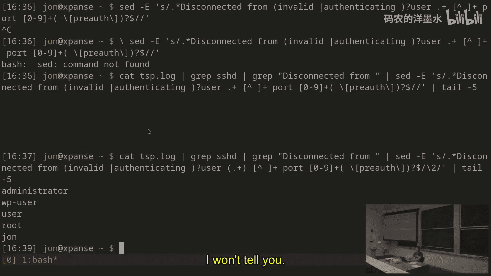

这个模式逐步匹配了：
1.  行首到 “disconnected from”。
2.  可选的 “invalid ” 或 “authenticating ”。
3.  “user ” 字符串。
4.  用户名（任意非空字符串）。
5.  IP地址（任意非空格字符串）。
6.  “ port ” 后跟端口号（数字）。
7.  可选的 “ [preauth]” 字符串。
8.  行尾。

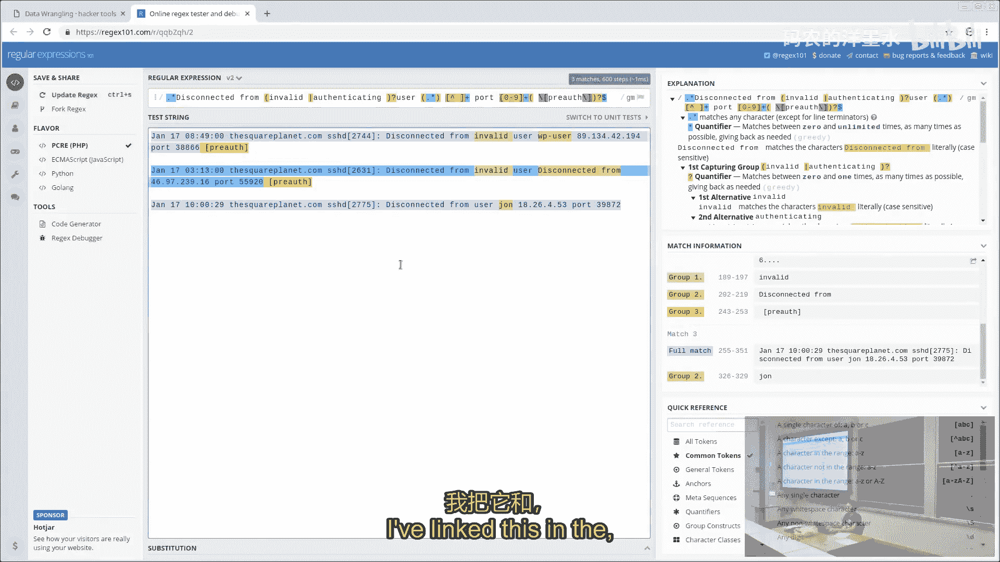

但这样会把整行都替换为空，我们只想保留用户名。

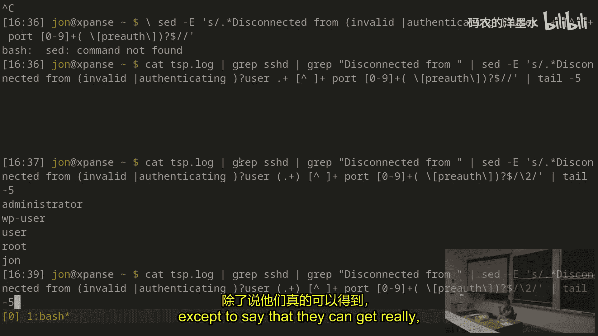

---

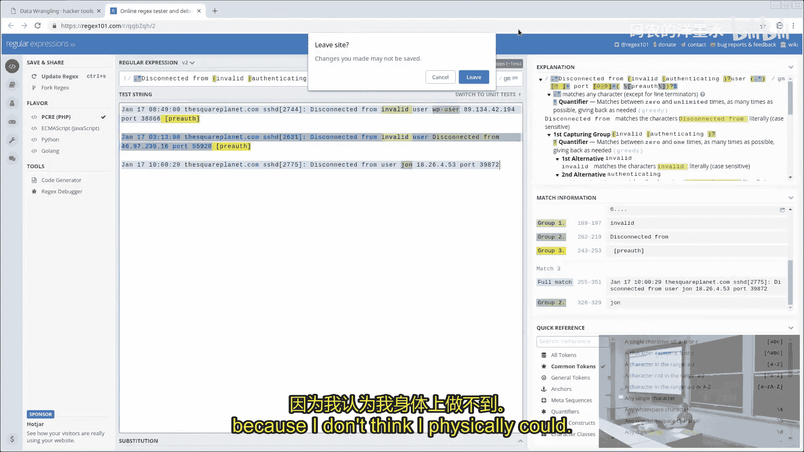

## 使用捕获组

正则表达式允许使用**捕获组**来保留匹配到的部分内容。将模式的一部分用括号 `()` 括起来，就可以在替换时通过 `\1`、`\2` 等来引用它们。

我们修改命令，将用户名部分用括号捕获，并在替换时只保留它。

```bash
sed -E 's/^.*disconnected from (invalid |authenticating )?user (.*) [^ ]+ port [0-9]+( \[preauth\])?$/\2/'
```

**命令解释**：
*   `(invalid |authenticating )?` 是第一个捕获组 `\1`。
*   `(.*)` 是第二个捕获组 `\2`，即我们想要的用户名。
*   `( \[preauth\])?` 是第三个捕获组 `\3`。
*   替换为 `\2`，意味着整行只被替换为捕获到的用户名。

现在，我们成功地从杂乱的日志行中提取出了纯净的用户名列表。

---

## 调试正则表达式

编写复杂的正则表达式可能很困难。在线工具如 [regex101.com](https://regex101.com) 非常有用，它可以可视化解释你的模式，高亮显示匹配部分和捕获组，帮助你调试。

---

## 对结果进行统计

现在我们有了用户名列表，可以进行一些有趣的分析。例如，统计每个用户名出现的频率。

首先，使用 `sort` 对用户名排序，使相同的用户名排列在一起。

```bash
sort
```

然后，使用 `uniq -c` 统计每个连续重复行的数量。

```bash
uniq -c
```

输出结果显示了用户名及其出现次数。为了查看最常见的用户名，我们可以按计数降序排列。

```bash
sort -nk1,1
```

**命令解释**：
*   `-n` 表示按数值排序。
*   `-k1,1` 表示仅按第一列（计数）排序。

使用 `tail` 可以查看最后10行（即出现次数最多的10个用户名）。

```bash
tail -10
```

---

## 使用 `awk` 处理字段数据

`awk` 是另一个强大的文本处理工具，特别擅长处理按列（字段）组织的数据。默认情况下，`awk` 以空白字符（空格、制表符）作为字段分隔符。

例如，从 `uniq -c` 的输出中，如果我们只想提取用户名（第二列），可以这样做：

```bash
awk '{print $2}'
```

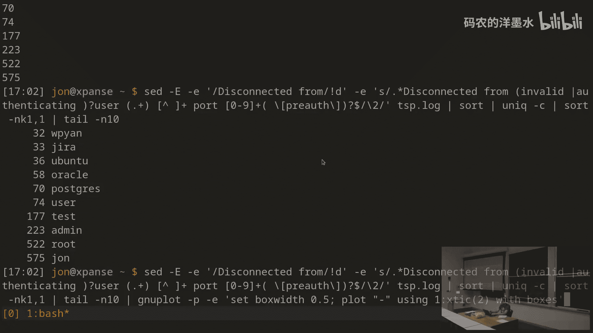

**变量解释**：
*   `$0` 代表整行。
*   `$1` 代表第一个字段（计数）。
*   `$2` 代表第二个字段（用户名）。

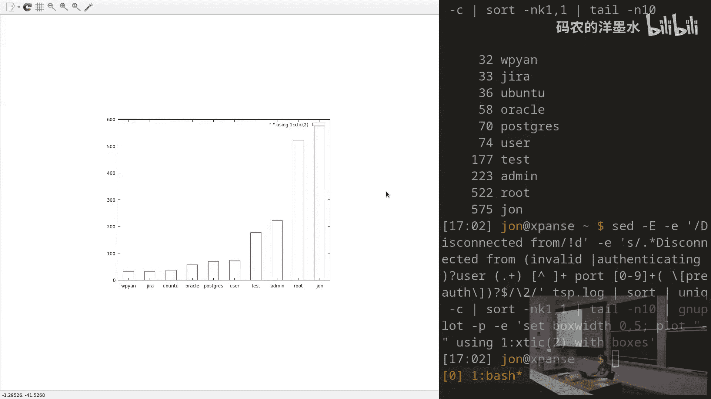

`awk` 本身就是一个完整的编程语言。你可以在其中添加条件判断。例如，找出所有只出现一次且以 ‘c’ 开头、以 ‘e’ 结尾的用户名：

```bash
awk '$1 == 1 && $2 ~ /^c.*e$/ {print $2}'
```

你还可以在 `awk` 中执行更复杂的计算，例如对满足条件的行进行求和。

```bash
awk 'BEGIN {rows=0} $1 != 1 && $2 ~ /^c/ {rows+=$1} END {print rows}'
```

**结构解释**：
*   `BEGIN` 块在处理任何行之前执行，用于初始化变量。
*   中间的模式-动作对 `$1 != 1 && $2 ~ /^c/ {rows+=$1}` 对满足条件的行，将其计数加到 `rows` 变量中。
*   `END` 块在处理完所有行后执行，用于输出最终结果。


---

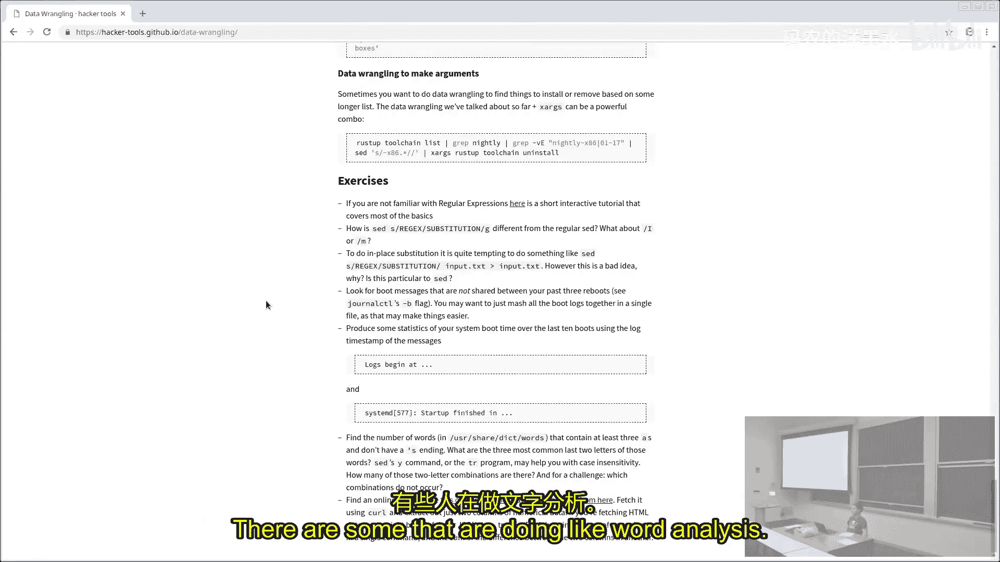

## 其他实用工具

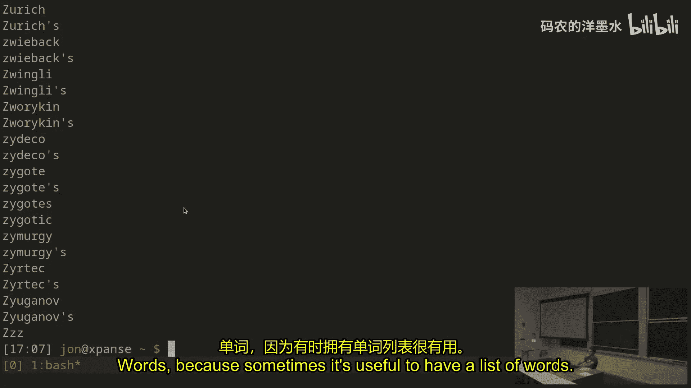

*   **`paste`**：将多行输入合并为一行，用指定分隔符连接。例如，用加号连接数字后传给计算器 `bc` 求和。
    ```bash
    paste -sd+ | bc
    ```
*   **`R` 语言**：可以通过命令行模式进行快速的统计分析。例如，计算一列数字的摘要统计信息。
    ```bash
    R -q -e 'x <- scan(file="stdin", quiet=TRUE); summary(x)'
    ```
*   **`gnuplot`**：一个简单的命令行绘图工具，适合快速可视化。
    ```bash
    gnuplot -p -e 'set terminal dumb; plot "/dev/stdin" using 1:2 with boxes'
    ```
*   **`xargs`**：将标准输入的行转换为后面命令的参数。例如，批量删除多个工具链版本。
    ```bash
    xargs rustup toolchain uninstall
    ```

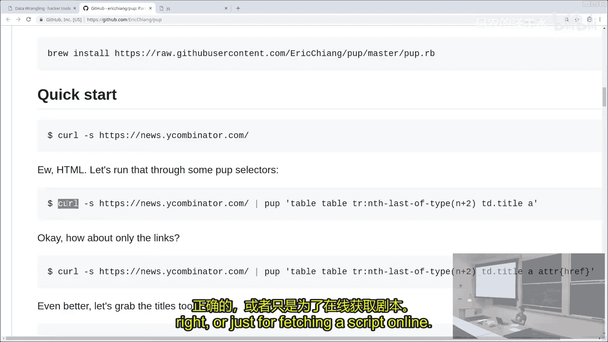

---

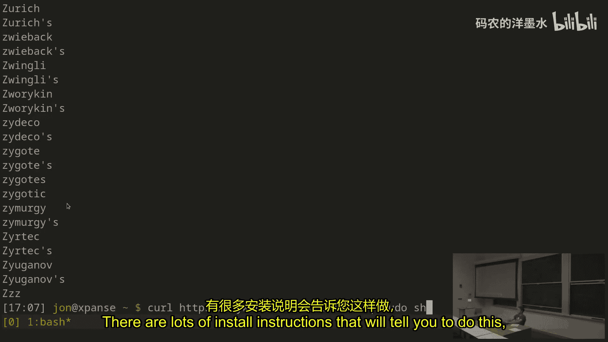

## 处理非文本数据

数据整理不仅限于纯文本。对于结构化数据，有更合适的工具：
*   **HTML**：使用 `pup`，它支持 CSS 选择器来提取元素。
    ```bash
    curl -s https://example.com | pup 'table .title a attr{href}'
    ```
*   **JSON**：使用 `jq`，它可以灵活地查询和提取 JSON 数据。
    ```bash
    curl -s https://api.example.com/data.json | jq '.[].attribute'
    ```
*   **CSV**：可以使用 `awk` 并指定逗号作为分隔符 `-F,` 来处理。

---

## 总结

本节课中我们一起学习了命令行数据整理的核心技能。我们从杂乱的系统日志开始，逐步使用 `grep`、`sed`（及其正则表达式）、`sort`、`uniq`、`awk` 等工具，最终提取出有价值的用户名频率信息。我们还介绍了 `paste`、`xargs` 等辅助工具，以及处理 JSON、HTML 等结构化数据的专用工具。

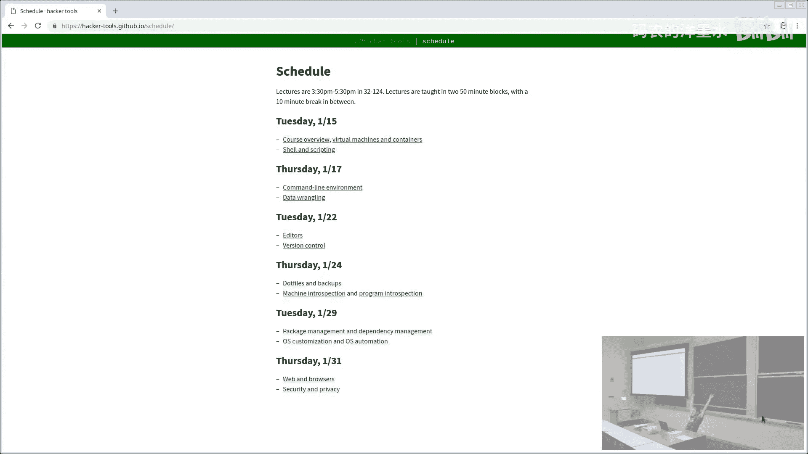

数据整理的魅力在于，通过组合这些简单而强大的工具，你可以将任何原始数据流转换为清晰、有用的格式，从而自动化完成许多原本繁琐的手动任务。掌握这些技能将极大提升你在命令行环境下的工作效率。