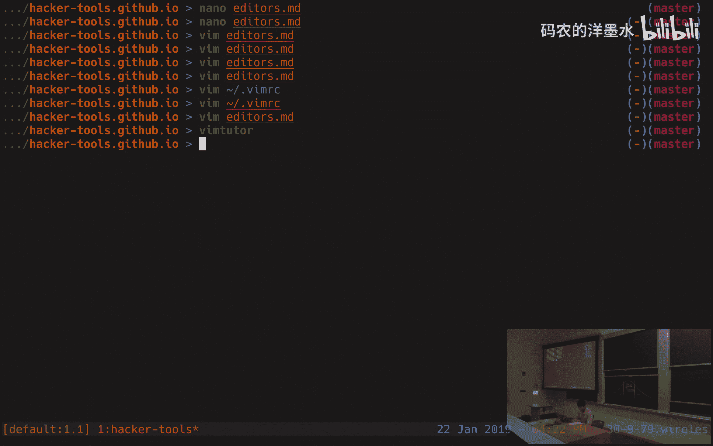
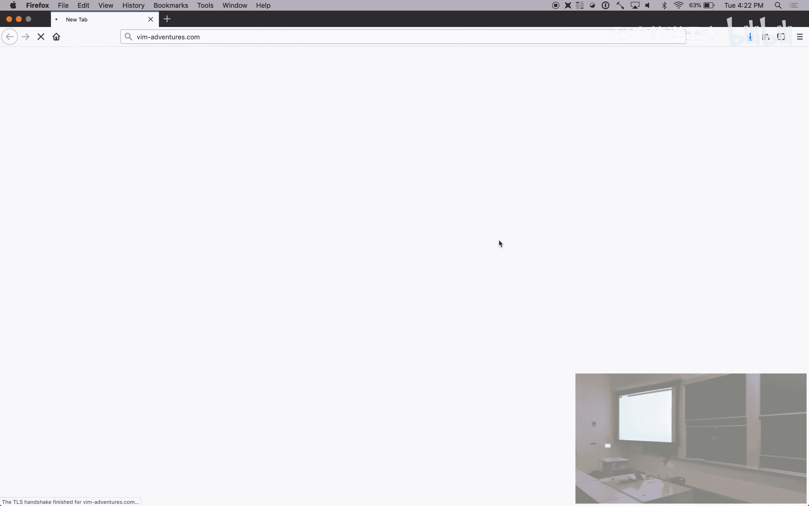
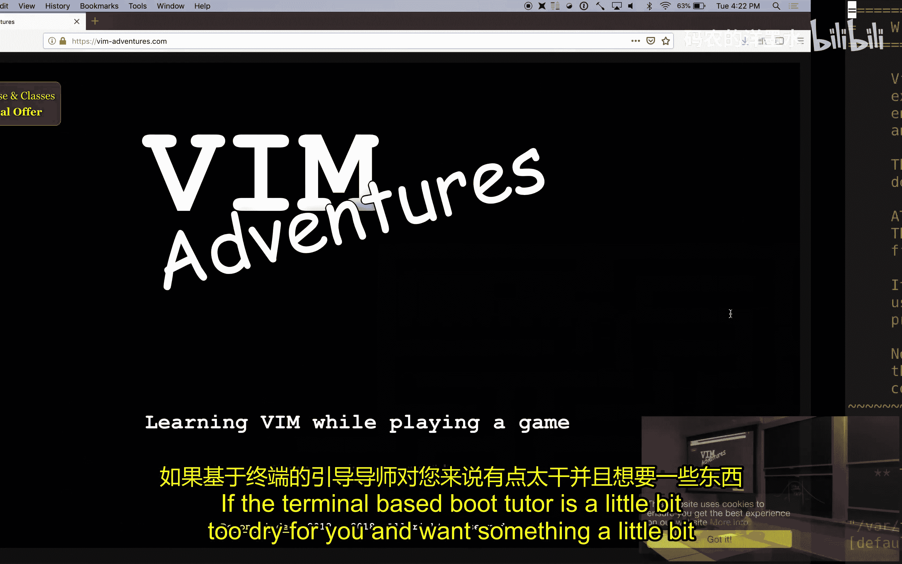
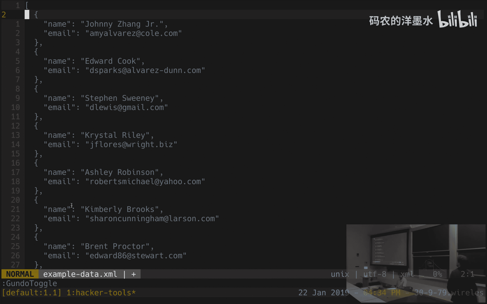

# 005：文本编辑器 📝

在本节课中，我们将要学习文本编辑器和版本控制。作为程序员，我们大部分时间都在与纯文本文件打交道，因此选择一个趁手的文本编辑器并熟练掌握它至关重要。我们将重点介绍一款功能强大的命令行编辑器 Vim，讲解其背后的设计哲学、基本操作以及一些高级功能，帮助你找到最适合自己的工具。

## 编辑器的重要性与选择

作为程序员，我们大部分时间都在与纯文本文件交互。在所有工具中，文本编辑器是你将花费最多时间的工具，因此值得投入时间去寻找最适合你的编辑器，并深入学习它。

以下是选择和学习编辑器的一些建议：
*   **尝试不同编辑器**：人们对此有不同看法，值得找到一个符合你需求的编辑器。
*   **深入学习**：投入时间学习并自定义你的编辑器，让它完全按你的意愿工作。
*   **强制使用**：学习新编辑器的最佳方式是强迫自己在几周内用它完成所有工作。起初效率可能略有下降，但几周后就会开始受益。

在本课程中，我们将教授 Vim 的基础知识，这是一款功能强大且常用的文本编辑器。我们鼓励你尝试其他选项。我们选择教授 Vim 是因为讲师们都使用它。不同的人有不同的偏好，课程笔记中甚至链接了关于“编辑器战争”的讨论。

在接下来的 50 分钟里，我们将介绍 Vim 的基础知识。我们无法在这么短的时间内教会你如何使用这款强大的编辑器，因此重点在于教授基础、展示高级功能、阐释其设计哲学，并提供资源链接，以便你自行深入学习。

## 文本编辑器的分类

文本编辑器主要分为两类：具有图形界面的编辑器（如 Atom 或 Sublime Text）和命令行文本编辑器。

即使你最终决定使用图形界面编辑器，也值得学习一些命令行编辑器的基础知识。这在远程编辑文件时非常有用，例如，当你需要 SSH 登录到远程机器并直接在终端中编辑文件时，这比来回复制文件或使用更复杂的技术要方便得多。

在深入 Vim 之前，我们先看一个不同的文本编辑器：Nano。

## 基础命令行编辑器：Nano

你可以通过 `nano` 命令启动 Nano，并指定要编辑的文件名。例如：
```bash
nano lecture_notes.txt
```

Nano 的界面底部始终显示操作指令。你可以使用方向键移动光标，并直接输入文本。

以下是需要记住的几个关键组合：
*   **Ctrl + O**：写入文件（保存）。编辑器会询问文件名，默认是打开的文件名。
*   **Ctrl + X**：关闭编辑器。

Nano 是一个非常简单的文本编辑器，预装在大多数系统上。当你登录到没有安装其他编辑器的远程机器并需要做小修改时，它非常方便。但它不适合编写复杂的程序，因为它缺乏高级功能支持。

那么，你应该使用什么呢？接下来，我们将学习功能更强大的 Vim。

## Vim 的设计哲学

Vim 是一个功能复杂的工具，背后有许多巧妙的设计理念。

**核心理念 1：模态编辑**
编程时，我们大部分时间不是在输入字符，而是在移动、阅读和操作文本。因此，Vim 是一个**模态编辑器**，拥有不同的模式来应对不同的任务：
*   **插入模式**：用于输入文本。
*   **普通模式**：用于在文件中移动和操作文本。由于编程时大部分时间在阅读和操作代码，你将在普通模式中度过大部分时间。

**核心理念 2：可编程性**
Vim 内置了一门叫做 Vimscript 的编程语言。你可以通过编写配置或插件来高度自定义编辑器。它也可以通过其他语言（如 Python、Ruby）的绑定进行编程。

**核心理念 3：类似编程语言的界面**
在普通模式下，你通过一系列命令（通常是单键击）来移动光标和修改文件。这些命令具有助记名称，并且可以组合。例如：
*   `w` 是一个移动命令，向前移动一个单词。
*   `c` 是一个编辑命令，表示“修改”。
*   组合 `cw` 意味着“修改单词”，它会删除当前单词并进入插入模式让你输入新词。
*   组合 `c$` 意味着“修改到行尾”，它会删除从光标到行尾的内容并进入插入模式。

这种组合性使得 Vim 非常强大。

**其他重要理念**
*   **避免使用鼠标**：鼠标不够精确且速度慢。Vim 鼓励使用键盘，通过肌肉记忆实现快速导航和操作。
*   **速度匹配思维**：编辑器应该以你思考的速度工作，让你想到哪里，光标就能立刻到哪里。

## Vim 基础：模式与切换

Vim 是一个模态编辑器。你当前所处的模式会显示在编辑器左下角。

**主要模式：**
*   **普通模式**：用于移动和操作。左下角无显示或显示“正常”。
*   **插入模式**：用于输入文本。显示“插入”。
*   **可视模式**：用于选择文本块。有多种变体。

**模式切换：**
*   从普通模式进入插入模式：按 `i`。
*   从普通模式进入可视模式：按 `v`（字符选择）、`V`（行选择）、`Ctrl+v`（块选择）。
*   从其他模式返回普通模式：按 `Esc` 键。

**关于 Esc 键的提示：**
标准键盘的 Esc 键位置不便。在 Vim 中，你经常需要在模式间切换，因此将 `Caps Lock` 键映射为 `Esc` 是一个常见做法（例如，在 Mac 系统偏好设置的键盘->修饰键中修改）。

## 基本 Vim 操作：保存、退出与帮助

在普通模式下，按 `:` 进入“命令模式”，光标会跳到底部，可以输入命令。

**基本命令：**
*   `:q` – 退出（quit）。
*   `:w` – 保存（write）。
*   `:wq` 或 `:x` – 保存并退出。
*   `:e <文件名>` – 编辑另一个文件。
*   `:ls` – 列出所有打开的缓冲区。
*   `:bn` – 切换到下一个缓冲区。

**帮助系统：**
Vim 拥有强大的内置文档。使用 `:help <主题>` 来查看帮助。例如，`:help w` 会告诉你 `w` 命令的作用。

## 在文件中移动

虽然可以使用方向键，但 Vim 提供了更高效的移动命令。建议初学者禁用方向键以培养好习惯。可以将以下配置加入 `~/.vimrc` 文件：
```vim
noremap <Left> :echo "Use h!"<CR>
noremap <Right> :echo "Use l!"<CR>
noremap <Up> :echo "Use k!"<CR>
noremap <Down> :echo "Use j!"<CR>
```

**基本移动（HJKL）：**
*   `h` – 左移
*   `j` – 下移
*   `k` – 上移
*   `l` – 右移

**按单词移动：**
*   `w` – 移动到下一个单词开头。
*   `b` – 移动到上一个单词开头。
*   `e` – 移动到当前单词末尾。

**行内移动：**
*   `0` – 移动到行首。
*   `^` – 移动到行首第一个非空白字符。
*   `$` – 移动到行尾。

**屏幕与文件内移动：**
*   `H` – 移动到屏幕顶部。
*   `M` – 移动到屏幕中部。
*   `L` – 移动到屏幕底部。
*   `Ctrl+d` – 向下翻半页。
*   `Ctrl+u` – 向上翻半页。
*   `gg` – 移动到文件开头。
*   `G` – 移动到文件末尾。
*   `:<行号>` 或 `:<行号>G` – 跳转到指定行。

**高级移动：**
*   `%` – 在配对的括号、引号间跳转。
*   `f<字符>` – 向右查找并跳转到下一个指定字符。
*   `F<字符>` – 向左查找并跳转到上一个指定字符。
*   `t<字符>` – 向右跳转到指定字符前。
*   `T<字符>` – 向左跳转到指定字符前。

**使用数字重复动作：**
在命令前加数字可以重复该动作。例如：
*   `5j` – 向下移动 5 行。
*   `3w` – 向前移动 3 个单词。

**搜索移动：**
*   `/` – 进入搜索模式，输入文本后按回车跳转到下一个匹配项。
*   `n` – 跳转到下一个匹配项。
*   `N` – 跳转到上一个匹配项。

## 文本选择（可视模式）

可视模式用于选择文本块，然后进行操作。

**进入可视模式：**
*   `v` – 进入字符选择可视模式。
*   `V` – 进入行选择可视模式。
*   `Ctrl+v` – 进入块选择可视模式。

在可视模式下，可以使用所有之前学过的移动命令（如 `w`, `j`, `$`）来调整选择范围。按 `Esc` 可以取消选择并返回普通模式。

## 文本操作与编辑

基本的编辑流程是：在普通模式下移动光标到目标位置，进入插入模式（`i`）进行修改，然后按 `Esc` 返回普通模式。

**更高效的操作命令：**
这些命令可以与移动命令组合。

**删除命令 `d` (delete)：**
*   `dw` – 删除一个单词（从光标到单词末尾）。
*   `d$` – 删除到行尾。
*   `d0` – 删除到行首。
*   `d3j` – 向下删除 3 行。
*   `d3w` – 删除 3 个单词。

**修改命令 `c` (change)：**
`c` 命令会删除指定文本并进入插入模式。
*   `cw` – 修改单词（等同于 `dw` + `i`）。
*   `c$` – 修改到行尾。
*   `c3w` – 修改 3 个单词。

**其他有用命令：**
*   `x` – 删除光标下的字符。
*   `s` – 替换光标下的字符并进入插入模式（等同于 `x` + `i`）。
*   `r<字符>` – 替换光标下的字符（不进入插入模式）。
*   `~` – 切换光标下字符的大小写。
*   `o` – 在当前行下方插入新行并进入插入模式。
*   `O` – 在当前行上方插入新行并进入插入模式。

**在可视模式下操作：**
先进入可视模式选择文本，然后按 `d` 删除或 `c` 修改。

**撤销与重做：**
*   `u` – 撤销上一次更改。
*   `Ctrl+r` – 重做被撤销的更改。







## 如何学习 Vim

记住所有命令可能令人望而生畏，但通过练习它们会变成肌肉记忆。

**学习资源：**
*   **Vim Tutor**：在终端输入 `vimtutor` 即可启动一个交互式教程，它会带你从基础学到进阶操作。
*   **Vim Adventures**：一个在线的游戏化学习网站 (`vim-adventures.com`)，通过游戏教你 Vim 命令，非常有趣。

## 自定义你的 Vim：.vimrc 文件

Vim 通过用户主目录下的 `~/.vimrc` 文件进行配置。你可以在此添加设置来改变编辑器的行为和外观。

**一些有用的基础设置：**
```vim
set number          " 显示行号
set incsearch       " 输入搜索内容时实时高亮匹配
set hlsearch        " 高亮所有搜索匹配项
syntax on           " 开启语法高亮
set backspace=indent,eol,start  " 允许在插入模式下用退格键删除
```

互联网上有大量关于 Vim 配置的技巧和文章。你也可以在 GitHub 上查看他人分享的配置文件，从中获取灵感。

## 高级功能演示

Vim 的功能远不止于此。以下是一些高级功能的简要演示，旨在激发你的探索兴趣。

**搜索与替换：**
使用 `:%s/旧文本/新文本/g` 可以进行全局替换。这类似于 `sed` 命令。添加 `c` 标志（如 `:%s/foo/bar/gc`）可以在替换前进行确认。

**分屏：**
使用 `:split` 或 `:vsplit` 可以水平或垂直分割窗口，同时查看或编辑文件的不同部分。

**宏：**
宏可以记录并回放一系列操作，用于自动化重复性任务。
1.  按 `q` 后跟一个寄存器字母（如 `q`）开始录制。
2.  执行你的操作序列。
3.  按 `q` 停止录制。
4.  按 `@` 后跟寄存器字母（如 `@`）回放宏。
5.  使用数字前缀（如 `1000@`）可以重复执行宏多次，直到出错为止。

讲师现场演示了如何使用宏将一个简单的 XML 数据片段快速转换为 JSON 格式，这展示了 Vim 强大的文本处理能力。

**插件：**
Vim 拥有丰富的插件生态系统，可以实现诸如可视化撤销历史树等高级功能。值得在熟悉基础后深入探索。

---



本节课中我们一起学习了文本编辑器的重要性，重点探讨了 Vim 这款强大的模态编辑器。我们从其设计哲学入手，学习了模式切换、基本导航、文本操作以及如何通过 `.vimrc` 文件进行自定义。最后，我们还预览了搜索替换、分屏和宏等高级功能。掌握一个高效的文本编辑器需要时间和练习，但这项投资将极大地提升你的编程生产力。希望本课能激发你深入学习 Vim 或其他编辑器的兴趣。