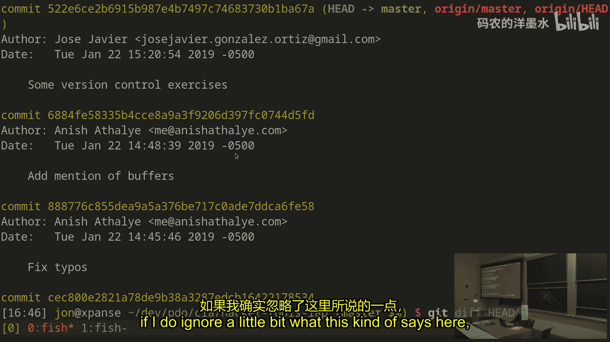
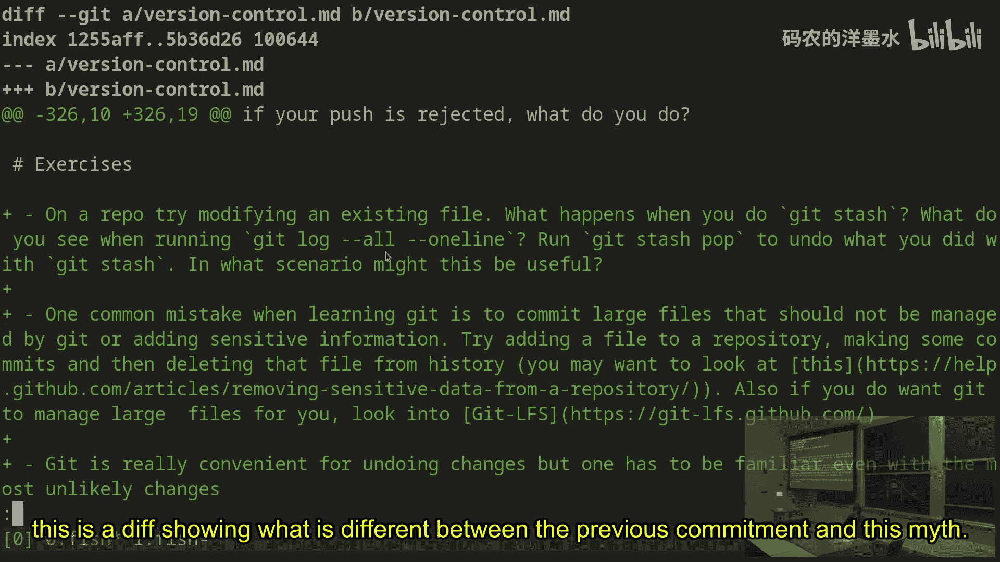
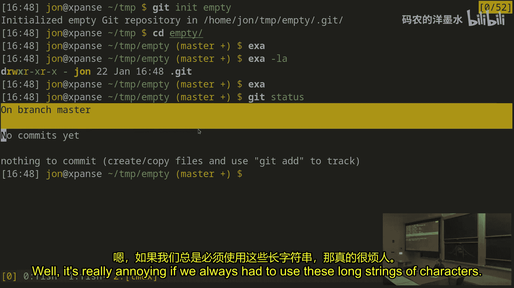
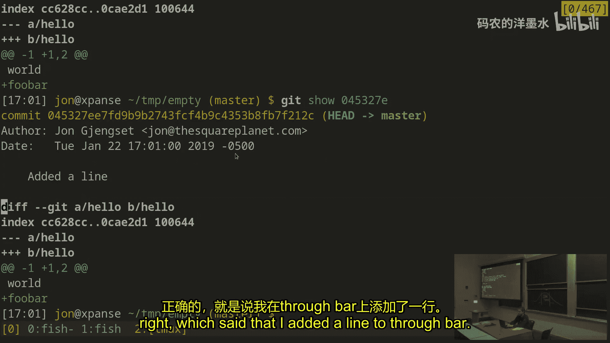
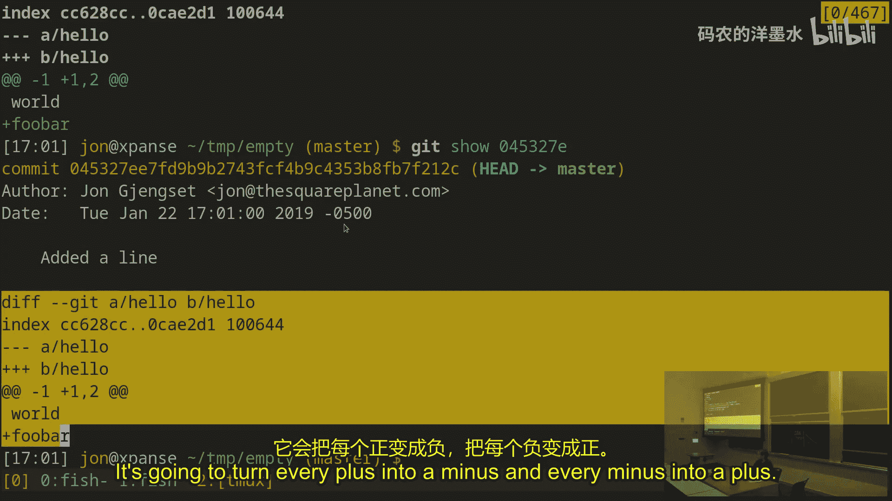
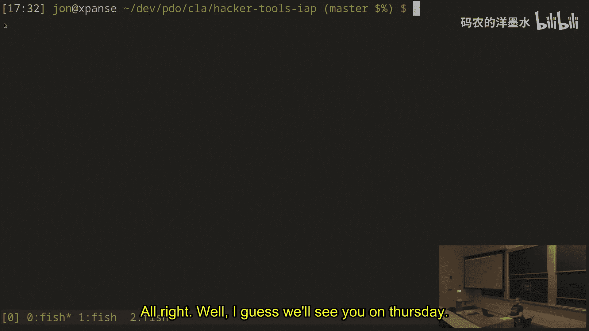

# 006：版本控制 📚

在本节课中，我们将要学习版本控制系统，特别是Git。版本控制系统能帮助我们追踪文件随时间的变化，允许我们撤销错误、查看历史记录，并与他人协作。我们将从Git的核心概念开始，逐步了解其基本操作和工作原理。

## 概述

版本控制系统是一种用于管理源代码、文本文件、配置文件等文件的工具。它能维护这些文件变化的持久历史记录。当你需要追踪随时间的变化时，版本控制系统是一个理想的起点。此外，它还能在不同用户之间共享变更，允许多人协作同一个项目。

市面上有许多版本控制系统，它们的工作方式、功能、易用性和适用场景各不相同。本讲座将重点介绍一个名为Git的工具，它是目前较为常见的版本控制系统之一，支持多用户、多机器协作，并且得到了在线平台（如GitHub）的良好支持。虽然我们会聚焦于Git，但其中的许多概念也适用于其他系统。

## Git的数据模型

理解Git的关键在于理解其数据模型，即它如何存储文件及其历史。一旦理解了数据模型，许多操作命令背后的逻辑就会变得清晰。

### 提交（Commit）

Git的核心是**提交**。一个提交本质上是某个时间点下，你所关注的文件夹状态的快照。当你使用版本控制系统时，它通常基于某个文件夹及其所有子内容。提交就是这个文件夹在某个时间点的“冻结”版本。

每个Git提交都有一个唯一的名称，称为**哈希值**。它看起来像这样：`522e6...`。你捕获的每一个快照（即每个提交）都有这样一个哈希值，并且保证在给定的仓库中是唯一的。

提交还包含其他信息：
*   **作者**：谁创建了这个快照。
*   **提交信息**：描述这个快照的原因。
*   **父提交哈希**：指向之前的提交，从而形成一个时间线，展示随时间发生的变化以及变更之间的依赖关系。

提交代表了自上一个提交以来所做的更改。你可以将每个快照视为捕获了从一个时间点到另一个时间点的变化。

实际上，Git存储的是完整的快照，而不仅仅是差异。但你可以将每个提交视为对前一个状态应用了一组更改，这就是为什么它需要记住前一个提交。

## 基本操作

上一节我们介绍了Git的核心数据模型——提交。本节中我们来看看如何使用Git进行基本的版本控制操作。

### 初始化仓库

首先，你需要一个Git仓库来开始追踪文件。仓库是Git存储其管理的文件夹所有信息的地方。

使用 `git init` 命令在指定文件夹中创建一个新的Git仓库。如果文件夹不存在，它会被创建。这个命令会在当前目录下创建一个名为 `.git` 的隐藏文件夹，用于存储Git追踪历史所需的所有信息。

初始化后，你的命令行提示符可能会显示版本控制状态信息（如果已配置），表明当前文件夹已处于版本控制之下。

### 状态与暂存

使用 `git status` 命令可以查看Git认为的当前目录状态。它会告诉你很多信息，例如当前所在的分支、提交历史以及哪些更改已准备就绪。

一个关键概念是**暂存区**。你并不总是希望将所有更改一次性提交。有时你可能只想提交部分文件，或者将一个文件的更改分多次提交。`git add <文件名>` 命令可以将特定文件的更改**暂存**，即标记为要包含在下一次提交中。

你可以使用 `git diff` 查看尚未暂存的更改，使用 `git diff --staged` 查看已暂存的更改。

### 创建提交

当你准备好将暂存的更改永久记录时，使用 `git commit` 命令。这会创建一个新的提交（快照）。Git会打开一个编辑器，让你输入提交信息来描述这次更改的原因。

你也可以使用 `git commit -m "提交信息"` 来快速提交，而无需打开编辑器。

### 查看历史

使用 `git log` 可以查看所有已做出的提交历史。`git log --oneline` 会提供更简洁的摘要视图。要查看特定提交的详细更改内容，可以使用 `git show <提交哈希>` 或 `git show -p`（显示补丁）。

### 撤销与回退

Git提供了多种方式来撤销更改：
*   **`git revert <提交哈希>`**：创建一个新的提交，该提交会撤销指定提交引入的更改。这是一种安全的撤销方式，因为它保留了历史记录。
*   **`git reset`**：这个命令有两种主要用法：
    *   `git reset <提交哈希>`：将当前分支的指针移动到指定的历史提交，但默认不改变工作目录中的文件。这常用于“撤销”尚未推送的提交。
    *   `git reset <文件名>`：将已暂存的文件更改移出暂存区。

### 分支与切换

分支是Git中一个强大的功能，它允许你在独立的时间线上开发。

*   **`git branch <分支名>`**：创建一个指向当前提交的新分支。
*   **`git checkout <分支名>`**：切换到指定的分支。
*   **`git checkout -`**：切换到上一个分支，方便快速来回切换。

默认分支通常叫 `master`。当你处于某个分支并创建提交时，只有该分支的指针会向前移动。

## 高级概念与协作

到目前为止，我们学习了如何在本地使用Git。接下来，我们将探讨如何重写历史以及如何与他人协作。

### 修改历史

有时提交历史会变得杂乱，包含许多微小的修复或尝试。Git允许你整理历史，使其更清晰。

*   **`git commit --amend`**：修改最新的提交。你可以添加漏掉的文件或修改提交信息。
*   **`git rebase -i`**：交互式变基。这是一个强大的工具，允许你重新排序、合并（squash）、修改（reword）或删除一系列提交。这在向开源项目提交代码前清理个人工作历史时非常有用。

### 远程仓库与协作

为了与他人协作，Git引入了**远程仓库**的概念。远程仓库是托管在别处（如GitHub）的同一仓库的副本。

*   **`git remote -v`**：查看已配置的远程仓库。
*   **`git fetch <远程名>`**：从远程仓库下载最新的提交和分支信息，但不会自动合并到你的工作。
*   **`git pull`**：相当于 `git fetch` 后接 `git merge`，即获取远程更改并合并到当前分支。
*   **`git push <远程名> <分支名>`**：将你的本地提交上传到远程仓库，并更新远程仓库的分支指针。

### 合并与冲突

当多人在同一文件的不同部分或同一部分进行修改时，就需要合并。

*   **`git merge <分支名>`**：将指定分支的更改合并到当前分支。Git会尝试自动合并。如果成功，它会创建一个新的“合并提交”。
*   **合并冲突**：如果Git无法自动合并（例如，两人修改了同一行代码），就会产生冲突。你需要手动编辑文件来解决冲突（文件中会有 `<<<<<<<`， `=======`， `>>>>>>>` 标记出冲突部分），然后使用 `git add` 标记冲突已解决，最后完成合并提交。

`git pull` 本质上就是先获取远程更改，然后尝试将其合并到你的本地分支。

## 总结

本节课中我们一起学习了版本控制系统Git。我们从其核心数据模型——提交和哈希开始，了解了如何初始化仓库、暂存更改、创建提交以及查看历史。接着，我们探讨了分支管理、撤销操作以及如何修改提交历史。最后，我们介绍了远程协作的基本流程，包括获取、拉取、推送代码以及如何处理合并冲突。

希望你能理解，Git的核心在于通过**哈希值**唯一标识提交，并通过**分支名、标签名**等引用这些提交。将“名称”和“哈希值”视为独立的实体来思考，是理解Git许多操作的关键。虽然Git命令繁多，但掌握这些基本概念将帮助你更自信地使用这个强大的工具。请务必查阅课程笔记中的进一步阅读链接和交互式教程，以加深理解。