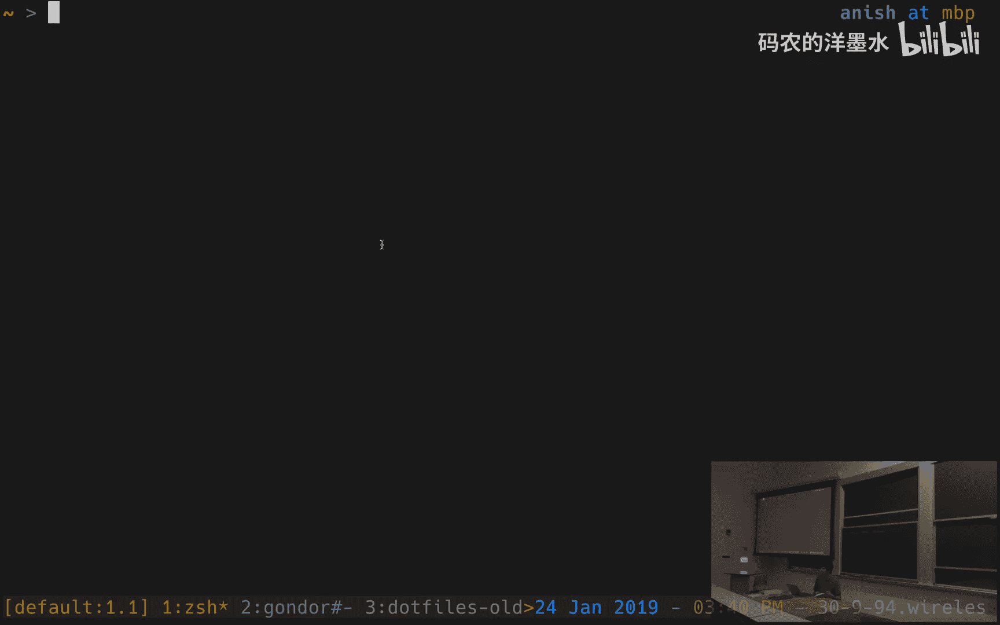
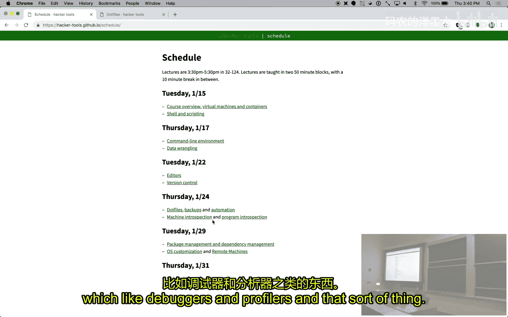
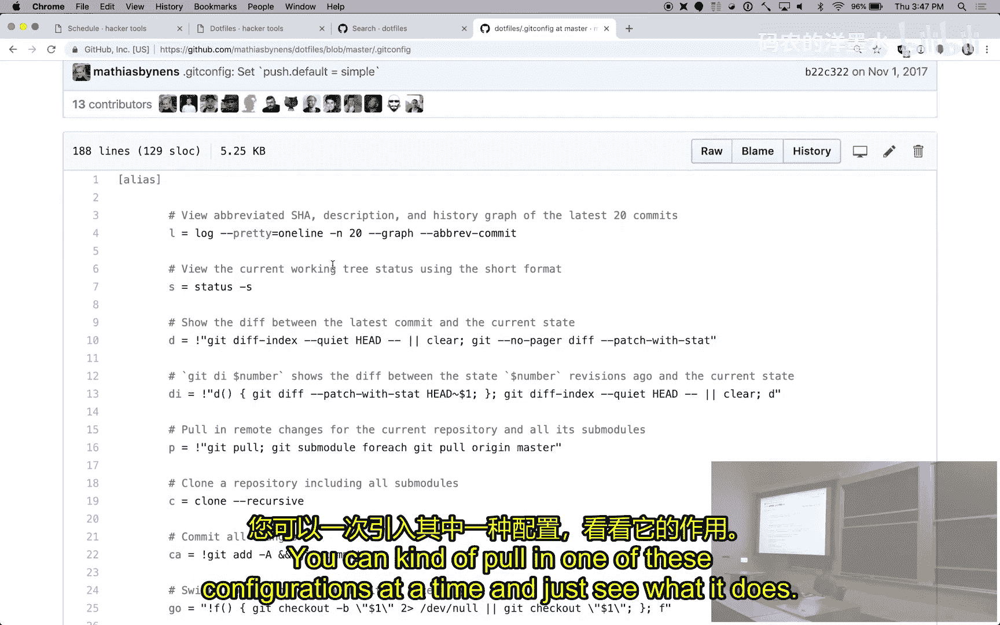
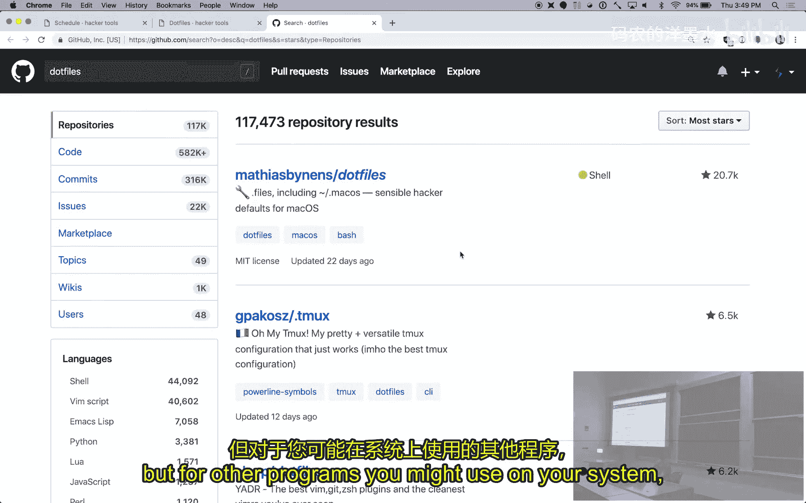
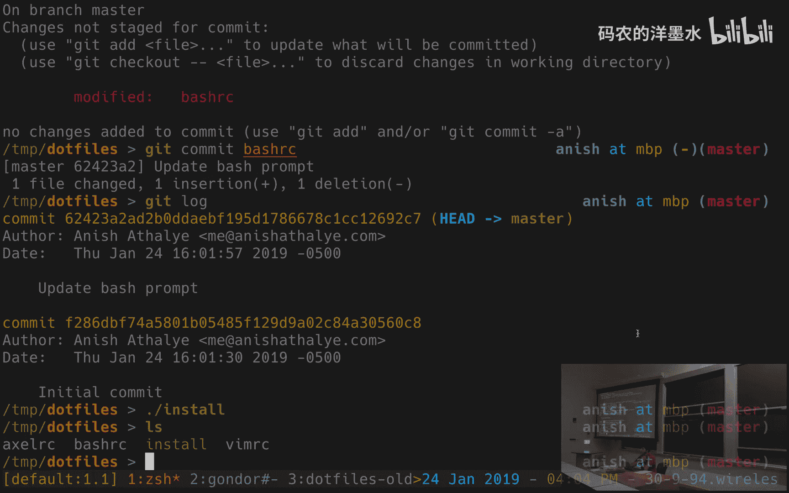
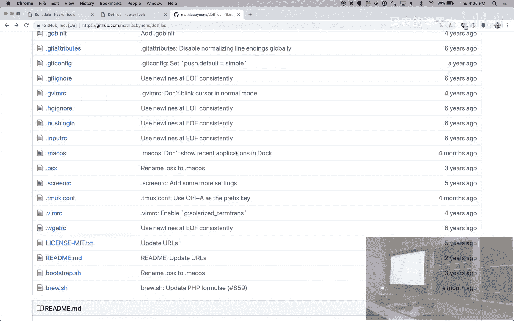
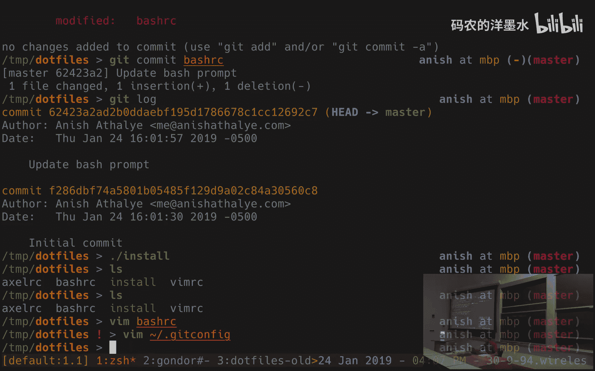

# 007：配置文件 📁





在本节课中，我们将要学习配置文件（通常称为“点文件”），了解它们是什么、为什么重要，以及如何有效地组织和管理它们，以便在不同的计算机上保持一致的开发环境。

---

## 什么是点文件？ 🤔

上一节我们介绍了文本编辑器，并查看了`.vimrc`文件。许多命令行工具都可以通过纯文本文件进行高度配置，这些文件被称为“点文件”。之所以这样称呼，是因为它们的文件名通常以一个点（`.`）开头，例如 `.vimrc` 或 `.bashrc`。

点文件默认是隐藏的。在Unix/Linux系统中，以点开头的文件在普通的目录列表（`ls`命令）中不会显示。这是早期`ls`工具实现的一个历史遗留特性，后来被用户用来存放不希望总是看到的配置文件。

## 为什么需要自定义工具？ ⚙️


我们认为，投入时间定制工具，使其完全按照你的期望工作，是完全值得的。不同的工具有不同的配置方式：
*   **通过编程语言**：例如，你的Shell（如Bash）在启动时会读取并执行像`.bashrc`这样的脚本文件。Vim则通过Vim脚本语言进行配置。
*   **通过特定文件格式**：例如，Git使用`.gitconfig`文件，你可以在其中设置各种键值对。



虽然有些人会直接下载并使用他人的配置文件，但我们不建议这样做。你应该根据自己的需求来定制工具。不过，查看他人的配置是了解可用选项的好方法。

以下是探索和自定义工具配置的几种途径：
*   在线搜索特定工具的教程（例如搜索“axel rc”）。
*   查阅工具的man手册页（例如 `man bash`）。
*   在GitHub等平台上浏览他人公开的“dotfiles”仓库，学习他们的配置方法。

---




## 如何组织你的点文件？ 🗂️

现在，我们来看看如何组织这些文件。当你在一台机器上精心配置了环境后，你肯定希望在其他机器（如实验室电脑或服务器）上也能轻松复制相同的设置。

组织点文件的目标主要有三个：
1.  **易于安装**：在新机器上，应该能通过简单的步骤（如克隆仓库并运行一个脚本）快速完成环境配置。
2.  **可移植性**：配置应能在不同机器间轻松同步和保持一致。
3.  **变更追踪**：配置的调整是一个长期过程，使用版本控制系统（如Git）来管理点文件，可以方便地查看历史、回滚更改。

### 一个推荐的组织方案

一个有效的方法是：创建一个单独的目录（例如 `~/dotfiles`）来存放所有配置文件，并将这个目录置于版本控制之下（例如Git仓库）。

但这里有一个问题：许多程序期望它们的配置文件位于用户主目录的特定位置（如 `~/.bashrc`），而不是我们集中管理的 `~/dotfiles` 目录里。

**解决方案是使用符号链接（Symbolic Links）**。符号链接类似于快捷方式，它指向另一个文件的实际位置。

例如，你可以将 `~/.bashrc` 创建为一个符号链接，指向你版本库中的实际文件 `~/dotfiles/bashrc`：
```bash
ln -s ~/dotfiles/bashrc ~/.bashrc
```
这样，当你编辑 `~/dotfiles/bashrc` 时，Shell读取的 `~/.bashrc` 内容也会同步更新。

### 自动化安装脚本

为了简化在多台机器上的部署过程，可以编写一个安装脚本（例如 `install.sh`）。这个脚本的核心任务就是为 `~/dotfiles` 目录中的每个配置文件创建指向正确位置的符号链接。

一个简单的脚本示例如下：
```bash
#!/bin/bash
cd $(dirname "$0") # 切换到脚本所在目录（即dotfiles目录）

ln -s $PWD/bashrc ~/.bashrc
ln -s $PWD/vimrc ~/.vimrc
# ... 为其他文件创建更多链接
```
之后，在新机器上设置环境只需三步：
1.  `git clone <你的dotfiles仓库地址>`
2.  `cd dotfiles`
3.  `./install.sh`

我们提供的简单脚本在链接已存在时会报错。在实际应用中，你可以使用更健壮的工具（如 [GNU Stow](https://www.gnu.org/software/stow/) 或一些专用的点文件管理器），课程笔记中提供了相关链接。此外，讲师们（Anish, John, Jose）的配置文件仓库也作为实例供参考。

---

## 处理机器特定的配置 🖥️

当你需要在不同机器上使用略有不同的配置时（例如，笔记本和服务器硬件不同），有几种方法可以处理：

1.  **在配置文件中使用条件判断**：由于许多点文件本身就是脚本（如 `.bashrc`），你可以在其中加入条件逻辑。
    ```bash
    # 在 .bashrc 中
    if [[ "$(hostname)" == "my-laptop" ]]; then
        # 笔记本电脑特定的设置
        export BATTERY_ALERT=true
    fi
    ```
2.  **使用包含指令**：许多工具支持从其他文件读取配置。例如，在Git配置中，你可以有一个通用的 `~/.gitconfig`，然后在末尾包含一个机器特定的文件。
    ```gitconfig
    # ~/.gitconfig (通用部分)
    [user]
        name = John Doe
    [include]
        path = ~/.gitconfig.local # 机器特定的配置放在这里
    ```



---



## 总结 📝

本节课中我们一起学习了：
*   **点文件**是什么，以及它们因历史原因而隐藏的特性。
*   自定义工具以适应个人工作流程的重要性。
*   如何通过**集中存储**、**版本控制**和**符号链接**来有效地组织点文件，实现跨机器的环境同步。
*   如何利用**条件判断**或**包含文件**的机制来处理不同机器间的细微配置差异。



建立一个良好组织的点文件系统，是对你长期开发效率的一项宝贵投资。