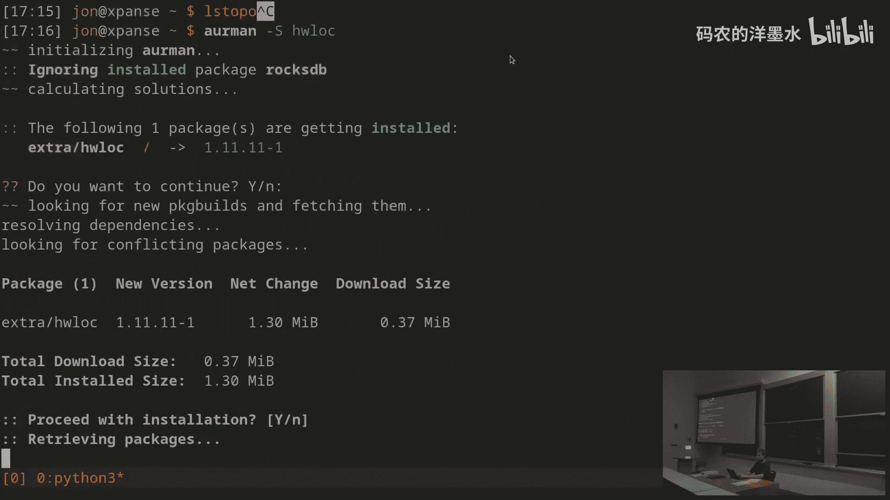
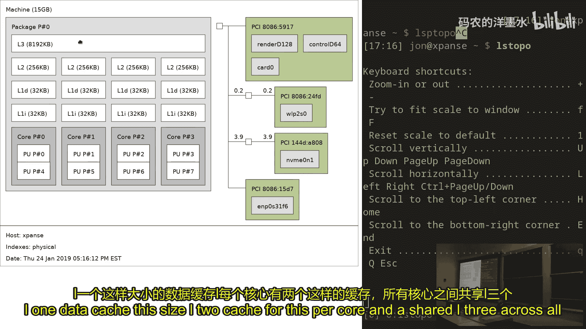
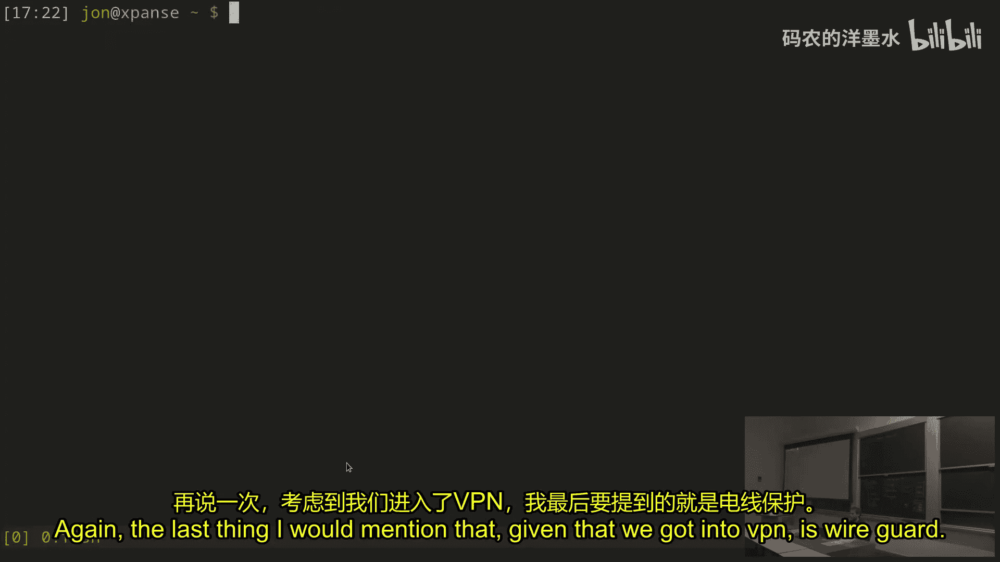
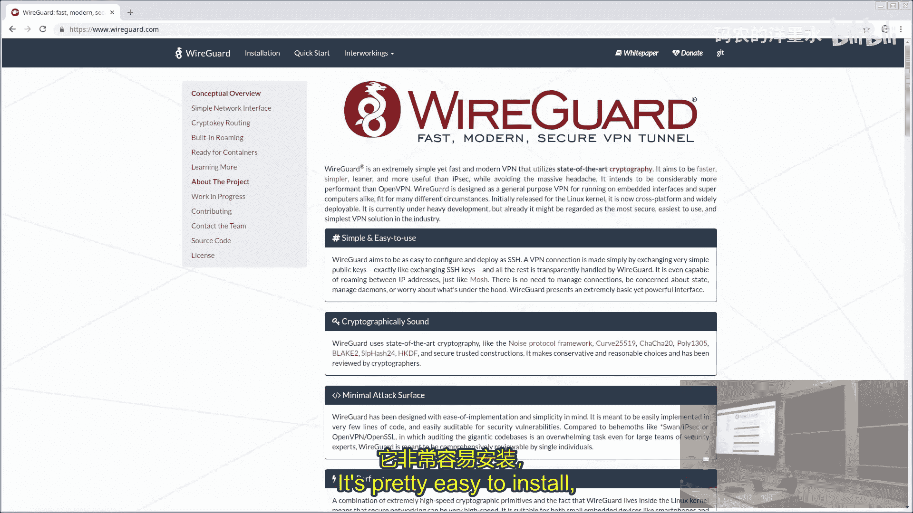
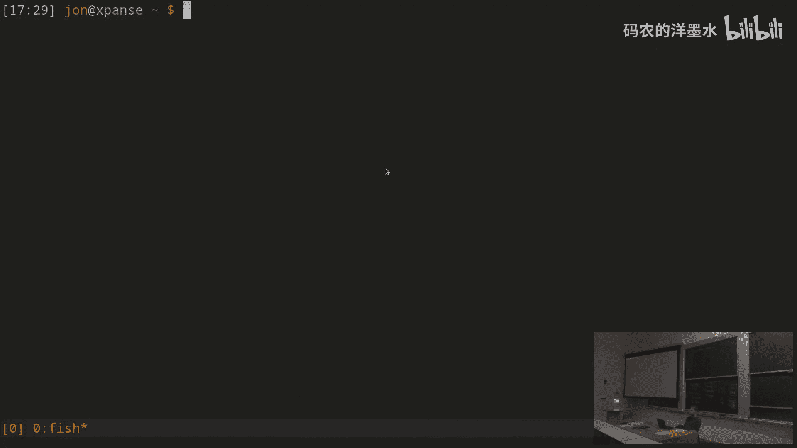

# 010：机器探查与系统自检 🔍

在本节课中，我们将学习一系列用于诊断计算机问题的工具。当系统出现故障或行为异常时，这些工具能帮助你查明原因、了解当前状态，并防止未来发生类似问题。

---

## 权限与 `sudo` 命令

要进行机器探查，通常需要特殊权限。内核通常不允许你随意查看系统状态，因此你通常需要属于特定用户组，例如 `wheel`（可以充当 `root` 用户的组）。其他组如 `power`、`audio`、`video`、`optical` 等用于更特殊的目的。通常，将自己添加到 `wheel` 组即可。如果你对安全性有顾虑，可以仅通过 `sudo` 命令临时获取权限。

`sudo` 命令是一个前缀，你可以将其加在任何命令之前运行。它会以 `root` 用户的身份执行该命令，从而获得机器上几乎所有可能的权限。

例如，我可以以普通用户身份运行 `date` 或 `whoami` 命令：
```bash
whoami
```
输出会显示我是 `john`。

如果我使用 `sudo`：
```bash
sudo whoami
```
它会提示我输入密码，输入后输出会显示 `root`。

`sudo` 会记住你在一段时间内的授权，但超时后会再次要求输入密码。你可以通过编辑 `/etc/sudoers` 文件来配置 `sudo` 的行为，例如禁用密码提示。使用 `visudo` 命令编辑此文件是安全的，因为它会在保存前检查语法。

`su` 命令允许你以另一个用户的身份启动终端，默认是 `root` 用户：
```bash
sudo su
```
这会给你一个 `root` 用户的终端提示符。

---

## 查看系统日志

当出现问题时，首先要做的是查看日志。你的机器上有许多日志文件，传统上大多位于 `/var/log` 目录下。

*   `/var/log/Xorg.0.log`：当 X 窗口系统失败时很有用。
*   特定子系统的日志文件夹，如 `cups`（打印服务）。
*   内核日志：过去在 `/var/log` 中，现在通常通过 `dmesg` 命令查看。`dmesg` 会显示自系统启动以来内核打印的所有消息。

你可以使用之前数据整理课程中学到的工具（如 `grep`）来筛选这些日志，查找特定模式。

现代系统通常使用 `systemd` 来管理系统服务，它有自己的日志守护进程 `journald`。查看日志的命令是 `journalctl`。

`journalctl` 默认显示自上次启动以来的所有消息。你可以滚动查看，也可以将其输出通过管道传递给其他工具进行处理。

以下是 `journalctl` 的一些常用选项：
*   `-u <unit>`：仅显示指定系统单元（如服务）的日志。
*   `-b`：仅显示本次启动以来的日志。
*   `-b -1`：显示上一次启动的日志（用于调试导致重启的问题）。
*   `-f`：实时跟踪日志输出（类似 `tail -f`）。
*   `-n 100`：仅显示最后 100 行日志。

有时 `journalctl` 会截断过长的日志行并显示 `...`，此时可以使用 `--no-pager` 或重定向输出来查看完整内容。

---

## 监控系统进程与资源

要了解系统正在运行什么，可以从 `top` 命令开始。`top` 显示机器上所有进程、它们的 CPU 和内存使用情况，以及一系列系统统计信息。

现在更多人使用 `htop`，它提供了更友好的界面，例如显示每个核心的负载、更图形化的表示，并且可以按树状结构显示进程关系（按 `t` 键），这有助于理解进程的启动关系。

如果只关心进程树，可以使用 `pstree` 命令。添加 `-p` 选项可以显示进程 ID（PID）。

要实时查看特定服务的日志输出，可以使用 `journalctl -f -u <unit>`。对于内核消息，可以使用 `dmesg -w`。对于普通日志文件（如 `/var/log/Xorg.0.log`），可以使用 `tail -f`。

另一个监控资源使用的强大工具是 `dstat`。`dstat` 监控机器的各种子系统（网络流量、磁盘 I/O、CPU 中断、上下文切换、进程数、CPU 利用率等），并实时打印信息。它有大量选项用于监控不同方面，例如 `-c` 监控 CPU，`-d` 监控磁盘，`-n` 监控网络。

`dstat` 非常适合快速了解计算机的繁忙程度以及它在忙什么。如果你运行一个程序时它似乎卡住了，打开 `dstat` 看看是否有任何活动。如果所有数字都是零，那可能就是程序本身的问题。

---

## 检查磁盘与网络

对于磁盘空间，最常用的工具是 `df`。`df` 显示机器上所有文件系统的已用空间、可用空间和挂载点。默认以字节显示，使用 `-h` 选项可以以人类可读的格式（如 GB、MB）显示。

要找出特定目录中哪些文件占用了大量空间，可以使用 `du` 命令。`du` 显示文件或目录的磁盘使用量。例如：
```bash
du -sh *
```
`-s` 选项显示摘要，`-h` 选项以人类可读格式显示。还有一个工具叫 `dust`，它提供更直观的界面来查看磁盘使用情况。

对于网络连接，`ss` 命令非常有用。`ss` 用于查看机器上的所有网络连接。默认显示所有支持的协议的所有连接。

常用选项：
*   `-t`：显示所有 TCP 连接。
*   `-l`：显示所有监听端口（服务器端口）。
*   `-p`：显示使用端口的进程和 PID。
*   `-n`：以数字形式显示端口和地址，而非服务名。

保持监听端口列表为空通常是安全的。浏览器等应用程序可能会打开临时端口。

`netcat`（`nc`）是一个方便的工具，用于在机器之间传输原始数据，黑客经常使用它，但有时也确实有用。

---

## 网络配置与诊断

网络配置主要使用 `ip` 命令。`ip` 命令可以配置机器上几乎所有与网络相关的设置。

基本命令 `ip addr` 显示所有网络接口及其绑定的 IP 地址。例如，`lo` 是回环接口，`eth*` 通常是以太网端口，`wlan*` 通常是无线端口。`UP` 表示接口已启用，`DOWN` 表示未连接。

`ip` 命令功能强大但语法复杂。通常使用 `ip help` 查看子命令帮助，或查阅手册页 `man ip`。

另一个重要的子命令是 `ip route`，它显示路由表，即数据包如何发送到其他机器。它告诉你哪些流量发送到本地网络，哪些流量通过默认网关（路由器）发送到外部网络。

当网络出现问题时，`ping` 是首选的诊断工具。操作顺序通常是：
1.  `ping` 一个主机名（如 `example.com`）。如果成功，说明网络正常。
2.  如果失败，尝试 `ping` 一个 IP 地址（如 `8.8.8.8`）。
3.  如果能 `ping` 通 IP 地址但不通主机名，问题可能出在 DNS 解析。
4.  如果两者都失败，尝试 `ping` 你的路由器（网关 IP）。如果能通，说明本地网络正常，问题出在路由器或更远的地方。
5.  如果连路由器都 `ping` 不通，问题就在本地机器或连接上。

`/etc/resolv.conf` 文件定义了系统使用的 DNS 服务器。



---



## 管理系统服务

对于要在后台运行的服务（如 Web 服务器、SSH 守护进程），现代 Linux 系统通常使用 `systemd` 进行管理。

每个服务都有一个对应的单元文件（`.service` 文件）。你可以使用 `journalctl -u <unit>` 查看特定服务的日志。

使用 `systemctl` 命令控制服务：
*   `systemctl status`：显示所有正在运行的服务及其状态和依赖关系。
*   `systemctl start <unit>`：启动一个服务。
*   `systemctl stop <unit>`：停止一个服务。
*   `systemctl restart <unit>`：重启一个服务。
*   `systemctl enable <unit>`：设置服务在开机时自动启动。
*   `systemctl disable <unit>`：禁用服务的开机自启。

你甚至可以编写自己的 `systemd` 单元文件，它们通常放在 `/etc/systemd/system/` 目录下。

如果感觉系统启动缓慢，可以使用 `systemd-analyze` 分析启动时间。`systemd-analyze blame` 可以显示每个服务启动所花费的时间。

---

## 其他实用工具

`locate` 命令可以快速在文件系统中查找文件。它基于一个预构建的数据库（通过 `updatedb` 命令更新）进行搜索，速度比 `find` 快得多。



`dmidecode` 命令解析机器固件信息，告诉你运行的硬件详情，如 CPU 型号、支持的功能等。这在进行固件升级或好奇硬件规格时有用。



`lstopo` 命令（来自 `hwloc` 包）可以图形化或文本化显示 CPU 的物理布局，包括所有核心和缓存层次结构。这对于性能调试很有帮助，它还可以用来将程序绑定到特定 CPU 核心上运行。

`/sys` 和 `/proc` 是内核暴露的特殊虚拟文件系统，用于查询和设置内核及进程的各种信息。
*   `/sys/class/` 包含按类别组织的设备信息。例如，你可以通过向 `/sys/class/backlight/.../brightness` 写入值来调整屏幕亮度。
*   `/proc/<PID>/` 包含特定进程的详细信息，如命令行参数（`cmdline`）、当前工作目录（`cwd`）等。`htop` 和 `top` 的信息就来源于此。

`/boot` 目录包含启动时所需的文件，如内核镜像（`vmlinuz`）和初始内存盘（`initramfs`）。启动配置（如内核参数）也常在这里。

`iptables` 是 Linux 内核内置的防火墙工具，它允许你设置复杂的规则来过滤、修改或重定向网络数据包。虽然功能强大，但配置可能较为复杂。

`WireGuard` 是一个现代、简洁、快速且安全的 VPN 实现。它使用公私钥对，配置简单，通常只需 `wg-quick up <接口名>` 和 `wg-quick down <接口名>` 即可启动和停止。

---

## Shell 选择小贴士

常见的 Shell 有 `bash`、`zsh` 和 `fish`。
*   `zsh` 试图与 `bash` 兼容，同时提供了更多功能，通过插件（如 Oh My Zsh）可以高度定制。
*   `fish` 则选择了一条不同的道路，它不追求与 `bash` 兼容，而是专注于提供更人性化、更直观的交互体验，例如强大的自动补全和语法高亮。

选择哪一个取决于你的需求。如果你需要与大量现有 `bash` 脚本兼容，`zsh` 可能是更好的选择。如果你更看重开箱即用的优秀交互体验，`fish` 值得一试。无论选择哪个，都值得花时间探索和配置它的特性，以提升工作效率。

---



本节课中，我们一起学习了机器探查与系统自检的核心工具。从获取权限、查看日志，到监控进程、检查磁盘和网络，再到配置服务和了解系统深层信息，这些工具构成了诊断和解决系统问题的基础技能树。掌握它们将帮助你更好地理解和管理你的计算机系统。