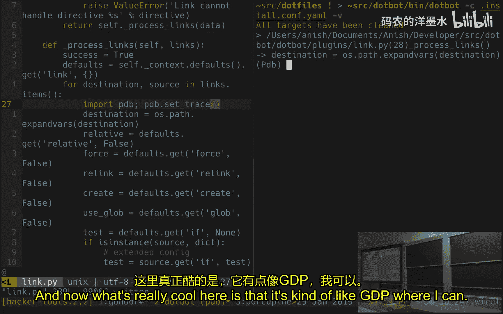
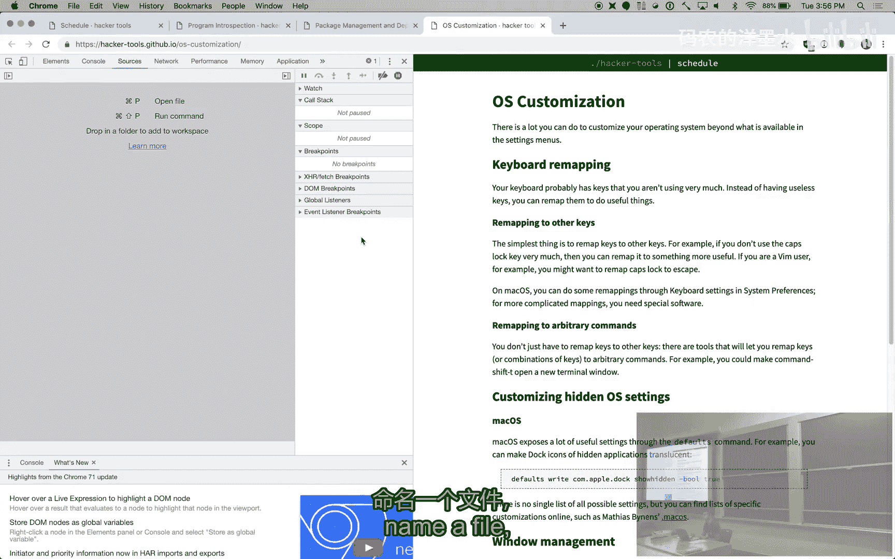
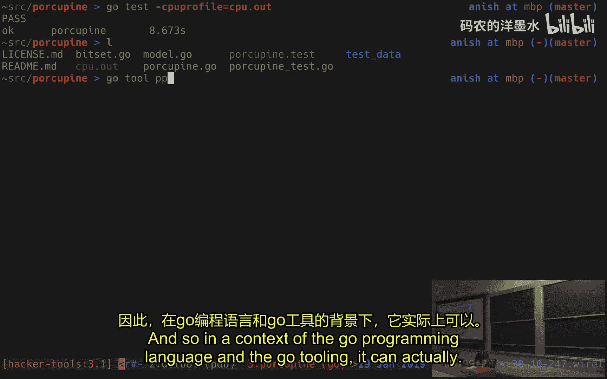
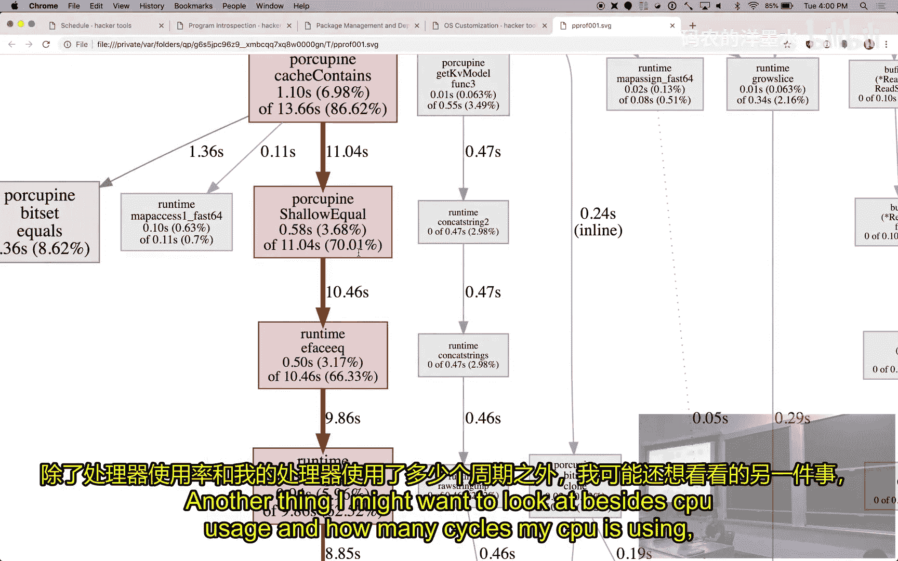
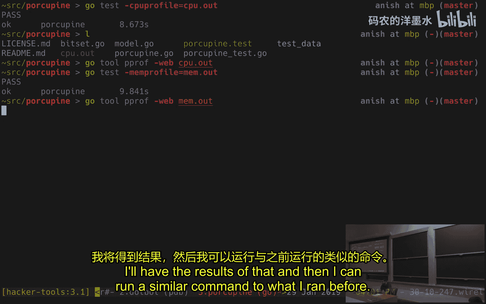
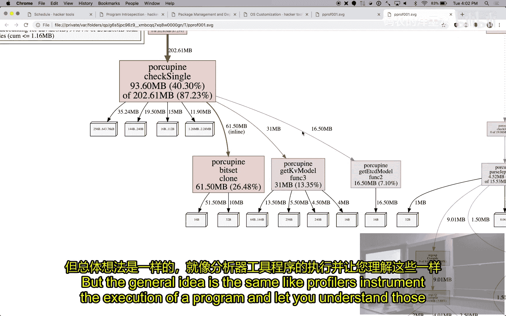
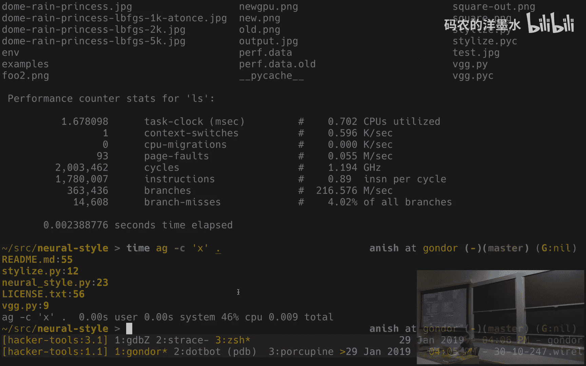

# 011：程序自省与探查 🔍

在本节课中，我们将学习如何深入理解程序的内部运行状态。我们将介绍两种主要的技术：调试（Debugging）和性能剖析（Profiling）。调试用于找出程序为何出错，而性能剖析则用于找出程序为何运行缓慢或占用过多资源。

---

## 调试基础：超越 `print` 语句

上一节我们概述了程序自省的目的。本节中，我们来看看最基础的调试方法——`print` 调试，以及它的局限性。

当程序出现问题时，一个常见的方法是插入大量的 `print` 语句来输出变量的值。这是一个有效的方法，但有时并不足够。这时，我们就需要更强大的工具：调试器。

调试器允许你与程序的执行过程进行交互。以下是调试器能做的几件事：

*   **设置断点**：让程序运行，并在到达代码的特定行时暂停执行。
*   **检查状态**：程序暂停后，你可以查看内存内容、打印变量值。
*   **单步执行**：一次执行一行代码，并在每行后暂停，以便检查程序状态。

---

## 使用 GDB 调试 C 程序 🛠️

现在，让我们通过 GNU 调试器 (GDB) 来具体了解调试器的功能。我们将使用一个简单的 C 程序作为例子。

该程序循环调用一个函数，打印数字 1 到 10。其核心代码如下：
```c
for (int i = 1; i <= 10; i++) {
    say(i);
}
```

要使用 GDB，需要在编译时添加 `-g` 标志，以便在二进制文件中包含调试信息。
```bash
gcc -g -o example example.c
```

然后，启动 GDB 并加载程序：
```bash
gdb ./example
```

以下是 GDB 的一些基本命令演示：

*   **运行程序**：在 GDB 提示符下输入 `run`。
*   **设置断点**：可以使用函数名或行号设置断点。
    *   `break main`：在 `main` 函数入口处暂停。
    *   `break example.c:18`：在 `example.c` 文件的第 18 行暂停。
*   **继续执行**：程序暂停后，输入 `continue` 可让其继续运行，直到下一个断点。
*   **检查变量**：在暂停时，使用 `print i` 可以查看变量 `i` 的当前值。
*   **单步执行**：
    *   `step`：执行下一行代码，如果遇到函数调用，会进入该函数。
    *   `next`：执行下一行代码，但会跳过（不进入）函数调用。
    *   `finish`：继续执行，直到当前函数返回。

---

## 高级调试功能

除了基本功能，调试器还提供了一些强大的高级特性。

*   **监视点**：可以监视一个变量或内存地址，当其值改变时暂停程序。命令是 `watch`。
*   **反向调试**：使用 `rr` 等工具，可以记录程序的执行，然后反向步进，这对于调试难以复现的并发问题非常有用。
*   **图形化界面**：GDB 也支持文本用户界面模式，使用 `layout` 命令可以分屏显示源代码、汇编代码和寄存器状态。

---

## 其他语言的调试器

调试的概念适用于几乎所有编程语言。

*   **Python**：使用自带的 `pdb` 模块。在代码中插入 `import pdb; pdb.set_trace()`，程序运行到此处会进入交互式调试环境。它结合了调试器命令和 Python shell 的功能。
*   **JavaScript**：现代网页浏览器（如 Chrome、Firefox）都内置了强大的图形化调试工具。你可以在源代码中设置断点，单步执行，并实时查看变量和调用栈。
*   **集成开发环境**：大多数 IDE（如 VS Code, IntelliJ）都集成了图形化调试器，通过点击即可设置断点，操作更加直观。

---

## 系统调用追踪：`strace`

对于系统编程，另一个有用的工具是 `strace`。它运行一个程序，并打印出该程序发出的每一个系统调用及其参数。

例如，运行 `strace echo hello` 会显示 `echo` 命令执行过程中所有系统调用的细节，最终你会看到它通过 `write` 系统调用将 “hello” 输出到标准输出。



---

## 性能剖析：找出程序瓶颈 ⏱️

调试器用于解决程序“出错”的问题。而当程序“太慢”或占用资源过多时，我们就需要使用性能剖析器。

剖析器会监测程序的运行，并生成报告，指出时间或资源消耗在了哪里。主要有两种类型：



1.  **CPU 剖析**：找出程序在哪些函数上花费了最多的 CPU 时间。
2.  **内存剖析**：找出程序在哪些地方分配了最多的内存。

---

## 使用 Go 工具进行剖析

以下以 Go 语言为例，展示剖析的基本流程：

*   **CPU 剖析**：运行程序并记录剖析数据，然后使用 `go tool pprof` 分析并可视化结果。它会生成一个调用关系图，用红色高亮显示最耗时的函数。
    ```bash
    # 记录CPU剖析数据
    go test -cpuprofile=cpu.prof
    # 启动Web界面查看剖析结果
    go tool pprof -http=:8080 cpu.prof
    ```



*   **内存剖析**：类似地，可以记录和分析内存分配情况。
    ```bash
    # 记录内存剖析数据
    go test -memprofile=mem.prof
    # 分析内存剖析结果
    go tool pprof mem.prof
    ```

剖析报告能帮助你精准定位优化点，避免盲目修改代码。



---



## 其他剖析工具



*   **`perf`**：Linux 系统上的强大性能分析工具，可以对任何程序进行 CPU 剖析。
    ```bash
    perf record -g ./my_program
    perf report
    ```
*   **`time` 命令**：最简单的“剖析器”，用于测量程序运行的真实时间、用户态 CPU 时间和系统态 CPU 时间。
    ```bash
    time ./my_program
    ```

---

## 总结

本节课中我们一起学习了程序自省的核心技术。

*   我们首先了解了调试器如何超越 `print` 语句，允许我们设置断点、检查变量和单步执行程序。我们以 GDB 为例进行了演示，并提到了其他语言（如 Python 的 `pdb`、浏览器的开发者工具）的调试器。
*   接着，我们介绍了 `strace` 工具，用于追踪程序的系统调用。
*   最后，我们探讨了性能剖析。当程序性能不佳时，使用 CPU 和内存剖析器可以精准定位瓶颈所在，指导我们进行有效的优化。



掌握这些工具将极大地提升你理解、调试和优化程序的能力。