# 013：操作系统自定义 🛠️

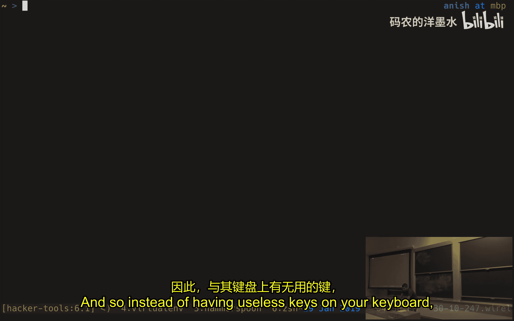

在本节课中，我们将学习如何自定义你的操作系统，以提升工作效率和用户体验。我们将探讨键盘重映射、隐藏系统设置、窗口管理以及布局自动化等核心概念。这些技巧能帮助你打造一个更符合个人习惯、更高效的工作环境。

## 键盘重映射 ⌨️

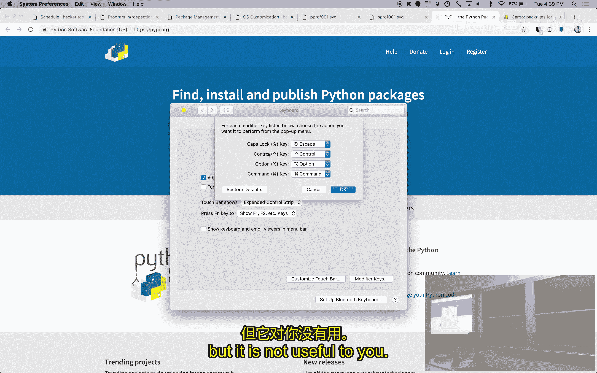

上一节我们介绍了自定义操作系统的概览，本节中我们来看看键盘重映射。键盘是与计算机交互时比鼠标更高效的工具，因此应尽可能优化其使用方式。你的键盘上可能有一些不常用的键，与其让它们闲置，不如将它们重映射为更有用的功能。

以下是键盘重映射的几个关键点：

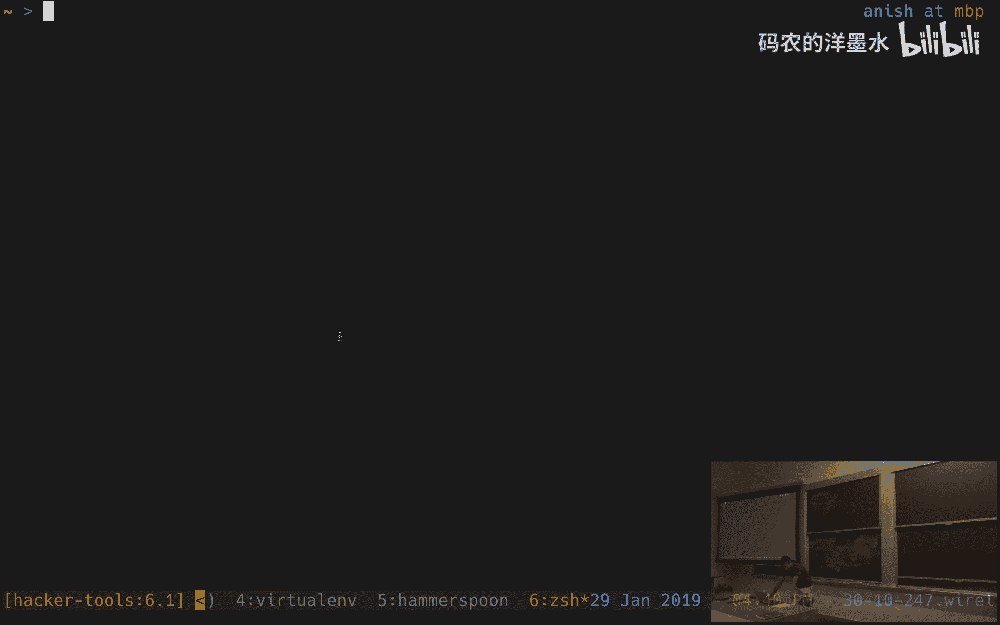

*   **基础重映射**：例如，在macOS中，你可以进入“系统偏好设置”->“键盘”->“修饰键”，将不常用的键（如Caps Lock）映射为其他功能键（如Escape）。对于Vim用户，将Caps Lock映射为Escape可以显著提升效率，因为Escape键用于切换回普通模式。
*   **高级重映射**：使用第三方软件可以实现更复杂的映射。你不仅可以映射单个键，还可以将组合键映射为任意命令。例如，将 `Ctrl+Alt+T` 映射为启动终端。
*   **条件映射**：一些工具甚至允许你进行编程式映射，例如，当特定程序运行时，某个组合键可以触发菜单中的某个点击操作。

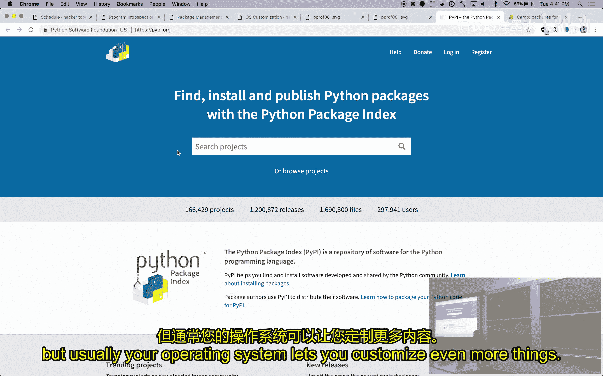

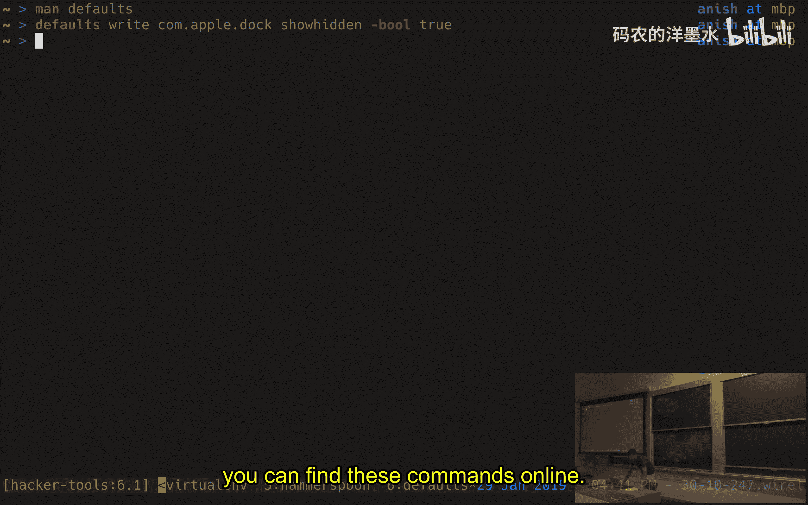

通过投入精力进行键盘自定义，可以极大地优化你的工作流程。

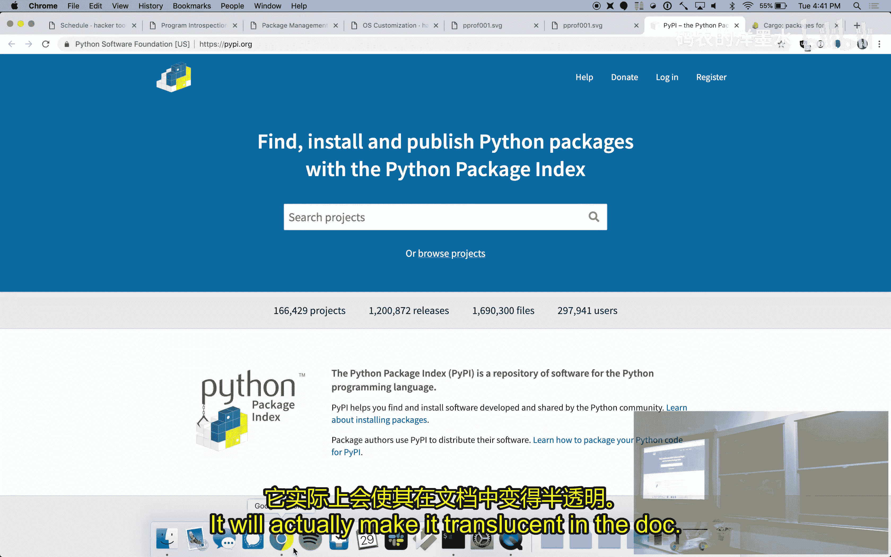

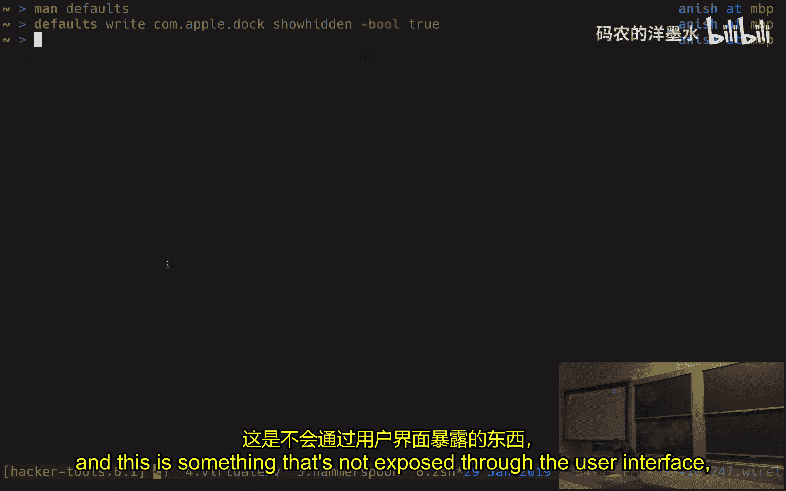

## 隐藏的操作系统设置 🔧

上一节我们探讨了键盘优化，本节中我们来看看如何调整那些未在图形界面中直接暴露的隐藏系统设置。无论你使用哪种操作系统，除了图形设置界面外，通常还有更多可自定义的选项。

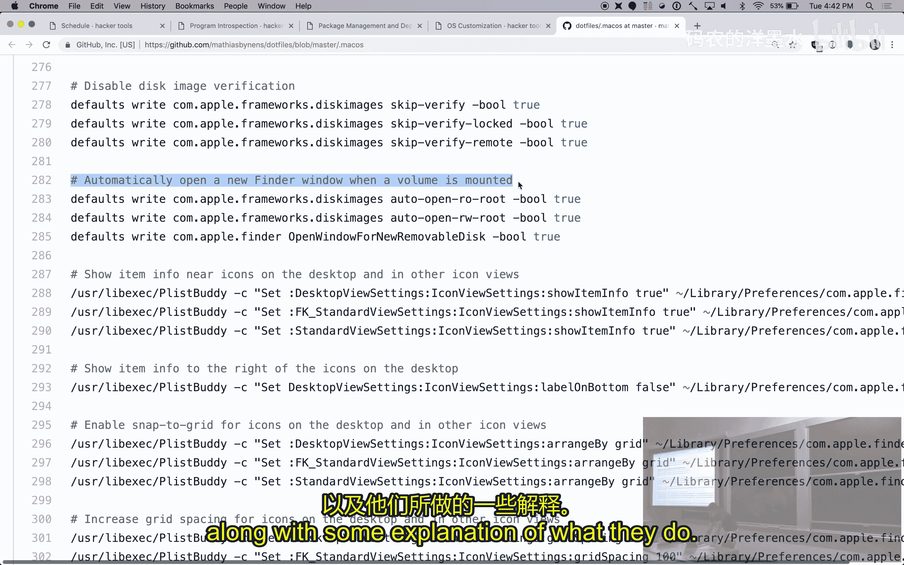

以下是关于隐藏设置的核心信息：

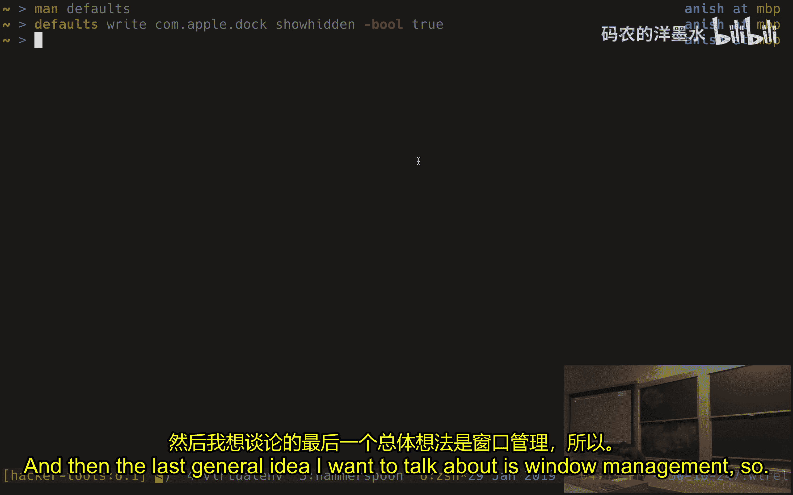

*   **访问方式**：例如，在macOS中，可以使用 `defaults` 命令来修改大量隐藏设置。命令格式通常为 `defaults write <domain> <key> <value>`。
*   **实用示例**：一个有用的设置是让隐藏的应用程序在程序坞（Dock）中显示为半透明，以便区分哪些程序是隐藏的。这可以通过类似 `defaults write com.apple.Dock showhidden -bool YES` 的命令实现。
*   **寻找配置**：网上有大量关于这些隐藏设置的资源。一个很好的方法是查看其他人（尤其是开发者）的配置文件（dotfiles），他们通常会分享并解释自己使用的优化配置。

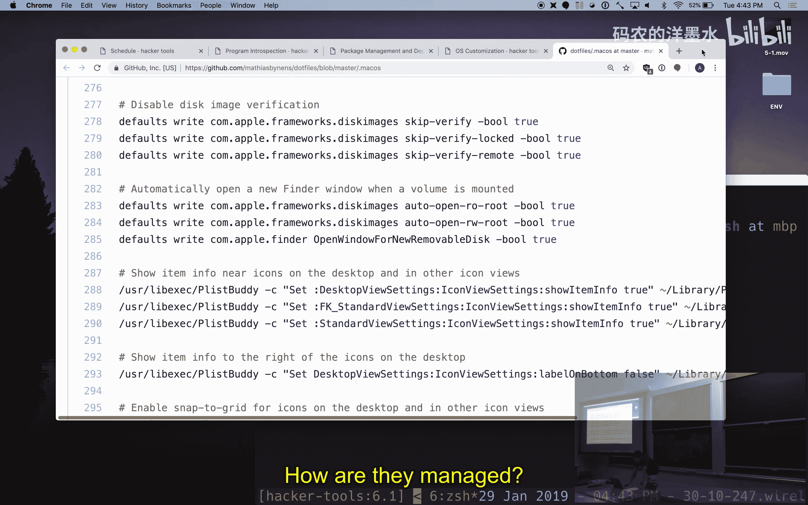

调整这些隐藏设置对于打造高度优化的个人环境非常有价值，这个理念在所有操作系统中都适用。

## 窗口管理 🪟

上一节我们介绍了系统级别的隐藏设置，本节中我们来看看直接影响日常操作的窗口管理。在使用图形界面时，如何高效地排列和管理多个窗口是一个关键问题。

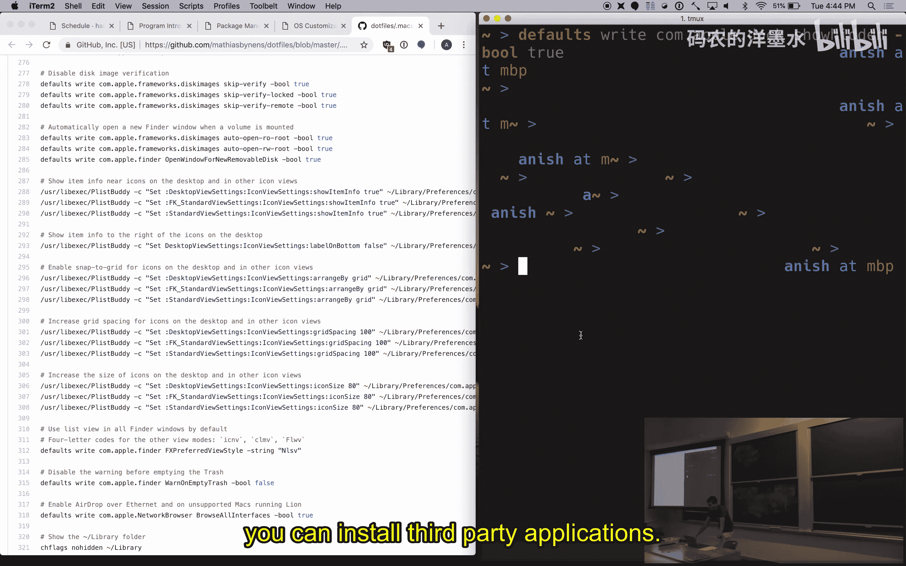

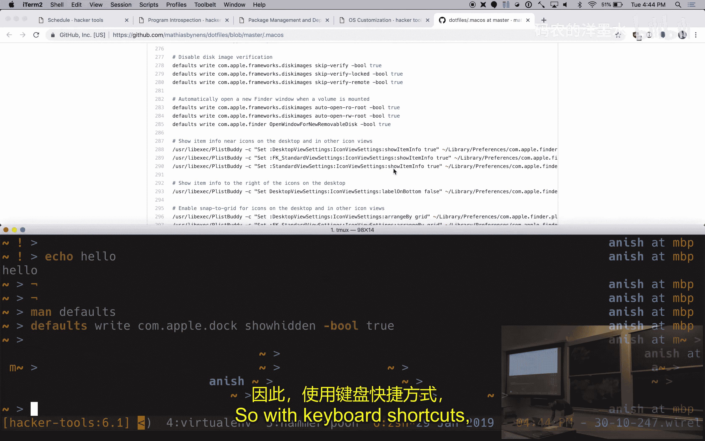

以下是几种窗口管理策略：

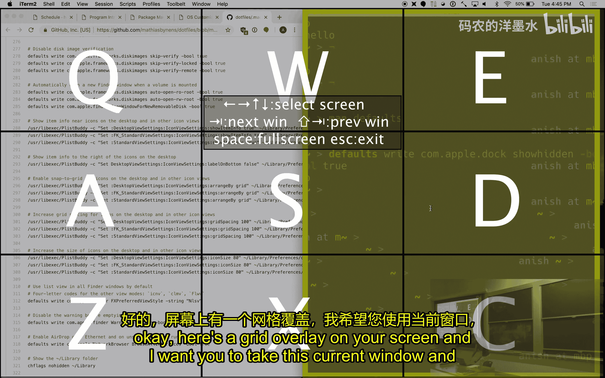

*   **平铺式窗口管理**：这是一种高效的管理风格。它不鼓励窗口重叠，而是将屏幕空间划分为不重叠的框架（平铺），让每个窗口都能完全显示。基于Linux的系统有专门的平铺窗口管理器（如i3, Awesome）。在Windows或macOS上，可以安装第三方应用（如Amethyst, Rectangle）来模拟类似行为。
*   **键盘快捷键**：为窗口操作配置键盘快捷键至关重要。例如，可以设置快捷键将窗口快速移动到屏幕左半部分、右半部分，或在不同显示器间移动。
*   **网格系统**：一些工具提供网格覆盖功能，允许你通过快捷键选择将当前窗口放置到屏幕的特定网格区域，实现精确布局。
*   **高度可定制**：所有这些功能都可以深度定制。例如，你可以根据显示器尺寸定义不同的网格密度，并为各种布局操作绑定自己喜欢的快捷键。

## 布局编码与自动化 🤖

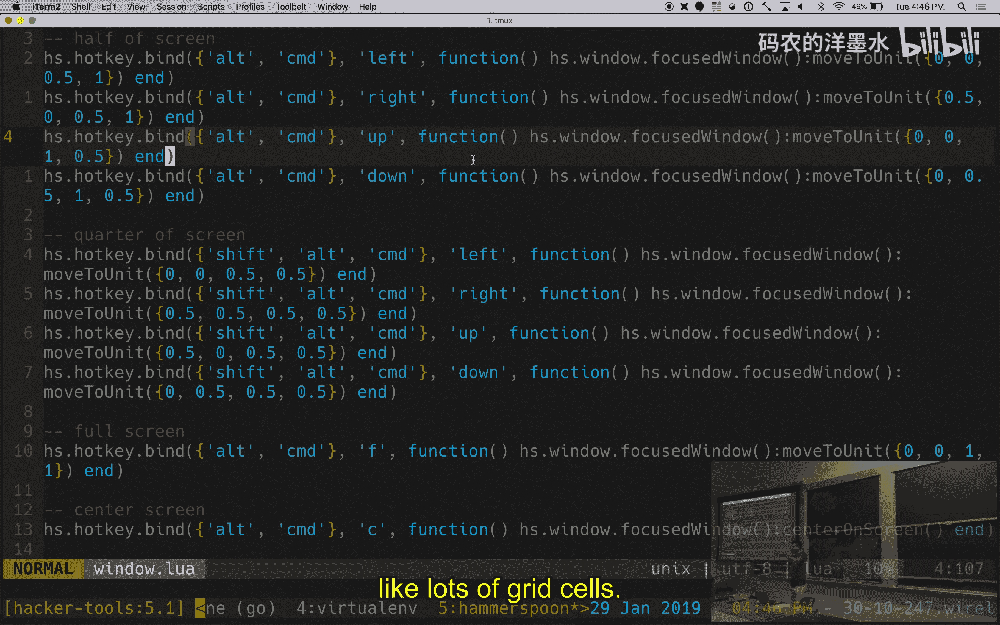

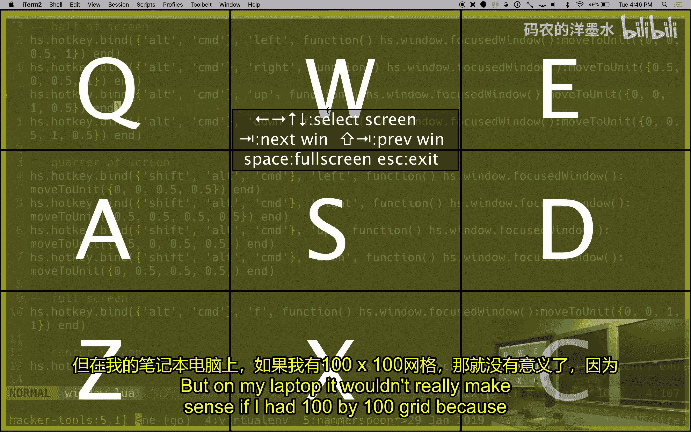

上一节我们学习了如何手动管理窗口，本节中我们来看看如何将常用的窗口布局自动化。如果你有固定的工作环境（如办公室的多显示器设置），每天手动排列窗口会浪费大量时间。根据本课程“自动化重复性任务”的主题，我们应该将布局保存并一键恢复。

以下是实现布局自动化的方法：

*   **工具示例**：对于macOS，HammerSpoon是一个强大的自动化工具，它允许你用Lua脚本编码窗口布局。
*   **工作流程**：你可以为不同场景（如在实验室、在家中）定义不同的布局配置，并为其命名。然后，将这些布局绑定到快捷键或菜单项上。
*   **效果**：只需点击一个按钮或按下一个快捷键，所有窗口就会自动调整到预设的大小和位置，无论是显示、隐藏还是位于特定显示器上。这能节省大量日常设置时间。

## 总结与资源 📚

本节课中我们一起学习了操作系统自定义的四个主要方面：**键盘重映射**、**隐藏设置调整**、**高效的窗口管理**以及**布局自动化**。这些技巧的核心目标是减少手动操作，让你的计算机环境完全适应你的工作习惯，从而提升整体效率。

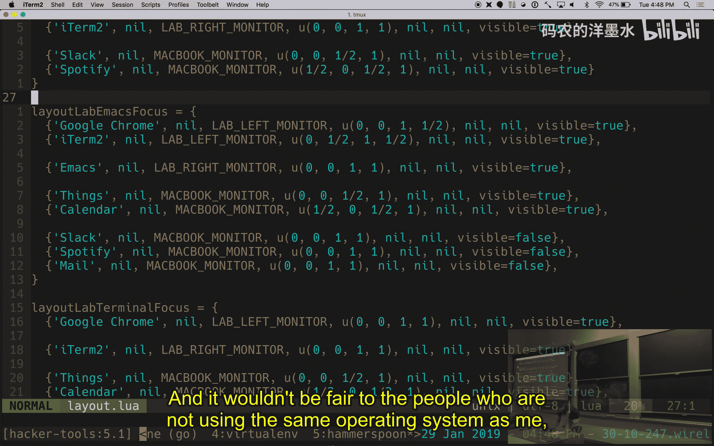

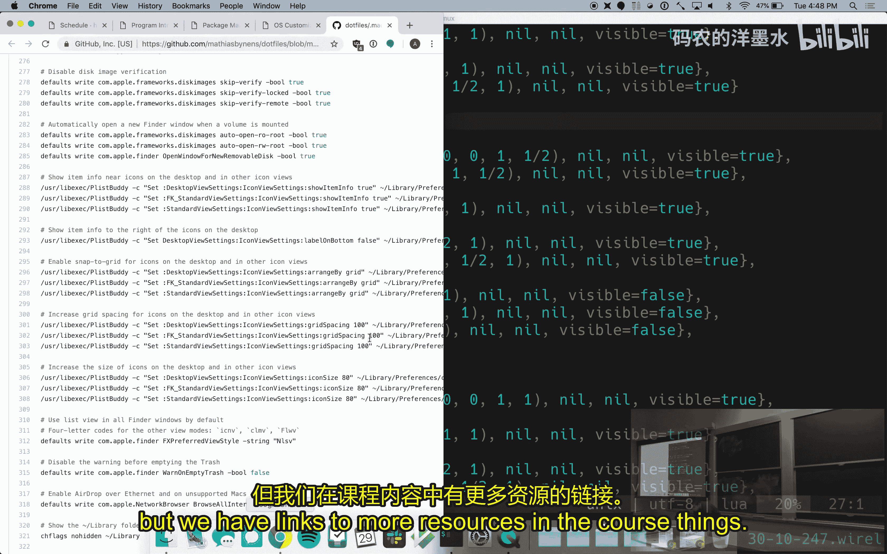

由于具体操作高度依赖于操作系统，我们无法深入每个细节。但课程笔记中提供了大量资源的链接。特别推荐你浏览“Unix Porn”这类社区，那里的人们会分享他们高度定制化的系统截图、配置说明甚至配置文件，你可以从中汲取灵感，复制对你有用的部分。

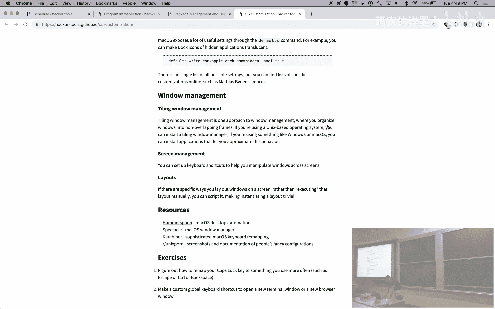

不断探索和优化你的系统设置，是成为一名高效用户的重要旅程。